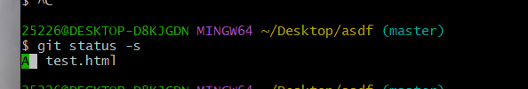

git init 创建仓库

git status -s 精简显示   ??表示  文件未跟踪  （-s 是-short缩写）

git add test.html 添加跟踪文件

取消暂存文件  git reset HEAD 要移除的名称

撤销 git checkout "文件名"

提交到本地仓库： git commit -m "新建了文件"

​	nothing to commit, working tree clean：所有文件都处于未修改

git push 提交到云端仓库

跳过暂存区

  git commit -a -m "描述"

移出文件

git rm -f test.html

移除工作区

git rm --cached test.html

查看历史

git log

git log -2 倒数第二次

git log -2 --pretty=oneline 一行显示

# 分支

查看分支 git branch

创建分支 git branch 名称

切换分支 git checkout 名称

分支快速创建切换 git checkout -b 名称

分支合并 git merge login（先切换成主分支master）

删除分支	git branch -d 分支名称

分支冲突需要手动解决 之后 git add . 

本地分支上传远程仓库

git push -u origin:名称

第一次加 -u   之后直接使用 git push

 git remote show origin 展示远程仓库列表名字

跟踪分支

git checkout 分支名称  不重新命名

git checkout -b reg origin/register   从仓库 origin里面register 下载到本地命名为reg

从仓库更新本地代码

git pull

删除远程分支

git push 远程仓库名称 --delete 远程分支名称

git reset --hard  8060144449fb2e1bd5fa49f6c32cca3a089d954c	回退唯一id

