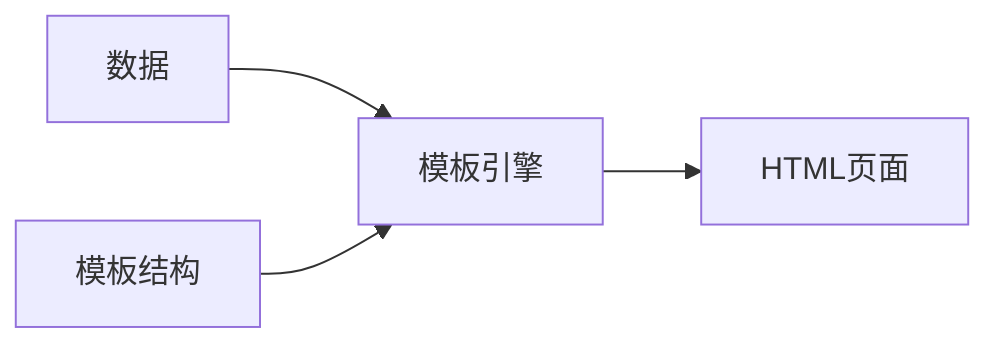
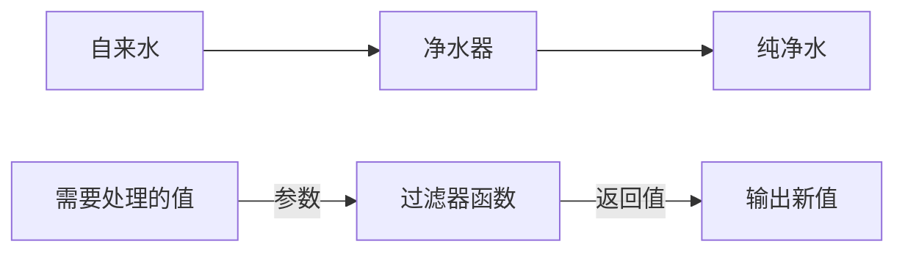

# 目录

  [目录](#目录)
  
- [目录](#目录)
  - [目标](#目标)
  - [1.form表单的基本使用](#1form表单的基本使用)
    - [1.1什么是表单](#11什么是表单)
    - [1.2表单的组成部分](#12表单的组成部分)
    - [1.3 `<form>`标签的属性](#13-form标签的属性)
      - [1.3.1 action](#131-action)
      - [1.3.2 target](#132-target)
      - [1.3.3 method](#133-method)
      - [1.3.4 enctype](#134-enctype)
    - [1.4表单的同步提交及缺点](#14表单的同步提交及缺点)
      - [1.4.1 什么是表单的同步提交](#141-什么是表单的同步提交)
      - [1.4.2 表单同步提交的缺点](#142-表单同步提交的缺点)
      - [1.4.3 如何解决表单同步提交的缺点](#143-如何解决表单同步提交的缺点)
  - [2.通过Ajax提交表单数据](#2通过ajax提交表单数据)
    - [2.1监听表单提交事件](#21监听表单提交事件)
    - [2.2阻止表单默认提交行为](#22阻止表单默认提交行为)
    - [2.3 快速获取表单中的数据](#23-快速获取表单中的数据)
      - [2.3.1 serialize()函数](#231-serialize函数)
      - [2.3.2 serialize()函数示例](#232-serialize函数示例)
  - [3 案例-评论列表](#3-案例-评论列表)
    - [3.1 渲染UI结构](#31-渲染ui结构)
    - [3.2 获取评论列表](#32-获取评论列表)
    - [3.3 发表评论](#33-发表评论)
  - [4.模板引擎的基本概念](#4模板引擎的基本概念)
    - [4.1渲染U结构时遇到的问题](#41渲染u结构时遇到的问题)
    - [4.2 什么是模板引擎](#42-什么是模板引擎)
    - [4.3 模板引擎的好处](#43-模板引擎的好处)
  - [5.art-template模板引擎](#5art-template模板引擎)
    - [5.1 art-template简介](#51-art-template简介)
    - [5.2 art-template的安装](#52-art-template的安装)
    - [5.3 art-template模板引擎的基本使用](#53-art-template模板引擎的基本使用)
      - [5.3.1.使用传统方式渲染UI结构](#531使用传统方式渲染ui结构)
      - [5.3.2 art-template的使用步骤](#532-art-template的使用步骤)
    - [5.4 art-template标准语法](#54-art-template标准语法)
      - [5.4.1 什么是标准语法](#541-什么是标准语法)
      - [5.4.2 标准语法 - 输出](#542-标准语法---输出)
      - [5.4.3 标准语法 – 原文输出](#543-标准语法--原文输出)
      - [5.4.4 标准语法 – 条件输出](#544-标准语法--条件输出)
      - [5.4.5 标准语法 – 循环输出](#545-标准语法--循环输出)
      - [5.4.6 标准语法 – 过滤器](#546-标准语法--过滤器)
    - [5.6 案例 – 新闻列表](#56-案例--新闻列表)
      - [5.6.1.实现步骤](#561实现步骤)
  - [6.模板引擎的实现原理](#6模板引擎的实现原理)
    - [6.1正则与字符串操作](#61正则与字符串操作)
      - [6.1.1基本语法](#611基本语法)
      - [6.1.2分组](#612分组)
      - [6.1.3字符串的replace函数](#613字符串的replace函数)
      - [6.1.4多次replace](#614多次replace)
      - [6.1.5. 使用while循环replace](#615-使用while循环replace)
      - [6.1.6 replace替换为真值](#616-replace替换为真值)
    - [6.2实现简易的模板引擎](#62实现简易的模板引擎)
      - [6.2.1实现步骤](#621实现步骤)
      - [6.2.2 定义模板结构](#622-定义模板结构)
      - [6.2.3预调用模板引擎](#623预调用模板引擎)
      - [6.2.4. 封装template函数](#624-封装template函数)

## 目标

- 能够说出form表单的常用属性
- 能够知道如何阻止表单的默认提交行为
- 能够知道如何使用jQuery快速获取表单数据
- 能够知道如何安装和使用模板引擎
- 能够知道模板引擎的实现原理
- form表单的基本使用
- 通过Ajax提交表单数据
- 案例-评论列表
- 模板引擎的基本概念
- art-template模板引擎
- 模板引擎的实现原理

## 1.form表单的基本使用

### 1.1什么是表单

表单在网页中主要负责数据采集功能。HTML中的`<form>`标签，就是用于采集用户输入的信息，并通过`<form>`标签的提交操作，把采集到的信息提交到服务器端进行处理。


`

```HTML
 <form>
     <input type="text" name="email_or_mobile" />
     <input type="password" name="password" />
     <input type="checkbox" name="remember_me" checked />
     <button type="submit">提交</button>
 </form>
```

---

### 1.2表单的组成部分

 > 表单由三个基本部分组成：
 >>表单标签
 表单域 [^1]
 表单按钮

```HTML
<form>
    <input type="text" name="email_or_mobile" />
    <input type="password" name="password" />
    <input type="checkbox" name="remember_me" checked />
    <button type="submit">提交</button>
</form>
```

---

### 1.3 `<form>`标签的属性

 `<form>标签用来采集数据，<form>标签的属性则是用来规定如何把采集到的数据发送到服务。`

| 属性    | 值                                                                        | 描述                                     |
| :------ | :------------------------------------------------------------------------ | :--------------------------------------- |
| action  | url地址                                                                   | 规定当提交表单时，向何处发送表单数据     |
| method  | get或post                                                                 | 规定以何种方式把表单数据提交到Action URL |
| enctype | application/x-www-form-urlencoded<br> multipart/form-data <br> text/plain | 规定在发送表单数据之前如何对其进行编码   |
| target  | _blank <br/>_self <br/>  _parent_top <br/>  framename                     | 规定在何处打开 action URL                |

#### 1.3.1 action

> action属性用来规定当提交表单时，==向何处发送表单数据==。<br>
> action属性的值应该是后端提供的一个URL地址，这个URL地址专门负责接收表单提交过来的数据。当`<form>`表单在未指定 action属性值的情况下，action的默认值为当前页面的URL地址。
==注意==: 当提交表单后，页面会立即跳转到action属性指定的URL地址

#### 1.3.2 target

target属性用来规定在何处打开action URL。
它的可选值有5个，默认情况下，target 的值是_self，表示在相同的框架中打开action URL

| 值        | 描述                         |
| --------- | ---------------------------- |
| blank     | 在新窗口中打开。             |
| self      | 默认。在相同的框架打开。     |
| parent    | 在父框架集中打开。(很少用)   |
| _top      | 在整个窗口中打开。(很少用)   |
| framename | 在指定的框架中打开。(很少用) |

#### 1.3.3 method

- method属性用来规定==以何种方式==把表单数据提交到action URL.
- 它的可选值有两个，分别是get和post。
- 默认情况下，method 的值为get，表示通过URL地址的形式，把表单数据提交到action URL。

注意:

get方式适合用来提交少量的、简单的数据.
Post方式适合用来提交大量的、复杂的、或包含文件上传的数据。
在实际开发中，`<form>`表单的post提交方式用的最多，很少用get。例如登录、注册、添加数据等表单操作，都需要使用post方式来提交表单。

#### 1.3.4 enctype

> enctype属性用来规定在发送表单数据之前如何对数据进行编码。
> 它的可选值有三个，默认情况下，enctype 的值为 application/x-www-form-urlencoded, 表示在发送前编码所有的字符。

| 值                                | 描述                                                          |
| --------------------------------- | ------------------------------------------------------------- |
| application/x-www-form-urlencoded | 在发送前编码所有疗符(默认)                                    |
| multipart/form-data               | 不对字符编码.  在使用包含文件上传控件的表单时，必须使用该值。 |
| text/plain                        | 空格转换为“+”加号，但不对特殊字符编码。(很少用)               |

注意:

在涉及到文件上传的操作时，必须将enctype 的值设置为multipart/form-data<br>
如果表单的提交不涉及到文件上传操作，则直接将enctype的值设置为 application/x-www-form-urlencoded即可!

---

### 1.4表单的同步提交及缺点

#### 1.4.1 什么是表单的同步提交

通过点击submit按钮，触发表单提交的操作，从而使页面跳转到action URL的行为，叫做表单的同步提交。

#### 1.4.2 表单同步提交的缺点

①`<form>`表单同步提交后，整个页面会发生跳转，跳转到action URL所指向的地址，用户体验很差。<br>
②`<form>`表单同步提交后，页面之前的状态和数据会丢失。<br>

思考：如何解决表单提交的问题

#### 1.4.3 如何解决表单同步提交的缺点

如果使用表单提交数据，则会导致以下两个问题:  

`①:页面会发生跳转`
`②页面之前的状态和数据会丢失`

解决方案: ==表单只负责采集数据，Ajax负责将数据提交到服务器==。

---

## 2.通过Ajax提交表单数据

### 2.1监听表单提交事件

在jQuery中，可以使用如下两种方式，监听到表单的提交事件:

````js
$('#form1').submit(function(e) {
   alert('监听到了表单的提交事件')
})

$('#form1').on('submit', function(e) {
   alert('监听到了表单的提交事件')
})

````

### 2.2阻止表单默认提交行为

当监听到表单的提交事件以后，可以调用事件对象的event.preventDefault()函数，来阻止表单的提交和页面的跳转，示例码如下:

````js
$('#form1').submit(function(e) {
   // 阻止表单的提交和页面的跳转
   e.preventDefault()
})

$('#form1').on('submit', function(e) {
   // 阻止表单的提交和页面的跳转
   e.preventDefault()
})

````

### 2.3 快速获取表单中的数据

#### 2.3.1 serialize()函数

为了简化表单中数据的获取操作，jQuery提供了serialize()函数，其语法格式如下:
`$(selector).serialize()`
serialize() 函数的好处：可以一次性获取到表单中的所有的数据。

#### 2.3.2 serialize()函数示例

```HTML
<!-- HTML -->
<form id="form1">
    <input type="text" name="username" />
    <input type="password" name="password" />
    <button type="submit">提交</button>
</form>
```

```JS
//JavaScript
$('#form1').serialize()
// 调用的结果：
// username=用户名的值&password=密码的值
```

注意：在使用 serialize() 函数快速获取表单数据时，必须为每个表单元素添加 name 属性！

## 3 案例-评论列表

### 3.1 渲染UI结构

- 使用 `bs3-panel`生成一个panel面板

 

- UI效果图

 

### 3.2 获取评论列表

```JS
//JavaScript
function getCmtList() {
    $.get('http://www.liulongbin.top:3006/api/cmtlist', function (res) {  
      if(res.status !== 200) {
        return alert('获取评论列表失败！')
      }
      var rows = []
      $.each(res.data, function (i, item) { // 循环拼接字符串
        rows.push('<li class="list-group-item">'+ item.content +'<span class="badge cmt-date">评论时间：'+ item.time +'</span><span class="badge cmt-person">评论人：'+ item.username +'</span></li>')
      })
      $('#cmt-list').empty().append(rows.join('')) // 渲染列表的UI结构
    })
  }

```

### 3.3 发表评论

```JS
//JavaScript
$('#formAddCmt').submit(function(e) {
    e.preventDefault() // 阻止表单的默认提交行为
    // 快速得到表单中的数据
    var data = $(this).serialize()
    $.post('http://www.liulongbin.top:3006/api/addcmt', data, function(res) {
      if (res.status !== 201) {
        return alert('发表评论失败！')
      }
      // 刷新评论列表
      getCmtList()
      // 快速清空表单内容  $('#formAddCmt')[0] JQuery对象转DOM对象 使用DOM对象的reset();
      $('#formAddCmt')[0].reset()
    })
  })

```

## 4.模板引擎的基本概念

### 4.1渲染U结构时遇到的问题

```JS
//JavaScript
var rows = []
$.each(res.data, function (i, item) { // 循环拼接字符串
    rows.push('<li class="list-group-item">'+ item.content +'<span class="badge cmt-date">评论时间：'+ item.time +'</span><span class="badge cmt-person">评论人：'+ item.username +'</span></li>')
})
$('#cmt-list').empty().append(rows.join('')) // 渲染列表的UI结构
```

- 上述代码是通过`字符串拼接`的形式，来渲染UI结构。

- 如果UI结构比较复杂，则拼接字符串的时候需要格外注意`引号之前的嵌套`。且一旦需求发生变化，`修改起来也非常麻烦`。

---

### 4.2 什么是模板引擎

- 模板引擎，顾名思义，它可以根据程序员指定的模板结构和数据，自动生成一个完整的HTML页面。
[横向流程图](https://www.runoob.com/markdown/md-advance.html)



---

### 4.3 模板引擎的好处

1. 减少了字符串的拼接操作
2. 使代码结构更清晰
3. 使代码更易于阅读与维护

## 5.art-template模板引擎

### 5.1 art-template简介

art-template 是一个简约、超快的模板引擎。中文官网首页为 <http://aui.github.io/art-template/zh-cn/index.html>

---

### 5.2 art-template的安装

在浏览器中访问 <http://aui.github.io/art-template/zh-cn/docs/installation.html> 页面，找到下载链接后，鼠标右键，选择“链接另存为”，将 art-template 下载到本地，然后，通过 `<script>`标签加载到网页上进行使用。


### 5.3 art-template模板引擎的基本使用

#### 5.3.1.使用传统方式渲染UI结构

用户信息
姓名︰zS年龄:20会员:否
注册时间:2019-10-28
爱好:
吃饭睡觉打豆豆

```JavaScript
var data = {
   title: '<h3>用户信息</h3>',
   name: 'zs',
   age: 20,
   isVIP: true,
   regTime: new Date(),
   hobby: ['吃饭', '睡觉', '打豆豆']
}
```

- 传统方式存在的问题，程序员需要手动操作DOM。模板引擎可以减少DOM操作。

#### 5.3.2 art-template的使用步骤

见`08.演示模板引擎的使用.html`
①导入art-template

```HTML
  <!-- 1. 导入模板引擎 -->
  <!-- 在 window 全局，多一个函数，叫做 template('模板的Id', 需要渲染的数据对象) -->
  <script src="./lib/template-web.js"></script>
  <script src="./lib/jquery.js"></script>
```

②定义数据

```JavaScript
  //JavaScript
  // 2. 定义需要渲染的数据
    var data = { name: 'zs', age: 20, test: '<h3>测试原文输出</h3>', flag: 1, hobby: ['吃饭', '睡觉', '写代码'], regTime: new Date() }
```

③定义模板

```JavaScript
  //JavaScript
  <!-- 3. 定义模板 -->
  <!-- 3.1 模板的 HTML 结构，必须定义到 script 中 -->
  <script type="text/html" id="tpl-user">
    <h1>{{name}}    ------    {{age}}</h1>
    {{@ test}}

    <div>
      {{if flag === 0}}
      flag的值是0
      {{else if flag === 1}}
      flag的值是1
      {{/if}}
    </div>

    <ul>
      {{each hobby}}
      <li>索引是:{{$index}}，循环项是:{{$value}}</li>
      {{/each}}
    </ul>

    <h3>{{regTime | dateFormat}}</h3>
  </script>

```

④调用template函数

```js
      // 4. 调用 template 函数
    var htmlStr = template('tpl-user', data)
```

⑤渲染HTML结构

```js
    $('#container').html(htmlStr)
```

### 5.4 art-template标准语法

#### 5.4.1 什么是标准语法

art-template 提供了 `{{ }}` 这种语法格式，在 `{{ }}` 内可以进行变量输出，或循环数组等操作，这种 `{{ }}` 语法在 art-template 中被称为标准语法。

#### 5.4.2 标准语法 - 输出

```art-template
{{value}}  //输出该对象
{{obj.key}} //输出对象.属性
{{obj['key']}} //输出对象[]属性
{{a ? b : c}}
{{a || b}}
{{a + b}}
```

在`{{ }}`语法中，可以进行变量的输出、对象属性的输出、三元表达式输出、逻辑或输出、加减乘除等表达式输出。

#### 5.4.3 标准语法 – 原文输出

`{{@ value }}`
如果要输出的 value 值中，包含了 HTML 标签结构，则需要使用原文输出语法，才能保证 HTML 标签被正常渲染。

#### 5.4.4 标准语法 – 条件输出

如果要实现条件输出，则可以在 `{{ }}` 中使用 if … else if … /if 的方式，进行按需输出。

```art-template
{{if value}} 按需输出的内容 {{/if}}

{{if v1}} 按需输出的内容 {{else if v2}} 按需输出的内容 {{/if}}

```

#### 5.4.5 标准语法 – 循环输出

如果要实现循环输出，则可以在 `{{ }}` 内，通过 each 语法循环数组，当前循环的索引使用 $index 进行访问，当前的循环项使用 $value 进行访问。

```art-template
{{each arr}}
    {{$index}} {{$value}}
{{/each}}
```

#### 5.4.6 标准语法 – 过滤器



- 过滤器的本质，就是一个 function 处理函数。

---
  `{{value | filterName}}`

过滤器语法类似管道操作符，它的上一个输出作为下一个输入。
定义过滤器的基本语法如下：

`template.defaults.imports.filterName = function(value){/*return处理的结果*/}`

---
`<div>注册时间：{{regTime | dateFormat}}</div>`
定义一个格式化时间的过滤器 dateFormat 如下：

```JS
 template.defaults.imports.dateFormat = function(date) {
    var y = date.getFullYear()
    var m = date.getMonth() + 1
    var d = date.getDate()

    return y + '-' + m + '-' + d // 注意，过滤器最后一定要 return 一个值
 }
```

### 5.6 案例 – 新闻列表

#### 5.6.1.实现步骤

①获取新闻数据
②定义 template 模板
③编译模板
④定义时间过滤器
⑤定义补零函数

## 6.模板引擎的实现原理

### 6.1正则与字符串操作

#### 6.1.1基本语法

exec()函数用于检索字符串中的正则表达式的匹配。
如果字符串中有匹配的值，则返回该匹配值，否则返回null.

`RegExpObject.exec(String)`

示例代码如下：

```JavaScript
var str = 'hello'
var pattern = /o/
// 输出的结果["o", index: 4, input: "hello", groups: undefined]
console.log(pattern.exec(str)) 
```

#### 6.1.2分组

正则表达式中 `( )` 包起来的内容表示一个分组，可以通过分组来提取自己想要的内容，示例代码如下：

```JavaScript
 var str = '<div>我是{{name}}</div>'
 var pattern = /{{([a-zA-Z]+)}}/

 var patternResult = pattern.exec(str)
 console.log(patternResult)
 // 得到 name 相关的分组信息
 // ["{{name}}", "name", index: 7, input: "<div>我是{{name}}</div>", groups: undefined]
```

#### 6.1.3字符串的replace函数

replace() 函数用于在字符串中用一些字符替换另一些字符，语法格式如下：

`var result = '123456'.replace('123', 'abc') // 得到的 result 的值为字符串 'abc456'`

示例代码如下：

```JavaScript
var str = '<div>我是{{name}}</div>'
var pattern = /{{([a-zA-Z]+)}}/

var patternResult = pattern.exec(str)
str = str.replace(patternResult[0], patternResult[1]) // replace 函数返回值为替换后的新字符串
// 输出的内容是：<div>我是name</div>
console.log(str)
```

#### 6.1.4多次replace

```JavaScript
var str = '<div>{{name}}今年{{ age }}岁了</div>'
var pattern = /{{\s*([a-zA-Z]+)\s*}}/

var patternResult = pattern.exec(str)
str = str.replace(patternResult[0], patternResult[1])
console.log(str) // 输出 <div>name今年{{ age }}岁了</div>

patternResult = pattern.exec(str)
str = str.replace(patternResult[0], patternResult[1])
console.log(str) // 输出 <div>name今年age岁了</div>

patternResult = pattern.exec(str)
console.log(patternResult) // 输出 null
```

#### 6.1.5. 使用while循环replace

```JavaScript
var str = '<div>{{name}}今年{{ age }}岁了</div>'
var pattern = /{{\s*([a-zA-Z]+)\s*}}/

var patternResult = null
while(patternResult = pattern.exec(str)) {
   str = str.replace(patternResult[0], patternResult[1])
}
console.log(str) // 输出 <div>name今年age岁了</div>
```

#### 6.1.6 replace替换为真值

``` JavaScript
var data = { name: '张三', age: 20 }
var str = '<div>{{name}}今年{{ age }}岁了</div>'
var pattern = /{{\s*([a-zA-Z]+)\s*}}/

var patternResult = null
while ((patternResult = pattern.exec(str))) {
   str = str.replace(patternResult[0], data[patternResult[1]])
}
console.log(str)
```

### 6.2实现简易的模板引擎

#### 6.2.1实现步骤

1. 定义模板结构
2. 预调用模板引擎
3. 封装 template 函数
4. 导入并使用自定义的模板引擎

#### 6.2.2 定义模板结构

```JavaScript
<!-- 定义模板结构 -->
<script type="text/html" id="tpl-user">
   <div>姓名：{{name}}</div>
   <div>年龄：{{ age }}</div>
   <div>性别：{{  gender}}</div>
   <div>住址：{{address  }}</div>
</script>

```

#### 6.2.3预调用模板引擎

```JavaScript
<script>
   // 定义数据
   var data = { name: 'zs', age: 28, gender: '男', address: '北京顺义马坡' }
  // 调用模板函数
   var htmlStr = template('tpl-user', data)
   // 渲染HTML结构
   document.getElementById('user-box').innerHTML = htmlStr
</script>
```

#### 6.2.4. 封装template函数

``````JS
//JavaScript
function template(id, data) {
  var str = document.getElementById(id).innerHTML
  var pattern = /{{\s*([a-zA-Z]+)\s*}}/
  var pattResult = null
   while ((pattResult = pattern.exec(str))) {
    str = str.replace(pattResult[0], data[pattResult[1]])
  }
   return str
}

```
