# **Buffer（缓冲器）** 

## **1.** **概念** 

Buffer 是一个类似于数组的 对象 ，用于表示固定长度的字节序列 

Buffer 本质是一段内存空间，专门用来处理 二进制数据 。 

## **2.** **特点** 

1. Buffer 大小固定且无法调整 

2. Buffer 性能较好，可以直接对计算机内存进行操作 

3. 每个元素的大小为 1 字节（byte） 

## **3.** **使用** 

### **3-1.** **创建** **Buffer** 

Node.js 中创建 Buffer 的方式主要如下几种： 

1. Buffer.alloc 

   ```javascript
   //创建了一个长度为 10 字节的 Buffer，相当于申请了 10 字节的内存空间，每个字节的值为 0
   let buf_1 = Buffer.alloc(10); // 结果为 <Buffer 00 00 00 00 00 00 00 00 00 00>
   ```

2. Buffer.allocUnsafe 

   ```javascript
   //创建了一个长度为 10 字节的 Buffer，buffer 中可能存在旧的数据, 可能会影响执行结果，所以叫
   unsafe
   let buf_2 = Buffer.allocUnsafe(10);
   ```

   

3. Buffer.from 

```javascript
//通过字符串创建 Buffer
let buf_3 = Buffer.from('hello');
//通过数组创建 Buffer
let buf_4 = Buffer.from([105, 108, 111, 118, 101, 121, 111, 117]);
```

**3-2 Buffer** **与字符串的转化**

​	我们可以借助 toString 方法将 Buffer 转为字符串

```javascript
let buf_4 = Buffer.from([105, 108, 111, 118, 101, 121, 111, 117]);
console.log(buf_4.toString())
```

`toString 默认是按照 utf-8 编码方式进行转换的。 `

### **3-3 Buffer** **的读写** 

Buffer 可以直接通过 [] 的方式对数据进行处理。 

```javascript
//读取
console.log(buf_3[1]);
//修改
buf_3[1] = 97;
//查看字符串结果
console.log(buf_3.toString());
```

注意: 

1. 如果修改的数值超过 255 ，则超过 8 位数据会被舍弃 

2. 一个 utf-8 的字符 一般 占 3 个字节 


# fs **模块**

fs 全称为 file system ，称之为 文件系统 ，是 Node.js 中的 内置模块 ，可以对计算机中的磁盘进行操 

作。 

本章节会介绍如下几个操作： 

1. 文件写入 

2. 文件读取 

3. 文件移动与重命名 

4. 文件删除 

5. 文件夹操作 

6. 查看资源状态 

## **一、文件写入** 

文件写入就是将 数据 保存到 文件 中，我们可以使用如下几个方法来实现该效果

| 1                             | 2        |
| ----------------------------- | -------- |
| **方法**                      | **说明** |
| `writeFile`                   | 异步写入 |
| `writeFileSync`               | 同步写入 |
| `appendFile / appendFileSync` | 追加写入 |
| `createWriteStream`           | 流式写入 |

### **1-1. writeFile** **异步写入** 

语法： 

​		`fs.writeFile(file, data[, options], callback) `

参数说明： 

​		file 文件名 

​		data 待写入的数据 

​		options 选项设置 （可选） 

​		callback 写入回调 

返回值： undefined 

代码示例：

```javascript
//1.导入 fs
const fs = require('fs')

//2.文件写入  异步
fs.writeFile('./座右铭.txt', '三人行, 则必有我师焉', err => { // 如果失败 err的值是错误对象 如果成功 值是 null
    if (err) {
        console.log(err)
    }
    console.log('成功');
})
console.log(1); // 先输出1 再输出 成功
```


### **1-2. writeFileSync** **同步写入** 

语法:` fs.writeFileSync(file, data[, options]) `

参数与 fs.writeFile 大体一致，只是没有 callback 参数 

返回值： undefined 

代码示例：

```javascript
//同步写入
fs.writeFileSync('./data.txt', 'test');
```

Node.js 中的磁盘操作是由其他 线程 完成的，结果的处理有两种模式： 

 * 同步处理 JavaScript 主线程 会等待 其他线程的执行结果，然后再继续执行主线程的代码，效率较低 

 * 异步处理 JavaScript 主线程 不会等待 其他线程的执行结果，直接执行后续的主线程代码， 

   效率较好

   

### **1-3. appendFile / appendFileSync** **追加写入**

appendFile 作用是在文件尾部追加内容，appendFile 语法与 writeFile 语法完全相同

语法: 

```javascript
fs.appendFile(file, data[, options], callback)
fs.appendFileSync(file, data[, options])
返回值： 二者都为 undefined
```

代码演示：

```javascript
//1. 引入 fs 模块
const fs = require('fs');

//2. 调用 appendFile
// fs.appendFile('./座右铭.txt', ',择其善者而从之, 择期不善者而改之', err => {
//     //判断
//     if (err) {
//         console.log('写入失败~~');
//         return;
//     }
//     console.log('追加写入成功');
// });

fs.appendFileSync('./座右铭.txt', '\r\n温故而知新, 可以为师矣', err => {
    if (err) {
        console.log('写入失败~~');
        return;
    }
    console.log('追加写入成功');
})

//writeFile 实现追加写入
fs.writeFile('./座右铭.txt', 'love love love', { flag: 'a' }, err => {
    if (err) {
        console.log('写入失败~');
        return;
    }
    console.log('写入成功');
});
```

### **1-4. `createWriteStream`** **流式写入** 

语法：`fs.createWriteStream(path[, options]) `

参数说明： 

​		path 文件路径 

​		options 选项配置（ 可选 ） 

返回值： Object

```javascript
/**
 * 观书有感.txt
 */
//1. 导入 fs 
const fs = require('fs');

//2. 创建写入流对象 
const ws = fs.createWriteStream('./观书有感.txt')

//3. write
ws.write('半亩方塘一鉴开\r\n');
ws.write('天光云影共徘徊\r\n');
ws.write('问渠那得清如许\r\n');
ws.write('为有源头活水来\r\n');
ws.write('这是一首诗')

//4. 关闭通道
ws.close(); // 不加也行
```

程序打开一个文件是需要消耗资源的 ，流式写入可以减少打开关闭文件的次数。 

流式写入方式适用于 大文件写入或者频繁写入 的场景, `writeFile` 适合于 写入频率较低的场景 

### **1-5** **写入文件的场景**

文件写入 在计算机中是一个非常常见的操作，下面的场景都用到了文件写入 

```javascript
* 下载文件 
* 安装软件 
* 保存程序日志，如 Git 
* 编辑器保存文件 
* 视频录制 
```

当 需要持久化保存数据 的时候，应该想到 文件写入 

## **二、文件读取** 

文件读取顾名思义，就是通过程序从文件中取出其中的数据，我们可以使用如下几种方式：

| 方法               | 说明     |
| ------------------ | -------- |
| `readFile`         | 异步读取 |
| `readFileSync`     | 同步读取 |
| `createReadStream` | 流式读取 |

### **2-1 `readFile`** **异步读取** 

语法： `fs.readFile(path[, options], callback) `

参数说明： 

​	path 文件路径 

​	options 选项配置 

​	callback 回调函数 

返回值： undefined 

​	代码示例：

```javascript
//1. 引入 fs 模块
const fs = require('fs');

//异步读取
fs.readFile('./观书有感.txt', (err, data) => {
    if (err) {
        console.log('失败');
        return
    }
    console.log(data.toString());
})
```

### **2-2 readFileSync** **同步读取** 

语法： `fs.readFileSync(path[, options]) `

参数说明： 

​	path 文件路径 

​	options 选项配置

返回值： string | Buffer

代码示例：

```javascript
//1. 引入 fs 模块
const fs = require('fs');

//同步读取
let data = fs.readFileSync('./观书有感.txt')
console.log(data.toString());
```

### **2-3 `createReadStream`** **流式读取** 

语法：` fs.createReadStream(path[, options]) `

参数说明： 

​	path 文件路径 

​	options 选项配置（ 可选 ） 

返回值： Object 

代码示例： 

```javascript
// 1. 引入fs
const fs = require('fs')

//2.创建读取流对象
const rs = fs.createReadStream('../资料/笑看风云.mp4')

//读取流 一块一块读取
//3.绑定data事件
rs.on('data', chunk => { //chunk块的意思
    // console.log(chunk.length); 
    console.log(chunk.length); // 
})

//4.end  可选
rs.on('end', () => {
    console.log('读取完成');
})
```

### **2-4** **读取文件应用场景** 

​	电脑开机 

​	程序运行 

​	编辑器打开文件 

​	查看图片 

​	播放视频 

​	播放音乐 

​	Git 查看日志 

​	上传文件 

​	查看聊天记录

## **文件复制**

```javascript
/**
 * 需求:
 *   复制『资料』文件夹下的『笑看风云.mp4』
 */
const fs = require('fs')
const process = require('process') // node 内置模块 

//方式1 readFile
//读取文件内容
let data = fs.readFileSync('../资料/笑看风云.mp4')
//写入文件
fs.writeFileSync('../资料/笑看风云2.mp4', data)
// console.log(process.memoryUsage()); //内存占用量 rss 117506048 字节 占用105MB


//方式2 流式操作  所占资源更少
//创建读取流对象
const rs = fs.createReadStream('../资料/笑看风云.mp4');
//创建写入流对象
const ws = fs.createWriteStream('../资料/笑看风云-3.mp4');

//绑定 data 事件
rs.on('data', chunk => {
    ws.write(chunk);
});
rs.on('end', () => {
    console.log(process.memoryUsage()); //54018048字节  占用51MB
})

//第二种简便写法
// rs.pipe(ws)
```


## **三、文件移动与重命名** 

在 Node.js 中，我们可以使用 rename 或 renameSync 来移动或重命名 文件或文件夹 

语法： 

​	`fs.rename(oldPath, newPath, callback) `

​	`fs.renameSync(oldPath, newPath)`

参数说明： 

​	`oldPath` 文件当前的路径 

​	`newPath` 文件新的路径 

​	`callback` 操作后的回调 

代码示例:

```javascript
const fs = require("fs")

//2.调用rename(老路径，新路径)
// fs.rename('./座右铭.txt', './论语.txt', err => {
//     if (err) {
//         console.log('失败');
//     }
//     console.log('成功');
// })

//文件移动  跟重命名一样更改路径
fs.rename('./data.txt', '../资料/data.txt', err => {
    if (err) {
        console.log('失败');
    }
    console.log('成功');
})
```

## **四、文件删除**

在 Node.js 中，我们可以使用 unlink 或 unlinkSync 来删除文件 

语法： 

​		`fs.unlink(path, callback) `

​		`fs.unlinkSync(path) `

参数说明： 

​	path 文件路径 

​	callback 操作后的回调 

代码示例

```javascript
const fs = require('fs')

//2.调用 unlink方法   同步的方法： unlinkSync
// fs.unlink('./观书有感.txt', err => {
//     if (err) {
//         console.log('删除失败');
//         return
//     }
//     console.log('成功');
// })

console.log(1);

//3.rm 方法   同步的方法： rmSync
fs.rm('./论语.txt', err => {
    if (err) {
        console.log('删除失败');
        return
    }
    console.log('成功');
})

console.log(2);
```

## **五、文件夹操作** 

借助 Node.js 的能力，我们可以对文件夹进行 创建 、 读取 、 删除 等操作 

| **方法**                | **说明**   |
| ----------------------- | ---------- |
| `mkdir / mkdirSync`     | 创建文件夹 |
| `readdir / readdirSync` | 读取文件夹 |
| `rmdir / rmdirSync`     | 删除文件夹 |

### **5-1 mkdir** **创建文件夹** 

```javascript
在 Node.js 中，我们可以使用` mkdir `或 `mkdirSync` 来创建文件夹 
语法： 
​		`fs.mkdir(path[, options], callback) `
​		`fs.mkdirSync(path[, options]) `
参数说明： 
​	path 文件夹路径 
​	options 选项配置（ 可选 ） 
​	callback 操作后的回调 

//异步创建文件夹
fs.mkdir('./page', err => {
if(err) throw err;
console.log('创建成功');
});
//递归异步创建
fs.mkdir('./1/2/3', {recursive: true}, err => {
if(err) throw err;
console.log('递归创建成功');
});
//递归同步创建文件夹
fs.mkdirSync('./x/y/z', {recursive: true});
```


### **5-2 readdir** **读取文件夹** 

```javascript
在 Node.js 中，我们可以使用 readdir 或 readdirSync 来读取文件夹 
语法： 
	fs.readdir(path[, options], callback) 
	fs.readdirSync(path[, options]) 
参数说明： 
path 文件夹路径 
options 选项配置（ 可选 ） 
callback 操作后的回调

//异步读取
fs.readdir('./论语', (err, data) => {
if(err) throw err;
console.log(data);
});
//同步读取
let data = fs.readdirSync('./论语');
console.log(data);
```

### **5-3 rmdir** **删除文件夹** 

```javascript
在 Node.js 中，我们可以使用 rmdir 或 rmdirSync 来删除文件夹 
语法： 
	fs.rmdir(path[, options], callback) 
	fs.rmdirSync(path[, options]) 
参数说明： 
	path 文件夹路径 
	options 选项配置（ 可选 ） 
	callback 操作后的回调 
    
//异步删除文件夹
fs.rmdir('./page', err => {
if(err) throw err;
console.log('删除成功');
});
//异步递归删除文件夹
fs.rmdir('./1', {recursive: true}, err => {
if(err) {
console.log(err);
}
console.log('递归删除')
});
//同步递归删除文件夹
fs.rmdirSync('./x', {recursive: true})
```


示例代码： 

```javascript
//1. 
const { log } = require('console')
const fs = require('fs')

//2.创建文件夹 make directory
// fs.mkdir('./html', err => {
//     if (err) {
//         console.log('创建失败');
//        return
//     }
//     console.log('创建成功');
// })

//2.2递归创建  recursive:递归
// fs.mkdir('./a/b/c', { recursive: true }, err => {
//     if (err) {
//         console.log('创建失败');
//         return
//     }
//     console.log('创建成功');
// })

//2.3读取文件夹
// fs.readdir('../资料', (err, data) => {
//     if (err) {
//         console.log('读取失败');
//         return
//     }
//     console.log('读取成功');
//     console.log(data); //[ 'data.txt', '笑看风云-3.mp4', '笑看风云.mp4', '笑看风云2.mp4' ]
//     // })
// })

//2.4删除文件夹
// fs.rmdir('./html', err => {
//     if (err) {
//         console.log('删除失败');
//         return
//     }
//     console.log('删除成功');
// })

//2.5 递归删除文件夹  不推荐使用
// fs.rmdir('./a', { recursive: true }, err => {
//     if (err) {
//         console.log('删除失败');
//         console.log(err);
//         return
//     }
//     console.log('删除成功');
// })

//递归删除文件夹  建议使用
// fs.rm('./a', { recursive: true }, err => {
//     if (err) {
//         console.log('删除失败');
//         console.log(err);
//         return
//     }
//     console.log('删除成功');
// })
```


## **六、查看资源状态** 

在 Node.js 中，我们可以使用 stat 或 `statSync` 来查看资源的详细信息

语法： 

​	`fs.stat(path[, options], callback) `

​	`fs.statSync(path[, options]) `

参数说明： 

​	path 文件夹路径 

​	options 选项配置（ 可选 ） 

​	callback 操作后的回调 

示例代码：

```javascript
//异步获取状态
fs.stat('./data.txt', (err, data) => {
if(err) throw err;
console.log(data);
});
//同步获取状态
let data = fs.statSync('./data.txt');
```

结果值对象结构： 

size 文件体积 

`birthtime`创建时间 

`mtime` 最后修改时间 

`isFile `检测是否为文件 

`isDirectory` 检测是否为文件夹 

```javascript
const fs = require('fs')

//2.调用stat 方法 status 缩写
fs.stat('../资料/笑看风云.mp4', (err, data) => {
    if (err) {
        console.log('操作失败');
        return
    }
    console.log(data);
    // isFile
    console.log(data.isFile()); // true
    console.log(data.isDirectory()); // faslse 是否为文件夹
})
```


## **七、相对路径问题** 

fs 模块对资源进行操作时，路径的写法有两种： 

​		相对路径 

			*  `../座右铭.txt `当前目录的上一级目录中的座右铭.txt 
			*  `./座右铭.txt `当前目录下的座右铭.txt 	

绝对路径 

	* `D:/Program Files windows 系统下的绝对路径 `
	* `/usr/bin Linux 系统下的绝对路径 `


相对路径中所谓的 当前目录 ，指的是 命令行的工作目录 ，而并非是文件的所在目录 

所以当命令行的工作目录与文件所在目录不一致时，会出现一些 BUG 

```javascript
const fs = require('fs')

//相对路径
// fs.writeFileSync('./index.html', 'love');
// fs.writeFileSync('index.html', 'love');
// fs.writeFileSync('../index.html', 'love');

//绝对路径
// fs.writeFileSync('D:/index.html', 'love');
// fs.writeFileSync('/index.html', 'love'); // 最外层 c盘权限不够
```

## **八、**__dirname 

`__dirname `与 require 类似，都是 Node.js 环境中的'全局'变量 

`__dirname `保存着 当前文件所在目录的绝对路径 ，可以使用 `__dirname `与文件名拼接成绝对路径 

代码示例： 

```javascript
let data = fs.readFileSync(__dirname + '/data.txt');
console.log(data);
```

使用 fs 模块的时候，尽量使用` __dirname` 将路径转化为绝对路径，这样可以避免相对路径产生的 

Bug 

```javascript
const fs = require('fs');

// 相对路径参照物: 命令行的工作目录
// fs.writeFileSync('./index.html', 'love')

//绝对路径 '全局变量' 保存的是: 所在文件的所在目录的绝对路径
// console.log(__dirname);
fs.writeFileSync(__dirname + '/index.html', 'love');
```

`__dirname` 不会随着命令工作目录的改变而改变


# **path** **模块** 

path 模块提供了 操作路径 的功能，我们将介绍如下几个较为常用的几个 API：

| API             | **说明**                    |
| --------------- | --------------------------- |
| `path.resolve`  | 拼接规范的绝对路径 ==常用== |
| `path.sep`      | 获取操作系统的路径分隔符    |
| `path.parse`    | 解析路径并返回对象          |
| `path.basename` | 获取路径的基础名称          |
| `path.dirname`  | 获取路径的目录名            |
| `path.extname`  | 获得路径的扩展名            |

代码示例：

```javascript
const path = require('path');
//获取路径分隔符
console.log(path.sep);
//拼接绝对路径
console.log(path.resolve(__dirname, 'test'));
//解析路径
let pathname = 'D:/program file/nodejs/node.exe';
console.log(path.parse(pathname));
//获取路径基础名称
console.log(path.basename(pathname))
//获取路径的目录名
console.log(path.dirname(pathname));
//获取路径的扩展名
console.log(path.extname(pathname));
```


# **HTTP** **协议**

## **一、概念** 

HTTP（hypertext transport protocol）协议；中文叫**超文本传输协议** 

​	是一种基于TCP/IP的应用层通信协议 

​	这个协议详细规定了 浏览器 和万维网 服务器 之间互相通信的规则。 

​	协议中主要规定了两个方面的内容 

 * 客户端：用来向服务器发送数据，可以被称之为**请求报文** 
 * 服务端：向客户端返回数据，可以被称之为**响应报文** 

报文：可以简单理解为就是一堆字符串 	

## **二、请求报文的组成** 

* 请求行 

* 请求头 

* 空行 
* 请求体

## **三、**HTTP **的请求行** 

* 请求方法（get、post、put、delete等） 

* 请求 URL（统一资源定位器） 

例如：**http://www.baidu.com:80/index.html?a=100&b=200#logo** 

* http： 			 							协议（https、ftp、ssh等）
* **www.baidu.com** 			    	 域名 
* 80 											    端口号 
* /index.html                                  路径 
* a=100&b=200                              查询字符串 
* \#logo                                             哈希（锚点链接） 

HTTP协议版本号

## **四、**HTTP **请求头** 

格式：『头名：头值』 

常见的请求头有：

| 请求头                     | 解释                                                         |
| -------------------------- | ------------------------------------------------------------ |
| Host                       | 主机名                                                       |
| Connection                 | 连接的设置 keep-alive（保持连接）；close（关闭连接           |
| Cache-Control              | 缓存控制 max-age = 0 （没有缓存）                            |
| Upgrade-Insecure-Requests- | 将网页中的http请求转化为https请求（很少用）老网站升级        |
| User-Agent                 | 用户代理，客户端字符串标识，服务器可以通过这个标识来识别这个请求来自哪个客户端 ，一般在PC端和手机端的区分 |
| Accept                     | 设置浏览器接收的数据类型                                     |
| Accept-Encoding            | 设置接收的压缩方式                                           |
| Accept- Language           | 设置接收的语言 q=0.7 为喜好系数，满分为1                     |
| Cookie                     | 后面单独讲                                                   |

## **五、**HTTP **的请求体** 

请求体内容的格式是非常灵活的， 

（可以是空）==> GET请求， 

（也可以是字符串，还可以是JSON）===> POST请求 

例如： 

* 字符串：keywords=手机&price=2000 

* JSON：{"keywords":"手机","price":2000} 

## **六、响应报文的组成** 

* 响应行

```javascript
HTTP/1.1 200 OK
```

* 
  * HTTP/1.1：HTTP协议版本号 
  * 200：响应状态码 404 Not Found 500 Internal Server Error 
  * 还有一些状态码，参考：**https://developer.mozilla.org/zh-CN/docs/Web/HTTP/Status** 
  * OK：响应状态描述

响应状态码和响应字符串关系是一一对应的。 

* 响应头

  ```javascript
  Cache-Control:缓存控制 private 私有的，只允许客户端缓存数据
  Connection 链接设置
  Content-Type:text/html;charset=utf-8 设置响应体的数据类型以及字符集,响应体为html，字符集
  utf-8
  Content-Length:响应体的长度，单位为字节
  ```

* 空行

* 响应体 

响应体内容的类型是非常灵活的，常见的类型有 HTML、CSS、JS、图片、JSON 

## **七、创建** **HTTP** **服务**

使用 nodejs 创建 HTTP 服务 

### **7.1** **操作步骤** 

```javascript
//1. 导入 http 模块
const http = require('http');
//2. 创建服务对象 create 创建 server 服务
// request 意为请求. 是对请求报文的封装对象, 通过 request 对象可以获得请求报文的数据
// response 意为响应. 是对响应报文的封装对象, 通过 response 对象可以设置响应报文
const server = http.createServer((request, response) => {
response.end('Hello HTTP server');
});
//3. 监听端口, 启动服务
server.listen(9000, () => {
console.log('服务已经启动, 端口 9000 监听中...');
});
```

```javascript
http.createServer 里的回调函数的执行时机： 当接收到 HTTP 请求的时候，就会执行
```

### **7.2** **测试** 

浏览器请求对应端口 

```javascript
http://127.0.0.1:9000
```

####  注意事项

1. 命令行 `ctrl + c` 停止服务

2. 当服务启动后，更新代码 必须重启服务才能生效

3. 响应内容中文乱码的解决办法

   ```
   // 设置响应头
   response.setHeader('content-type','text/html;charset=utf-8');
   ```

4. 端口号被占用

   `Error: listen EADDRINUSE: address already in use :::9000`

   1）关闭当前正在运行监听端口的服务 （ 使用较多 ）

   2）修改其他端口号

5. `HTTP` 协议默认端口是 `80` 。`HTTPS` 协议的默认端口是 `443`, HTTP 服务开发常用端口有 `3000`，`8080`，`8090`，`9000` 等

> 如果端口被其他程序占用，可以使用 资源监视器 找到占用端口的程序，然后使用 任务管理器 关闭对应的程序

```javascript
//1.导入 http 模块
const http = require("http")

//2.创建服务对象
const server = http.createServer((request, response) => {
    // response.end('Hello HTTP Server --1') // 设置响应体
    response.setHeader('content-type', 'text/html;charset=utf-8')
    response.end('你好') // 设置响应体
})

//3.监听端口，启动服务
server.listen(80, () => {
    console.log('服务已经启动');
})
```


## 八，浏览器查看 HTTP 报文

点击步骤

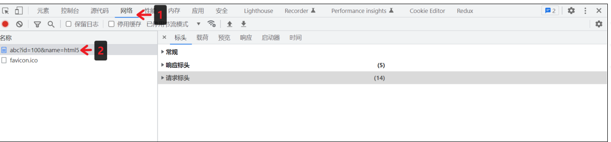


### **8.1** **查看请求行与请求头**


### **8.2** **查看请求体**

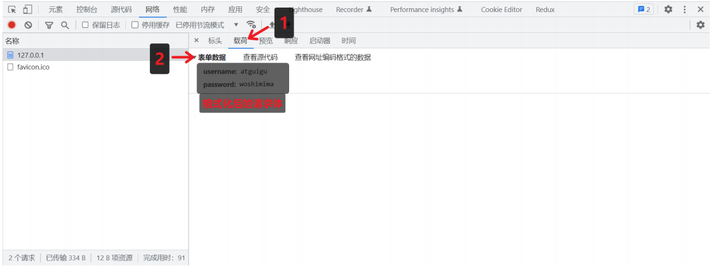

### **8.3** **查看** **URL** **查询字符串**

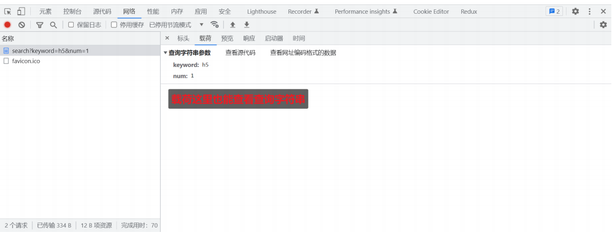

### **8.4** **查看响应行与响应头** 

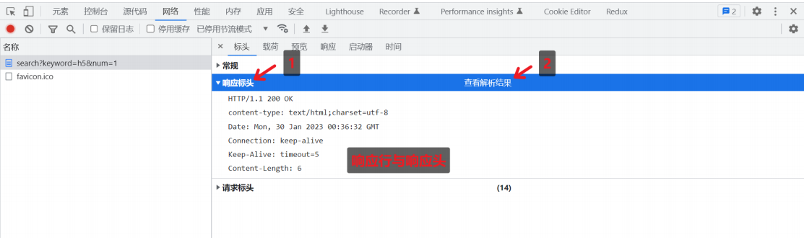

### **8.5** **查看响应体** 

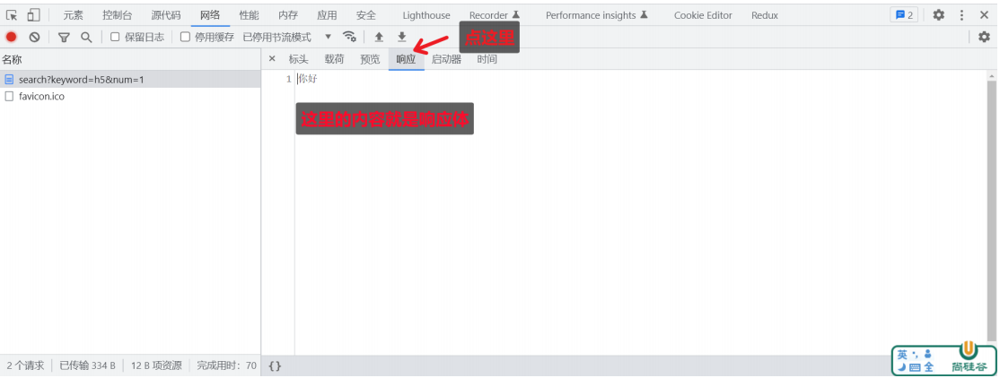

## **九、获取** **HTTP** **请求报文** 

想要获取请求的数据，需要通过 request 对象

| 含义           | 语法                                                         | 重点掌握 |
| -------------- | ------------------------------------------------------------ | -------- |
| 请求方法       | `request.method`                                             | *****    |
| 请求版本       | request.httpVersion                                          |          |
| 请求路径       | `request.url`                                                | *****    |
| URL 路径       | `require('url').parse(request.url).pathname`                 | *****    |
| URL 查询字符串 | `require('url').parse(request.url, true).query`              | *****    |
| 请求头         | `request.headers`                                            | *****    |
| 请求体         | request.on('data', function(chunk){}) request.on('end', function(){}) |          |

注意事项： 

1. request.url 只能获取路径以及查询字符串，无法获取 URL 中的域名以及协议的内容 

2. request.headers 将请求信息转化成一个对象，并将属性名都转化成了『小写』 

3. 关于路径：如果访问网站的时候，只填写了 IP 地址或者是域名信息，此时请求的路径为『 / 』 

4. 关于 favicon.ico：这个请求是属于浏览器自动发送的请求

### 获取请求头

获取请求头  获取请求的url  获取HTTP协议的版本号   获取HTTP的请求头

```javascript
//1.导入 http 模块
const http = require("http")

//2.创建服务对象
const server = http.createServer((request, response) => {
    //获取请求的方法
    // console.log(request.method);

    //获取请求的url
    // console.log(request.url);// /searcch?keyword=h5&num=1  只包含url中的路径与查询字符串

    //获取HTTP协议的版本号
    // console.log(request.httpVersion); //  1.1

    //获取HTTP的请求头
    // console.log(request.headers);
    // console.log(request.headers.host); //127.0.0.1:9000


    response.end('Hello HTTP Server --1') // 设置响应体
    // response.end('你好') // 设置响应体
})

//3.监听端口，启动服务
server.listen(9000, () => {
    console.log('服务已经启动');
})
```

### 获取请求体

```javascript
//1.导入 http 模块
const http = require("http")

//2.创建服务对象
const server = http.createServer((request, response) => {
    //1.声明一个变量
    let body = ''
    //2.绑定事件
    request.on('data', chunk => {
        body += chunk
    })
    //3.绑定end事件
    request.on('end', () => {
        console.log(body);
        //响应
        response.end('Hello HTTP')
    })
})

//3.监听端口，启动服务
server.listen(9000, () => {
    console.log('服务已经启动');
})
```

### 获取请求路径(URL)和查询字符串

```javascript
//导入 http 模块
const http = require("http")

//1.导入url模块
const url = require('url')

//创建服务对象
const server = http.createServer((request, response) => {
    //2.解析 request.url
    // console.log(request.url);

    // let res = url.parse(request.url)
    let res = url.parse(request.url, true)

    //获取路径
    // console.log(res.pathname);
    // console.log(res);
    //查询字符串
    let keyword = res.query.keywords
    console.log(keyword);

    response.end('url')
})

//监听端口，启动服务
server.listen(9000, () => {
    console.log('服务已经启动');
})
```

### 获取请求路径(URL)和查询字符串-方法2

```javascript
//导入 http 模块
const http = require("http")

//创建服务对象
const server = http.createServer((request, response) => {
    // console.log(request.url);

    //实例化一个url的对象
    // let url = new URL('/search?a=100&b=200', 'http://127.0.0.1:9000')
    let url = new URL(request.url, 'http://127.0.0.1:9000')

    //输出路径
    // console.log(url.pathname);
    // console.log(url);

    //输出 keywords 查询字符串
    console.log(url.searchParams.get('keywords')); // h5

 
    response.end('url new')
})

//监听端口，启动服务
server.listen(9000, () => {
    console.log('服务已经启动');
})
```


### **9.1** **练习** 

按照以下要求搭建 HTTP 服务

| 请求类型**(**方法**)** | 请求地址 | 响应体结果 |
| ---------------------- | -------- | ---------- |
| get                    | /login   | 登录页面   |
| get                    | /reg     | 注册页面   |


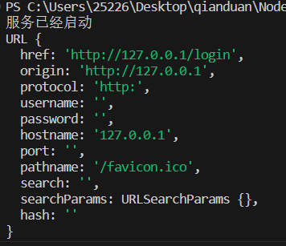

```javascript
// 要求：如果请求方法为  get  请求地址为/login  响应体结果：登录页面
// 要求：如果请求方法为  get  请求地址为/reg    响应体结果：注册页面

//1. 导入HTTP模块
const http = require('http')

//2.创建服务对象
const server = http.createServer((request, response) => {
    //获取请求方法
    // console.log(request.method);
    let { method } = request

    // 获取请求的url路径
    let { pathname } = new URL(request.url, 'http://127.0.0.1')

    // console.log(request.url);   //   /login   
    // console.log(pathname);  //   /login     

    //设置响应头
    response.setHeader('content-type', 'text/html;charset=utf-8')

    //判断
    if (method === 'GET' && pathname === '/login') {
        //登录的情形
        response.end("登录页面")
    } else if (method === 'GET' && pathname === '/reg') {
        //注册的情形
        response.end("注册页面")
    } else {
        response.end('Not Found')
    }
})

//3.监听端口，启动服务
server.listen(9000, () => {
    console.log('服务已经启动');
})
```


## **十、设置** **HTTP** **响应报文**

| 作用             | 语法                                                |
| ---------------- | --------------------------------------------------- |
| 设置响应状态码   | response.statusCode                                 |
| 设置响应状态描述 | response.statusMessage （ 用的非常少 ）             |
| 设置响应头信息   | `response.setHeader`('头名', '头值') (`可以自定义`) |
| 设置响应体       | `response.write('xx')` ` response.end('xxx')`       |

```javascript
write 和 end 的两种使用情况：
//1. write 和 end 的结合使用 响应体相对分散
response.write('xx');
response.write('xx');
response.write('xx');
response.end(); //每一个请求，在处理的时候必须要执行 end 方法的
//2. 单独使用 end 方法 响应体相对集中
response.end('xxx');
```

```javascript
//导入http模块
const http = require("http")

//2.创建服务对象
const server = http.createServer((request, response) => {
    //1.设置响应状态码
    response.statusCode = 200
    // response.statusCode = 203

    //2.响应状态的描述
    response.statusMessage = 'kill'

    //3.设置响应头
    response.setHeader('content-type', 'text/html;charset=utf-8')
    // response.setHeader('Server', 'Node.js') // 表示服务端的名字，可自定义写值
    // response.setHeader('MyHeader', 'test,test') // 自定义响应头
    // response.setHeader('test', ['a', 'b', 'c']) // 设置同名的响应头

    //4.设置响应体
    //4.1   write
    response.write('llllee') //  write可多次调用 
    response.write('xxxxx') //  write可多次调用 

    //4.2   end
    response.end('response') //设置响应体   只能用有且只有1个end
})

//3. 监听服务器端口，启动服务
server.listen(9000, () => {
    console.log('服务已启动');
})
```


### **10.1** **练习** 

搭建 HTTP 服务，响应一个 4 行 3 列的表格，并且要求表格有 隔行换色效果 ，且 点击 单元格能 高亮显示 

```javascript
//导入 http 模块
const http = require("http")
const fs = require('fs')

//创建服务对象
const server = http.createServer((request, response) => {
    //读取文件内容
    let html = fs.readFileSync('./10_table.html')
    console.log(__dirname);
    response.end(html) // 设置响应体
})

//监听端口，启动服务
server.listen(9000, () => {
    console.log('服务已经启动');
})
```


## 十一、网页资源的基本加载过程

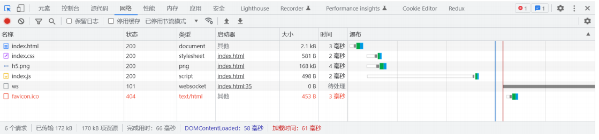

网页资源的加载都是循序渐进的，首先获取 HTML 的内容， 然后解析 HTML 在发送其他资源的请求，如 CSS，Javascript，图片等。 理解了这个内容对于后续的学习与成长有非常大的帮助

```javascript
//导入 http 模块
const http = require("http")
const fs = require('fs')
const path = require('path')

//创建服务对象
const server = http.createServer((request, response) => {
    //获取请求url的路径
    let { pathname } = new URL(request.url, 'http://127.0.0.1')

    if (pathname === '/') {
        //读取文件内容
        // let html = fs.readFileSync(__dirname + './10_table.html')
        let html = fs.readFileSync(path.join(__dirname, './10_table.html'))
        response.end(html) // 设置响应体
    } else if (pathname === '/index.css') {
        let css = fs.readFileSync(path.join(__dirname, './index.css'))
        response.end(css) // 设置响应体
    } else if (pathname === '/index.js') {
        let js = fs.readFileSync(path.join(__dirname, './index.js'))
        response.end(js) // 设置响应体
    } else {
        response.statusCode = 404
        response.end('404 Not found') // 设置响应体
    }
})

//监听端口，启动服务
server.listen(9000, () => {
    console.log('服务已经启动');
})
```


## **十二、静态资源服务** 

`静态资源` 是指 内容长时间不发生改变的资源 ，例如图片，视频，CSS 文件，JS文件，HTML文件，字体文件等

`动态资源` 是指 内容经常更新的资源 ，例如百度首页，网易首页，京东搜索列表页面等 

```javascript
/**
 * 创建一个 HTTP 服务，端口为 9000，满足如下需求
 * GET  /index.html        响应  page/index.html 的文件内容
 * GET  /css/app.css       响应  page/css/app.css 的文件内容
 * GET  /images/logo.png   响应  page/images/logo.png 的文件内容
 */
//导入 http 模块
const http = require("http")
const fs = require('fs')
const path = require('path')

//创建服务对象
const server = http.createServer((request, response) => {
    //获取请求url的路径
    let { pathname } = new URL(request.url, 'http://127.0.0.1')
    //拼接文件路径
    let filePath = __dirname + '/page' + pathname
    //读取文件 fs 异步 API
    fs.readFile(filePath, (err, data) => {
        if (err) {
            response.statusCode = 500
            response.end('文件读取失败')
            return
        }
        //响应文件内容
        response.end(data)
    })

    // if (pathname === '/index.html') {
    //     //读取文件内容
    //     let html = fs.readFileSync(path.join(__dirname, './page/index.html'))
    //     response.end(html) // 设置响应体
    // } else if (pathname === '/css/app.css') {
    //     let css = fs.readFileSync(path.join(__dirname, 'page/css/app.css'))
    //     response.end(css) // 设置响应体
    // } else if (pathname === '/images/logo.png') {
    //     let img = fs.readFileSync(path.join(__dirname, 'page/images/logo.png'))
    //     response.end(img) // 设置响应体
    // } else {
    //     response.statusCode = 404
    //     response.end('404 Not found') // 设置响应体
    // }
})

//监听端口，启动服务
server.listen(9000, () => {
    console.log('服务已经启动');
})
```


### **12.1** **网站根目录或静态资源目录** 

HTTP 服务在哪个文件夹中寻找静态资源，那个文件夹就是 静态资源目录 ，也称之为 网站根目录

> 思考：vscode 中使用 live-server 访问 HTML 时， 它启动的服务中网站根目录是谁？
>
> - 改文件的所处的文件夹

### **12.2** **网页中的** **URL** 

网页中的 URL 主要分为两大类：相对路径与绝对路径 

#### **12.2.1** **绝对路径** 

绝对路径可靠性强，而且相对容易理解，在项目中运用较多

| 形式                                                         | 特点                                                         |
| ------------------------------------------------------------ | ------------------------------------------------------------ |
| [http://atguigu.com/w eb](https://gitee.com/link?target=http%3A%2F%2Fatguigu.com%2Fweb) | 直接向目标资源发送请求，容易理解。网站的外链会用到此形式     |
| //atguigu.com/web                                            | 与页面 URL 的协议拼接形成完整 URL 再发送请求。大型网站用的比较多 |
| /web                                                         | 与页面 URL 的协议、主机名、端口拼接形成完整 URL 再发送请求。中小型网站 |

#### **12.2.2** **相对路径** 

相对路径在发送请求时，需要与当前页面 URL 路径进行 计算 ，得到完整 URL 后，再发送请求，学习阶 段用的较多 

例如当前网页 url 为 **http://www.atguigu.com/course/h5.html**

| 形式               | 最终的 **URL**                                               |
| ------------------ | ------------------------------------------------------------ |
| ./css/app.css      | [http://www.atguigu.com/course/css/app.css](https://gitee.com/link?target=http%3A%2F%2Fwww.atguigu.com%2Fcourse%2Fcss%2Fapp.css) |
| js/app.js          | [http://www.atguigu.com/course/js/app.js](https://gitee.com/link?target=http%3A%2F%2Fwww.atguigu.com%2Fcourse%2Fjs%2Fapp.js) |
| ../img/logo.png    | [http://www.atguigu.com/img/logo.png](https://gitee.com/link?target=http%3A%2F%2Fwww.atguigu.com%2Fimg%2Flogo.png) |
| ../../mp4/show.mp4 | [http://www.atguigu.com/mp4/show.mp4](https://gitee.com/link?target=http%3A%2F%2Fwww.atguigu.com%2Fmp4%2Fshow.mp4) |

#### **12.2.3** **网页中使用** **URL** **的场景小结** 

包括但不限于如下场景：

- a 标签 href
- link 标签 href
- script 标签 src
- img 标签 src
- video audio 标签 src
- form 中的 action
- AJAX 请求中的 URL

### **12.3**设置资源类型（mime类型） 

媒体类型（通常称为 Multipurpose Internet Mail Extensions 或 MIME 类型 ）是一种标准，用来表示文档、文件或字节流的性质和格式。

```javascript
mime 类型结构： [type]/[subType]

例如： text/html text/css image/jpeg image/png application/json
```

HTTP 服务可以设置响应头 Content-Type 来表明响应体的 MIME 类型，浏览器会根据该类型决定如何处理资源

下面是常见文件对应的 mime 类型

```javascript
html: 'text/html',
css: 'text/css',
js: 'text/javascript',
png: 'image/png',
jpg: 'image/jpeg', 
gif: 'image/gif',
mp4: 'video/mp4',
mp3: 'audio/mpeg',
json: 'application/json'
```

> 对于未知的资源类型，可以选择 `application/octet-stream` 类型，浏览器在遇到该类型的响应时，会对响应体内容进行独立存储，也就是我们常见的 `下载` 效果

```javascript
require('http').createServer((request,response)=>{
	//获取请求的方法已经路径
	let {url,method} = request;
	//判断请求方式以及请求路径
	if(method == "GET" && url == "/index.html"){
		//需要响应文件中的内容
		let data = require('fs').readFileSync( dirname + '/index.html');
         response.end(data);
	}else if(method == "GET" && url == "/css/app.css"){
		//需要响应文件中的内容
		let data = require('fs').readFileSync( dirname + '/public/css/app.css');
		response.end(data);
	}else if(method == "GET" && url == "/js/app.js"){
		//需要响应文件中的内容
		let data = require('fs').readFileSync( dirname + '/public/js/app.js');
         response.end(data);
	}else{
		//404响应
         response.statusCode = 404;
		response.end("<h1>404 Not Found</h1>");
	}
}).listen(80,()=>{

console.log('80端口正在启动中....');

})
```

很明显上面的代码，当只要有一个请求路径就需要进行判断，显然这种方式不够完美，那么我们需要封 装 

```javascript
require('http').createServer((request,response)=>{
	//获取请求的方法已经路径
	let {url,method} = request;
	//文件夹路径  根路径
	let rootDir = dirname + '/public';
	//拼接文件路径
	let filePath = rootDir + url;
	//读取文件内容
    fs.readFile(filePath,(err,data)=>{
		//判断
        if(err){
			//如果出现错误，响应404状态码
            response.statusCode = 404; 
            response.end('<h1>404 Not Found</h1>');
		}else{
			//响应文件内容
            response.end(data);
		}
	})
}).listen(80,()=>{
	console.log('80端口正在启动中....');
})
```

```javascript
/**
 * 创建一个 HTTP 服务，端口为 9000，满足如下需求
 * GET  /index.html        响应  page/index.html 的文件内容
 * GET  /css/app.css       响应  page/css/app.css 的文件内容
 * GET  /images/logo.png   响应  page/images/logo.png 的文件内容
 */
//导入 http 模块
const http = require("http")
const fs = require('fs')
const path = require('path')
//声明一个变量
let mimes = {
    html: 'text/html',
    css: 'text/css',
    js: 'text/javascript',
    png: 'image/png',
    jpg: 'image/jpeg',
    gif: 'image/gif',
    mp4: 'video/mp4',
    mp3: 'audio/mpeg',
    json: 'application/json'
}

//创建服务对象
const server = http.createServer((request, response) => {
    if (request.method !== 'GET') {
        response.statusCode = 405
        response.end('<h1>405 Method Not Allowed</h1>')
        return
    }
    //获取请求url的路径
    let { pathname } = new URL(request.url, 'http://127.0.0.1')
    //拼接文件路径
    //声明一个变量
    let root = __dirname + '/page'
    let filePath = root + pathname

    //读取文件 fs 异步 API
    fs.readFile(filePath, (err, data) => {
        if (err) {
            // console.log(err);
            //字符集
            response.setHeader('content-type', 'text/html;charset=utf-8')
            //判断错误代号
            switch (err.code) {
                case 'ENOENT':
                    response.statusCode = 404
                    response.end(`<h1>404 Not Found</h1>`)
                case 'EPERM':
                    response.statusCode = 403
                    response.end('<h1>403 Forbidden</h1>')
                default:
                    response.statusCode = 500
                    response.end('<h1>Internal Server Error</h1>')
            }
            // response.statusCode = 500
            // response.end('文件读取失败')
            return
        }
        //获取文件后缀名
        let ext = path.extname(filePath).slice(1)
        //获取对应的类型
        let type = mimes[ext] //这里的 mimes[ext] 表示从 mimes 对象中获取键为 ext 的值
        if (type) {
            //匹配成功
            response.setHeader('content-type', type + ';charset=utf-8')
        } else {
            //没有匹配成功
            response.setHeader('content-type', 'application/octet-stream')
        }

        //响应文件内容
        response.end(data)
    })
})

//监听端口，启动服务
server.listen(9000, () => {
    console.log('服务已经启动');
})
```


### **12.4 GET** **和** **POST** **请求场景小结** 

GET 请求的情况：

- 在地址栏直接输入 url 访问
- 点击 a 链接
- link 标签引入 css
- script 标签引入 js
- img 标签引入图片
- form 标签中的 method 为 get （不区分大小写）
- ajax 中的 get 请求

POST 请求的情况：

- form 标签中的 method 为 post（不区分大小写）
- AJAX 的 post 请求

## **十三、GET和POST请求的区别** 

`GET` 和 `POST` 是 HTTP 协议请求的两种方式。

- `GET` 主要用来获取数据，`POST` 主要用来提交数据
- `GET` 带参数请求是将参数缀到 URL 之后，在地址栏中输入 url 访问网站就是 GET 请求，`POST` 带参数请求是将参数放到请求体中
- `POST` 请求相对 `GET` 安全一些，因为在浏览器中参数会暴露在地址栏
- `GET` 请求大小有限制，一般为 2K，而 POST 请求则没有


#  Node.js 模块化

## 一，介绍

### 1.1什么是模块化与模块 ?

> 将一个复杂的程序文件依据一定规则（规范）拆分成多个文件的过程称之为 `模块化`

其中拆分出的 每个文件就是一个模块，模块的内部数据是私有的，不过模块可以暴露内部数据以便其他模块使用

### 1.2什么是模块化项目 ?

> 编码时是按照模块一个一个编码的， 整个项目就是一个模块化的项目

### 1.3模块化好处

下面是模块化的一些好处：

1. 防止命名冲突
2. 高复用性
3. 高维护性

## 二，模块暴露数据

### 2.1模块初体验

可以通过下面的操作步骤，快速体验模块化

1. 创建 me.js

   ```javascript
   //声明函数
   function tiemo(){
   	console.log('贴膜....');
   }
   //暴露数据
   module.exports = tiemo;
   ```

2. 创建 index.js

   ```javascript
   //导入模块
   const tiemo = require('./me.js');
   //调用函数
   tiemo(); //=> 贴膜....
   ```

### 2.2暴露数据

模块暴露数据的方式有两种：

1. `module.exports` = value
2. `exports.name` = value

> 使用时有几点注意：
>
> - `module.exports` 可以暴露 任意 数据
> - 不能使用 `exports = value` 的形式暴露数据，模块内部 module 与 exports 的隐式关系 `exports = module.exports = {}` ，require 返回的是目标模块中 `module.exports` 的值

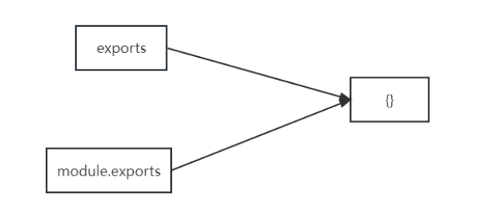

```javascript
function tiemo() {
    console.log('贴膜');
}

function niejiao() {
    console.log('捏脚。。');
}


//暴露数据
// module.exports = {
//     tiemo,
//     niejiao
// }

//exports暴露数据
// exports.niejiao = niejiao
// exports.tiemo = tiemo

//1, module.exports 可以暴露 任意 数据
// module.exports = 'dingding'
// module.exports = 231

//2，不能使用 exports = value 的形式暴露数据
// exports = 'dingding'

// exports = module.exports = {}
console.log(module.exports); //{}
console.log(module.exports === exports); // true
```


## 三，导入（引入）模块

在模块中使用 require 传入文件路径即可引入文件

```
const test = require('./me.js')
```

require 使用的一些注意事项：

1. 对于自己创建的模块，导入时路径建议写 相对路径，且不能省略 `./` 和 `../`

2. `js` 和 `json` 文件导入时可以不用写后缀，c/c++编写的 `node` 扩展文件也可以不写后缀，但是一般用不到，直接使用 **node** 的 `require()` 方法即可将 JSON 文件转换成 JS 对象

3. 如果导入其他类型的文件，会以 `js` 文件进行处理

4. 如果导入的路径是个文件夹，则会 首先 检测该文件夹下 `package.json` 文件中 `main` 属性对应的文件，        

   如果存在则导入，反之如果文件不存在会报错。

   如果 main 属性不存在，或者 package.json 不存在，则会尝试导入文件夹下的 `index.js` 和 `index.json`，

   如果还是没找到，就会报错

5. 导入 node.js 内置模块时，直接 require 模块的名字即可，无需加 `./` 和 `../`

## 四，导入模块的基本流程

这里我们介绍一下 `require` 导入 自定义模块 的基本流程

1. 将相对路径转为绝对路径，定位目标文件
2. 缓存检测
3. 读取目标文件代码
4. 包裹为一个函数并执行（自执行函数）。通过 `arguments.callee.toString()` 查看自执行函数
5. 缓存模块的值
6. 返回 `module.exports` 的值

```javascript
/**
 * 伪代码
 */

function require(file){
  //1. 将相对路径转为绝对路径，定位目标文件
  let absolutePath = path.resolve(__dirname, file);
  //2. 缓存检测
  if(caches[absolutePath]){
    return caches[absolutePath];
  }
  //3. 读取文件的代码
  let code = fs.readFileSync(absolutePath).toString();
  //4. 包裹为一个函数 然后执行
  let module = {};
  let exports = module.exports = {};
  (function (exports, require, module, __filename, __dirname) {
    const test = {
      name: '尚硅谷'
    }
  
    module.exports = test;
  
    //输出
    console.log(arguments.callee.toString());
  })(exports, require, module, __filename, __dirname)
  //5. 缓存结果
  caches[absolutePath] = module.exports;
  //6. 返回 module.exports 的值
  return module.exports;
}
```

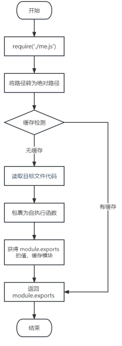

## 五，CommonJS 规范

`module.exports` 、`exports` 以及 `require` 这些都是 `CommonJS` 模块化规范中的内容。

而 Node.js 是实现了 CommonJS 模块化规范，二者关系有点像 JavaScript 与 ECMAScript


#  包管理工具


## 一，概念介绍

### 1.1包是什么

> 『包』英文单词是 `package` ，代表了一组特定功能的源码集合

### 1.2包管理工具

管理『包』的应用软件，可以对「包」进行 `下载安装` ， `更新` ， `删除`， `上传`等操作

借助包管理工具，可以快速开发项目，提升开发效率

包管理工具是一个通用的概念，很多编程语言都有包管理工具，所以 掌握好包管理工具非常重要

### 1.3常用的包管理工具

下面列举了前端常用的包管理工具

- `npm`
- yarn
- cnpm

## 二，npm

> npm 全称 `Node Package Manager` ，翻译为中文意思是『Node 的包管理工具』

npm 是 node.js 官方内置的包管理工具，是 必须要掌握住的工具

### 2.1npm 的安装

node.js 在安装时会 `自动安装 npm` ，所以如果你已经安装了 node.js，可以直接使用 npm

可以通过 `npm -v` 查看版本号测试，如果显示版本号说明安装成功，反之安装失败

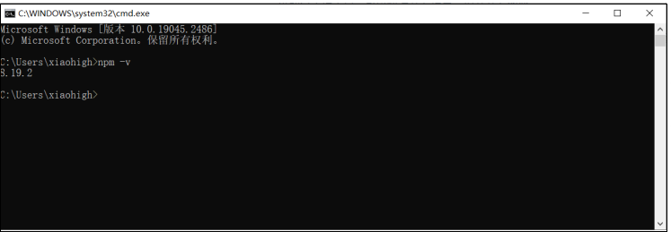

> 查看版本时可能与上图版本号不一样，不过不影响正常使用

### 2.2 npm 基本使用

#### 2.2.1初始化

创建一个空目录，然后以此目录作为工作目录 启动命令行工具，执行 `npm init`

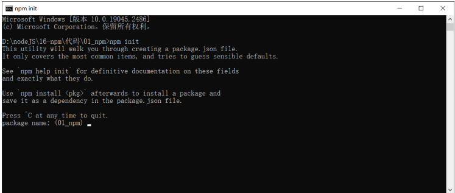

```
npm init` 命令的作用是将文件夹初始化为一个『包』， `交互式创建 package.json 文件
package.json` 是包的配置文件，每个包都必须要有 `package.json
```

`package.json` 内容示例：

```
{
	"name": "01_npm",
	"version": "1.0.0",
	"description": "",
	"main": "index.js",
	"scripts": {
		"test": "echo \"Error: no test specified\" && exit 1"
	},
	"author": "",
	"license": "ISC"
}
```

属性翻译

```javascript
{
	"name": "1-npm", 		#包的名字
	"version": "1.0.0", 	#包的版本
	"description": "", 		#包的描述
	"main": "index.js", 	#包的入口文件
	"scripts": { 		    #脚本配置
		"test": "echo \"Error: no test specified\" && exit 1"
	},
	"author": "", 			#作者
	"license": "ISC" 		#开源证书
}
```

> 初始化的过程中还有一些注意事项：
>
> 1. package name (`包名`) 不能使用中文、大写，默认值是`文件夹的名称`，所以文件夹名称也不 能使用中文和大写
> 2. version (`版本号`)要求 `x.x.x` 的形式定义，`x` 必须是数字，默认值是 `1.0.0`
> 3. ISC 证书与 MIT 证书功能上是相同的，关于开源证书扩展阅读 [http://www.ruanyifeng.com/blog/2011/05/how_to_choose_free_software_licenses.html](https://gitee.com/link?target=http%3A%2F%2Fwww.ruanyifeng.com%2Fblog%2F2011%2F05%2Fhow_to_choose_free_software_licenses.html)
> 4. `package.json` 可以手动创建与修改
> 5. 使用 `npm init -y` 或者 `npm init --yes` 极速创建 `package.json`

#### 2.2.2搜索包

搜索包的方式有两种

1. 命令行 『npm s/search 关键字』
2. `网站搜索` 网址是 `https://www.npmjs.com/`

> 经常有同学问，『我怎样才能精准找到我需要的包？』 这个事儿需要大家在实践中不断的积累，通过看文章，看项目去学习去积累

#### 2.2.3下载安装包

我们可以通过 `npm install` 和 `npm i` 命令安装包

```
# 格式
npm install <包名>
npm i <包名>

# 示例

npm install uniq
npm i uniq
```

运行之后文件夹下会增加两个资源

- `node_modules 文件夹` 存放下载的包
- `package-lock.json 包的锁文件`，用来锁定包的版本

> 安装 uniq 之后， uniq 就是当前这个包的一个 `依赖包` ，有时会简称为 `依赖`
>
> 比如我们创建一个包名字为 A，A 中安装了包名字是 B，我们就说 B 是 A 的一个依赖包，也会说 A 依赖 B

#### 2.2.4 require 导入 npm 包基本流程

1. 在当前文件夹下 node_modules 中寻找同名的文件夹
2. 在**上级目录**中下的 node_modules 中寻找同名的文件夹，直至找到磁盘根目录

### 2.3 生产环境与开发环境

`开发环境` 是程序员 专门用来写代码 的环境，一般是指程序员的电脑，开发环境的项目一般 只能程序员自己访问

`生产环境` 是项目 代码正式运行 的环境，一般是指正式的服务器电脑，生产环境的项目一般 每个客户都可以访问

### 2.4 生产依赖与开发依赖

我们可以在安装时设置选项来区分 `依赖的类型`，目前分为两类：

| 类型     | 命令                                      | 补充                                                         |
| -------- | ----------------------------------------- | ------------------------------------------------------------ |
| 生产依赖 | npm i -S uniq   <br/>npm i --save uniq    | -S 等效于 --save，`-S 是默认选项` 包信息保存在 package.json 中 `dependencies` 属性 |
| 开发依赖 | npm i -D less  <br/>npm i --save-dev less | -D 等效于 --save-dev 包信息保存在 package.json 中 `devDependencies` 属性 |

> 举个例子方便大家理解，比如说做蛋炒饭需要`大米`，`油`，`葱`，`鸡蛋`，`锅`，`煤气`，`铲子`等
>
> 其中`锅`， `煤气`， `铲子`属于开发依赖，只在制作阶段使用
>
> 而 `大米`， `油`， `葱`， `鸡蛋`属于生产依赖，在制作与最终食用都会用到
>
> 所以 `开发依赖` 是只在开发阶段使用的依赖包，而 `生产依赖` 是开发阶段和最终上线运行阶段都用到的依赖包

### 2.5 全局安装

我们可以执行安装选项 -g 进行全局安装

```
npm i -g nodemon
```

全局安装完成之后就可以在命令行的任何位置运行 `nodemon` 命令

该命令的作用是 `自动重启 node 应用程序`

> 说明：
>
> - 全局安装的命令不受工作目录位置影响
> - 可以通过 `npm root -g` 可以查看全局安装包的位置
> - 不是所有的包都适合全局安装，只有全局类的工具才适合，可以通过查看包的官方文档来确定安装方式，这里先不必太纠结

#### 2.5.1修改 windows 执行策略

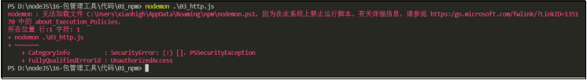

windows 默认不允许 npm 全局命令执行脚本文件，所以需要修改执行策略

1. 以`管理员身份`打开 `powershell` 命令行

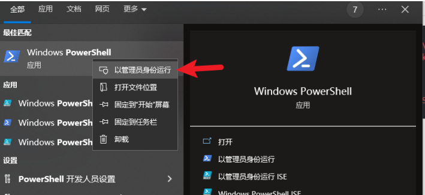

1. 键入命令 `set-ExecutionPolicy remoteSigned`

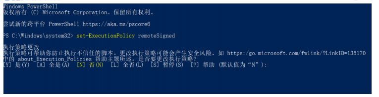

1. 键入 A 然后敲回车 👌
2. 如果不生效，可以尝试重启 vscode

#### 2.5.2 环境变量 Path

Path 是操作系统的一个环境变量，可以设置一些文件夹的路径，在当前工作目录下找不到可执行文件 时，就会在环境变量 Path 的目录中挨个的查找，如果找到则执行，如果没有找到就会报错

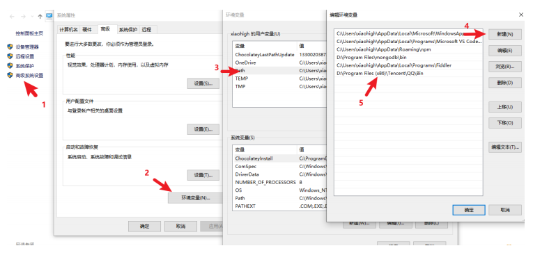

> 补充说明：
>
> - 如果希望某个程序在任何工作目录下都能正常运行，就应该将该程序的所在目录配置到环境 变量 Path 中
> - windows 下查找命令的所在位置
>   - `cmd 命令行` 中执行 `where nodemon`
>   - `powershell命令行` 执行 `get-command nodemon`

### 2.6安装包依赖

在项目协作中有一个常用的命令就是 `npm i`，通过该命令可以依据 `package.json` 和 `package-lock.json` 的依赖声明安装项目依赖

```
npm i
npm install
```

> node_modules 文件夹大多数情况都不会存入版本库

### 2.7安装指定版本的包

项目中可能会遇到版本不匹配的情况，有时就需要安装指定版本的包，可以使用下面的命令的

```
## 格式
npm i <包名@版本号>

## 示例
npm i jquery@1.11.2
```

### 2.8 删除依赖

项目中可能需要删除某些不需要的包，可以使用下面的命令

```
## 局部删除
npm remove uniq
npm r uniq

## 全局删除
npm remove -g nodemon
```

### 2.9配置命令别名

通过配置命令别名可以更简单的执行命令

配置 package.json 中的 `scripts` 属性

```
{
	.
	.
	.
	"scripts": {
		"server": "node server.js",
		"start": "node index.js",
	},
	.
	.
}
```

配置完成之后，可以使用别名执行命令

```
npm run server
npm run start
```

不过 `start` 别名比较特别，使用时可以省略 `run`

```
npm start
```

> 补充说明：
>
> - `npm start` 是项目中常用的一个命令，一般用来启动项目
> - `npm run` 有自动向上级目录查找的特性，跟 `require` 函数也一样
> - 对于陌生的项目，我们可以通过查看 `scripts` 属性来参考项目的一些操作

## 三，cnpm

### 3.1介绍

cnpm 是一个淘宝构建的`npmjs.com`的完整镜像，也称为『淘宝镜像』，网址[https://npmmirror.com/](https://gitee.com/link?target=https%3A%2F%2Fnpmmirror.com%2F) cnpm 服务部署在国内 阿里云服务器上，可以提高包的下载速度

官方也提供了一个全局工具包 `cnpm` ，操作命令与 npm 大体相同

### 3.2安装

我们可以通过 npm 来安装 cnpm 工具

```
npm install -g cnpm --registry=https://registry.npmmirror.com
```

### 3.3操作命令

| 功能         | 命令                                                        |
| ------------ | ----------------------------------------------------------- |
| 初始化       | cnpm init / cnpm init                                       |
| 安装包       | cnpm i uniq cnpm i -S uniq cnpm i -D uniq cnpm i -g nodemon |
| 安装项目依赖 | cnpm i                                                      |
| 删除         | cnpm r uniq                                                 |

### 3.4npm 配置淘宝镜像

用 npm 也可以使用淘宝镜像，配置的方式有两种

- 直接配置
- 工具配置

#### 3.4.1直接配置

执行如下命令即可完成配置

```
npm config set registry https://registry.npmmirror.com/
```

#### 3.4.2工具配置

使用 `nrm` 配置 npm 的镜像地址 `npm registry manager`

1. 安装 nrm

   ```
   npm i -g nrm
   ```

2. 修改镜像

   ```
   nrm use taobao
   ```

3. 检查是否配置成功（选做）

   ```
   npm config list
   ```

   检查 registry 地址是否为 [https://registry.npmmirror.com/](https://gitee.com/link?target=https%3A%2F%2Fregistry.npmmirror.com%2F) , 如果 `是` 则表明成功

> 补充说明：
>
> 1. 建议使用第二种方式进行镜像配置，因为后续修改起来会比较方便
> 2. 虽然 cnpm 可以提高速度，但是 npm 也可以通过淘宝镜像进行加速，所以 npm 的使用率还是高于 cnpm

## 四，yarn

### 4.1yarn 介绍

> yarn 是由 Facebook 在 2016 年推出的新的 Javascript 包管理工具，官方网址：[https://yarnpkg.com/](https://gitee.com/link?target=https%3A%2F%2Fyarnpkg.com%2F)

### 4.2yarn 特点

yarn 官方宣称的一些特点

- 速度超快：yarn 缓存了每个下载过的包，所以再次使用时无需重复下载。 同时利用并行下载以最大化资源利用率，因此安装速度更快
- 超级安全：在执行代码之前，yarn 会通过算法校验每个安装包的完整性
- 超级可靠：使用详细、简洁的锁文件格式和明确的安装算法，yarn 能够保证在不同系统上无差异的工作

### 4.3yarn 安装

我们可以使用 npm 安装 yarn

```
npm i -g yarn
```

### 4.4yarn 常用命令

| 功能         | 命令                                                         |
| ------------ | ------------------------------------------------------------ |
| 初始化       | yarn init / yarn init -y                                     |
| 安装包       | yarn add uniq 生产依赖 yarn add less --dev 开发依赖 yarn global add nodemon 全局安装 |
| 删除包       | yarn remove uniq 删除项目依赖包 yarn global remove nodemon 全局删除包 |
| 安装项目依赖 | yarn                                                         |
| 运行命令别名 | yarn <别名> # 不需要添加 `run`                               |

> 思考题：
>
> 这里有个小问题就是 全局安装的包不可用，yarn 全局安装包的位置可以通过 `yarn global bin`来查看，
>
> 那你有没有办法使 yarn 全局安装的包能够正常运行？
>
> - 配置 path 环境

### 4.5yarn 配置淘宝镜像

可以通过如下命令配置淘宝镜像

```
yarn config set registry https://registry.npmmirror.com/
```

可以通过 `yarn config list` 查看 yarn 的配置项

### 4.6npm 和 yarn 选择

大家可以根据不同的场景进行选择

1. 个人项目

   如果是个人项目，哪个工具都可以，可以根据自己的喜好来选择

2. 公司项目 如果是公司要根据项目代码来选择，可以 通过锁文件判断 项目的包管理工具

   - npm 的锁文件为 `package-lock.json`
   - yarn 的锁文件为 `yarn.lock`

> 包管理工具 不要混着用，切记，切记，切记

## 五，管理发布包

### 5.1创建与发布

我们可以将自己开发的工具包发布到 npm 服务上，方便自己和其他开发者使用，操作步骤如下：

1. 创建文件夹，并创建文件 index.js， 在文件中声明函数，使用 module.exports 暴露
2. npm 初始化工具包，package.json 填写包的信息 (包的名字是唯一的)
3. 注册账号 [https://www.npmjs.com/signup](https://gitee.com/link?target=https%3A%2F%2Fwww.npmjs.com%2Fsignup)
4. 激活账号 （ 一定要激活账号 ）
5. 修改为官方的官方镜像 (命令行中运行 `nrm use npm` )
6. 命令行下 `npm login` 填写相关用户信息
7. 命令行下 `npm publish` 提交包 👌

### 5.2更新包

后续可以对自己发布的包进行更新，操作步骤如下

1. 更新包中的代码

2. 测试代码是否可用

3. 修改 `package.json` 中的版本号

4. 发布更新

   ```
   npm publish
   ```

### 5.3删除包

执行如下命令删除包

```
npm unpublish --force
```

> 删除包需要满足一定的条件， [https://docs.npmjs.com/policies/unpublish](https://gitee.com/link?target=https%3A%2F%2Fdocs.npmjs.com%2Fpolicies%2Funpublish)
>
> - 你是包的作者
> - 发布小于 24 小时
> - 大于 24 小时后，没有其他包依赖，并且每周小于 300 下载量，并且只有一个维护者

## 六，扩展内容

在很多语言中都有包管理工具，比如：

| 语言       | 包管理工具          |
| ---------- | ------------------- |
| PHP        | composer            |
| Python     | pip                 |
| Java       | maven               |
| Go         | go mod              |
| JavaScript | npm/yarn/cnpm/other |
| Ruby       | rubyGems            |

除了编程语言领域有包管理工具之外，操作系统层面也存在包管理工具，不过这个包指的是『`软件包`』

| 操作系统 | 包管理工具 | 网址                                                         |
| -------- | ---------- | ------------------------------------------------------------ |
| Centos   | yum        | [https://packages.debian.org/stable/](https://gitee.com/link?target=https%3A%2F%2Fpackages.debian.org%2Fstable%2F) |
| Ubuntu   | apt        | [https://packages.ubuntu.com/](https://gitee.com/link?target=https%3A%2F%2Fpackages.ubuntu.com%2F) |
| MacOS    | homebrew   | [https://brew.sh/](https://gitee.com/link?target=https%3A%2F%2Fbrew.sh%2F) |
| Windows  | chocolatey | [https://chocolatey.org/](https://gitee.com/link?target=https%3A%2F%2Fchocolatey.org%2F) |


# nvm

##  介绍

nvm 全称 `Node Version Manager` 顾名思义它是用来管理 node 版本的工具，方便切换不同版本的Node.js

## 使用

nvm 的使用非常的简单，跟 npm 的使用方法类似

### 下载安装

首先先下载 nvm，下载地址 [https://github.com/coreybutler/nvm-windows/releases](https://gitee.com/link?target=https%3A%2F%2Fgithub.com%2Fcoreybutler%2Fnvm-windows%2Freleases) ，

选择 `nvm-setup.exe` 下载即可（网络异常的小朋友可以在资料文件夹中获取）

### 常用命令

| 命令                  | 说明                            |
| --------------------- | ------------------------------- |
| nvm list available    | 显示所有可以下载的 Node.js 版本 |
| nvm list              | 显示已安装的版本                |
| nvm install 18.12.1   | 安装 18.12.1 版本的 Node.js     |
| nvm install latest    | 安装最新版的 Node.js            |
| nvm uninstall 18.12.1 | 删除某个版本的 Node.js          |
| nvm use 18.12.1       | 切换 18.12.1 的 Node.js         |


# Express

##  express 介绍

> express 是一个基于 Node.js 平台的极简、灵活的 WEB 应用开发框架，官方网址： [https://www.expressjs.com.cn/](https://gitee.com/link?target=https%3A%2F%2Fwww.expressjs.com.cn%2F)

简单来说，express 是一个封装好的工具包，封装了很多功能，便于我们开发 WEB 应用(HTTP 服务)

## express 使用

### express 下载

express 本身是一个 npm 包，所以可以通过 npm 安装

```
npm init
npm i express
```

### express 初体验

大家可以按照这个步骤进行操作：

1. 创建 JS 文件，键入如下代码

```javascript
//1. 导入 express
const express = require('express');
//2. 创建应用对象
const app = express();
//3. 创建路由规则
app.get('/home', (req, res) => {
	res.send('hello express server');
});
//4. 监听端口 启动服务
app.listen(3000, () =>{
	console.log('服务已经启动, 端口监听为 3000...');
});
```

1. 命令行下执行该脚本

   ```javascript
   1. node <文件名>
   # 或者
   nodemon <文件名>
   ```

2. 然后在浏览器就可以访问 [http://127.0.0.1:3000/home](https://gitee.com/link?target=http%3A%2F%2F127.0.0.1%3A3000%2Fhome) 👌

## express 路由

### 什么是路由

> 官方定义： 路由确定了应用程序如何响应客户端对特定端点的请求

### 路由的使用

一个路由的组成有 `请求方法`， `路径` 和 `回调函数` 组成

express 中提供了一系列方法，可以很方便的使用路由，使用格式如下：

```javascript
app.<method>(path，callback)
```

代码示例：

```javascript
//导入 express
const express = require('express');

//创建应用对象
const app = express();

//创建 get 路由
app.get('/home', (req, res) => {
	res.send('网站首页');
});

//首页路由
app.get('/', (req,res) => {
	res.send('我才是真正的首页');
});

//创建 post 路由
app.post('/login', (req, res) => {
	res.send('登录成功');
});

//匹配所有的请求方法
app.all('/search', (req, res) => {
	res.send('1 秒钟为您找到相关结果约 100,000,000 个');
});

//自定义 404 路由
app.all("*", (req, res) => {
	res.send('<h1>404 Not Found</h1>')
});

//监听端口 启动服务
app.listen(3000, () =>{
	console.log('服务已经启动, 端口监听为 3000');
});
```

### 获取请求参数

express 框架封装了一些 API 来方便获取请求报文中的数据，并且兼容原生 HTTP 模块的获取方式

```javascript
//导入 express
const express = require('express');

//创建应用对象
const app = express();

//获取请求的路由规则
app.get('/request', (req, res) => {
	// 1. 获取报文的方式与原生 HTTP 获取方式是兼容的
	console.log(req.method);
	console.log(req.url);
	console.log(req.httpVersion);
	console.log(req.headers);
	
    // 2. express 独有的获取报文的方式
    // 获取路径
	console.log(req.path)
    //获取查询字符串
	console.log(req.query); // 『相对重要』对象形式返回所有的查询字符串
	// 获取指定的请求头
	console.log(req.get('host'));
	res.send('请求报文的获取');
});
//启动服务
app.listen(3000, () => {
	console.log('启动成功....')
})
```

```javascript
//导入express
const express = require('express')

//创建应用对象
const app = express()

//创建一个路由
app.get('/request', (req, res) => {
    //原生操作
    console.log(req.method); //GET
    console.log(req.url); ///request
    console.log(req.httpVersion); //1.1
    console.log(req.headers); //请求头

    //express 操作
    console.log(req.path);  // /request 查询字符串
    console.log(req.query); //{ a: '100', b: '200' }  查询字符串
    //获取 ip
    console.log(req.ip); //::ffff:127.0.0.1
    //获取请求头
    console.log(req.get('host')); //127.0.0.1:3000

    res.end('hello express')
})

//监听端口启动服务
app.listen(3000, () => {
    console.log('服务已经启动,端口3000正在监听中...');
})
```


### 获取路由参数

路由参数指的是 URL 路径中的参数（数据）

```
app.get('/:id.html', (req, res) => {
	res.send('商品详情, 商品 id 为' + req.params.id);
});
```

```javascript
//导入express
const express = require('express')

//创建应用对象
const app = express()

//创建一个路由
app.get('/:id.html', (req, res) => {
    //获取路由参数
    // console.log(req.params);
    console.log(req.params.id);
    res.setHeader('content-type', 'text/html;charset=utf-8')
    res.end('商品详情')
})

//监听端口启动服务
app.listen(3000, () => {
    console.log('服务已经启动,端口3000正在监听中...');
})
```

### 歌手信息练习

```javascript
//导入express
const express = require('express')
//导入json文件
const { singers } = require('./singers.json')
// console.log(singers);

//创建应用对象
const app = express()

//创建一个路由
app.get('/singer/:id.html', (req, res) => {
    //获取路由参数
    let { id } = req.params
    //在数组中寻找对应id的数据
    let result = singers.find(item => {
        if (item.id === Number(id)) {
            return true
        }
    })

    if (!result) {
        res.statusCode = 404
        res.end('404 not fount')
        return
    }

    res.end(`
    <!DOCTYPE html>
<html lang="en">

<head>
    <meta charset="UTF-8">
    <meta http-equiv="X-UA-Compatible" content="IE=edge">
    <meta name="viewport" content="width=device-width, initial-scale=1.0">
    <title>Document</title>
</head>

<body>
    <h2>${result.singer_name}</h2>
    
</body>

</html>
    `)
})

//监听端口启动服务
app.listen(3000, () => {
    console.log('服务已经启动,端口3000正在监听中...');
})
```


## express 响应设置

express 框架封装了一些 API 来方便给客户端响应数据，并且兼容原生 HTTP 模块的获取方式

```javascript
//获取请求的路由规则
app.get("/response", (req, res) => {
  	//1. express 中设置响应的方式兼容 HTTP 模块的方式
  	res.statusCode = 404;
  	res.statusMessage = 'xxx';
  	res.setHeader('abc','xyz');
  	res.write('响应体');
  	res.end('xxx');
  
    //2. express 的响应方法
  	res.status(500); //设置响应状态码
  	res.set('xxx','yyy');//设置响应头
  	res.send('中文响应不乱码');//设置响应体
  	//连贯操作
  	res.status(404).set('xxx','yyy').send('你好朋友')
  	
    //3. 其他响应
  	res.redirect('http://atguigu.com')//重定向
  	res.download('./package.json');//下载响应
  	res.json();//响应 JSON
  	res.sendFile(__dirname + '/home.html') //响应文件内容
});
```

**express 响应**

```javascript
//导入express
const express = require('express')

//创建应用对象
const app = express()

//创建一个路由
app.get('/response', (req, res) => {
    //原生的响应
    // res.statusCode = 404
    // res.statusMessage = 'miss'
    // res.setHeader('xxx', 'yyy')
    // res.write('hello express ')
    // res.end('response')


    //express响应
    // res.status(500) //状态码
    // res.set('aaa', 'bbb') //响应头
    // res.send('你好 Express') //响应体
    res.status(500).set('aaa', 'bbb').send('连续设置')
})

//监听端口启动服务
app.listen(3000, () => {
    console.log('服务已经启动,端口3000正在监听中...');
})
```

**其他响应**

```javascript
//导入express
const express = require('express')

//创建应用对象
const app = express()

//创建一个路由
app.get('/other', (req, res) => {
    //1.跳转响应
    // res.redirect('http://baidu.com')

    //2.下载响应
    // res.download(__dirname + '/package.json')

    //3.json响应
    // res.json({
    //     name: '尚硅谷',
    //     slogan: '口号'
    // })

    //4.响应文件内容
    res.sendFile(__dirname + '/test.html')
})

//监听端口启动服务
app.listen(3000, () => {
    console.log('服务已经启动,端口3000正在监听中...');
})
```


## express 中间件

### 什么是中间件

```javascript
中间件（Middleware）本质是一个回调函数
中间件函数` 可以像路由回调一样访问 `请求对象（request）` ， `响应对象（response）
```

### 中间件的作用

```javascript
中间件的作用` 就是 `使用函数封装公共操作，简化代码
```

### 中间件的类型

全局中间件 路由中间件

#### 定义全局中间件

```javascript
每一个请求` 到达服务端之后 `都会执行全局中间件函数
```

声明中间件函数

```javascript
let recordMiddleware = function(request,response,next){
  //实现功能代码
  //.....
  //执行next函数(当如果希望执行完中间件函数之后，仍然继续执行路由中的回调函数，必须调用next)
  next();
}
```

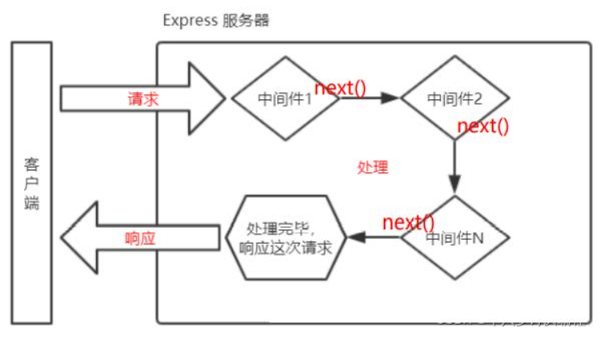

应用中间件

```javascript
app.use(recordMiddleware)
```

声明时可以直接将匿名函数传递给 `use`

```javascript
app.use(function (request, response, next) {
  	console.log('定义第一个中间件');
    next();
})
```

#### 全局中间件实践-记录访问日志

```javascript
// 记录每一个请求的url 和 IP

//导入express
const express = require('express')
const fs = require('fs')
const path = require('path')

//创建应用对象
const app = express()

//声明中间件函数
function recordMiddleware(req, res, next) { // req 请求报文对象，res 响应报文对象 next内置函数 执行之后会指向后续的路由回调或者中间件函数回调
    //获取url和ip
    let { url, ip } = req
    //将信息保存在文件中 access.log
    fs.appendFileSync(path.resolve(__dirname, './access.log'), `${url}${ip}\r\n`)
    // 调用 next
    next()
}

//使用中间件函数
app.use(recordMiddleware)

//创建一个路由
app.get('/home', (req, res) => {
    res.send('前台首页')
})

app.get('/admin', (req, res) => {
    res.send('后台首页')
})

app.all('*', (req, res) => {
    res.send('404 not found')
})

//监听端口启动服务
app.listen(3000, () => {
    console.log('服务已经启动,端口3000正在监听中...');
})
```


#### 多个全局中间件

express 允许使用 app.use() 定义多个全局中间件

```javascript
app.use(function (request, response, next) {
  	console.log('定义第一个中间件');
    next();
})
app.use(function (request, response, next) {
  	console.log('定义第二个中间件');
    next();
})
```

#### 定义路由中间件

如果只需要对某一些路由进行功能封装，则就需要路由中间件

调用格式如下：

```javascript
app.get('/路径',`中间件函数`,(request,response)=>{

});

app.get('/路径',`中间件函数1`,`中间件函数2`,(request,response)=>{

});
```

```javascript
/**
 * 针对 /admin  /setting 的请求, 要求 URL 携带 code=521 参数, 如未携带提示『暗号错误』  
 */
//导入express
const express = require('express')

//创建应用对象
const app = express()

//创建一个路由
//前台
app.get('/home', (req, res) => {

})

//声明中间件函数
let checkCodeMiddleware = (req, res, next) => {
    //判断url中 code参数是否等于521
    if (req.query.code === '521') {
        next()
    } else {
        res.send('暗号错误')
    }
}

//后台
app.get('/admin', checkCodeMiddleware, (req, res) => {
    res.send('后台首页')
})

//后台设置
app.get('/setting', checkCodeMiddleware, (req, res) => {
    res.send('设置页面')
})

app.all('*', (req, res) => {
    res.send('404 not found')
})

//监听端口启动服务
app.listen(3000, () => {
    console.log('服务已经启动,端口3000正在监听中...');
})
```


### 静态资源中间件

express 内置处理静态资源的中间件

```javascript
//导入express
const express = require('express')

//创建应用对象
const app = express()

//静态资源中间件的设置
app.use(express.static(__dirname + '/public')) // express.static(__dirname + '/public')的返回结果是中间件函数 __dirname + '/public'是静态资源文件夹路径

//创建一个路由
app.get('/home', (req, res) => {
    res.end('hello express')
})

//监听端口启动服务
app.listen(3000, () => {
    console.log('服务已经启动,端口3000正在监听中...');
})
```


```javascript
//引入express框架
const express = require('express');
//创建服务对象
const app = express();
//静态资源中间件的设置，将当前文件夹下的public目录作为网站的根目录
app.use(express.static('./public')); //当然这个目录中都是一些静态资源
//如果访问的内容经常变化，还是需要设置路由
//但是，在这里有一个问题，如果public目录下有index.html文件，单独也有index.html的路由
//则谁书写在前，优先执行谁
app.get('/index.html',(request,response)=>{
	respsonse.send('首页');
});
//监听端口
app.listen(3000,()=>{
	console.log('3000 端口启动....');
});
```

> 注意事项:
>
> 1. index.html 文件为默认打开的资源
> 2. 如果静态资源与路由规则同时匹配，谁先匹配谁就响应
> 3. 路由响应动态资源，静态资源中间件响应静态资源

#### 品尚汇练习

```javascript
//导入express
const express = require('express')

//创建应用对象
const app = express()

//设置静态资源中间件
app.use(express.static(__dirname + '/尚品汇'))

//监听端口启动服务
app.listen(3000, () => {
    console.log('服务已经启动,端口3000正在监听中...');
})
```


### 获取请求体数据 body-parser

express 可以使用 `body-parser` 包处理请求体

第一步：安装

```javascript
npm i body-parser
```

第二步：导入 body-parser 包

```javascript
const bodyParser = require('body-parser');
```

第三步：获取中间件函数

```javascript
//处理 querystring 格式的请求体
let urlParser = bodyParser.urlencoded({extended:false}));
//处理 JSON 格式的请求体
let jsonParser = bodyParser.json();
```

第四步：设置路由中间件，然后使用 `request.body` 来获取请求体数据

```javascript
app.post('/login', urlParser, (request,response)=>{
	//获取请求体数据
	//console.log(request.body);
	//用户名
	console.log(request.body.username);
 	//密码
  	console.log(request.body.userpass);
  	response.send('获取请求体数据');
});
```

获取到的请求体数据：

```javascript
[Object: null prototype] { username: 'admin', userpass: '123456' }
```

```javascript
/**
 * 按照要求搭建 HTTP 服务
 * 
 * GET   /login  显示表单网页
 * POST  /login  获取表单中的『用户名』和『密码』
 */

//导入express
const express = require('express')
let bodyParser = require('body-parser')

//创建应用对象
const app = express()

// 解析 JSON 格式的请求体的中间件
// let jsonParser = bodyParser.json()

// 解析 querystring 格式请求体的中间件
let urlencodedParser = bodyParser.urlencoded({ extended: false })

//创建路由规则
app.get('/login', (req, res) => {
    // res.send('表单页面')
    //响应html文件内容
    res.sendFile(__dirname + '/11-form.html')
})
app.post('/login', urlencodedParser, (req, res) => {
    // 获取用户名和密码
    console.log(req.body);
    res.send('获取用户数据')
})

//启动服务
app.listen(3000, () => {
    console.log('服务器已启动');
})
```


**注意:** 现在你已经可以抛弃 body-parser 模块，因为 Express 自从 4.16.0 版本开始，内置了 body 解析

**使用方法:**

```javascript
const express = require('express');

const app = express();
// 解析 JSON 格式的请求体的中间件
app.use(express.json())
// 解析 querystring 格式请求体的中间件
app.use(express.urlencoded({ extended: false }))
```

## Router

### 什么是 Router

express 中的 Router 是一个完整的中间件和路由系统，可以看做是一个小型的 app 对象。

### Router 作用

对路由进行模块化，更好的管理路由

### Router 使用

创建独立的 JS 文件（homeRouter.js）

```javascript
//1. 导入 express
const express = require('express');

//2. 创建路由器对象
const router = express.Router();

//3. 在 router 对象身上添加路由
router.get('/', (req, res) => {
	res.send('首页');
})

router.get('/cart', (req, res) => {
	res.send('购物车');
});

//4. 暴露
module.exports = router;
```

主文件

```javascript
const express = require('express');

const app = express();
//5.引入子路由文件
const homeRouter = require('./routes/homeRouter');
//6.设置和使用中间件
app.use(homeRouter);

app.listen(3000,()=>{
	console.log('3000 端口启动....');
})
```

### 路由模块化

详见文件

## EJS 模板引擎

### 什么是模板引擎

模板引擎是分离 用户界面和业务数据 的一种技术

### 什么是 EJS

EJS 是一个高效的 Javascript 的模板引擎 官网: [https://ejs.co/](https://gitee.com/link?target=https%3A%2F%2Fejs.co%2F) 中文站： [https://ejs.bootcss.com/](https://gitee.com/link?target=https%3A%2F%2Fejs.bootcss.com%2F)

### EJS 初体验

下载安装EJS

```
npm i ejs --save
```

代码示例

```javascript
//1.引入ejs
const ejs = require('ejs');
//2.定义数据
let person = ['张三','李四','王二麻子'];
//3.ejs解析模板返回结构
//<%= %> 是ejs解析内容的标记，作用是输出当前表达式的执行结构
//"<%= %>"可以直接输出变量或表达式的值，变量或表达式的值将作为一个字符串在浏览器中输出。
let html = ejs.render(‘<%= person.join(",") %>’, {person:person});
//4.输出结果
console.log(html);
```

命令行下运行

### EJS 常用语法

执行JS代码

```javascript
<% code %>
```

输出转义的数据到模板上

```javascript
<%= code %>
```

输出非转义的数据到模板上

```javascript
<%- code %>
```

### 在express中使用ejs

```javascript
// 导入 express
const express = require('express')
const path = require('path')

// 创建应用对象
const app = express()
// 1. 设置模板引擎
app.set('view engine', 'ejs')  // pug  twing
// 2. 设置模板文件的存放位置
// 模板文件: 具有模板语法内容的文件
app.set('views', path.resolve(__dirname, './views'))

// 创建路由
app.get('/home', (req, res) => {
  // 3. render 响应
  // res.render('模板的文件名','数据')
  let title = '尚硅谷 - 让天下没有难学的技术'
  res.render('home', { title })
  // 4. 创建模板文件
  // 如下面文件 views/home.ejs
})

// 监听端口，启动服务
app.listen(3000, () => {
  console.log('服务器已启动~~~~')
})
views/home.ejs
<!DOCTYPE html>
<html lang="en">

<head>
  <meta charset="UTF-8">
  <meta http-equiv="X-UA-Compatible" content="IE=edge">
  <meta name="viewport" content="width=device-width, initial-scale=1.0">
  <title>Document</title>
</head>

<body>
  <h2>
    <%=title %>
  </h2>
</body>

</html
```


#  MongoDB

## **一、**简介

### **1.1** Mongodb 是什么

> MongoDB 是一个基于分布式文件存储的数据库，官方地址 [https://www.mongodb.com/](https://gitee.com/link?target=https%3A%2F%2Fwww.mongodb.com%2F)

### **1.2**数据库是什么

数据库（DataBase）是按照数据结构来组织、存储和管理数据的 `应用程序`

### **1.3**数据库的作用

数据库的主要作用就是 `管理数据`，对数据进行 `增（c）、删（d）、改（u）、查（r）`

### **1.4**数据库管理数据的特点

相比于纯文件管理数据，数据库管理数据有如下特点：

1. 速度更快
2. 扩展性更强
3. 安全性更强

### **1.5** 为什么选择 Mongodb

操作语法与 JavaScript 类似，容易上手，学习成本低

## **二、**核心概念

Mongodb 中有三个重要概念需要掌握

- 数据库（database） 数据库是一个数据仓库，数据库服务下可以创建很多数据库，数据库中可以存放很多集合
- 集合（collection） 集合类似于 JS 中的数组，在集合中可以存放很多文档
- 文档（document） 文档是数据库中的最小单位，类似于 JS 中的对象

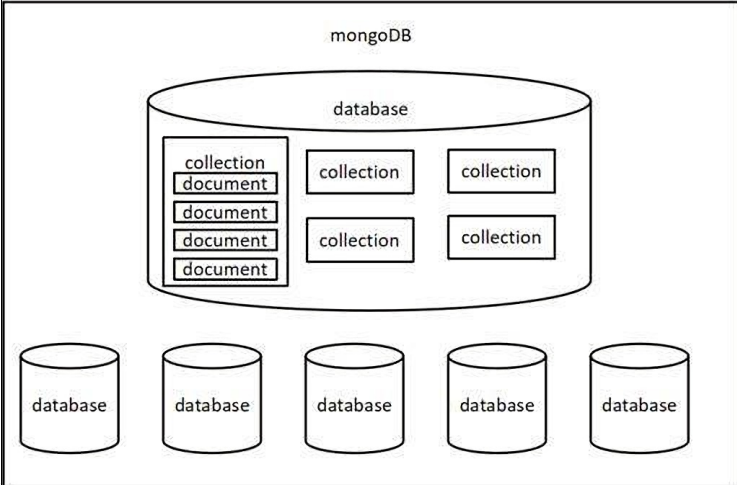

```javascript
{
	"accounts": [
  	{
		"id": "3-YLju5f3",
  		"title": "买电脑",
  		"time": "2023-02-08",
  		"type": "-1",
  		"account": "5500",
  		"remarks": "为了上网课"
  	},
  	{
  		"id": "3-YLju5f4",
  		"title": "请女朋友吃饭",
  		"time": "2023-02-08",
  		"type": "-1",
          "account": "214",
          "remarks": "情人节聚餐"
	},
	{
          "id": "mRQiD4s3K",
          "title": "发工资",
          "time": "2023-02-19",
          "type": "1",
          "account": "4396",
          "remarks": "终于发工资啦!~~"
     }
  ],
    "users":[
  	{
  		"id": 1,
  		"name": "zhangsan",
        "age": 18
  	},
  	{
  		"id": 2,
  		"name": "lisi",
  		"age": 20
  	},
  	{
  		"id": 3,
  		"name": "wangwu",
  		"age": 22
  	}
  ]
}
```

大家可以通过 JSON 文件来理解 Mongodb 中的概念

- 一个 `JSON 文件` 好比是一个 `数据库`，一个 Mongodb 服务下可以有 N 个数据库
- JSON 文件中的 `一级属性的数组值` 好比是 `集合`
- 数组中的对象好比是 `文档`
- 对象中的属性有时也称之为 `字段`

> 一般情况下
>
> - 一个项目使用一个数据库
> - 一个集合会存储同一种类型的数据

## **三、**下载安装与启动

下载地址： [https://www.mongodb.com/try/download/community](https://gitee.com/link?target=https%3A%2F%2Fwww.mongodb.com%2Ftry%2Fdownload%2Fcommunity)

建议选择 `zip` 类型， 通用性更强

配置步骤如下:

1. 将压缩包移动到 `C:\Program Files` 下，然后解压

2. 创建 `C:\data\db` 目录，mongodb 会将数据默认保存在这个文件夹

3. 以 mongodb 中 bin 目录作为工作目录，启动命令行

4. 运行命令 `mongod`

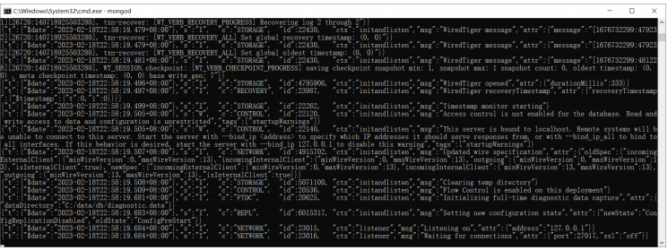

看到最后的 `waiting for connections` 则表明服务 `已经启动成功`

然后可以使用 `mongo` 命令连接本机的 mongodb 服务

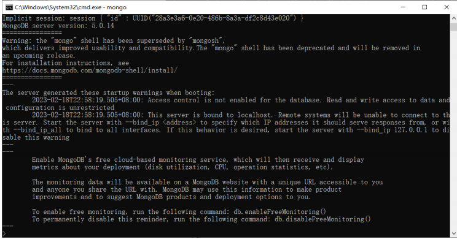

> 注意：
>
> - 为了方便后续方便使用 mongod 命令，可以将 bin 目录配置到环境变量 Path 中
> - `千万不要选中服务端窗口的内容`，选中会停止服务，可以 `敲回车` 取消选中

配置windows服务: [https://www.shuzhiduo.com/A/E35pAE6Ydv/](https://gitee.com/link?target=https%3A%2F%2Fwww.shuzhiduo.com%2FA%2FE35pAE6Ydv%2F)

修改`mongodb`数据库位置


## **四、**命令行交互

命令行交互一般是学习数据库的第一步，不过这些命令在后续用的比较少，所以大家了解即可

### **4.1**数据库命令

1. 显示所有的数据库

   ```javascript
   show dbs
   ```

2. 切换到指定的数据库，如果数据库不存在会自动创建数据库

   ```
   use 数据库名
   ```

3. 显示当前所在的数据库

   ```
   db
   ```

4. 删除当前数据库

   ```
   use 库名
   db.dropDatabase()
   ```

### **4.2**集合命令

1. 创建集合

   ```
   db.createCollection('集合名称')
   ```

2. 显示当前数据库中的所有集合

   ```
   show collections
   ```

3. 删除某个集合

   ```
   db.集合名.drop()
   ```

4. 重命名集合

   ```
   db.集合名.renameCollection('newName')
   ```

### **4.3**文档命令

1. 插入文档

   ```
   db.集合名.insert(文档对象);
   ```

2. 查询文档

   ```
   db.集合名.find(查询条件)
   ```

   _id 是 mongodb 自动生成的唯一编号，用来唯一标识文档

3. 更新文档

   ```
   db.集合名.update(查询条件,新的文档)
   db.集合名.update({name:'张三'},{$set:{age:19}})
   ```

4. 删除文档

   ```
   db.集合名.remove(查询条件)
   ```

### **4.4**应用场景

#### **4.4.1**新增

- 用户注册
- 发布视频
- 发布商品
- 发朋友圈
- 发评论
- 发微博
- 发弹幕
- .......

#### **4.4.2**删除

- 删除评论
- 删除商品
- 删除文章
- 删除视频
- 删除微博
- ......

#### **4.4.3** 更新

- 更新个人信息
- 修改商品价格
- 修改文章内容
- ......

#### **4.4.4**查询

- 商品列表
- 视频列表
- 朋友圈列表
- 微博列表
- 搜索功能
- ......

## **五、**Mongoose

### **5.1**介绍

Mongoose 是一个对象文档模型库，官网 [http://www.mongoosejs.net/](https://gitee.com/link?target=http%3A%2F%2Fwww.mongoosejs.net%2F)

### **5.2**作用

方便使用代码操作 mongodb 数据库

### **5.3**使用流程

```javascript
 //1. 安装 mongoose
 //2. 导入 mongoose
 const mongoose = require('mongoose');

 //3. 连接数据库                              数据库名称
 mongoose.connect('mongodb://127.0.0.1:27017/bilibili');

 //4. 设置连接回调
 //连接成功   once 一次   事件回调函数只执行一次
mongoose.connection.on('open', () => {
	console.log('连接成功');
 	//5. 创建文档结构对象
    // 设置集合中 文档的属性以及属性值得类型
 	let BookSchema = new mongoose.Schema({
 		title: String,
 		author: String,
 		price: Number
 	});
     
 	//6. 创建文档模型对象  对文档操作的封装对象  mongoose会使用集合名称的复数，创建集合
 	let BookModel = mongoose.model('book', BookSchema);
	
     //7. 插入文档
 	BookModel.create({
 		title: '西游记',
 		author: '吴承恩',
		price: 19.9
 	}, (err, data) => {
        // 判断是否有错误
 		if (err) throw err;
        //输出 data 对象  如果没有出错，则输出插入后的文档对象
 		console.log(data);
 		//8. 断开连接  关闭数据链接 (项目运行过程中，不会添加该代码)
 		mongoose.disconnect();
 	});
});

//连接出错
mongoose.connection.on('error', () => {
	console.log('连接出错~~');
})

//连接关闭
mongoose.connection.on('close', () => {
	console.log('连接关闭');
})
```

### **5.4**字段类型

文档结构可选的常用字段类型列表

| 类型       | 描述                                                         |
| ---------- | ------------------------------------------------------------ |
| String     | 字符串                                                       |
| Number     | 数字                                                         |
| Boolean    | 布尔值                                                       |
| Array      | 数组，也可以使用 `[]` 来标识                                 |
| Date       | 日期                                                         |
| Buffer     | Buffer 对象                                                  |
| Mixed      | 任意类型，需要使用 `mongoose.Schema.Types.Mixed` 指定        |
| ObjectId   | 对象 ID，需要使用 `mongoose.Schema.Types.ObjectId` 指定      |
| Decimal128 | 高精度数字，需要使用 `mongoose.Schema.Types.Decimal128` 指定 |

### **5.5**字段值验证

Mongoose 有一些内建验证器，可以对字段值进行验证

#### **5.5.1**必填项

```javascript
title: {
	type: String,
 	required: true // 设置必填项
},
```

#### **5.5.2**默认值

```javascript
author: {
 	type: String,
 	default: '匿名' //默认值
},
```

#### **5.5.3**枚举值

```javascript
gender: {
	type: String,
	enum: ['男','女'] //设置的值必须是数组中的
},
```

#### **5.5.4** 唯一值

```javascript
username: {
	type: String,
 	unique: true
},
```

> unique 需要 `重建集合` 才能有效果
>
> 永远不要相信用户的输入

### **5.6**CURD

数据库的基本操作包括四个，增加（create），删除（delete），修改（update），查（read）

#### **5.6.1**增加

插入一条

```
SongModel.create({
	title:'给我一首歌的时间',
 	author: 'Jay'
}, function(err, data){
	//错误
	console.log(err);
	//插入后的数据对象
	console.log(data);
});
```

批量插入

```
//1.引入mongoose
const mongoose = require('mongoose');

//2.链接mongodb数据库 connect 连接
mongoose.connect('mongodb://127.0.0.1:27017/project');

//3.设置连接的回调
mongoose.connection.on('open',()=>{
	//4.声明文档结构
	const PhoneSchema = new mongoose.Schema({
		brand:String,
		color:String,
		price:Number,
 		tags:Array
	})
 	//6.创建模型对象
 	const PhoneModel = mongoose.model('phone',PhoneSchema);
 	PhoneModel.insertMany([
 		{
 			brand:'华为',
 			color:'灰色',
 			price:2399,
 			tags:['电量大','屏幕大','信号好']
 		},
 		{
 			brand:'小米',
 			color:'白色',
 			price:2099,
 			tags:['电量大','屏幕大','信号好']
         }
	],(err,data)=>{
		if(err) throw err;
         console.log('写入成功');
         mongoose.connection.close();
	})
})
```

#### 删除

**5.6.2** **删除**删除一条数据

```
SongModel.deleteOne({_id:'5dd65f32be6401035cb5b1ed'}, function(err){
 	if(err) throw err;
 	console.log('删除成功');
	mongoose.connection.close();
});
```

批量删除

```
SongModel.deleteMany({author:'Jay'}, function(err){
 	if(err) throw err;
 	console.log('删除成功');
	mongoose.connection.close();
});
```

#### **5.6.3**更新

更新一条数据

```
SongModel.updateOne({author: 'JJ Lin'}, {author: '林俊杰'}, function (err) {
	if(err) throw err;
	mongoose.connection.close();
});
```

批量更新数据

```
SongModel.updateMany({author: 'Leehom Wang'}, {author: '王力宏'}, function (err) {
	if(err) throw err;
	mongoose.connection.close();
});
```

#### **5.6.4**查询

查询一条数据

```
SongModel.findOne({author: '王力宏'}, function(err, data){
	if(err) throw err;
	console.log(data);
	mongoose.connection.close();
});
//根据 id 查询数据
SongModel.findById('5dd662b5381fc316b44ce167',function(err, data){
	if(err) throw err;
	console.log(data);
	mongoose.connection.close();
});
```

批量查询数据

```
//不加条件查询
SongModel.find(function(err, data){
	if(err) throw err;
	console.log(data);
	mongoose.connection.close();
});
//加条件查询
SongModel.find({author: '王力宏'}, function(err, data){
	if(err) throw err;
	console.log(data);
	mongoose.connection.close();
});
```

### **5.7**条件控制

#### **5.7.1**运算符

在 mongodb 不能 > < >= <= !== 等运算符，需要使用替代符号

- `>`使用 `$gt`
- `<` 使用 `$lt`
- `=` 使用 `$gte`
- `<=` 使用 `$lte`
- `!==` 使用 `$ne`

```javascript
db.students.find({id:{$gt:3}}); id号比3大的所有的记录

// 价格小于 20 的图书
BookModel.find({ price: { $lt: 20 } }, (err, data) => {
	if (err) {
		console.log('读取失败~~~')
		return
    }
    console.log(data)
})
```

#### **5.7.2**逻辑运算

`$or` 逻辑或的情况

```javascript
db.students.find({$or:[{age:18},{age:24}]});

// 曹雪芹 或者 余华的书
BookModel.find({ $or: [{ author: '曹雪芹' }, { author: '余华' }] }, (err, data)=>{
    .then(resolve => {
            console.log(resolve);
            //8.关闭数据库链接  （项目运行中不会添加该代码）
            setTimeout(() => {
                mongoose.disconnect()
            }, 2000)
        })
        .catch(error => {
            console.log('读取失败');
            return
        })
})
```

`$and` 逻辑与的情况

```javascript
db.students.find({$and: [{age: {$lt:20}}, {age: {$gt: 15}}]});

// 价格大于 30 且 小于 70
BookModel.find({ $and: [{ price: { $gt: 30 } }, { price: { $lt: 70 } }] })
.then(resolve => {
            console.log(resolve);
            //8.关闭数据库链接  （项目运行中不会添加该代码）
            setTimeout(() => {
                mongoose.disconnect()
            }, 2000)
        })
        .catch(error => {
            console.log('读取失败');
            return
        })
})
```

#### **5.7.3**正则匹配

条件中可以直接使用 JS 的正则语法，通过正则可以进行模糊查询

```javascript
db.students.find({name:/imissyou/});

正则表达式，搜索书籍名称中带有 '三' 的图书
BookModel.find({ name: /三/ }, (err, data) => {
	if (err) {
		console.log('读取失败~~~')
      	return
	}
   console.log(data)
})

BookModel.find({ name: new RegExp('三') }, (err, data) => {
 	if (err) {
      	console.log('读取失败~~~')
      	return
    }
    console.log(data)
})
```

### **5.8**个性化读取

#### **5.8.1**字段筛选

```javascript
//0:不要的字段
//1:要的字段
SongModel.find().select({_id:0,title:1}).exec(function(err,data){
	if(err) throw err;
	console.log(data);
	mongoose.connection.close();
});
```

#### **5.8.2**数据排序

```javascript
// sort 排序
// 1:升序
// -1:倒序
SongModel.find().sort({hot:1}).exec(function(err,data){
	if(err) throw err;
	console.log(data);
	mongoose.connection.close();
});
```

#### **5.8.3**数据截取

```javascript
//skip 跳过   limit 限定
SongModel.find().skip(10).limit(10).exec(function(err,data){
	if(err) throw err;
	console.log(data);
	mongoose.connection.close();
});
```

## **六、**图形化管理工具

我们可以使用图形化的管理工具来对 Mongodb 进行交互，这里演示两个图形化工具

- Robo 3T 免费 [https://github.com/Studio3T/robomongo/releases](https://gitee.com/link?target=https%3A%2F%2Fgithub.com%2FStudio3T%2Frobomongo%2Freleases)
- Navicat 收费 [https://www.navicat.com.cn/](https://gitee.com/link?target=https%3A%2F%2Fwww.navicat.com.cn%2F)


# 接口

## 一，简介

### 1.1接口是什么

> 接口是 前后端通信的桥梁

简单理解：一个接口就是 服务中的一个路由规则 ，根据请求响应结果

接口的英文单词是 API ( )，所以有时也称之为 `API 接口`

这里的接口指的是『数据接口』， 与编程语言（Java，Go 等）中的接口语法不同

### 1.2接口的作用

> 实现 前后端通信

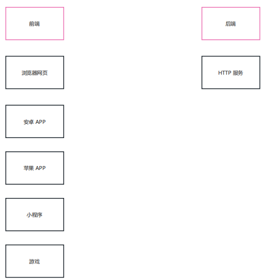

### 1.3接口的开发与调用

大多数接口都是由 后端工程师 开发的， 开发语言不限

一般情况下接口都是由 前端工程师 调用的，但有时 后端工程师也会调用接口 ，比如短信接口，支付接口 等

### 1.4接口的组成

一个接口一般由如下几个部分组成

- 请求方法
- 接口地址（URL）
- 请求参数
- 响应结果

一个接口示例 [https://www.free-api.com/doc/325](https://gitee.com/link?target=https%3A%2F%2Fwww.free-api.com%2Fdoc%2F325)

体验一下： [https://api.asilu.com/idcard/?id=371522199111299668](https://gitee.com/link?target=https%3A%2F%2Fapi.asilu.com%2Fidcard%2F%3Fid%3D371522199111299668)

## RESTful API

RESTful API 是一种特殊风格的接口，主要特点有如下几个：

- URL 中的路径表示 资源，路径中不能有 `动词`，例如`create` , `delete` , `update` 等这些都不能有
- 操作资源要与 `HTTP 请求方法` 对应
- 操作结果要与 `HTTP 响应状态码` 对应

规则示例：

| 操作         | 请求类型 | URL      | 返回                 |
| ------------ | -------- | -------- | -------------------- |
| 新增歌曲     | POST     | /song    | 返回新生成的歌曲信息 |
| 删除歌曲     | DELETE   | /song/10 | 返回一个空文档       |
| 修改歌曲     | PUT      | /song/10 | 返回更新后的歌曲信息 |
| 修改歌曲     | PATCH    | /song/10 | 返回更新后的歌曲信息 |
| 获取所有歌曲 | GET      | /song    | 返回歌曲列表数组     |
| 获取单个歌曲 | GET      | /song/10 | 返回单个歌曲信息     |

> 扩展阅读： [https://www.ruanyifeng.com/blog/2014/05/restful_api.html](https://gitee.com/link?target=https%3A%2F%2Fwww.ruanyifeng.com%2Fblog%2F2014%2F05%2Frestful_api.html)

## json-server

json-server 本身是一个 JS 编写的工具包，可以快速搭建 RESTful API 服务

官方地址: [https://github.com/typicode/json-server](https://gitee.com/link?target=https%3A%2F%2Fgithub.com%2Ftypicode%2Fjson-server)

操作步骤：

1. 全局安装 `json-server`

   ```
   npm i -g json-server
   ```

2. 创建 JSON 文件（db.json），编写基本结构

   ```
   {
   	"song": [
   		{ "id": 1, "name": "干杯", "singer": "五月天" },
   		{ "id": 2, "name": "当", "singer": "动力火车" },
   		{ "id": 3, "name": "不能说的秘密", "singer": "周杰伦" }
   	]
   }
   ```

3. ==以 JSON 文件所在文件夹作为工作目录==，执行如下命令

   ```
   json-server --watch db.json
   ```

默认监听端口为 `3000`

## 接口测试工具

介绍几个接口测试工具 apipost [https://www.apipost.cn/](https://gitee.com/link?target=https%3A%2F%2Fwww.apipost.cn%2F) (中文) apifox [https://www.apifox.cn/](https://gitee.com/link?target=https%3A%2F%2Fwww.apifox.cn%2F) (中文) postman [https://www.postman.com/](https://gitee.com/link?target=https%3A%2F%2Fwww.postman.com%2F) (英文)


# 会话控制

## 一，介绍

> 所谓会话控制就是 对会话进行控制

HTTP 是一种无状态的协议，它没有办法区分多次的请求是否来自于同一个客户端，无法区分用户

而产品中又大量存在的这样的需求，所以我们需要通过 会话控制 来解决该问题

常见的会话控制技术有三种：

- cookie
- session
- token

## 二，cookie

### 2.1cookie 是什么

> cookie 是 HTTP 服务器发送到用户浏览器并保存在本地的一小块数据

cookie 是保存在浏览器端的一小块数据

cookie 是按照域名划分保存的

简单示例：

| 域名                                                         | cookie                        |
| ------------------------------------------------------------ | ----------------------------- |
| [www.baidu.com](https://gitee.com/link?target=http%3A%2F%2Fwww.baidu.com) | a=100; b=200                  |
| [www.bilibili.com](https://gitee.com/link?target=http%3A%2F%2Fwww.bilibili.com) | xid=1020abce121; hm=112411213 |
| jd.com                                                       | x=100; ocw=12414cce           |

### 2.2cookie 的特点

浏览器向服务器发送请求时，会自动将 `当前域名下` 可用的 cookie 设置在请求头中，然后传递给服务器


这个请求头的名字也叫 `cookie` ，所以将 cookie 理解为一个 HTTP 的请求头也是可以的

### 2.3cookie 的运行流程

填写账号和密码校验身份，校验通过后下发 cookie

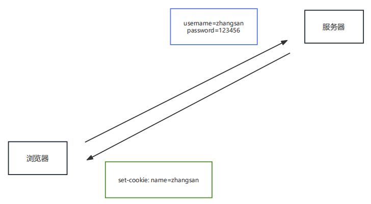

 有了 cookie 之后，后续向服务器发送请求时，就会自动携带 cookie

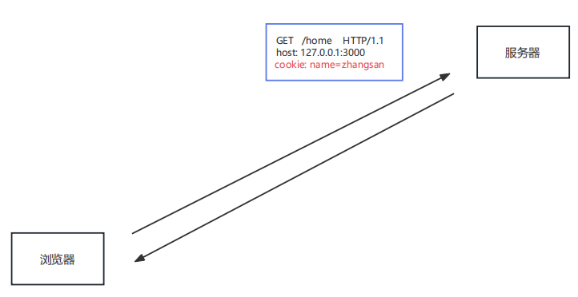

### 2.4浏览器操作 cookie

浏览器操作 cookie 的操作，使用相对较少，大家了解即可

1. 禁用所有 cookie
2. 删除 cookie
3. 查看 cookie

### 2.5cookie 的代码操作

声明周期不到期即使关闭浏览器也还会有cookie

express 中可以使用 `cookie-parser` 进行处理

```javascript
const express =require('express');
//1. 安装 cookie-parser	 npm i cookie-parser
//2. 引入 cookieParser 包
const cookieParser = require('cookie-parser');
  
const app = express();

//3. 设置 cookieParser 中间件
app.use(cookieParser());
  
//4-1 设置 cookie
app.get('/set-cookie', (request, response) => {
	// 不带时效性    会在浏览器关闭的时候，销毁
	response.cookie('username','wangwu');
  	// 带时效性
  	response.cookie('email','23123456@qq.com', {maxAge: 5*60*1000 });
  	//响应
  	response.send('Cookie的设置');
});

//4-2 读取 cookie
app.get('/get-cookie', (request, response) => {
    //读取 cookie
    console.log(request.cookies);
  	//响应体
  	response.send('Cookie的读取');
});

//4-3 删除cookie
app.get('/delete-cookie', (request, response) => {
	//删除
	response.clearCookie('username');
	//响应
	response.send('cookie 的清除');
});

//4. 启动服务
app.listen(3000, () => {
	console.log('服务已经启动....');
});
```

> 不同浏览器中的 cookie 是相互独立的，不共享

## 三，session

### 3.1session 是什么

session 是保存在 服务器端的一块儿数据，保存当前访问用户的相关信息

### 3.2session 的作用

实现会话控制，可以识别用户的身份，快速获取当前用户的相关信息

### 3.3session 运行流程

填写账号和密码校验身份，校验通过后创建 `session 信息`，然后将 `session_id` 的值通过响应头返回给浏览器

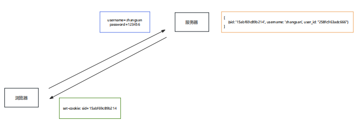

有了cookie，下次发送请求时会自动携带cookie，服务器通过 `cookie` 中的 `session_id` 的值确定用 户的身份

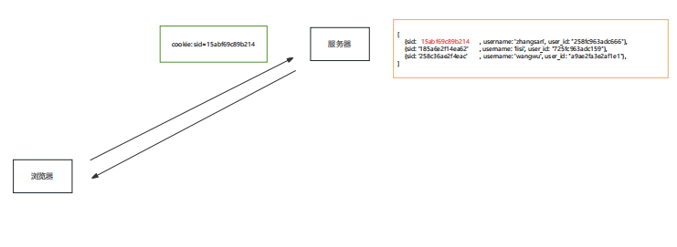

### 3.4session 的代码操作

express 中可以使用 `express-session` 对 session 进行操作

```javascript
const express = require('express');
//1. 安装包 npm i express-session connect-mongo
//2. 引入 express-session connect-mongo
const session = require("express-session");
const MongoStore = require('connect-mongo');

const app = express();

//3. 设置 session 的中间件
app.use(session({
	name: 'sid', //设置cookie的name，默认值是：connect.sid
	secret: 'atguigu', //参与加密的字符串（又称签名）  加盐
	saveUninitialized: false, //是否为每次请求都设置一个cookie用来存储session的id
	resave: true, //是否在每次请求时重新保存session
	store: MongoStore.create({
		mongoUrl: 'mongodb://127.0.0.1:27017/project' //数据库的连接配置
	}),
	cookie: {
		httpOnly: true, // 开启后前端无法通过 JS 操作
		maxAge: 1000 * 300 // 这一条 是控制 sessionID 的过期时间的！！！
	},
}))

//创建 session  session的设置
app.get('/login', (req, res) => {
    //设置session
    req.session.username = 'zhangsan';
    req.session.email = 'zhangsan@qq.com'
    res.send('登录成功');
})

//获取 session
app.get('/home', (req, res) => {
    console.log('session的信息');
    console.log(req.session.username);
    // 检测 session 是否存在用户数据
    if (req.session.username) {
    	res.send(`你好 ${req.session.username}`);
    }else{
    	res.send('登录 注册');
    }
})

//销毁 session
app.get('/logout', (req, res) => {
    //销毁session
    // res.send('设置session');
    req.session.destroy(() => {
    	res.send('成功退出');
	});
});
app.listen(3000, () => {
	console.log('服务已经启动, 端口 ' + 3000 + ' 监听中...');
});
```

## 四，session 和 cookie 的区别

cookie 和 session 的区别主要有如下几点：

1. 存在的位置

- cookie：浏览器端
- session：服务端

1. 安全性

- cookie 是以明文的方式存放在客户端的，安全性相对较低
- session 存放于服务器中，所以安全性 `相对` 较好

1. 网络传输量

- cookie 设置内容过多会增大报文体积， 会影响传输效率
- session 数据存储在服务器，只是通过 cookie 传递 id，所以不影响传输效率

1. 存储限制

- 浏览器限制单个 cookie 保存的数据不能超过 `4K` ，且单个域名下的存储数量也有限制
- session 数据存储在服务器中，所以没有这些限制

## 五，token

### 5.1token 是什么

```
token` 是服务端生成并返回给 HTTP 客户端的一串加密字符串， `token` 中保存着`用户信息
```

token 不属于 http 标准，完全由前后端协商而定，但 cookie 属于 http 标准

### 5.2token 的作用

实现会话控制，可以识别用户的身份，主要用于移动端 APP

### 5.3token 的工作流程

填写账号和密码校验身份，校验通过后响应 token，token 一般是在响应体中返回给客户端的

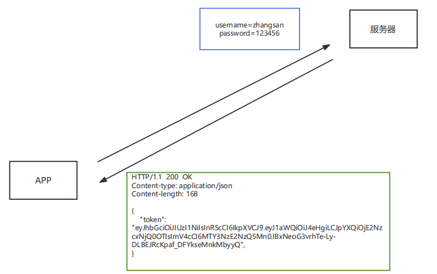 后续发送请求时，需要`手动`将 token 添加在请求报文中(cookie是自动携带的)，一般是放在请求头中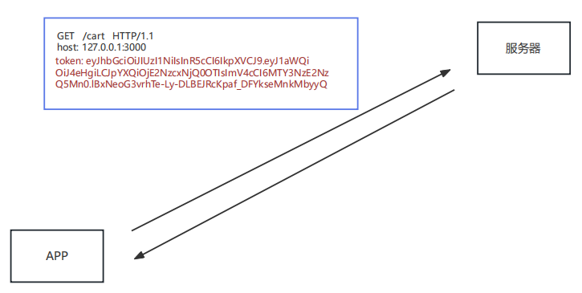

### 5.4token 的特点

- 服务端压力更小
  - 数据存储在客户端
- 相对更安全
  - 数据加密
  - 可以避免 CSRF（跨站请求伪造）
- 扩展性更强
  - 服务间可以共享
  - 增加服务节点更简单

### 5.5JWT

JWT（JSON Web Token ）是目前最流行的跨域认证解决方案，可用于基于 `token` 的身份验证

JWT 使 token 的生成与校验更规范

我们可以使用 `jsonwebtoken 包` 来操作 token

```javascript
//导入 jsonwebtokan
const jwt = require('jsonwebtoken');

//创建 token
// jwt.sign(数据, 加密字符串, 配置对象)
let token = jwt.sign({
    username: 'zhangsan'
}, 'atguigu', {
    expiresIn: 60 //单位是 秒
})

//解析 token
// jwt.verify(token,加密字符串，回调函数)
jwt.verify(token, 'atguigu', (err, data) => {
    if(err){
    	console.log('校验失败~~');
	    return
	}
	console.log(data);// { username: '张三', iat: (创建时间), exp:(过期时间)}
})
```

> 扩展阅读： [https://www.ruanyifeng.com/blog/2018/07/json_web_token-tutorial.html](https://gitee.com/link?target=https%3A%2F%2Fwww.ruanyifeng.com%2Fblog%2F2018%2F07%2Fjson_web_token-tutorial.html)

## 六，附录

### 6.1本地域名

所谓本地域名就是 只能在本机使用的域名，一般在开发阶段使用

#### 6.1.1操作流程

编辑文件 `C:\Windows\System32\drivers\etc\hosts`

```javascript
127.0.0.1   www.baidu.com
```

如果修改失败，可以修改该文件的权限

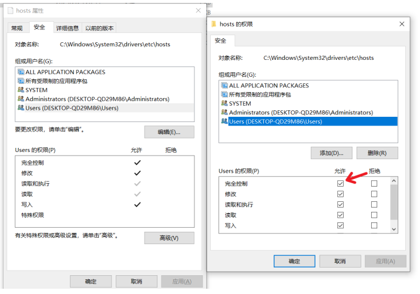

#### 6.1.2原理

在地址栏输入 `域名` 之后，浏览器会先进行 DNS（Domain Name System）查询，获取该域名对应的 IP 地 址 请求会发送到 DNS 服务器，可以 `根据域名返回 IP 地址`

可以通过 `ipconfig /all` 查看本机的 DNS 服务器

`hosts` 文件也可以设置域名与 IP 的映射关系，在发送请求前，可以通过该文件获取域名的 IP 地址


​                        
