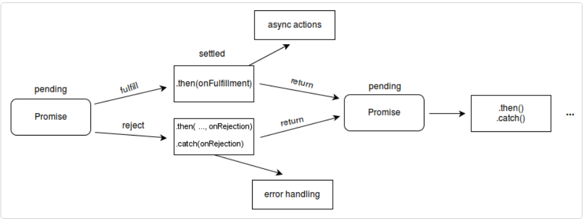

### 回调函数

JavaScript 回调函数是指将一个函数作为参数传递给另一个函数，并在另一个函数中被调用执行的函数。通常情况下，回调函数需要在异步操作完成后执行某些操作，例如读取文件、网络请求等。回调函数可以是匿名函数或者是已经定义好的函数。

以下是一个简单的例子，在 setTimeout 函数中传入一个回调函数：

```javascript
javascriptCopy Code// 定义回调函数
function sayHello() {
  console.log('Hello World!');
}

// 将回调函数作为参数传递给 setTimeout 函数
setTimeout(sayHello, 1000);
```

在上面的例子中，setTimeout 函数会在延迟 1000 毫秒后执行 sayHello 函数。

回调函数在 JavaScript 中应用广泛，尤其是在异步编程中非常常见，例如在 jQuery 中的 ajax 方法中，我们可以通过回调函数来处理异步请求的结果：

```javascript
$.ajax({
  url: '/api/user',
  success: function(response) {
    console.log('请求成功:', response);
  },
  error: function(error) {
    console.log('请求失败:', error);
  }
});
```

以上代码中，success 和 error 参数分别是请求成功和失败时的回调函数，它们会在异步请求完成后被调用执行。

### 回调地狱

```javascript
 <div id="products"></div>
    <script>
        getUser(function (user) { //调用getUser函数传参一个匿名函数，参数是user
            getProducts(user.id, function (products) {//调用getProducts函数 传参2个  第一个user.id  第二个 匿名函数 传参products
                displayProducts(products); //调用displayProducts函数 传参products
            });
        });

        function getUser(callback) { //getUser函数
            setTimeout(function () {
                const user = {
                    id: 123,
                    name: 'John Doe'
                };
                callback(user); //调用传进来的匿名函数
            }, 1000);
        }

        function getProducts(userId, callback) {//getProducts函数
            setTimeout(function () {
                const products = [
                    { id: 1, name: 'Product 1', price: 10 },
                    { id: 2, name: 'Product 2', price: 20 }
                ];
                callback(products);
            }, 2000);
        }

        function displayProducts(products) {  //displayProducts函数
            const element = document.getElementById('products');
            element.innerHTML = `
                    <ul>
                    ${products.map(p => `<li>${p.name} - $${p.price}</li>`).join('')}
                    </ul>`;
        }
    </script>
```


promise 是一个对象，它代表了一个异步操作的最终完成或者失败。 

# Peomise的使用

 假设现在有一个名为 `createAudioFileAsync()` 的函数，它接收一些配置和两个回调函数，然后异步地生成音频文件。一个回调函数在文件成功创建时被调用，另一个则在出现异常时被调用。 

 以下为使用 `createAudioFileAsync()` 的示例： 

```javascript
// 成功的回调函数
function successCallback(result) {
  console.log("音频文件创建成功：" + result);
}

// 失败的回调函数
function failureCallback(error) {
  console.log("音频文件创建失败：" + error);
}

createAudioFileAsync(audioSettings, successCallback, failureCallback)
```

 更现代的函数会返回一个 Promise 对象，使得你可以将你的回调函数绑定在该 Promise 上。 

 如果函数 `createAudioFileAsync()` 被重写为返回 Promise 的形式，那么我们可以像下面这样简单地调用它： 

```javascript
const promise = createAudioFileAsync(audioSettings);
promise.then(successCallback, failureCallback);
```

 或者简写为： 

`createAudioFileAsync(audioSettings).then(successCallback, failureCallback);`

 我们把这个称为 *异步函数调用*，这种形式有若干优点，下面我们将会逐一讨论。 


## [约定]

不同于“老式”的传入回调，在使用 Promise 时，会有以下约定：

- 在本轮 [事件循环](https://developer.mozilla.org/zh-CN/docs/Web/JavaScript/Event_loop#执行至完成) 运行完成之前，回调函数是不会被调用的。
- 即使异步操作已经完成（成功或失败），在这之后通过 [`then()`](https://developer.mozilla.org/zh-CN/docs/Web/JavaScript/Reference/Global_Objects/Promise/then) 添加的回调函数也会被调用。
- 通过多次调用 [`then()`](https://developer.mozilla.org/zh-CN/docs/Web/JavaScript/Reference/Global_Objects/Promise/then) 可以添加多个回调函数，它们会按照插入顺序进行执行。

Promise 很棒的一点就是**链式调用**（**chaining**）。


## [链式调用](https://developer.mozilla.org/zh-CN/docs/Web/JavaScript/Guide/Using_promises#链式调用)

连续执行两个或者多个异步操作是一个常见的需求，在上一个操作执行成功之后，开始下一个的操作，并带着上一步操作所返回的结果。我们可以通过创造一个 **Promise 链**来实现这种需求。

见证奇迹的时刻：`then()` 函数会返回一个和原来不同的**新的 Promise**：

```javascript
const promise = doSomething();
const promise2 = promise.then(successCallback, failureCallback);
```

或者

```javascript
const promise2 = doSomething().then(successCallback, failureCallback);
```

 `promise2` 不仅表示 `doSomething()` 函数的完成，也代表了你传入的 `successCallback` 或者 `failureCallback` 的完成，这两个函数也可以返回一个 Promise 对象，从而形成另一个异步操作，这样的话，在 `promise2` 上新增的回调函数会排在这个 Promise 对象的后面。 

 基本上，每一个 Promise 都代表了链中另一个异步过程的完成。 

在过去，要想做多重的异步操作，会导致经典的回调地狱：

```javascript
doSomething(function(result) {
    
  doSomethingElse(result, function(newResult) {
      
    doThirdThing(newResult, function(finalResult) {
        
      console.log('Got the final result: ' + finalResult);
        
    }, failureCallback);
      
  }, failureCallback);
    
}, failureCallback);
```

现在，我们可以把回调绑定到返回的 Promise 上，形成一个 Promise 链：

```javascript
doSomething() // 第一个异步函数
  .then(function(result) { // Promise 的第一个 then 方法，result 是上一个函数的返回值或者是初始值（如果是第一个函数）
    return doSomethingElse(result); // 在第一个 Promise 完成后调用第二个异步函数，并返回新的 Promise 对象
  })
  .then(function(newResult) { // Promise 的第二个 then 方法
    return doThirdThing(newResult); // 在第二个 Promise 完成后调用第三个异步函数，并返回新的 Promise 对象
  })
  .then(function(finalResult) { // Promise 的第三个 then 方法
    console.log('Got the final result: ' + finalResult); // 当所有 Promise 都完成时在控制台输出最终的结果
  })
  .catch(failureCallback); // 如果出现错误，Promise 对象将会被 reject，然后由 catch 方法处理
```

then 里的参数是可选的，`catch(failureCallback)` 是 `then(null, failureCallback)` 的缩略形式。如下所示，我们也可以用[箭头函数](https://developer.mozilla.org/zh-CN/docs/Web/JavaScript/Reference/Functions/Arrow_functions)来表示：

```
doSomething()
.then(result => doSomethingElse(result))
.then(newResult => doThirdThing(newResult))
.then(finalResult => {
  console.log(`Got the final result: ${finalResult}`);
})
.catch(failureCallback);
```

**注意：**一定要有返回值，否则，callback 将无法获取上一个 Promise 的结果。(如果使用箭头函数，`() => x` 比 `() => { return x; }` 更简洁一些，但后一种保留 `return` 的写法才支持使用多个语句。）。

# [Catch 的后续链式操作](https://developer.mozilla.org/zh-CN/docs/Web/JavaScript/Guide/Using_promises#catch_的后续链式操作)

 

`catch` 方法用于在 Promise 链进行错误处理，因为它总是会返回一个 [`Promise`](https://developer.mozilla.org/zh-CN/docs/Web/JavaScript/Reference/Global_Objects/Promise)，所以它可以和 [`then()`](https://developer.mozilla.org/zh-CN/docs/Web/JavaScript/Reference/Global_Objects/Promise/then) 方法一样被[链式调用](https://developer.mozilla.org/zh-CN/docs/Web/JavaScript/Guide/Using_promises#链式调用)。 

有可能会在一个回调失败之后继续使用链式操作，即，使用一个 `catch`，这对于在链式操作中抛出一个失败之后，再次进行新的操作会很有用。请阅读下面的例子：

```javascript
new Promise((resolve, reject) => {
    console.log('初始化');

    resolve();
})
.then(() => {
    throw new Error('有哪里不对了');

    console.log('执行「这个」”');
})
.catch(() => {
    console.log('执行「那个」');
})
.then(() => {
    console.log('执行「这个」，无论前面发生了什么');
});
```

输出结果如下：

```
初始化
执行“那个”
执行“这个”，无论前面发生了什么
```

 **注意：**因为抛出了错误 **有哪里不对了**，所以前一个 **执行「这个」** 没有被输出。 

throw **语句**用来抛出一个用户自定义的异常 。当前函数的执行将被停止（`throw` 之后的语句将不会执行），并且控制将被传递到调用堆栈中的第一个 [`catch`](https://developer.mozilla.org/zh-CN/docs/Web/JavaScript/Reference/Statements/try...catch) 块。如果调用者函数中没有 `catch` 块，程序将会终止。 

## .then和.catch区别

在 JavaScript 中，Promise 是一种处理异步操作的机制，它通过 then 和 catch 方法来处理异步操作的结果和错误。**then 方法接收两个函数作为参数（成功函数和失败函数），当 Promise 对象被解决（resolved）时，成功函数将被调用，而当 Promise 对象被拒绝（rejected）时，失败函数将被调用。**

**.catch 方法是 then 方法的简写方式，它只接收一个函数作为参数，用于捕获 Promise 对象被拒绝的情况。**

它们的主要区别在于异常的捕获上。如果在 then 的第一个函数里抛出了异常，那么后面的 catch 方法可以捕获到这个异常，但是 then 的第二个函数则无法捕获。因此，推荐在 then 方法中使用两个函数参数来分别处理 Promise 解决和拒绝的情况，而在链式调用中使用 catch 方法来捕获异常。

## [错误传递](https://developer.mozilla.org/zh-CN/docs/Web/JavaScript/Guide/Using_promises#错误传递)

在之前的回调地狱示例中，你可能记得有 3 次 `failureCallback` 的调用，而在 Promise 链中只有尾部的一次调用。

```javascript
doSomething()
.then(result => doSomethingElse(result))
.then(newResult => doThirdThing(newResult))
.then(finalResult => console.log(`Got the final result: ${finalResult}`))
.catch(failureCallback);
```

 通常，一遇到异常抛出，浏览器就会顺着 Promise 链寻找下一个 `onRejected` 失败回调函数或者由 `.catch()` 指定的回调函数。这和以下同步代码的工作原理（执行过程）非常相似。 

```
try {
  let result = syncDoSomething();
  let newResult = syncDoSomethingElse(result);
  let finalResult = syncDoThirdThing(newResult);
  console.log(`Got the final result: ${finalResult}`);
} catch(error) {
  failureCallback(error);
}
```

在 ECMAScript 2017 标准的 [`async/await`](https://developer.mozilla.org/zh-CN/docs/Web/JavaScript/Reference/Statements/async_function) 语法糖中，这种异步代码的对称性得到了极致的体现：

```
async function foo() {
  try {
    const result = await doSomething();
    const newResult = await doSomethingElse(result);
    const finalResult = await doThirdThing(newResult);
    console.log(`Got the final result: ${finalResult}`);
  } catch(error) {
    failureCallback(error);
  }
}
```

这个例子是在 Promise 的基础上构建的，例如，`doSomething()` 与之前的函数是相同的。你可以在[这里](https://developers.google.com/web/fundamentals/getting-started/primers/async-functions)阅读更多的与此语法相关的文章。


--------

# Promise

一个 `Promise` 必然处于以下几种状态之一：

- *待定（pending）*：初始状态，既没有被兑现，也没有被拒绝。
- *已兑现（fulfilled）*：意味着操作成功完成。
- *已拒绝（rejected）*：意味着操作失败。

待定状态的 Promise 对象要么会通过一个值*被兑现*，要么会通过一个原因（错误）*被拒绝*。当这些情况之一发生时，我们用 promise 的 `then` 方法排列起来的相关处理程序就会被调用。如果 promise 在一个相应的处理程序被绑定时就已经被兑现或被拒绝了，那么这个处理程序也同样会被调用，因此在完成异步操作和绑定处理方法之间不存在竞态条件。

 因为 `Promise.prototype.then` 和 `Promise.prototype.catch` 方法返回的是 promise，所以它们可以被链式调用。 



 **备注：** 如果一个 promise 已经被兑现或被拒绝，那么我们也可以说它处于 *已敲定（settled）* 状态。你还会听到一个经常跟 promise 一起使用的术语：*已决议（resolved）*，它表示 promise 已经处于已敲定状态，或者为了匹配另一个 promise 的状态被“锁定”了。Domenic Denicola 的 [States and fates](https://github.com/domenic/promises-unwrapping/blob/master/docs/states-and-fates.md) 中有更多关于 promise 术语的细节可以供你参考。 

### [Promise 的链式调用](https://developer.mozilla.org/zh-CN/docs/Web/JavaScript/Reference/Global_Objects/Promise#promise_的链式调用)

 我们可以用 `Promise.prototype.then()`、`Promise.prototype.catch()` 和 `Promise.prototype.finally()` 这些方法将进一步的操作与一个变为已敲定状态的 promise 关联起来。 

 例如 `.then()` 方法需要两个参数，第一个参数作为处理已兑现状态的回调函数，而第二个参数则作为处理已拒绝状态的回调函数。每一个 `.then()` 方法还会返回一个新生成的 promise 对象，这个对象可被用作链式调用，就像这样： 

```javascript
const myPromise = new Promise((resolve, reject) => {
  setTimeout(() => {
    resolve('foo');
  }, 300);
});

myPromise
  .then(handleResolvedA, handleRejectedA)
  .then(handleResolvedB, handleRejectedB)
  .then(handleResolvedC, handleRejectedC);
```

 当 `.then()` 中缺少能够返回 promise 对象的函数时，链式调用就直接继续进行下一环操作。因此，链式调用可以在最后一个 `.catch()` 之前把所有的处理已拒绝状态的回调函数都省略掉。 

过早地处理变为已拒绝状态的 promise 会对之后 promise 的链式调用造成影响。不过有时候我们因为需要马上处理一个错误也只能这样做。例如，外面必须抛出某种类型的错误以在链式调用中传递错误状态。另一方面，在没有迫切需要的情况下，可以在最后一个 `.catch()` 语句时再进行错误处理，这种做法更加简单。`.catch()` 其实只是没有给处理已兑现状态的回调函数预留参数位置的 `.then()` 而已。

```javascript
myPromise
  .then(handleResolvedA)
  .then(handleResolvedB)
  .then(handleResolvedC)
  .catch(handleRejectedAny);
```

使用[箭头函数表达式](https://developer.mozilla.org/zh-CN/docs/Web/JavaScript/Reference/Functions/Arrow_functions)作为 promise 回调函数的示例如下：

```javascript
myPromise
  .then(value => { return value + ' and bar'; })
  .then(value => { return value + ' and bar again'; })
  .then(value => { return value + ' and again'; })
  .then(value => { return value + ' and again'; })
  .then(value => { console.log(value) })
  .catch(err => { console.log(err) });
```


# promise状态

##  [PromiseState] 

* pending   未决定，初始状态

* reloved / fullfilled 成功

* rejected 失败

  状态不会第二次变化   只能pending=>reloved / fullfilled  或者pending=>rejected

##  [PromiseResult] 

保存着异步任务成功或者失败的结果

resolve 和 reject 这两个函数可以对PromiseResult进行修改

# API

```javascript
1.promise 构造函数
Promise(excutor){
    
	}
excutor 函数 ：执行器，(resolve,reject)=>{}
resolve 成功回调
reject	失败回调
说明：excutor会在promise内部同步执行调用，异步操作在执行器中执行

2，promise.prototype.then方法
(onResolved,onRejected)=>{}
onResolved 函数， 成功回调 (value)=>{}
onRejected 函数， 失败回调	(reason)=>{}
说明：指定用于得到成功value的成功回调和用于得到失败reason回调,返回一个新的promise对象

3，promise.prototype.catch方法：(onRejected)=>{}
	(1)onRejected函数：失败的回调函数 (reason)=>{}
    
```

```javascript
4,Promise.resolve(xxx)
//如果传入的参数为 非promise类型的对象，则返回的结果为成功的promise对象
//如果传入的参数为 promise类型的对象，则参数的结果决定了reslove的结果
 let p1 = Promise.resolve(123)
    //如果传入的参数为 非promise类型的对象，则返回的结果为成功的promise对象
    //如果传入的参数为 promise类型的对象，则参数的结果决定了reslove的结果

   let p2 = Promise.resolve(new Promise((resolve, reject) => {
          // resolve('ok')
          reject('Error')
   }))
   p2.catch(reason => {
           console.log(reason);
   })

   console.log(p1);//Promise {<fulfilled>: 123}
   console.log(p2) //Promise {<fulfilled>: 'ok'}
```

```javascript
5,Promise.reject方法：(reason)=>{}
(1)reason:失败的原因
说明：返回一个失败的promise对象

<body>
    <script>
        let p = Promise.reject(12)
        let p2 = Promise.reject('asd')
        let p3 = Promise.reject(new Promise((resolve, reject) => {
            resolve("ok")
        }))

        // console.log(p); //Promise {<rejected>: 12}
        // console.log(p2); //Promise {<rejected>: 'asd'}
        console.log(p3) //Promise {<rejected>: Promise}
    </script>
</body>
```

```javascript
6，Promise.all方法：(promise)=>{}
(1)promise:包含n个promise的数组
说明：返回一个新的promise,只有所有的promise成功才成功，一个失败就直接失败
<body>
    <script>
        let p1 = new Promise((resolve, reject) => {
            resolve("ok")
        })
        let p2 = Promise.reject("Error")
        let p3 = Promise.resolve("yes")
        const result = Promise.all([p1, p2, p3])
        console.log(result);
    </script>
</body>
```

```javascript
7,Promise.race 方法：(promise)=>{}
(1) promise:包含n个promise 的数组
说明：返回一个新的promise，第一个完成的promise的结果就是最终结果状态
<body>
    <script>
        let p1 = new Promise((resolve, reject) => {
            setTimeout(() => {
                resolve("ok")
            }, 1000)
        })
        let p2 = Promise.reject("Error")
        let p3 = Promise.resolve("yes")
        const result = Promise.race([p1, p2, p3])
        console.log(result); //成功//p1异步，p2先执行，失败
    </script>
</body>
```


#  **promise** **的几个关键问题**

1. 如何改变 promise 的状态? 

(1) resolve(value): 如果当前是 pending 就会变为 resolved 

(2) reject(reason): 如果当前是 pending 就会变为 rejected 

(3) 抛出异常: 如果当前是 pending 就会变为 rejected

```javascript
<body>
    <script>
        let p = new Promise((resolve, reject) => {
            //1.调用resolve 函数  改变为成功
            // resolve() //pending => fulfilled

            //2.调用reject 函数  改变为失败
            // reject() //pending => rejected

            //3.抛出错误
            // // 改变为失败
            // throw '出问题了'
        })
        console.log(p);
    </script>
</body>
```


2. 一个 promise 指定多个成功/失败回调函数, 都会调用吗? 

当 promise 改变为对应状态时都会调用 

```javascript
<body>
    <script>
        //都会调用
        let p = new Promise((resolve, reject) => {
            resolve('ok')
        })
        //指定回调 1
        p.then(value => {
            console.log(value);
        })
        //指定回调 2
        p.then(value => {
            alert(value)
        })
    </script>
</body>
```

3. 改变 promise 状态和指定回调函数谁先谁后? 

(1) 都有可能, 正常情况下是先指定回调再改变状态, 但也可以先改状态再指定回调 

(2) 如何先改状态再指定回调? 

​	① 在执行器中直接调用 resolve()/reject() 

​	② 延迟更长时间才调用 then() 

(3) 什么时候才能得到数据? 

​	① 如果先指定的回调, 那当状态发生改变时, 回调函数就会调用, 得到数据 

​	② 如果先改变的状态, 那当指定回调时, 回调函数就会调用, 得到数据

```javascript
<body>
    <script>
        let p = new Promise((resolve, reject) => {
            // resolve("ok") //同步任务，先改变状态,再指定then方法
            setTimeout(() => {  //异步任务，先指定then方法，再执行改变状态。  在改变状态之后再去调用成功或者失败的结果
                resolve("ok")
            }, 1000)
        })

        p.then(value => {
            console.log(value);
        }, reason => {

        })
    </script>
</body>
```

4. promise.then()返回的新 promise 的结果状态由什么决定? 

(1) 简单表达: 由 then()指定的回调函数执行的结果决定 

(2) 详细表达: 

​	① 如果抛出异常, 新 promise 变为 rejected, reason 为抛出的异常 

​	② 如果返回的是非 promise 的任意值, 新 promise 变为 resolved, value 为返回的值 

​	③ 如果返回的是另一个新 promise, 此 promise 的结果就会成为新 promise 的结果

5. promise 如何串连多个操作任务? 

(1) promise 的 then()返回一个新的 promise, 可以开成 then()的链式调用 

(2) 通过 then 的链式调用串连多个同步/异步任务

```javascript
<body>
    <script>
        let p = new Promise((resolve, reject) => {
            resolve("ok")
        })

        //执行 then方法
        let result = p.then(value => {
            // console.log(value);

            //1.抛出错误
            // throw "出了问题" //result   result 状态为失败

            //2，返回结果是非Promise对象
            // return 123      // result 状态为成功  结果 123

            //3，返回结果是Promise对象
            return new Promise((resolve, reject) => {//result 的结果 是 then 方法返回promise的失败结果
                // resolve('success')   // result 状态为成功  结果是 'success'
                reject('error')         // result 状态为失败  结果是 'error'
            })
        }, reason => {
            console.log(reason);
        })
        console.log(result);
    </script>
</body>
```

5. promise 如何串连多个操作任务? 

(1) promise 的 then()返回一个新的 promise, 可以看成 then()的链式调用 

(2) 通过 then 的链式调用串连多个同步/异步任务

```javascript
<body>
    <script>
        let p = new Promise((resolve, reject) => {
            setTimeout(() => {
                resolve("OK")
            }, 1000)
        })

        p.then(value => {
            return new Promise((resolve, reject) => {
                resolve("success")
            })
        }).then(value => {
            console.log(value)  //success
        }).then(value => {
            console.log(value); //undefined  上一个没有返回值
        })

    </script>
</body>
```


6. promise 异常传透? 

(1) 当使用 promise 的 then 链式调用时, 可以在最后指定失败的回调,  

(2) 前面任何操作出了异常, 都会传到最后失败的回调中处理

```javascript
<body>
    <script>
        let p = new Promise((resolve, reject) => {
            setTimeout(() => {
                resolve("OK")
                // reject("error")
            }, 1000)
        })

        p.then(value => {
            // console.log(111);
            throw "失败了"
        }).then(value => {
            console.log(222);
        }).then(value => {
            console.log(333);
        }).catch(reason => {
            console.warn(reason);
        })
    </script>
</body>
```

7. 中断 promise 链? 

(1) 当使用 promise 的 then 链式调用时, 在中间中断, 不再调用后面的回调函数 

(2) 办法: 在回调函数中返回一个 pendding 状态的 promise 对象

```javascript
<body>
    <script>
        let p = new Promise((resolve, reject) => {
            setTimeout(() => {
                resolve("OK")
                // reject("error")
            }, 1000)
        })

        p.then(value => {
            console.log(111);
            //仅一种方式 返回一个pending状态的promise
            return new Promise(() => { })
        }).then(value => {
            console.log(222);
        }).then(value => {
            console.log(333);
        }).catch(reason => {
            console.warn(reason);
        })
    </script>
</body>
```


# **async** **与** **await**

##  **async** **函数**

1. 函数的返回值为 promise 对象 

2. promise 对象的结果由 async 函数执行的返回值决定

```javascript
<body>
    <script>
        async function main() {
            //1.返回值是一个非Promise类型的数据
            // return 123 // 成功 结果值 是123
            //2.返回值是一个Promise类型的对象
            // return new Promise((resolve, rreject) => {
            //     // resolve("ok") // 成功 值是 ok
            //     // rreject("no") //失败 值是 no
            // })

            //3.抛出异常
            throw 'oh no'  // 失败 值是 oh no
        }

        let result = main()
        console.log(result);
    </script>
</body>
```

##  **await** **表达式** 

1. await 右侧的表达式一般为 promise 对象, 但也可以是其它的值 

2. 如果表达式是 promise 对象, await 返回的是 promise 成功的值 

3. 如果表达式是其它值, 直接将此值作为 await 的返回值

##  **注意** 

1. await 必须写在 async 函数中, 但 async 函数中可以没有 await 

2. 如果 await 的 promise 失败了, 就会抛出异常, 需要通过 try...catch 捕获处理


