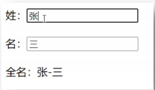
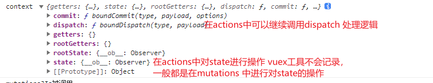

# **Vue 技术栈(全家桶)**

## **第 1 章：Vue 核心**

### **1.1. Vue 简介** 

#### **1.1.1. 官网** 

1. 英文官网: https://vuejs.org/ 

2. 中文官网: https://cn.vuejs.org/ 

#### **1.1.2. 介绍与描述** 

1. 动态构建用户界面的**渐进式** JavaScript 框架 

2. 作者: 尤雨溪 

#### **1.1.3. Vue 的特点** 

1. 遵循 **MVVM** 模式 

2. 编码简洁, 体积小, 运行效率高, 适合移动/PC 端开发3. 它本身只关注 UI, 也可以引入其它第三方库开发项目 

#### **1.1.4. 与其它 JS 框架的关联** 

1. 借鉴 Angular 的**模板**和**数据绑定**技术 

2. 借鉴 React 的**组件化**和**虚拟 DOM** 技术 

#### **1.1.5. Vue 周边库** 

1. vue-cli: vue 脚手架 

2. vue-resource 

3. axios 

4. vue-router: 路由 

5. vuex: 状态管理 

6. element-ui: 基于 vue 的 UI 组件库(PC 端) 


### **1.2. 初识 Vue** 


### **1.3. 模板语法** 

### **1.3.1. 效果** 

#### **1.3.2. 模板的理解** 

html 中包含了一些 JS 语法代码，语法分为两种，分别为： 

1. 插值语法（双大括号表达式） 
2. 指令（以 v-开头）

#### **1.3.3. 插值语法** 

1. 功能: 用于解析标签体内容 
2. 语法: {{xxx}} ，xxxx 会作为 js 表达式解析 

#### **1.3.4. 指令语法** 

1. 功能: 解析标签属性、解析标签体内容、绑定事件 

2. 举例：v-bind:href = 'xxxx' ，xxxx 会作为 js 表达式被解析 

3. 说明：Vue 中有有很多的指令，此处只是用 v-bind 举个例子

### **1.4. 数据绑定** 

#### **1.4.1. 效果**


#### 1.4.2. 单向数据绑定

1. 语法：v-bind:href ="xxx" 或简写为 :href 

2. 特点：数据只能从 data 流向页面 

#### **1.4.3. 双向数据绑定** 

1. 语法：v-mode:value="xxx" 或简写为 v-model="xxx" 

2. 特点：数据不仅能从 data 流向页面，还能从页面流向 data

备注：

​         1.双向绑定一般都应用在表单类元素上（如：input、select等）

​          2.v-model:value 可以简写为 v-model，因为v-model默认收集的就是value值。

#### 1.4.4 el与data的两种写法

​	data与el的2种写法

​          1.el有2种写法

​                  (1).new Vue时候配置el属性。

​                  (2).先创建Vue实例，随后再通过vm.$mount('#root')指定el的值。

​          2.data有2种写法

​                  (1).对象式

​                  (2).函数式

​                  如何选择：目前哪种写法都可以，以后学习到组件时，data必须使用函数式，否则会报错。

​          3.一个重要的原则：

​                  由Vue管理的函数，一定不要写箭头函数，一旦写了箭头函数，this就不再是Vue实例了。

### **1.5. MVVM 模型**

1. M：模型(Model) ：对应 data 中的数据 

2. V：视图(View) ：模板 

3. VM：视图模型(ViewModel) ： Vue 实例对象


​      观察发现：

​            1.data中所有的属性，最后都出现在了vm身上。

​            2.vm身上所有的属性 及 Vue原型上所有属性，在Vue模板中都可以直接使用。


### Object.defineProperty

```html
 <script>
        let number = 18
        let person = {
            name: '张三',
            sex: '男',
        }

        Object.defineProperty(person, 'age', {
            // value: 18,
            // enumerable: true,//控制属性是否可枚举 默认false
            // writable: true, //控制属性可否修改 默认false
            // configurable: true //控制属性是否可以被删除

            //当有人读取person的age属性时 get函数(getter)会被调用 且返回值就是age的值
            get: function () {
                console.log('有人读取age属性了')
                return number
            },

            //当有人修改person的age属性时，set函数(setter)就会被调用，且会收到修改的具体值
            set: function (value) {
                console.log('有人修改了age属性，且值是', value)
                number = value
            }
        })
        console.log(person);
        // console.log(Object.keys(person));
    </script>
```

### 数据代理

```html
 <script>
        // <!-- 数据代理：通过一个对象代理对另一个对象中属性的操作（读/写）-->
        let obj = { x: 100 }
        let obj2 = { y: 200 }

        Object.defineProperty(obj2, 'x', {
            get() {
                console.log('访问obj2');
                return obj.x
            },
            set(value) {
                console.log('修改obj2.x');
                obj.x = value
            }
        })
        console.log(obj2);
    </script>
```

```html
<script>
        let data = {
            name: "尚硅谷",
            address: "北京"
        }

        const vm = new Vue({
            el: "#root",
            data: data
        })
        console.log(vm);
        /*
        vm._data=options.data = data            options是el，data 这些配置对象
        vm._data = data         true
        */
    </script>
```


```html
1.Vue中的数据代理：
	通过vm对象来代理data对象中属性的操作（读/写）
2.Vue中数据代理的好处：
	更加方便的操作data中的数据
3.基本原理：
	通过Object.defineProperty()把data对象中所有属性添加到vm上。
	为每一个添加到vm上的属性，都指定一个getter/setter。
	在getter/setter内部去操作（读/写）data中对应的属性。
```

### 1.6. 事件处理

**1.6.2. 绑定监听**

1. v-on:xxx="fun" 

2. @xxx="fun" 

3. @xxx="fun(参数)" 

4. 默认事件形参: event 

5. 隐含属性对象: $event

```html
<body>
    <!-- 
事件的基本使用：
	1.使用v-on:xxx 或 @xxx 绑定事件，其中xxx是事件名；
	2.事件的回调需要配置在methods对象中，最终会在vm上；
	3.methods中配置的函数，不要用箭头函数！否则this就不是vm了；
	4.methods中配置的函数，都是被Vue所管理的函数，this的指向是vm 或 组件实例对象；
	5.@click="demo" 和 @click="demo($event)" 效果一致，但后者可以传参；
		-->
    <div id="root">
        <h2>欢迎来到{{name}}学习</h2>

        <!-- <button v-on:click="showInfo(1,2,3)">提示信息</button> -->
        <button @click="showInfo">提示信息 (不传参)</button>
        <button @click="showInfo2(33,$event)">提示信息222（传参）</button>

    </div>
    <script src="../../vue.js"></script>
    <script>
        const vm = new Vue({
            el: "#root",
            data: {
                name: "马尔克斯"
            },
            methods: {
                showInfo(event) {
                    alert("同学你好")
                    console.log(event.target);
                    // console.log(this === vm); // 不是箭头函数 此时this就是vue的实例对象
                },
                showInfo2(a, event) {
                    alert("同学你好" + a)
                    console.log(event.target);
                }
            },
        })
    </script>
</body>
```

#### **1.6.3. 事件修饰符**

1. .prevent : 阻止事件的默认行为 event.preventDefault() 

2. .stop : 停止事件冒泡 event.stopPropagation()

   修饰符可以连续写

```html
Vue中的事件修饰符：
	1.prevent：阻止默认事件（常用）；
	2.stop：阻止事件冒泡（常用）；
	3.once：事件只触发一次（常用）；
	4.capture：使用事件的捕获模式；
	5.self：只有event.target是当前操作的元素时才触发事件；
	6.passive：事件的默认行为立即执行，无需等待事件回调执行完毕；
```

#### **1.6.4. 按键修饰符**

```html
1.Vue中常用的按键别名：
		回车 => enter
		删除 => delete (捕获“删除”和“退格”键)
		退出 => esc
		空格 => space
		换行 => tab (特殊，必须配合keydown去使用)
		上 => up
		下 => down
		左 => left
		右 => right
	2.Vue未提供别名的按键，可以使用按键原始的key值去绑定，但注意要转为kebab-case（短横线命名）
	3.系统修饰键（用法特殊）：ctrl、alt、shift、meta
		(1).配合keyup使用：按下修饰键的同时，再按下其他键，随后释放其他键，事件才被触发。
		(2).配合keydown使用：正常触发事件。
	4.也可以使用keyCode去指定具体的按键（不推荐）
	5.Vue.config.keyCodes.自定义键名 = 键码，可以去定制按键别名
```

### **1.7. 计算属性与监视**

#### **1.7.2. 计算属性-computed**



1. 要显示的数据不存在，要通过计算得来。 

2. 在 computed 对象中定义计算属性。 

3. 在页面中使用{{方法名}}来显示计算的结果。

> 计算属性：
>
> ​      1.定义：要用的属性不存在，要通过已有属性计算得来。
>
> ​      2.原理：底层借助了Objcet.defineproperty方法提供的getter和setter。
>
> ​      3.get函数什么时候执行？
>
> ​        (1).初次读取时会执行一次。
>
> ​        (2).当依赖的数据发生改变时会被再次调用。
>
> ​      4.优势：与methods实现相比，内部有缓存机制（复用），效率更高，调试方便。
>
> ​      5.备注：
>
> ​        1.计算属性最终会出现在vm上，直接读取使用即可。
>
> ​        2.如果计算属性要被修改，那必须写set函数去响应修改，且set中要引起计算时依赖的数据发生改变。

```html
<body>
    <div id="root">
        姓<input type="text" v-model="firstName"> <br>
        名<input type="text" v-model="lastName"> <br>
        测试：<input type="text" v-model="x"> <br /><br />
        全名：<span> {{fullName}}</span> <br>
        全名：<span> {{fullName}}</span> <br>
        全名：<span> {{fullName}}</span> <br>
        全名：<span> {{fullName}}</span> <br>


        <!-- <button @click="fullName">xxx</button> -->
    </div>
    <script src='https://cdn.jsdelivr.net/npm/vue@2.7.14/dist/vue.js'></script>
    <script>
        const vm = new Vue({
            el: "#root",
            data: {
                firstName: "张",
                lastName: "三",
                x: '你好'
            },
            computed: {
                fullName: {
                    //get有什么作用？当有人读取fullName时，get就会被调用，且返回值就作为fullName的值
                    //get什么时候调用？1.初次读取fullName时。2.所依赖的数据(this.firstName)发生变化时。
                    get() {
                        console.log('get被调用了')
                        // console.log(this) //此处的this是vm
                        return this.firstName + '-' + this.lastName
                    },
                    //set什么时候调用? 当fullName被修改时。
                    set(value) {
                        // console.log('set');
                        const arr = value.split('-')
                        this.firstName = arr[0]
                        this.lastName = arr[1]
                    }
                }
            },
        })
    </script>
</body>
```

```javascript
<script>
        const vm = new Vue({
            el: "#root",
            data: {
                firstName: "张",
                lastName: "三",
            },
            computed: {
                //完整写法
                /* fullName:{
                    get(){
                        console.log('get被调用了')
                        return this.firstName + '-' + this.lastName
                    },
                    set(value){
                        console.log('set',value)
                        const arr = value.split('-')
                        this.firstName = arr[0]
                        this.lastName = arr[1]
                    }
                } */
                //简写
                fullName() {
                    console.log('get被调用了')
                    return this.firstName + '-' + this.lastName
                }
            },
        })
    </script>
```


#### 1.7.3. 监视属性-watch


1. 通过通过 vm 对象的$watch()或 watch 配置来监视指定的属性 

2. 当属性变化时, 回调函数自动调用, 在函数内部进行计算

> 监视属性watch：
>
>   1.当被监视的属性变化时, 回调函数自动调用, 进行相关操作
>
>   2.监视的属性必须存在，才能进行监视！！
>
>   3.监视的两种写法：
>
> ​      (1).new Vue时传入watch配置
>
> ​      (2).通过vm.$watch监视

```html
<body>
    <div id="root">
        <h2>今天天气很{{info}}</h2>
        <button @click="changeWeather">切换天气</button>
    </div>
    <script src='https://cdn.jsdelivr.net/npm/vue@2.7.14/dist/vue.js'></script>
    <script>
        const vm = new Vue({
            el: "#root",
            data: {
                isHot: true
            },
            methods: {
                changeWeather() {
                    this.isHot = !this.isHot
                }
            },
            computed: {
                info() {
                    return this.isHot ? "炎热" : "凉爽"
                }
            },
            /* watch: {
                isHot: {
                    // computed的 info也能监视
                    immediate: true, //初始化时让handler调用一下
                    //handler什么时候调用？当isHot发生改变时。
                    handler(newValue, oldValue) {
                        console.log(oldValue);
                        console.log(newValue);
                        console.log('isHot被修改');
                    }
                }
            }, */
        })

        vm.$watch('isHot', {
            immediate: true, //初始化时让handler调用一下
            //handler什么时候调用？当isHot发生改变时。
            handler(newValue, oldValue) {
                console.log(oldValue);
                console.log(newValue);
                console.log('isHot被修改');
            }
        })
    </script>
</body>
```

#### 1.7.4深度监视

> 深度监视：
>
>   (1).Vue中的watch默认不监测对象内部值的改变（一层）。
>
>   (2).配置deep:true可以监测对象内部值改变（多层）。
>
> 备注：
>
>   (1).Vue自身可以监测对象内部值的改变，但Vue提供的watch默认不可以！
>
>   (2).使用watch时根据数据的具体结构，决定是否采用深度监视。

```html
<body>

    <div id="root">
        <h2>今天天气很{{info}}</h2>
        <button @click="changeWeather">切换天气</button>
        <hr>
        <h3>a的值是:{{numbers.a}}</h3>
        <button @click="numbers.a++">点我让a加1</button>
        <hr>
        <h3>b的值是:{{numbers.b}}</h3>
        <button @click="numbers.b++">点我让a加1</button>
        <button @click="numbers={a:666,b:888}">彻底替换掉numbers</button>

    </div>
    <script src='https://cdn.jsdelivr.net/npm/vue@2.7.14/dist/vue.js'></script>
    <script>
        const vm = new Vue({
            el: "#root",
            data: {
                isHot: true,
                numbers: {
                    a: 1,
                    b: 1
                }
            },
            methods: {
                changeWeather() {
                    this.isHot = !this.isHot
                }
            },
            computed: {
                info() {
                    return this.isHot ? "炎热" : "凉爽"
                }
            },
            watch: {
                isHot: {
                    // immediate: true, //初始化时让handler调用一下
                    //handler什么时候调用？当isHot发生改变时。
                    handler(newValue, oldValue) {
                        console.log(oldValue);
                        console.log(newValue);
                        console.log('isHot被修改');
                    }
                },
                //监视多级结构中某个属性的变化
                /* 'numbers.a': {
                    handler() {
                        console.log('a改变了');
                    }
                } */

                //监视多级结构中所有属性的变化
                numbers: {
                    deep: true,
                    handler() {
                        console.log('numbers改变了');
                    }
                }
            },
        })
    </script>
</body>
```

#### 1.7.5监视属性的简写

```html
<body>
    <div id="root">
        <h2>今天天气很{{info}}</h2>
        <button @click="changeWeather">切换天气</button>
    </div>
    <script src='https://cdn.jsdelivr.net/npm/vue@2.7.14/dist/vue.js'></script>
    <script>
        const vm = new Vue({
            el: "#root",
            data: {
                isHot: true,
                numbers: {
                    a: 1,
                    b: 1
                }
            },
            methods: {
                changeWeather() {
                    this.isHot = !this.isHot
                }
            },
            computed: {
                info() {
                    return this.isHot ? "炎热" : "凉爽"
                }
            },
            watch: {
                isHot: {
                    //正常写法
                    immediate: true, //初始化时让handler调用一下
                    //handler什么时候调用？当isHot发生改变时。
                    handler(newValue, oldValue) {
                        console.log('isHot被修改', newValue, oldValue);
                    }
                },

                //简写
                /* isHot(newValue, oldValue) {
                    console.log('isHot被修改', newValue, oldValue);
                } */

            },
        })

        //正常写法
        /* vm.$watch("isHot", {
            immediate: true, //初始化时让handler调用一下
            deep: true,
            handler(newValue, oldValue) {
                console.log('isHot被修改', newValue, oldValue);
            }
        }) */

        //简写 不用箭头函数
        // vm.$watch("isHot", function (newValue, oldValue) {
        //     console.log('isHot被修改', newValue, oldValue);
        // })

    </script>
</body>
```

>   1.computed能完成的功能，watch都可以完成。
>
>   2.watch能完成的功能，computed不一定能完成，例如：watch可以进行异步操作。
>
> 两个重要的小原则：
>
> ​    1.所被Vue管理的函数，最好写成普通函数，这样this的指向才是vm 或 组件实例对象。
>
> ​    2.所有不被Vue所管理的函数（定时器的回调函数、ajax的回调函数等、Promise的回调函数），最好写成箭头函数，
>
> ​      这样this的指向才是vm 或 组件实例对象。

```html
<body>
    <div id="root">
        姓<input type="text" v-model="firstName"> <br>
        名<input type="text" v-model="lastName"> <br>
        全名：<span> {{fullName}}</span> <br>
    </div>
    <script src='https://cdn.jsdelivr.net/npm/vue@2.7.14/dist/vue.js'></script>
    <script>
        const vm = new Vue({
            el: "#root",
            data: {
                firstName: "张",
                lastName: "三",
                fullName: '张-三'
            },
            watch: {
                firstName(val) {
                    setTimeout(() => { //写成箭头函数 this才指向vm
                        this.fullName = val + "-" + this.lastName
                    }, 1000);
                },
                lastName(val) {
                    this.fullName = this.firstName + "-" + val
                }
            },
        })
    </script>
</body>
```

### **1.8. class 与 style 绑定**

#### **1.8.1. 理解** 

1. 在应用界面中, 某个(些)元素的样式是变化的 

2. class/style 绑定就是专门用来实现动态样式效果的技术

#### **1.8.2. class 绑定** 

1. :class='xxx' 

2. 表达式是字符串: 'classA' 

3. 表达式是对象: {classA:isA, classB: isB}

4. 表达式是数组: ['classA', 'classB']

#### **1.8.3. style 绑定** 

1. :style="{ color: activeColor, fontSize: fontSize + 'px' }" 

2. 其中 activeColor/fontSize 是 data 属性

> 绑定样式：
>
> 1. class样式
>
> ​    写法:class="xxx" xxx可以是字符串、对象、数组。
>
> ​      字符串写法适用于：类名不确定，要动态获取。
>
> ​      对象写法适用于：要绑定多个样式，个数不确定，名字也不确定。
>
> ​      数组写法适用于：要绑定多个样式，个数确定，名字也确定，但不确定用不用。
>
> 2. style样式
>
> ​    :style="{fontSize: xxx}"其中xxx是动态值。
>
> ​    :style="[a,b]"其中a、b是样式对象。

```html
<style>
        .basic {
            width: 400px;
            height: 100px;
            border: 1px solid black;
        }

        .happy {
            border: 4px solid red;
            ;
            background-color: rgba(255, 255, 0, 0.644);
            background: linear-gradient(30deg, yellow, pink, orange, yellow);
        }

        .sad {
            border: 4px dashed rgb(2, 197, 2);
            background-color: gray;
        }

        .normal {
            background-color: skyblue;
        }

        .atguigu1 {
            background-color: yellowgreen;
        }

        .atguigu2 {
            font-size: 30px;
            text-shadow: 2px 2px 10px red;
        }

        .atguigu3 {
            border-radius: 20px;
        }
    </style>
</head>

<body>
    <div id="root">
        <!-- 绑定class样式--字符串写法，适用于：样式的类名不确定，需要动态指定 -->
        <div class="basic" :class="a" @click="changeMood">test</div> <br>

        <!-- 绑定class样式--数组写法，适用于：要绑定的样式个数不确定、名字也不确定 -->
        <div class="basic" :class="classArr">test</div> <br>

        <!-- 绑定class样式--对象写法，适用于：要绑定的样式个数确定、名字也确定，但要动态决定用不用 -->
        <div class="basic" :class="classObj">test</div> <br>

        <!-- 绑定style样式--对象写法 -->
        <div class="basic" :style="styleObj">test</div> <br>

        <!-- 绑定style样式--数组写法 -->
        <div class="basic" :style="[styleObj,styleObj2]">test</div> <br>
        <div class="basic" :style="styleArr">{{name}}</div>

    </div>
    <script src='https://cdn.jsdelivr.net/npm/vue@2.7.14/dist/vue.js'></script>
    <script>
        const vm = new Vue({
            el: "#root",
            data: {
                name: 'Jack',
                a: "normal",
                classArr: ['atguigu1', 'atguigu2', 'atguigu3'],
                classObj: {
                    atguigu1: true,
                    atguigu2: true,
                },
                styleObj: {
                    fontSize: "45px",
                    color: "red",
                },
                styleObj2: {
                    background: "orange"
                },
                styleArr: [
                    {
                        fontSize: "45px",
                        color: "red",
                    },
                    {
                        background: "orange"
                    }
                ]
            },
            methods: {
                changeMood() {
                    const arr = ['happy', 'sad', 'normal']
                    const index = Math.floor(Math.random() * 3)
                    this.a = arr[index]
                }
            },
        })
    </script>
</body>
```

### **1.9. 条件渲染**

#### **1.9.1. 条件渲染指令** 

1. v-if 与 v-else 

2. v-show

#### 1.9.2. 比较 v-if 与 v-show 

1. 如果需要频繁切换 v-show 较好 

2. 当条件不成立时, v-if 的所有子节点不会解析(项目中使用)


> 条件渲染：
>
>   1.v-if
>
> ​    写法：
>
> ​        (1).v-if="表达式" 
>
> ​        (2).v-else-if="表达式"
>
> ​        (3).v-else="表达式"
>
> ​    适用于：切换频率较低的场景。
>
> ​    特点：不展示的DOM元素直接被移除。
>
> ​    注意：v-if可以和:v-else-if、v-else一起使用，但要求结构不能被“打断”。
>
> 
>
>   2.v-show
>
> ​    写法：v-show="表达式"
>
> ​    适用于：切换频率较高的场景。
>
> ​    特点：不展示的DOM元素未被移除，仅仅是使用样式隐藏掉
>
> ​    
>
>   3.备注：使用v-if的时，元素可能无法获取到，而使用v-show一定可以获取到。

```html
<body>
    <div id="root">
        <h2>当前的n值是 {{n}} </h2>
        <button @click="n++">点我n+1</button>

        <!-- 使用v-show做条件渲染 -->
        <!-- <h2 v-show="false">欢迎来到{{name}}</h2>
        <h2 v-show="1 === 1">欢迎来到{{name}}</h2> -->

        <!-- 使用v-if做条件渲染 -->
        <!-- <h2 v-if="false">欢迎来到{{name}}</h2>
        <h2 v-if="1 === 1">欢迎来到{{name}}</h2> -->

        <h2 v-if="n===1">angular</h2>
        <h2 v-else-if="n===2">react</h2>
        <h2 v-else>vue</h2>

        <!-- v-if与template的配合使用 -->
        <template v-if="n === 1">
            <h2>你好</h2>
            <h2>尚硅谷</h2>
            <h2>北京</h2>
        </template>

    </div>
    <script src='https://cdn.jsdelivr.net/npm/vue@2.7.14/dist/vue.js'></script>
    <script>
        const vm = new Vue({
            el: "#root",
            data: {
                name: 'Jack',
                n: 0
            },
            methods: {

            },
        })
    </script>
</body>
```

### **1.10. 列表渲染**

#### **1.10.1. 效果**


> v-for指令:
>
>   1.用于展示列表数据
>
>   2.语法：v-for="(item, index) in xxx" :key="yyy"
>
>   3.可遍历：数组、对象、字符串（用的很少）、指定次数（用的很少）

```html
<body>
    <div id="root">
        <!-- 遍历数组 -->
        <h2>人员列表（遍历数组）</h2>
        <ul>
            <li v-for="(p,index) in persons" :key="p.id">
                {{p.name}}-{{p.age}}
            </li>
        </ul>

        <!-- 遍历对象 -->
        <h2>汽车信息（遍历对象）</h2>
        <ul>
            <li v-for="(value,k) of car" :key="k">
                {{value}}--{{k}}
            </li>
        </ul>

        <!-- 遍历字符串 -->
        <h2>测试遍历字符串（用得少）</h2>
        <ul>
            <li v-for="(char,index) of str" :key="index">
                {{char}}-{{index}}
            </li>
        </ul>

        <!-- 遍历指定次数 -->
        <h2>测试遍历指定次数（用得少）</h2>
        <ul>
            <li v-for="(number,index) of 5" :key="index">
                {{number}}-{{index}}
            </li>
        </ul>
    </div>
    <script src='https://cdn.jsdelivr.net/npm/vue@2.7.14/dist/vue.js'></script>
    <script>
        new Vue({
            el: "#root",
            data: {
                persons: [
                    { id: '001', name: '张三', age: 18 },
                    { id: '002', name: '李四', age: 19 },
                    { id: '003', name: '王五', age: 20 }
                ],
                car: {
                    name: '奥迪A8',
                    price: '70万',
                    color: '黑色'
                },
                str: 'hello'
            },
        })
    </script>
</body>
```

> 面试题：react、vue中的key有什么作用？（key的内部原理）
>
>   1. 虚拟DOM中key的作用：
>
>  	   key是虚拟DOM对象的标识，当数据发生变化时，Vue会根据【新数据】生成【新的虚拟DOM】, 
>
>  	   随后Vue进行【新虚拟DOM】与【旧虚拟DOM】的差异比较，比较规则如下：
>
> ​          
>
>   2.对比规则：
>
> ​    (1).旧虚拟DOM中找到了与新虚拟DOM相同的key：
>
> ​     	 ①.若虚拟DOM中内容没变, 直接使用之前的真实DOM！
>
> ​    	  ②.若虚拟DOM中内容变了, 则生成新的真实DOM，随后替换掉页面中之前的真实DOM。
>
> 
>
> ​    (2).旧虚拟DOM中未找到与新虚拟DOM相同的key
>
> ​    	  创建新的真实DOM，随后渲染到到页面。
>
> ​              
>
> 3. 用index作为key可能会引发的问题：
>
>    ​    1. 若对数据进行：逆序添加、逆序删除等破坏顺序操作:
>
>    ​      会产生没有必要的真实DOM更新 ==> 界面效果没问题, 但效率低。
>
> 
>
> ​    2. 如果结构中还包含输入类的DOM：
>
> ​    	  会产生错误DOM更新 ==> 界面有问题。
>
> 
>
> 4. 开发中如何选择key?:
>
> ​    1.最好使用每条数据的唯一标识作为key, 比如id、手机号、身份证号、学号等唯一值。
>
> ​    2.如果不存在对数据的逆序添加、逆序删除等破坏顺序操作，仅用于渲染列表用于展示，
>
> ​      使用index作为key是没有问题的。

```html
<body>
    <div id="root">
        <!-- 遍历数组 -->
        <h2>人员列表（遍历数组）</h2>
        <button @click.once="add">添加一个老刘</button>
        <ul>
            <li v-for="(p,index) in persons" :key="p.id">
                {{p.name}}-{{p.age}}
                <input type="text">
            </li>
        </ul>
    </div>
    <script src='https://cdn.jsdelivr.net/npm/vue@2.7.14/dist/vue.js'></script>
    <script>
        new Vue({
            el: "#root",
            data: {
                persons: [
                    { id: '001', name: '张三', age: 18 },
                    { id: '002', name: '李四', age: 19 },
                    { id: '003', name: '王五', age: 20 }
                ],

            },
            methods: {
                add() {
                    const p = { id: "004", name: "老刘", age: 40 }
                    this.persons.unshift(p)
                }
            },
        })
    </script>
</body>
```


#### 列表过滤

```html
<body>
    <!-- 
        filter 返回新数组
        indexOf 包含 返回下标 否则返回 -1    字符串都包含'' 且下标为0
     -->

    <div id="root">
        <h2>人员列表</h2>
        <input type="text" placeholder="请输入名字" v-model="keyWord">
        <ul>
            <li v-for="(p,index) in filPersons" :key="p.id">
                {{p.name}}-{{p.age}}-{{p.sex}}
            </li>
        </ul>
    </div>
    <script src='https://cdn.jsdelivr.net/npm/vue@2.7.14/dist/vue.js'></script>
    <script>
        Vue.config.productionTip = false

        //watch实现
        /*  new Vue({
             el: "#root",
             data: {
                 keyWord: "",
                 persons: [
                     { id: '001', name: '马冬梅', age: 19, sex: '女' },
                     { id: '002', name: '周冬雨', age: 20, sex: '女' },
                     { id: '003', name: '周杰伦', age: 21, sex: '男' },
                     { id: '004', name: '温兆伦', age: 22, sex: '男' }
                 ],
                 filPersons: []
             },
             watch: {
                 keyWord: {
                     immediate: true,
                     handler(val) {
                         this.filPersons = this.persons.filter((p) => {
                             return p.name.indexOf(val) !== -1
                         })
                     }
                 }
             },
         }) */


        //computed实现
        new Vue({
            el: "#root",
            data: {
                keyWord: "",
                persons: [
                    { id: '001', name: '马冬梅', age: 19, sex: '女' },
                    { id: '002', name: '周冬雨', age: 20, sex: '女' },
                    { id: '003', name: '周杰伦', age: 21, sex: '男' },
                    { id: '004', name: '温兆伦', age: 22, sex: '男' }
                ],
            },
            computed: {
                filPersons() {
                    return this.persons.filter((p) => {
                        return p.name.indexOf(this.keyWord) !== -1
                    })
                }
            },

        })
    </script>
</body>
```


#### 列表排序

```html
<body>
    <!-- 
        filter 返回新数组
        indexOf 包含 返回下标 否则返回 -1    字符串都包含'' 且下标为0
     -->

    <div id="root">
        <h2>人员列表</h2>
        <input type="text" placeholder="请输入名字" v-model="keyWord">
        <button @click="sortType = 2">年龄升序</button>
        <button @click="sortType = 1">年龄降序</button>
        <button @click="sortType = 0">原升序</button>
        <ul>
            <li v-for="(p,index) in filPersons" :key="p.id">
                {{p.name}}-{{p.age}}-{{p.sex}}
            </li>
        </ul>
    </div>
    <script src='https://cdn.jsdelivr.net/npm/vue@2.7.14/dist/vue.js'></script>
    <script>
        Vue.config.productionTip = false
        //computed实现
        new Vue({
            el: "#root",
            data: {
                keyWord: "",
                sortType: 0,  // 0原顺序 1降序 2升序
                persons: [
                    { id: '001', name: '马冬梅', age: 56, sex: '女' },
                    { id: '002', name: '周冬雨', age: 23, sex: '女' },
                    { id: '003', name: '周杰伦', age: 44, sex: '男' },
                    { id: '004', name: '温兆伦', age: 12, sex: '男' }
                ],
            },
            computed: {
                filPersons() {
                    const arr = this.persons.filter((p) => {
                        return p.name.indexOf(this.keyWord) !== -1
                    })
                    //判断是否需要排序
                    if (this.sortType) { // 0 转布尔值为false
                        arr.sort((a, b) => {
                            return this.sortType === 1 ? b.age - a.age : a.age - b.age
                        })
                    }
                    return arr
                }
            },

        })
        /* let zzz = [1, 3, 4, 5, 8, 2]
        zzz.sort((a, b) => {
            return a - b
        })
        console.log(zzz); // a-b [1, 2, 3, 4, 5, 8] 改变原素组 */
    </script>
</body>
```


#### **1.10.2. 列表显示指令**

遍历数组: v-for / index 

遍历对象: v-for / key


### 数据检测原理

> Vue监视数据的原理：
>
> 1. vue会监视data中所有层次的数据。
>
> 
>
> 2. 如何监测对象中的数据？
>
> ​    通过setter实现监视，且要在new Vue时就传入要监测的数据。
>
> ​      (1).对象中后追加的属性，Vue默认不做响应式处理
>
> ​      (2).如需给后添加的属性做响应式，请使用如下API：
>
> ​        Vue.set(target，propertyName/index，value) 或 
>
> ​        vm.$set(target，propertyName/index，value)
>
> 
>
>   3. 如何监测数组中的数据？
>
> ​    通过包裹数组更新元素的方法实现，本质就是做了两件事：
>
> ​      (1).调用原生对应的方法对数组进行更新。
>
> ​      (2).重新解析模板，进而更新页面。
>
> 
>
>   4.在Vue修改数组中的某个元素一定要用如下方法：
>
> ​    1.使用这些API:push()、pop()、shift()、unshift()、splice()、sort()、reverse()
>
> ​    2.Vue.set() 或 vm.$set()
>
>   
>
>   特别注意：Vue.set() 和 vm.$set() 不能给vm 或 vm的根数据对象 添加属性！！！

### **1.11. 收集表单数据**


> 收集表单数据：
>
>   若：<input type="text"/>，则v-model收集的是value值，用户输入的就是value值。
>
>   若：<input type="radio"/>，则v-model收集的是value值，且要给标签配置value值。
>
>   若：<input type="checkbox"/>
>
> ​    1.没有配置input的value属性，那么收集的就是checked（勾选 or 未勾选，是布尔值）
>
> ​    2.配置input的value属性:
>
> ​      (1)v-model的初始值是非数组，那么收集的就是checked（勾选 or 未勾选，是布尔值）
>
> ​      (2)v-model的初始值是数组，那么收集的的就是value组成的数组
>
>   备注：v-model的三个修饰符：
>
> ​    lazy：失去焦点再收集数据
>
> ​    number：输入字符串转为有效的数字
>
> ​    trim：输入首尾空格过滤

```html
<body>
    <div id="root">
        <form action="" @submit.prevent="demo">
            账号: <input type="text" v-model.trim="userInfo.account"> <br> <br>
            密码: <input type="password" v-model="userInfo.password"> <br><br>
            年龄：<input type="number" v-model.number="userInfo.age"> <br /><br />
            性别:
            男<input type="radio" name="sex" v-model="userInfo.sex" value="男">
            女<input type="radio" name="sex" v-model="userInfo.sex" value="女"> <br><br>
            爱好:
            学习<input v-model="userInfo.hobby" type="checkbox" value="学习">
            打游戏<input v-model="userInfo.hobby" type="checkbox" value="打游戏">
            吃饭<input v-model="userInfo.hobby" type="checkbox" value="吃饭"> <br><br>
            所属校区:
            <select v-model="userInfo.city">
                <option value="">请选择</option>
                <option value="beijing">北京</option>
                <option value="shanghai">上海</option>
                <option value="shenzhen">深圳</option>
                <option value="wuhan">武汉</option>
            </select> <br><br>
            其他信息：
            <textarea v-model.lazy="userInfo.other"></textarea> <br><br>
            <input type="checkbox" v-model="userInfo.agree"> 阅读并接受 <a href="http://www.atguigu.com">《用户协议》</a> <br><br>
            <button>提交</button>
        </form>
    </div>
    <script src='https://cdn.jsdelivr.net/npm/vue@2.7.14/dist/vue.js'></script>
    <script>
        Vue.config.productionTip = false
        new Vue({
            el: "#root",
            data: {
                userInfo: {
                    account: '',
                    password: '',
                    age: 18,
                    sex: '女',
                    hobby: [],
                    city: '',
                    other: '',
                    agree: ''
                }
            },
            methods: {
                demo() {
                    console.log(JSON.stringify(this.userInfo))
                }
            },
        })
    </script>
</body>
```

### **1.12. 过滤器**

#### **1.12.1. 效果**


#### **1.12.2. 理解过滤器**

1. 功能: 对要显示的数据进行特定格式化后再显示 

2. 注意: 并没有改变原本的数据, 是产生新的对应的数据

> 过滤器：
>
>   定义：对要显示的数据进行特定格式化后再显示（适用于一些简单逻辑的处理）。
>
>   语法：
>
> ​    1.注册过滤器：Vue.filter(name,callback) 或 new Vue{filters:{}}
>
> ​    2.使用过滤器：{{ xxx | 过滤器名}}  或  v-bind:属性 = "xxx | 过滤器名"
>
>   备注：
>
> ​    1.过滤器也可以接收额外参数、多个过滤器也可以串联
>
> ​    2.并没有改变原本的数据, 是产生新的对应的数据

```html
<body>
    <div id="root">
        <h2>显示格式化后的时间</h2>
        <!-- 计算属性实现 -->
        <h2>现在是: {{fmtTime}} </h2>

        <!-- methods实现 -->
        <h2>现在是: {{getFmtTime()}} </h2>

        <!-- 过滤器实现 -->
        <h3>现在是：{{time | timeFormater}}</h3>

        <!-- 过滤器实现（传参） -->
        <h3>现在是：{{time | timeFormater('YYYY_MM_DD') | mySlice }}</h3>
    </div>

    <div id="root2">
        <h2>{{msg | mySlice}}</h2>
    </div>

    <script src="https://cdn.bootcdn.net/ajax/libs/dayjs/1.11.7/dayjs.min.js"></script>
    <script src='https://cdn.jsdelivr.net/npm/vue@2.7.14/dist/vue.js'></script>
    <script>
        Vue.config.productionTip = false

        //全局过滤器
        Vue.filter('mySlice', function (value) {
            return value.slice(0, 4)
        })

        new Vue({
            el: "#root",
            data: {
                time: 1685933977344 // 时间戳
            },
            computed: {
                fmtTime() {
                    return dayjs(this.time).format('YYYY年MM月DD HH:mm:ss')
                }
            },
            methods: {
                getFmtTime() {
                    return dayjs(this.time).format('YYYY年MM月DD日 HH:mm:ss')
                }
            },
            //局部过滤器
            filters: {
                timeFormater(value, str = 'YYYY年MM月DD日 HH:mm:ss') {
                    return dayjs(value).format(str)
                },
                // mySlice(value) {
                //     return value.slice(0, 4)
                // }
            }
        })

        new Vue({
            el: '#root2',
            data: {
                msg: 'hello,atguigu!'
            }
        })
    </script>
</body>
```

### **1.13. 内置指令与自定义指令**

#### **1.13.1. 常用内置指令**

> 1. v-text : 更新元素的 textContent 
>
>    > v-text指令：
>    >
>    >   1.作用：向其所在的节点中渲染文本内容。
>    >
>    >   2.与插值语法的区别：v-text会替换掉节点中的内容，{{xx}}则不会。
>    
> 2. v-html : 更新元素的 innerHTM 
>
>    > v-html指令：
>    >
>    >   1.作用：向指定节点中渲染包含html结构的内容。
>    >
>    >   2.与插值语法的区别：
>    >
>    > ​    (1).v-html会替换掉节点中所有的内容，{{xx}}则不会。
>    >
>    > ​    (2).v-html可以识别html结构。
>    >
>    >   3.严重注意：v-html有安全性问题！！！！
>    >
>    > ​    (1).在网站上动态渲染任意HTML是非常危险的，容易导致XSS攻击。
>    >
>    > ​    (2).一定要在可信的内容上使用v-html，永不要用在用户提交的内容上！
>
> 3. v-if : 如果为 true, 当前标签才会输出到页面 
>
> 4. v-else: 如果为 false, 当前标签才会输出到页面 
>
> 5. v-show : 通过控制 display 样式来控制显示/隐藏 
>
> 6. v-for : 遍历数组/对象 
>
> 7. v-on : 绑定事件监听, 一般简写为@ 
>
> 8. v-bind : 绑定解析表达式, 可以省略 v-bind 
>
> 9. v-model : 双向数据绑定 
>
> 10. v-cloak : 防止闪现, 与 css 配合: [v-cloak] { display: none }
>
>     
>
> > v-cloak指令（没有值）：
> >
> >   1.本质是一个特殊属性，Vue实例创建完毕并接管容器后，会删掉v-cloak属性。
> >
> >   2.使用css配合v-cloak可以解决网速慢时页面展示出{{xxx}}的问题。
> >
> > ```html
> > <style>
> >         [v-cloak] {
> >             display: none;
> >         }
> >     </style>
> > </head>
> > <body>
> >     <div id="root">
> >         <h2 v-cloak>{{name}}</h2>
> >     </div>
> >     <script src='https://cdn.jsdelivr.net/npm/vue@2.7.14/dist/vue.js'></script>
> >     <script>
> >         Vue.config.productionTip = false
> >         new Vue({
> >             el: "#root",
> >             data: {
> >                 name: 'Jack'
> >             },
> >         })
> >     </script>
> > ```
>
> 11.v-once
>
> > v-once指令：
> >
> >   1.v-once所在节点在初次动态渲染后，就视为静态内容了。
> >
> >   2.以后数据的改变不会引起v-once所在结构的更新，可以用于优化性能。
> >
> > ```html
> > <body>
> >     <div id="root">
> >         <h2 v-once>初始化的n值是:{{n}}</h2>
> >         <h2>当前的n值是:{{n}}</h2>
> >         <button @click="n++">点我n+1</button>
> >     </div>
> >     <script src='https://cdn.jsdelivr.net/npm/vue@2.7.14/dist/vue.js'></script>
> >     <script>
> >         Vue.config.productionTip = false
> >         new Vue({
> >             el: "#root",
> >             data: {
> >                 n: 1
> >             },
> >         })
> >     </script>
> > ```
>
> 12. v-pre
>
>     > v-pre指令：
>     >
>     >   1.跳过其所在节点的编译过程。
>     >
>     >   2.可利用它跳过：没有使用指令语法、没有使用插值语法的节点，会加快编译。
>     >
>     > ```html
>     > <body>
>     >     <div id="root">
>     >         <h2 v-pre>Vue其实很简单</h2>
>     >         <h2 v-pre>当前的n值是:{{n}}</h2>
>     >         <button @click="n++">点我n+1</button>
>     >     </div>
>     >     <script src='https://cdn.jsdelivr.net/npm/vue@2.7.14/dist/vue.js'></script>
>     >     <script>
>     >         Vue.config.productionTip = false
>     >         new Vue({
>     >             el: "#root",
>     >             data: {
>     >                 n: 1
>     >             },
>     >         })
>     >     </script>
>     > </body>
>     > ```

#### **1.13.2. 自定义指令**

**1. 注册全局指令** 

```javascript
Vue.directive('my-directive', function(el, binding){ 
	el.innerHTML = binding.value.toupperCase() 
})
```

**2. 注册局部指令** 

```javascript
directives : { 
	'my-directive' : { 
		bind (el, binding) { 
			el.innerHTML = binding.value.toupperCase() 
		} 
	} 
}
```

1) 使用指令 

v-my-directive='xxx'

##### 		自定义指令1

```html
<body>
    <!-- 
        需求1：定义一个v-big指令，和v-text功能类似，但会把绑定的数值放大10倍。
     -->
    <div id="root">
        <h2>当前的n值是 <span v-text="n"></span> </h2>
        <h2>放大十倍后的n值是 <span v-big="n"></span> </h2>
        <button @click="n++">点我n+1</button>
    </div>
    <script src='https://cdn.jsdelivr.net/npm/vue@2.7.14/dist/vue.js'></script>
    <script>
        Vue.config.productionTip = false
        new Vue({
            el: "#root",
            data: {
                n: 10
            },
            directives: {
                //big函数何时会被调用？1.指令与元素成功绑定时（一上来）。2.指令所在的模板被重新解析时。
                big(element, binding) {
                    element.innerText = binding.value * 10
                }
            }
        })
    </script>
</body>
```

得先有表单才能获取焦点()

```html
<body>
    <!-- 
        需求1：定义一个v-big指令，和v-text功能类似，但会把绑定的数值放大10倍。
        需求2：定义一个v-fbind指令，和v-bind功能类似，但可以让其所绑定的input元素默认获取焦点。
     -->
    <div id="root">
        <h2>当前的n值是 <span v-text="n"></span> </h2>
        <h2>放大十倍后的n值是 <span v-big="n"></span> </h2>
        <button @click="n++">点我n+1</button>
        <hr>
        <input type="text" v-fbind:value="n">
    </div>
    <script src='https://cdn.jsdelivr.net/npm/vue@2.7.14/dist/vue.js'></script>
    <script>
        Vue.config.productionTip = false
        new Vue({
            el: "#root",
            data: {
                n: 1
            },
            directives: {
                //big函数何时会被调用？1.指令与元素成功绑定时（一上来）。2.指令所在的模板被重新解析时。
                big(element, binding) {
                    element.innerText = binding.value * 10
                },

                fbind: {
                    // 直接写函数的形式就行 bind和update bind指令与元素成功绑定时（一上来）执行   update模板被重新解析时 执行
                    //指令与元素成功绑定时（一上来）
                    bind(element, binding) {
                        element.value = binding.value
                        console.log('bind');
                    },
                    //指令所在元素被插入页面时
                    inserted(element, binding) {
                        element.focus()
                    },
                    //指令所在的模板被重新解析时
                    update(element, binding) {
                        element.value = binding.value
                        console.log('update');
                    }
                }
            },
        })
    </script>
</body>
```

##### 自定义指令总结

> 一、定义语法：
>
> ​    (1).局部指令：
>
> ​      new Vue({                   
>
> ​           new Vue({
>
> ​       	 directives:{指令名:配置对象}  或      directives{指令名:回调函数}
>
> ​     	 })                          
>
> ​      })
>
> ​    (2).全局指令：
>
> ​      Vue.directive(指令名,配置对象) 或  Vue.directive(指令名,回调函数)
>
> 
>
>   二、配置对象中常用的3个回调：
>
> ​    (1).bind：指令与元素成功绑定时调用。
>
> ​    (2).inserted：指令所在元素被插入页面时调用。
>
> ​    (3).update：指令所在模板结构被重新解析时调用。
>
> 
>
>   三、备注：
>
> ​    1.指令定义时不加v-，但使用时要加v-；
>
> ​    2.指令名如果是多个单词，要使用kebab-case命名方式，不要用camelCase命名。

```html
<body>
    <div id="root">
        <h2>当前的n值是 <span v-text="n"></span> </h2>
        <h2>放大十倍后的n值是 <span v-big="n"></span> </h2>
        <button @click="n++">点我n+1</button>
        <hr>
        <input type="text" v-fbind:value="n">
    </div>
    <script src='https://cdn.jsdelivr.net/npm/vue@2.7.14/dist/vue.js'></script>
    <script>
        Vue.config.productionTip = false

        //定义全局指令
        // Vue.directive('fbind', {
        //     bind(element, binding) {
        //         element.value = binding.value
        //     },
        //     inserted(element, binding) {
        //         element.focus()
        //     },
        //     update(element, binding) {
        //         element.value = binding.value
        //     }
        // })

        //定义全局指令
        // Vue.directive('big', function (element, binding) {
        //     element.innerText = binding.value * 10
        // })

        new Vue({
            el: "#root",
            data: {
                n: 1
            },
            directives: {
                //big函数何时会被调用？1.指令与元素成功绑定时（一上来）。2.指令所在的模板被重新解析时。
                big(element, binding) {
                    element.innerText = binding.value * 10
                },

                fbind: {
                    // 直接写函数的形式就行 bind和update bind指令与元素成功绑定时（一上来）执行   update模板被重新解析时 执行
                    //指令与元素成功绑定时（一上来）
                    bind(element, binding) {
                        // console.log(this); //此处this是window
                        element.value = binding.value
                        console.log('bind');
                    },
                    //指令所在元素被插入页面时
                    inserted(element, binding) {
                        element.focus()
                    },
                    //指令所在的模板被重新解析时
                    update(element, binding) {
                        element.value = binding.value
                        console.log('update');
                    }
                }
            },
        })
    </script>
</body>
```

### **1.14. Vue 实例生命周期**

#### **1.14.1. 效果**


> 生命周期：
>
>   1.又名：生命周期回调函数、生命周期函数、生命周期钩子。
>
>   2.是什么：Vue在关键时刻帮我们调用的一些特殊名称的函数。
>
>   3.生命周期函数的名字不可更改，但函数的具体内容是程序员根据需求编写的。
>
>   4.生命周期函数中的this指向是vm 或 组件实例对象。

```html
<body>
    <div id="root">
        <h1 v-if="a">你好啊</h1>
        <h2 :style="{opacity}">欢迎学习VUE</h2>
    </div>
    <script src='https://cdn.jsdelivr.net/npm/vue@2.7.14/dist/vue.js'></script>
    <script>
        Vue.config.productionTip = false
        const vm = new Vue({
            el: "#root",
            data: {
                a: false,
                opacity: 1
            },
            methods: {

            },
            //Vue完成模板的解析并把初始的真实DOM元素放入页面后（挂载完毕）调用mounted
            mounted() {
                console.log('mounted');
                setInterval(() => {
                    this.opacity -= 0.01
                    if (this.opacity <= 0) this.opacity = 1
                }, 16)
            },

        })

        //通过外部的定时器实现（不推荐）
        /* setInterval(() => {
            vm.opacity -= 0.01
            if (vm.opacity <= 0) vm.opacity = 1
        }, 16) */
    </script>
</body>
```


#### 1.14.2. 生命周期流程图


> 生命周期：
>
>   1.又名：生命周期回调函数、生命周期函数、生命周期钩子。
>
>   2.是什么：Vue在关键时刻帮我们调用的一些特殊名称的函数。
>
>   3.生命周期函数的名字不可更改，但函数的具体内容是程序员根据需求编写的。
>
>   4.生命周期函数中的this指向是vm 或 组件实例对象。

```html
<body>
    <div id="root">
        <h1 v-if="a">你好啊</h1>
        <h2 :style="{opacity}">欢迎学习VUE</h2>
    </div>
    <script src='https://cdn.jsdelivr.net/npm/vue@2.7.14/dist/vue.js'></script>
    <script>
        Vue.config.productionTip = false
        const vm = new Vue({
            el: "#root",
            data: {
                a: false,
                opacity: 1
            },
            methods: {

            },
            //Vue完成模板的解析并把初始的真实DOM元素放入页面后（挂载完毕）调用mounted
            mounted() {
                console.log('mounted');
                setInterval(() => {
                    this.opacity -= 0.01
                    if (this.opacity <= 0) this.opacity = 1
                }, 16)
            },

        })

        //通过外部的定时器实现（不推荐）
        /* setInterval(() => {
            vm.opacity -= 0.01
            if (vm.opacity <= 0) vm.opacity = 1
        }, 16) */
    </script>
</body>
```


```html
<body>
    <div id="root">
        <h2 v-text="n"></h2>
        <h2>当前的n值是：{{n}}</h2>
        <button @click="add">点我n+1</button>
        <button @click="bye">点我销毁vm</button>
    </div>
    <script src='https://cdn.jsdelivr.net/npm/vue@2.7.14/dist/vue.js'></script>
    <script>
        Vue.config.productionTip = false
        new Vue({
            el: "#root",
            data: {
                n: 1
            },
            methods: {
                add() {
                    console.log('add')
                    this.n++
                },
                bye() {
                    console.log('bye')
                    this.$destroy()
                }
            },
            watch: {
                n() {
                    console.log('n变了')
                }
            },
            beforeCreate() {
                console.log('beforeCreate');
                // console.log(this);
                // debugger
            },
            created() {
                console.log('created');
                // console.log(this);
                // debugger
            },
            beforeMount() {
                console.log('beforeMount');
                // console.log(this);
                // debugger
            },
            mounted() {
                console.log('mounted');
                // console.log(this);
                // debugger
            },
            beforeUpdate() {
                console.log('beforeUpdate');
                // console.log(this.n);
                // debugger
            },
            updated() {
                console.log('updated');
                // console.log(this.n);
                // debugger
            },
            beforeDestroy() {
                console.log('beforeDestroy');
                // console.log(this.n);
                // this.add()
            },
            destroyed() {
                console.log('destroyed');
            },
        })

        
        
        
        
    </script>
</body
```


> 常用的生命周期钩子：
>
>   1.mounted: 发送ajax请求、启动定时器、绑定自定义事件、订阅消息等【初始化操作】。
>
>   2.beforeDestroy: 清除定时器、解绑自定义事件、取消订阅消息等【收尾工作】。
>
> 
>
> 关于销毁Vue实例
>
>   1.销毁后借助Vue开发者工具看不到任何信息。
>
>   2.销毁后自定义事件会失效，但原生DOM事件依然有效。
>
>   3.一般不会在beforeDestroy操作数据，因为即便操作数据，也不会再触发更新流程了。


#### 1.14.3. vue 生命周期分析

1) 初始化显示 

* beforeCreate() 

* created() 

* beforeMount() 

* mounted() 

2) 更新状态: this.xxx = value 

* beforeUpdate() 

* updated(

3) 销毁 vue 实例: vm.$destory() 

* beforeDestory() 

* destoryed()

#### **1.14.4. 常用的生命周期方法**

1. mounted(): 发送 ajax 请求, 启动定时器等异步任务 
2. beforeDestory(): 做收尾工作, 如: 清除定时器


## **第 2 章：Vue 组件化编程**

### **2.1 模块与组件、模块化与组件化**

#### **2.1.1. 模块** 

1. 理解: 向外提供特定功能的 js 程序, 一般就是一个 js 文件 

2. 为什么: js 文件很多很复杂 

3. 作用: 复用 js, 简化 js 的编写, 提高 js 运行效率

#### **2.1.2. 组件** 

1. 理解: 用来实现局部(特定)功能效果的代码集合(html/css/js/image…..) 

2. 为什么: 一个界面的功能很复杂

3. 作用: 复用编码, 简化项目编码, 提高运行效率

#### **2.1.3. 模块化** 

当应用中的 js 都以模块来编写的, 那这个应用就是一个模块化的应用。

#### **2.1.4. 组件化** 

当应用中的功能都是多组件的方式来编写的, 那这个应用就是一个组件化的应用,。


### **2.2. 非单文件组件**

1. 模板编写没有提示 

2. 没有构建过程, 无法将 ES6 转换成 ES5 

3. 不支持组件的 CSS 

4. 真正开发中几乎不用

   

> Vue中使用组件的三大步骤：
>
>   一、定义组件(创建组件)
>
>   二、注册组件
>
>   三、使用组件(写组件标签)
>
> 
>
> 一、如何定义一个组件？
>
>   使用Vue.extend(options)创建，其中options和new Vue(options)时传入的那个options几乎一样，但也有点区别；
>
>   区别如下：
>
> ​    1.el不要写，为什么？ ——— 最终所有的组件都要经过一个vm的管理，由vm中的el决定服务哪个容器。
>
> ​    2.data必须写成函数，为什么？ ———— 避免组件被复用时，数据存在引用关系。
>
>   备注：使用template可以配置组件结构。
>
> 
>
> 二、如何注册组件？
>
>   1.局部注册：靠new Vue的时候传入components选项
>
>   2.全局注册：靠Vue.component('组件名',组件)
>
> 
>
> 三、编写组件标签：
>
>   <school></school>

```html
<body>
    <div id="root">
        <h1>{{msg}}</h1>
        <hr>

        <!-- 第三步：编写组件标签 -->
        <school></school>
        <hr>
        <!-- 第三步：编写组件标签 -->
        <student></student>
        <student></student>
    </div>

    <hr>
    <div id="root2">
        <hello></hello>
    </div>

    <script src='https://cdn.jsdelivr.net/npm/vue@2.7.14/dist/vue.js'></script>
    <script>
        Vue.config.productionTip = false

        // 第一步：创建school组件
        const school = Vue.extend({
            // el: "#root", //组件定义时，一定不要写el配置项，因为最终所有的组件都要被一个vm管理，由vm决定服务于哪个容器。
            data() {
                return {
                    schoolName: "尚硅谷",
                    address: '北京昌平'
                }
            },
            template: `
            <div>
                <h2>学校名称, {{schoolName}}</h2>
                <h2>学校地址, {{address}}</h2>
                <button @click="showName">点我提示学校名</button>
            </div>`,
            methods: {
                showName() {
                    alert(this.schoolName)
                }
            },
        })

        // 第一步：创建student组件
        const student = Vue.extend({
            // el: "#root", //组件定义时，一定不要写el配置项，因为最终所有的组件都要被一个vm管理，由vm决定服务于哪个容器。
            data() {
                return {
                    studentName: "张三",
                    age: 18
                }
            },
            template: `
            <div>
                <h2>学生姓名，{{studentName}}</h2>
                <h2>学生年龄，{{age}}</h2>
            </div>`
        })

        //第一步：创建hello组件
        const hello = Vue.extend({
            template: `
            <div>
                <h2>你好啊！{{name}}</h2>
            </div>`,
            data() {
                return {
                    name: 'Tom'
                }
            }
        })

        //第二步：全局注册组件
        Vue.component("hello", hello)

        //创建vm
        new Vue({
            el: "#root",
            data: {
                msg: "你好"
            },
            // 第二步：注册组件(局部)
            components: {
                school, //school:school 组件名：使用的组件
                student //student:student 组件名：使用的组件
            }
        })


        new Vue({
            el: "#root2",
        })
    </script>
</body>
```

> 几个注意点：
>
>   1.关于组件名:
>
> ​    一个单词组成：
>
> ​      第一种写法(首字母小写)：school
>
> ​      第二种写法(首字母大写)：School
>
> ​    多个单词组成：
>
> ​      第一种写法(kebab-case命名)：my-school
>
> ​      第二种写法(CamelCase命名)：MySchool (需要Vue脚手架支持)
>
> ​    备注：
>
> ​      (1).组件名尽可能回避HTML中已有的元素名称，例如：h2、H2都不行。
>
> ​      (2).可以使用name配置项指定组件在开发者工具中呈现的名字。
>
> 
>
>   2.关于组件标签:
>
> ​    第一种写法：<school></school>
>
> ​    第二种写法：<school/>
>
> ​    备注：不用使用脚手架时，<school/>会导致后续组件不能渲染。
>
> 
>
>   3.一个简写方式：
>
> ​    const school = Vue.extend(options) 可简写为：const school = options

```html
<body>
    <div id="root">
        <h1>{{msg}}</h1>
        <school></school>
    </div>
    <script src='https://cdn.jsdelivr.net/npm/vue@2.7.14/dist/vue.js'></script>
    <script>
        Vue.config.productionTip = false

        //定义组件
        const s = Vue.extend({
            name: "atguigu",
            template: `
            <div>
                <h2>学校名称：{{name}}</h2>	
                <h2>学校地址：{{address}}</h2>	
            </div>
            `,
            data() {
                return {
                    name: '尚硅谷',
                    address: '北京'
                }
            }
        })

        //简写
        /* const s = {
            name: "atguigu",
            template: `
            <div>
                <h2>学校名称：{{name}}</h2>	
                <h2>学校地址：{{address}}</h2>	
            </div>
            `,
            data() {
                return {
                    name: '尚硅谷',
                    address: '北京'
                }
            }
        } */

        new Vue({
            el: "#root",
            data: {
                msg: '欢迎学习Vue!'
            },
            components: {
                school: s
            }
        })
    </script>
</body>
```

#### 组件的嵌套

```html
<body>
    <div id="root">
        <!-- <hello></hello>
        <hr>
        <school></school> -->
        <!-- app管理其他组件 -->
        <!-- <app></app> -->
        <!-- app也可以不写 在vm上配置 template -->
    </div>
    <script src='https://cdn.jsdelivr.net/npm/vue@2.7.14/dist/vue.js'></script>
    <script>
        Vue.config.productionTip = false

        //定义student组件
        const student = Vue.extend({
            name: "student",
            template: `
            <div>
                <h2>学生名称：{{name}}</h2>	
                <h2>学生年龄：{{age}}</h2>	
            </div>
            `,
            data() {
                return {
                    name: '张三',
                    age: 34
                }
            },

        })

        //定义school组件
        const school = Vue.extend({
            name: "atguigu",
            template: `
            <div>
                <h2>学校名称：{{name}}</h2>	
                <h2>学校地址：{{address}}</h2>	
                <student></student>
            </div>
            `,
            data() {
                return {
                    name: '尚硅谷',
                    address: '北京'
                }
            },
            //注册组件（局部）
            components: {
                student
            }
        })

        // 定义一个hello组件
        const hello = Vue.extend({
            template: `<h1>{{msg}}</h1>`,
            data() {
                return {
                    msg: "欢迎来到尚硅谷"
                }
            }
        })

        //定义app组件
        const app = Vue.extend({
            components: {
                school,
                hello,
            },
            template: `
            <div>
                <hello></hello>
                <school></school>
            </div>`
        })

        //创建vm
        new Vue({
            template: `<app></app>`,
            el: "#root",
            //注册组件(局部)
            components: {
                app
            }
        })

    </script>
</body>
```

#### VueComponent

> 关于VueComponent：
>
>   1.school组件本质是一个名为VueComponent的构造函数，且不是程序员定义的，是Vue.extend生成的。
>
> 
>
>   2.我们只需要写<school/>或<school></school>，Vue解析时会帮我们创建school组件的实例对象，
>
>    即Vue帮我们执行的：new VueComponent(options)。
>
> 
>
>   3.特别注意：每次调用Vue.extend，返回的都是一个全新的VueComponent！！！！
>
> 
>
>   4.关于this指向：
>
> ​    (1).组件配置中：
>
> ​      data函数、methods中的函数、watch中的函数、computed中的函数 它们的this均是【VueComponent实例对象】。
>
> ​    (2).new Vue(options)配置中：
>
> ​      data函数、methods中的函数、watch中的函数、computed中的函数 它们的this均是【Vue实例对象】。
>
> 
>
>   5.VueComponent的实例对象，以后简称vc（也可称之为：组件实例对象）。
>
> ​    Vue的实例对象，以后简称vm。

```html
<body>
    <div id="root">
        <school></school>
        <hello></hello>
    </div>
    <script src='https://cdn.jsdelivr.net/npm/vue@2.7.14/dist/vue.js'></script>
    <script>
        Vue.config.productionTip = false

        //定义school组件
        const school = Vue.extend({
            name: "atguigu",
            template: `
            <div>
                <h2>学校名称：{{name}}</h2>	
                <h2>学校地址：{{address}}</h2>	
                <button @click="showName">点我提示学校名</button>
            </div>
            `,
            data() {
                return {
                    name: '尚硅谷',
                    address: '北京'
                }
            },
            methods: {
                showName() {
                    console.log(this); //组件中this指向 VueComponent
                    alert(this.name)
                }
            },
        })

        //定义hello组件
        const hello = Vue.extend({
            template: `
				<div>
					<h2>{{msg}}</h2>
				</div>
			`,
            data() {
                return {
                    msg: '你好啊！'
                }
            },
        })

        //创建vm
        const vm = new Vue({
            el: "#root",
            //注册组件(局部)
            components: {
                school,
                hello
            }
        })
    </script>
</body>
```

####  一个重要的内置关系


> 1.一个重要的内置关系：VueComponent.prototype._ _proto__ === Vue.prototype
>
> 2.为什么要有这个关系：让组件实例对象（vc）可以访问到 Vue原型上的属性、方法。

```html
<body>
    <div id="root">
        {{msg}}
        <school></school>

    </div>
    <script src='https://cdn.jsdelivr.net/npm/vue@2.7.14/dist/vue.js'></script>
    <script>
        Vue.config.productionTip = false

        Vue.prototype.x = 99

        const school = Vue.extend({
            data() {
                return {
                    schoolName: "尚硅谷",
                    address: '北京昌平'
                }
            },
            template: `
            <div>
                <h2>学校名称, {{schoolName}}</h2>
                <h2>学校地址, {{address}}</h2>
                <button @click="showX">点我输出x</button>
            </div>`,
            methods: {
                showX() {
                    console.log(this); //this是 VueCompontent
                    alert(this.x)
                }
            },
        })

        const vm = new Vue({
            el: "#root",
            /* components: {
                school
            } */
            data: {
                msg: "你好"
            },
            components: {
                school
            }

        })

        console.log(school.prototype.__proto__ === Vue.prototype); // true

        //定义一个构造函数
        /* function Demo() {
            this.a = 1
            this.b = 2
        }
        //创建一个Demo的实例对象
        const d = new Demo()

        console.log(Demo.prototype) //显示原型属   性

        console.log(d.__proto__) //隐式原型属性

        console.log(Demo.prototype === d.__proto__)

        //程序员通过显示原型属性操作原型对象，追加一个x属性，值为99
        Demo.prototype.x = 99

        console.log('@', d.x) */
    </script>
</body>
```


### 2.3. 单文件组件

#### **2.3.1. 一个.vue 文件的组成(3 个部分)**

**1. 模板页面** 

```html
<template> 
 页面模板 
</template>
```

**2. JS 模块对象** 

```javascript
<script> 
	export default { 
	data() {
      return {}
           }, 
	methods: {}, 
	computed: {}, 
	components: {} 
} 
</script>
```

**3. 样式** 

```css
<style> 
样式定义 
</style>
```

详见  19_单文件组件


## **第** **3** **章：使用** **Vue** **脚手架**  (CLI command line interface)

### **3.1 初始化脚手架** 

#### **3.1.1** 说明

1. Vue 脚手架是 Vue 官方提供的标准化开发工具（开发平台）。 

2. 最新的版本是 4.x。 

3. 文档: https://cli.vuejs.org/zh/。

#### **3.1.2** **具体步骤** 

第一步（仅第一次执行）：全局安装@vue/cli。 

npm install -g @vue/cli 

第二步：**切换到你要创建项目的目录**，然后使用命令创建项目 

vue create xxxx 

第三步：启动项目 

npm run serve

备注：

1. 如出现下载缓慢请配置 npm 淘宝镜像：npm config set registry 

https://registry.npm.taobao.org

2. Vue 脚手架隐藏了所有 webpack 相关的配置，若想查看具体的 webpakc 配置， 

请执行：vue inspect > output.js


#### 3.1.3脚手架文件结构

	├── node_modules 
	├── public
	│   ├── favicon.ico: 页签图标
	│   └── index.html: 主页面
	├── src
	│   ├── assets: 存放静态资源
	│   │   └── logo.png
	│   │── component: 存放组件
	│   │   └── HelloWorld.vue
	│   │── App.vue: 汇总所有组件
	│   │── main.js: 入口文件
	├── .gitignore: git版本管制忽略的配置
	├── babel.config.js: babel的配置文件
	├── package.json: 应用包配置文件 
	├── README.md: 应用描述文件
	├── package-lock.json：包版本控制文件

### 关于不同版本的Vue

1. vue.js与vue.runtime.xxx.js的区别：
   1. vue.js是完整版的Vue，包含：核心功能 + 模板解析器。
   2. vue.runtime.xxx.js是运行版的Vue，只包含：核心功能；没有模板解析器。
2. 因为vue.runtime.xxx.js没有模板解析器，所以不能使用template这个配置项，需要使用render函数接收到的createElement函数去指定具体内容。

### vue.config.js配置文件

1. 使用vue inspect > output.js可以查看到Vue脚手架的默认配置。
2. 使用vue.config.js可以对脚手架进行个性化定制，详情见：https://cli.vuejs.org/zh

### 3.2.ref 与 props

#### ref属性

1. 被用来给元素或子组件注册引用信息（id的替代者）
2. 应用在html标签上获取的是真实DOM元素，应用在组件标签上是组件实例对象（vc）
3. 使用方式：
   1. 打标识：```<h1 ref="xxx">.....</h1>``` 或 ```<School ref="xxx"></School>```
   2. 获取：```this.$refs.xxx```

#### props配置项

1. 功能：让组件接收外部传过来的数据

2. 传递数据：```<Demo name="xxx"/>```

3. 接收数据：

   1. 第一种方式（只接收）：```props:['name'] ```

   2. 第二种方式（限制类型）：```props:{name:String}```

   3. 第三种方式（限制类型、限制必要性、指定默认值）：

      ```js
      props:{
      	name:{
      		type:String, //类型
      		required:true, //必要性
      		default:'老王' //默认值
      	}
      }
      ```

   > 备注：props是只读的，Vue底层会监测你对props的修改，如果进行了修改，就会发出警告，若业务需求确实需要修改，那么请复制props的内容到data中一份，然后去修改data中的数据。

### 3.3.mixin(混入)

1. 功能：可以把多个组件共用的配置提取成一个混入对象

2. 使用方式：

   第一步定义混合：

   ```javascript
   {
       data(){....},
       methods:{....}
       ....
   }
   ```

   第二步使用混入：

   ​	全局混入：```Vue.mixin(xxx)```
   ​	局部混入：```mixins:['xxx']	```

   > 备注：
   >
   > 1. 组件里的data和mixin的data重叠的  以组件的为主 。 
   > 2. 组件里的methods和mixin的methods重叠的  以组件的为主 。
   > 3. mixin里的生命周期钩子不会被覆盖 而且比组件里的更早执行（data也是先执行mixin里的，然后再与组件里的进行比较）

   

### 3.4.插件

1. 功能：用于增强Vue

2. 本质：包含install方法的一个对象，install的第一个参数是Vue，第二个以后的参数是插件使用者传递的数据。

3. 定义插件：

   ```js
   对象.install = function (Vue, options) {
       // 1. 添加全局过滤器
       Vue.filter(....)
   
       // 2. 添加全局指令
       Vue.directive(....)
   
       // 3. 配置全局混入(合)
       Vue.mixin(....)
   
       // 4. 添加实例方法
       Vue.prototype.$myMethod = function () {...}
       Vue.prototype.$myProperty = xxxx
   }
   ```

4. 使用插件：```Vue.use()```

   

### scoped样式

1. 作用：让样式在局部生效，防止冲突。

2. 写法：```<style scoped>```

   <style lang="less"> lang="使用的样式"

### 3.5.总结TodoList案例

1. 组件化编码流程：

   ​	(1).拆分静态组件：组件要按照功能点拆分，命名不要与html元素冲突。

   ​	(2).实现动态组件：考虑好数据的存放位置，数据是一个组件在用，还是一些组件在用：

   ​			1).一个组件在用：放在组件自身即可。

   ​			2). 一些组件在用：放在他们共同的父组件上（<span style="color:red">状态提升</span>）。

   ​	(3).实现交互：从绑定事件开始。

2. props适用于：

   ​	(1).父组件 ==> 子组件 通信

   ​	(2).子组件 ==> 父组件 通信（要求父先给子一个函数）子函数用props接受 在合适的时机调  		 用这个函数

3. 使用v-model时要切记：v-model绑定的值不能是props传过来的值，因为props是不可以修改的！

4. props传过来的若是对象类型的值，修改对象中的属性时Vue不会报错，但不推荐这样做。

   > reduce第二次调用的初始值是第一次调用的“返回值” 最后一次调用的返回值就是reduce的值
   >
   > 计算属性简写就不能修改了 要完整写法
   >
   > ```vue
   > isAll: {
   >       get() {
   >         return this.doneTotal === this.total && this.total > 0
   >       },
   >       set(value) {
   >         this.checkAllTodo(value)
   >       }
   >     }
   > ```
   >
   > 选中已完成也要监听  深度监听
   >
   > ```vue
   > watch: {
   >         todos: {
   >             deep: true,
   >             handler(value) {
   >                 localStorage.setItem("todos", JSON.stringify(value))
   > 
   >             }
   >         }
   >     }
   > ```

   

### webStorage

1. 存储内容大小一般支持5MB左右（不同浏览器可能还不一样）

2. 浏览器端通过 Window.sessionStorage 和 Window.localStorage 属性来实现本地存储机制。

3. 相关API：

   1. ```xxxxxStorage.setItem('key', 'value');```
      				该方法接受一个键和值作为参数，会把键值对添加到存储中，如果键名存在，则更新其对应的值。

   2. ```xxxxxStorage.getItem('person');```

      ​		该方法接受一个键名作为参数，返回键名对应的值。

   3. ```xxxxxStorage.removeItem('key');```

      ​		该方法接受一个键名作为参数，并把该键名从存储中删除。

   4. ``` xxxxxStorage.clear()```

      ​		该方法会清空存储中的所有数据。

4. 备注：

   1. SessionStorage存储的内容会随着浏览器窗口关闭而消失。
   2. LocalStorage存储的内容，需要手动清除才会消失。
   3. ```xxxxxStorage.getItem(xxx)```如果xxx对应的value获取不到，那么getItem的返回值是null。
   4. ```JSON.parse(null)```的结果依然是null。

### 3.6.组件的自定义事件

1. 一种组件间通信的方式，适用于：<strong style="color:red">子组件 ===> 父组件</strong>

2. 使用场景：A是父组件，B是子组件，B想给A传数据，那么就要在A中给B绑定自定义事件（<span style="color:red">事件的回调在A中</span>）。

3. 绑定自定义事件：

   1. 第一种方式，在父组件中：

      ```html
      App.vue
      <template>
      	<Student @atguigu="getStudentName" /> 或者
      	<Student v-on:atguigu="getStudentName" />
      </template>
      <script>
       	methods: {
      		getStudentName(name) {
      			console.log('app收到学生名', name);
      		},
      	}
      </script>
      
      --------------------------------------------
      
      Student.vue
      <script>
       methods: {
              sendStudentlName() {
                  //触发Student组件实例身上的atguigu事件
                  this.$emit('atguigu', this.name)
              }
          },
      </script>
      ```

   2. 第二种方式，在父组件中：

      ```html
      APP.vue
      
      <template>
      	<Student ref="student" />
      </template>
      
      <script>
      methods: {
        getStudentName(name) {
            console.log('app收到学生名', name);
          }     
      }
          
      	mounted(){
       	 this.$refs.student.$on('atguigu', this.getStudentName)
              					//事件名    回调函数					
      	}
      </script>
      -----------------
          Student.vue
      
      <script>
           methods: {
              sendStudentlName() {
                  //触发Student组件实例身上的atguigu事件
                  this.$emit('atguigu', this.name)
              }
          },
      </script>
      ```

4. 若想让自定义事件只能触发一次，可以使用```once```修饰符，或```$once```方法。

5. 触发自定义事件：```this.$emit('atguigu',数据)```		

6. 解绑自定义事件```this.$off('atguigu')```

7. 组件上也可以绑定原生DOM事件，需要使用```native```修饰符。

8. 注意：通过```this.$refs.xxx.$on('atguigu',回调)```绑定自定义事件时，回调<span style="color:red">要么配置在methods中</span>，<span style="color:red">要么用箭头函数</span>，否则this指向会出问题！

   补充：this.$destroy() //销毁了当前Student组件的实例，销毁后所有Student实例的自定义事件全都不奏效。原生的也不奏效

### 3.7全局事件总线（GlobalEventBus）

#### **3.7.1 理解**

1. Vue 原型对象上包含事件处理的方法 

   1) $on(eventName, listener): 绑定自定义事件监听 

   2) $emit(eventName, data): 分发自定义事件 

   3) $off(eventName): 解绑自定义事件监听 

   4) $once(eventName, listener): 绑定事件监听, 但只能处理一次

2. 所有组件实例对象的原型对象的原型对象就是 Vue 的原型对象

   1) 所有组件对象都能看到 Vue 原型对象上的属性和方法 

   2)` Vue.prototype.$bus = new Vue(), 所有的组件对象都能看到$bus` 这个属性 

   ​	对象

3. 全局事件总线

   1) 包含事件处理相关方法的对象(只有一个) 

   2) 所有的组件都可以得到


#### **3.7.2 指定事件总线对象**

```javascript
new Vue({
beforeCreate () { // 尽量早的执行挂载全局事件总线对象的操作
Vue.prototype.$globalEventBus = this
},
}).$mount('#root')
```

#### **3.7.3 绑定事件**

```javascript
this.$globalEventBus.$on('deleteTodo', this.deleteTodo)
```

#### **3.7.4 分发事件**

```javascript
this.$globalEventBus.$emit('deleteTodo', this.index)
```

#### **3.7.5 解绑事件**

```javascript
this.$globalEventBus.$off('deleteTodo')
```


1. 一种组件间通信的方式，适用于<span style="color:red">任意组件间通信</span>。

2. 安装全局事件总线：

   ```js
   new Vue({
   	......
   	beforeCreate() {
   		Vue.prototype.$bus = this //安装全局事件总线，$bus就是当前应用的vm
   	},
       ......
   }) 
   ```

3. 使用事件总线：

   1. 接收数据：A组件想接收数据，则在A组件中给$bus绑定自定义事件，事件的<span style="color:red">回调留在A组件自身。</span>

      ```html
      shool接受
      Scholl.vue
      <script>
       mounted() {
              // console.log(this);
              this.$bus.$on('hello', (data) => { //回调不写在data中就要写成箭头函数
                  console.log('我是School组件，收到了数据', data)
              })
          },
          beforeDestroy() {
              this.$bus.off('hello')
          }
      </script>
      ---------------------------------------------
      Student.vue
      <template>
          <div class="student">
              <button @click="sendStudentName">把学生名给School组件</button>
          </div>
      </template>
      <script>
      export default {
          name: "Student",
          data() {
              return {
                  name: '张三',
                  sex: '男',
              }
          },
          methods: {
              sendStudentName() {
                  this.$bus.$emit('hello', this.name)
              }
          },
      }
      </script>
      ```

   2. 提供数据：```this.$bus.$emit('xxxx',数据)```

4. 最好在beforeDestroy钩子中，用$off去解绑<span style="color:red">当前组件所用到的</span>事件。

### 消息订阅与发布（pubsub）

1. 一种组件间通信的方式，适用于<span style="color:red">任意组件间通信</span>。

2. 使用步骤：

   1. 安装pubsub：```npm i pubsub-js```

   2. 引入: ```import pubsub from 'pubsub-js'```

   3. 接收数据：A组件想接收数据，则在A组件中订阅消息，订阅的<span style="color:red">回调留在A组件自身。</span>

      ```javascript
      School.vue
      <script>
      	methods(){
          	//订阅名  收到的数据
        		 demo(msgName, data) {
           	 console.log(this);
           	 console.log('有人发布了hello消息，hello消息的回调执行了', msgName, data)
              }
   	}
      	mounted() {     
        //订阅消息
           // 普通函		数this是undefined 箭头函数this是VueComponent
           /* this.pubId = pubsub.subscribe('hello', (msgName, data) => { 
            console.log(this);
            // console.log('有人发布了hello消息，hello消息的回调执行了', msgName, data)
      	}) */
          
              this.pubId = pubsub.subscribe('hello', this.demo) //回调函数写在methods里
          },
          beforeDestroy() {
          	//清除订阅
              pubsub.unsubscribe(this.pubId)
          }
      </script>
      -------------------------------------------------------------
          Student.vue
      <template>
          <div class="student">
              <h2>学生名称,{{ name }}</h2>
              <button @click="sendStudentName">把学生名给School组件</button>
          </div>
      </template>
      <script>
      	methods: {
              sendStudentName() {
                  pubsub.publish("hello", 666)
              }
          },
       </script>
      ```
   
   4. 提供数据：```pubsub.publish('xxx',数据)```
   
   5. 最好在beforeDestroy钩子中，用```PubSub.unsubscribe(pid)```去<span style="color:red">取消订阅。</span>

### nextTick

1. 语法：```this.$nextTick(回调函数)```
2. 作用：**在下一次** DOM 更新结束后执行其指定的回调。
3. 什么时候用：当改变数据后，要基于更新后的新DOM进行某些操作时，要在nextTick所指定的回调函数中执行。


### Vue封装的过度与动画

1. 作用：在插入、更新或移除 DOM元素时，在合适的时候给元素添加样式类名。

   

2. 图示：

3. 写法：

   1. 准备好样式：

      - 元素进入的样式：
        1. v-enter：进入的起点
        2. v-enter-active：进入过程中
        3. v-enter-to：进入的终点
      - 元素离开的样式：
        1. v-leave：离开的起点
        2. v-leave-active：离开过程中
        3. v-leave-to：离开的终点

   2. 使用```<transition>```包裹要过度的元素，并配置name属性：

      ```vue
      <transition name="hello">
      	<h1 v-show="isShow">你好啊！</h1>
      </transition>
      ```

   3. 备注：若有多个元素需要过度，则需要使用：```<transition-group>```，且每个元素都要指定```key```值。

### 动画：

```vue

<template>
    <div>
        <button @click="isShow = !isShow" :x="false">显示/隐藏</button>
        <!-- :x=false 就不显示了  :appear 与 appear :apper="true"效果一样 页面刷新执行 -->
        <transition name="hello" appear>
            <!-- name 不写 下面默认就是 .v-enter-active -->
            <h1 v-show="isShow">你好哇</h1>
        </transition>
    </div>
</template>

<script>
export default {
    name: "Test",
    data() {
        return {
            isShow: true
        }
    },
}
</script>

<style scoped>
h1 {
    background-color: orange;
}

.hello-enter-active {
    animation: atguigu 0.5s linear;
}

.hello-leave-active {
    animation: atguigu 0.5s linear reverse;
}

@keyframes atguigu {
    from {
        transform: translateX(-100%);
    }

    to {
        transform: translateX(0px);
    }
}
</style>
```

### 过渡：

```vue
过渡：
<template>
    <div>
        <button @click="isShow = !isShow" :x="false">显示/隐藏</button>
        <!-- :x=false 就不显示了  :appear 与 appear :apper="true"效果一样 页面刷新执行 -->
        <transition name="hello" appear>
            <!-- name 不写 下面默认就是 .v-enter-active -->
            <h1 v-show="isShow">你好哇</h1>
        </transition>
    </div>
</template>

<script>
export default {
    name: "Test",
    data() {
        return {
            isShow: true
        }
    },
}
</script>

<style scoped>
h1 {
    background-color: orange;
}

/* 进入的起点、离开的终点 */
.hello-enter,
.hello-leave-to {
    transform: translateX(-100%);
}

.hello-enter-active,
.hello-leave-active {
    transition: 0.5s linear;
}

/* 进入的终点、离开的起点 */
.hello-enter-to,
.hello-leave {
    transform: translateX(0);
}
</style>
```

### 多个元素过渡:

```vue

<transition-group name="hello" appear>  
            <!-- name 不写 下面默认就是 .v-enter-active  需要指定key -->
            <h1 v-show="!isShow" key="1">你好哇1111</h1>
            <h1 v-show="isShow" key="2">你好哇2222</h1>
</transition-group>
```

### 第三方库

Animate.css


## **第 4 章：Vue 中的 ajax**

使用代理服务器

### vue脚手架配置代理

### 方法一

​	在vue.config.js中添加如下配置：

```js
devServer:{
  proxy:"http://localhost:5000"
}
```

说明：

1. 优点：配置简单，请求资源时直接发给前端（8080）即可。
2. 缺点：不能配置多个代理，不能灵活的控制请求是否走代理。
3. 工作方式：若按照上述配置代理，当请求了前端不存在的资源时，那么该请求会转发给服务器 （优先匹配前端资源 public内的资源）

### 方法二

​	编写vue.config.js配置具体代理规则：

```js
//axios.get('http://localhost:8080/api1/students')
//axios.get('http://localhost:8080//api2/cars')

module.exports = {
	devServer: {
      proxy: {
      '/api1': {// 匹配所有以 '/api1'开头的请求路径
        target: 'http://localhost:5000',// 代理目标的基础路径
        changeOrigin: true,
        pathRewrite: {'^/api1': ''}
      },
      '/api2': {// 匹配所有以 '/api2'开头的请求路径
        target: 'http://localhost:5001',// 代理目标的基础路径
        changeOrigin: true,
        pathRewrite: {'^/api2': ''}
      }
    }
  }
}
/*
   changeOrigin设置为true时，服务器收到的请求头中的host为：localhost:5000
   changeOrigin设置为false时，服务器收到的请求头中的host为：localhost:8080
   changeOrigin默认值为true
*/
```

说明：

1. 优点：可以配置多个代理，且可以灵活的控制请求是否走代理。
2. 缺点：配置略微繁琐，请求资源时必须加前缀。

### **4.2 github 用户搜索案例**

```html
List.vue
<script>
export default {
    name: "List",
    data() {
        return {
            info: {
                isFirst: true,
                isLoading: false,
                errMsg: '',
                users: [],
            }
        }
    },
    mounted() {
        this.$bus.$on('updateListData', (dataObj) => { // 少了 isFirst这一项
            this.info = { ...this.info, ...dataObj } //先拿info中的数据 其中与dataObj重名的以dataObj为主
        })
    },
}
</script>

-------------------------------------------------------------------------------
Search.vue
<script>
import axios from 'axios'
export default {
    name: "Search",
    data() {
        return {
            keyWord: '',
        }
    },
    methods: {
        searchUsers() {
            //请求前更新List的数据
            this.$bus.$emit("updateListData", { isFirst: false, isLoading: true, errMsg: '', users: [] })
            axios.get(`https://api.github.com/search/users?q=${this.keyWord}`)
                .then(response => {
                    //请求成功后更新List的数据
                    this.$bus.$emit("updateListData", { isLoading: false, errMsg: '', users: response.data.items })
                }, error => {
                    //请求后更新List的数据
                    this.$bus.$emit("updateListData", { isLoading: false, errMsg: error.message, users: [] })
                })
        }
    },
}
</script>
```


### **4.3 vue 项目中常用的 2 个 Ajax 库**

#### **4.3.1 axios** 

通用的 Ajax 请求库, 官方推荐，使用广泛

#### **4.3.2 vue-resource** 

vue 插件库, vue1.x 使用广泛，**官方已不维护。**


### 4.4slot插槽

#### **4.4.1 效果**

效果一（不使用插槽）：


效果二（默认插槽）：


```vue
App.vue
<template>
    <div class="container">
        <Category title="美食">
            
        </Category>
        <Category title="游戏">
            <ul>
                <li v-for="(item, index) in games" :key="index">{{ item }}</li>
            </ul>
        </Category>
        <Category title="电影">
            <video autoplay controls src="http://clips.vorwaerts-gmbh.de/big_buck_bunny.mp4"></video>
        </Category>
    </div>
</template>

<script>
import Category from './components/Category';
export default {
    name: "App",
    data() {
        return {
            foods: ['火锅', '烧烤', '小龙虾', '牛排'],
            games: ['红色警戒', '穿越火线', '劲舞团', '超级玛丽'],
            films: ['《教父》', '《拆弹专家》', '《你好，李焕英》', '《尚硅谷》']
        }
    },
    components: {
        Category
    },
}
</script>

<style scoped>
.container {
    display: flex;
    justify-content: space-around;
}

/* 这些样式可以写在App里 因为App解析完 插入Category 也可以写Category里面 都可以*/
img {
    width: 100%;
}

video {
    width: 100%;
}
</style>

------------------------------------------------------------------
Category.vue

<template>
    <div class="category">
        <h3>{{ title }}分类</h3>
        <!-- 定义一个插槽（挖个坑，等着组件的使用者进行填充） -->
        <slot>我是一些默认值，当使用者没有传递具体结构时，我会出现</slot>
    </div>
</template>

<script>
export default {
    name: "Category.",
    props: ['title']
}
</script>

<style>
.category {
    background: skyblue;
    width: 200px;
    height: 300px;
}

h3 {
    text-align: center;
    background: orange;
}

img {
    width: 100%;
}

video {
    width: 100%;
}
</style>

```


效果三（具名插槽）：


```vue
App.vue
<template>
    <div class="container">
        <Category title="美食">
            
            <a slot="footer" href="123">更多美食</a>
        </Category>
        <Category title="游戏">
            <ul slot="center">
                <li v-for="(item, index) in games" :key="index">{{ item }}</li>
            </ul>
            <div slot="footer" class="foot">
                <a href="123">单机游戏</a>
                <a href="123">网络游戏</a>
            </div>
        </Category>
        <Category title="电影">
            <video slot="center" autoplay controls src="http://clips.vorwaerts-gmbh.de/big_buck_bunny.mp4"></video>
            <template slot="footer">
                <div slot="footer" class="foot">
                    <a href="123">经典</a>
                    <a href="123">热门</a>
                    <a href="123">推荐</a>
                </div>
                <h4 slot="footer">欢迎前来观影</h4>
            </template>
        </Category>
    </div>
</template>
--------------------------------------------------------------------------
Category.vue
<template>
    <div class="category">
        <h3>{{ title }}分类</h3>
        <!-- 定义一个插槽（挖个坑，等着组件的使用者进行填充） -->
        <slot name="center">我是一些默认值，当使用者没有传递具体结构时，我会出现1</slot>
        <slot name="footer">我是一些默认值，当使用者没有传递具体结构时，我会出现2</slot>
    </div>
</template>
```


效果三（作用域插槽）：


```vue
App.vue
<template>
    <div class="container">
        <Category title="游戏">
            <template scope="atguigu">
                <!-- {{ atguigu }}这里是：{ "games": [ "红色警戒", "穿越火线", "劲舞团", "超级玛丽" ] } -->
                <ul>
                    <li v-for="(item, index) in atguigu.games" :key="index">{{ item }}</li>
                </ul>
                {{ atguigu.msg }}
            </template>
        </Category>
        <Category title="游戏">
            <template scope="{games}">
                <ol>
                    <li style="color:red" v-for="(item, index) in games" :key="index">{{ item }}</li>
                </ol>
            </template>
        </Category>
        <Category title="游戏">
            <template scope="{games}">
                <h4 v-for="(item, index) in games" :key="index">{{ item }}</h4>
            </template>
        </Category>
    </div>
</template>

-------------------------------------------------------------------
Category.vue
<template>
    <div class="category">
        <h3>{{ title }}分类</h3>
        <slot :games="games" msg="hello">我是默认的一些内容</slot>
    </div>
</template>

<script>
export default {
    name: "Category.",
    props: ['title'],
    data() {
        return {
            games: ['红色警戒', '穿越火线', '劲舞团', '超级玛丽'],
        }
    },
}
</script>
```


#### **4.4.1 理解**

​	 	父组件向子组件传递带数据的标签，当一个组件有不确定的结构时, 就需要使用 slot 技术，注意：插槽内容是在父组件中编译后, 再传递给子组件的。

#### **4.4.2 分类**

1. 默认插槽 

2. 命名插槽 

3. 作用域插槽


1. 作用：让父组件可以向子组件指定位置插入html结构，也是一种组件间通信的方式，适用于 <strong style="color:red">父组件 ===> 子组件</strong> 。

2. 分类：默认插槽、具名插槽、作用域插槽

3. 使用方式：

   1. 默认插槽：

      ```vue
      父组件中：
              <Category>
                 <div>html结构1</div>
              </Category>
      子组件中：
              <template>
                  <div>
                     <!-- 定义插槽 -->
                     <slot>插槽默认内容...</slot>
                  </div>
              </template>
      ```

   2. 具名插槽：

      ```vue
      父组件中：
              <Category>
                  <template slot="center">
                    <div>html结构1</div>
                  </template>
      
                  <template v-slot:footer>
                     <div>html结构2</div>
                  </template>
              </Category>
      子组件中：
              <template>
                  <div>
                     <!-- 定义插槽 -->
                     <slot name="center">插槽默认内容...</slot>
                     <slot name="footer">插槽默认内容...</slot>
                  </div>
              </template>
      ```

   3. 作用域插槽：

      1. 理解：<span style="color:red">数据在组件的自身，但根据数据生成的结构需要组件的使用者来决定。</span>（games数据在Category组件中，但使用数据所遍历出来的结构由App组件决定）

      2. 具体编码：

         ```vue
         父组件中：
         		<Category>
         			<template scope="scopeData">
         				<!-- 生成的是ul列表 -->
         				<ul>
         					<li v-for="g in scopeData.games" :key="g">{{g}}</li>
         				</ul>
         			</template>
         		</Category>
         
         		<Category>
         			<template slot-scope="scopeData">
         				<!-- 生成的是h4标题 -->
         				<h4 v-for="g in scopeData.games" :key="g">{{g}}</h4>
         			</template>
         		</Category>
         子组件中：
                 <template>
                     <div>
                         <slot :games="games"></slot>
                     </div>
                 </template>
         		
                 <script>
                     export default {
                         name:'Category',
                         props:['title'],
                         //数据在子组件自身
                         data() {
                             return {
                                 games:['红色警戒','穿越火线','劲舞团','超级玛丽']
                             }
                         },
                     }
                 </script>
         ```

   

## **第 5 章：vuex**

### **5.1 理解 vuex**

1. Github 地址: https://github.com/vuejs/vuex 

2.  在Vue中实现集中式状态（数据）管理的一个Vue插件，对vue应用中多个组件的共享状态进行集中式的管理（读/写），也是一种组件间通信的方式，且适用于任意组件间通信。

   


#### **5.1.2 什么时候使用 Vuex**

1. 多个组件依赖于同一状态 

2. 来自不同组件的行为需要变更同一状态

#### **5.1.3 案例**


#### **5.1.4 Vuex 工作原理图**


3.搭建vuex环境

1. 创建文件：```src/store/index.js```

   ```js
   npm i vuex
   
   //引入Vue核心库
   import Vue from 'vue'
   //引入Vuex
   import Vuex from 'vuex'
   //应用Vuex插件
   Vue.use(Vuex)
   
   //准备actions对象——响应组件中用户的动作
   const actions = {}
   //准备mutations对象——修改state中的数据
   const mutations = {}
   //准备state对象——保存具体的数据
   const state = {}
   
   //创建并暴露store
   export default new Vuex.Store({
   	actions,
   	mutations,
   	state
   })
   ```

2. 在```main.js```中创建vm时传入```store```配置项

   ```js
   ......
   //引入store
   import store from './store'
   ......
   
   //创建vm
   new Vue({
   	el:'#app',
   	render: h => h(App),
   	store
   })
   
   ······················
   当前完整的
   //引入Vue
   import Vue from "vue";
   //引入App
   import App from "./App.vue";
   //引入插件
   import vueResource from "vue-resource";
   //引入store
   import store from "./store";
   
   //关闭Vue的生产提示
   Vue.config.productionTip = false;
   
   //使用插件
   Vue.use(vueResource);
   
   //创建vm
   const vm = new Vue({
     el: "#app",
     render: (h) => h(App),
     store,
     beforeCreate() {
       Vue.prototype.$bus = this;
     },
   });
   console.log(vm);
   ```

> js预解析 会把所有的import 汇总到最上方先执行

###    4.基本使用

1. 初始化数据、配置```actions```、配置```mutations```，操作文件```store.js```

   ```js
   //引入Vue核心库
   import Vue from 'vue'
   //引入Vuex
   import Vuex from 'vuex'
   //引用Vuex
   Vue.use(Vuex)
   
   const actions = {
       //响应组件中加的动作
   	jia(context,value){
   		// console.log('actions中的jia被调用了',miniStore,value)
   		context.commit('JIA',value)
   	},
   }
   
   const mutations = {
       //执行加
   	JIA(state,value){
   		// console.log('mutations中的JIA被调用了',state,value)
   		state.sum += value
   	}
   }
   
   //初始化数据
   const state = {
      sum:0
   }
   
   //创建并暴露store
   export default new Vuex.Store({
   	actions,
   	mutations,
   	state,
   })
   ```

   ```javascript
   求和案例vuex版
   
   store/index.js：
   
   //该文件用于创建vuex中最为核心的store
   
   //引入Vue
   import Vue from "vue";
   //引入vuex
   import Vuex from "vuex";
   
   //使用vuex
   Vue.use(Vuex);
   
   //准备actions---用于响应组件中的动作
   const actions = {
     //   jia(context, value) {
     //     console.log("actionsjia被调用");
     //     context.commit("JIA", value);
     //   },
     //   jian(context, value) {
     //     console.log("actionsjian被调用");
     //     context.commit("JIAN", value);
     //   },
     jiaOdd(context, value) {
       console.log("actionsjiaOdd被调用");
       if (context.state.sum % 2) {
         context.commit("JIA", value);
       }
     },
     jiaWait(context, value) {
       console.log("actions jiaWait被调用");
       setTimeout(() => {
         context.commit("JIA", value);
       }, 1000);
     },
   };
   //准备mutations---用于操作数据(state)
   const mutations = {
     JIA(state, value) {
       console.log("mutationsJIa被调用");
       state.sum += value;
     },
     JIAN(state, value) {
       console.log("mutationsJIAN被调用");
       state.sum -= value;
     },
   };
   //准备state---用于存储数据
   const state = {
     sum: 0, //当前的和
   };
   
   //创建并暴露store
   export default new Vuex.Store({
     actions,
     mutations,
     state,
   });
   -----------------------------------------------------------
   Count.vue
   
   <template>
       <div>
           <h1>当前求和为：{{ $store.state.sum }}</h1>
           <select v-model.number="n">
               <option value="1">1</option>
               <option value="2">2</option>
               <option value="3">3</option>
           </select>
           <button @click="increment">+</button>
           <button @click="decrement">-</button>
           <button @click="incrementOdd">当前求和为奇数再加</button>
           <button @click="incrementWait">等一等再加</button>
       </div>
   </template>
   
   <script>
   export default {
       name: "Count",
       data() {
           return {
               n: 1, //用户选择的数字
           }
       },
       methods: {
           increment() {
               this.$store.commit('JIA', this.n)
           },
           decrement() {
               this.$store.commit('JIAN', this.n)
           },
           incrementOdd() {
               this.$store.dispatch('jiaOdd', this.n)
           },
           incrementWait() {
               this.$store.dispatch('jiaWait', this.n)
           }
       },
       mounted() {
           console.log('Count', this);
       },
   }
   </script>
   
   <style>
   button {
       margin-left: 5px;
   }
   </style>
   
   ```

   > ```javascript
   > const actions = {
   >      jia(context, value) {
   >        console.log(context);
   >        context.commit("JIA", value);
   >      },
   >  };
   > 
   > ```
   >
   > 

2. 组件中读取vuex中的数据：```$store.state.sum```

3. 组件中修改vuex中的数据：```$store.dispatch('action中的方法名',数据)``` 或 ```$store.commit('mutations中的方法名',数据)```

   >  备注：若没有网络请求或其他业务逻辑，组件中也可以越过actions，即不写```dispatch```，直接编写```commit```

### 5.getters的使用

1. 概念：当state中的数据需要经过加工后再使用时，可以使用getters加工。

2. 在```store.js```中追加```getters```配置

   ```js
   ......
   
   const getters = {
   	bigSum(state){
   		return state.sum * 10
   	}
   }
   
   //创建并暴露store
   export default new Vuex.Store({
       actions,
       mutations,
       state,
   	......
   	getters
   })
   ```

3. 组件中读取数据：```$store.getters.bigSum```

### 6.四个map方法的使用

1. <strong>mapState方法：</strong>用于帮助我们映射```state```中的数据为计算属性

   ```js
   computed: {
       //借助mapState生成计算属性：sum、school、subject（对象写法）
        ...mapState({sum:'sum',school:'school',subject:'subject'}),
            
       //借助mapState生成计算属性：sum、school、subject（数组写法）
       ...mapState(['sum','school','subject']),
   },
   ```

2. <strong>mapGetters方法：</strong>用于帮助我们映射```getters```中的数据为计算属性

   ```js
   computed: {
       //借助mapGetters生成计算属性：bigSum（对象写法）
       ...mapGetters({bigSum:'bigSum'}),
   
       //借助mapGetters生成计算属性：bigSum（数组写法）
       ...mapGetters(['bigSum'])
   },
   ```

3. <strong>mapActions方法：</strong>用于帮助我们生成与```actions```对话的方法，即：包含```$store.dispatch(xxx)```的函数

   ```js
   methods:{
       //靠mapActions生成：incrementOdd、incrementWait（对象形式）
       ...mapActions({incrementOdd:'jiaOdd',incrementWait:'jiaWait'})
   
       //靠mapActions生成：incrementOdd、incrementWait（数组形式）
       ...mapActions(['jiaOdd','jiaWait'])
   }
   ```

4. <strong>mapMutations方法：</strong>用于帮助我们生成与```mutations```对话的方法，即：包含```$store.commit(xxx)```的函数

   ```js
   methods:{
       //靠mapActions生成：increment、decrement（对象形式）
       ...mapMutations({increment:'JIA',decrement:'JIAN'}),
       
       //靠mapMutations生成：JIA、JIAN（对象形式）
       ...mapMutations(['JIA','JIAN']),
   }
   ```

> 备注：mapActions与mapMutations使用时，若需要传递参数需要：在模板中绑定事件时传递好参数，否则参数是事件对象。
>
> 计算属性：
>
> 					1. 直接更新（更改）的用 mapState，
>    					2. 需要对state中数据进行加工的 用 getters
>
> 方法：
>
> 1. 直接更新（更改）的用 mapMutations
> 2. 需要进行逻辑运算的(定时器，逻辑判断)用 mapActions

### 7.模块化+命名空间

1. 目的：让代码更好维护，让多种数据分类更加明确。

2. 修改```store.js```

   ```javascript
   const countAbout = {
     namespaced:true,//开启命名空间
     state:{x:1},
     mutations: { ... },
     actions: { ... },
     getters: {
       bigSum(state){
          return state.sum * 10
       }
     }
   }
   
   const personAbout = {
     namespaced:true,//开启命名空间
     state:{ ... },
     mutations: { ... },
     actions: { ... }
   }
   
   const store = new Vuex.Store({
     modules: {
       countAbout,
       personAbout
     }
   })
   ```

3. 开启命名空间后，组件中读取state数据：

   ```js
   //方式一：自己直接读取
   this.$store.state.personAbout.list
   //方式二：借助mapState读取：
   ...mapState('countAbout',['sum','school','subject']),
   ```

4. 开启命名空间后，组件中读取getters数据：

   ```js
   //方式一：自己直接读取
   this.$store.getters['personAbout/firstPersonName']
   //方式二：借助mapGetters读取：
   ...mapGetters('countAbout',['bigSum'])
   ```

5. 开启命名空间后，组件中调用dispatch

   ```js
   //方式一：自己直接dispatch
   this.$store.dispatch('personAbout/addPersonWang',person)
   //方式二：借助mapActions：
   ...mapActions('countAbout',{incrementOdd:'jiaOdd',incrementWait:'jiaWait'})
   ```

6. 开启命名空间后，组件中调用commit

   ```js
   //方式一：自己直接commit
   this.$store.commit('personAbout/ADD_PERSON',person)
   //方式二：借助mapMutations：
   ...mapMutations('countAbout',{increment:'JIA',decrement:'JIAN'}),
   ```


## 第六章：路由

1. 理解： 

   一个路由（route）就是一组映射关系（key - value），多个路由需要路由器（router）进行管理。

   > SPA
   >
   > 1. 单页 Web 应用（single page web application，SPA）。 
   >
   > 2. 整个应用只有**一个完整的页面**。 
   >
   > 3. 点击页面中的导航链接**不会刷新**页面，只会做页面的**局部更新。** 
   >
   > 4. 数据需要通过 ajax 请求获取。

2. 前端路由：key是路径，value是组件。

3. 路由分类

   > 1. 后端路由： 
   >
   >    1) 理解：value 是 function, 用于处理客户端提交的请求。 
   >
   >    2) 工作过程：服务器接收到一个请求时, 根据**请求路径**找到匹配的**函数** 来处理请求, 返回响应数据。 
   >
   > 2. 前端路由： 
   >
   >    1) 理解：value 是 component，用于展示页面内容。 
   >
   >    2) 工作过程：当浏览器的路径改变时, 对应的组件就会显示

4. 

### 1.基本使用

1. 安装vue-router，命令：```npm i vue-router```

2. 应用插件：```Vue.use(VueRouter)```

3. 编写router配置项:

   ```js
   //引入VueRouter
   import VueRouter from 'vue-router'
   //引入Luyou 组件
   import About from '../components/About'
   import Home from '../components/Home'
   
   //创建router实例对象，去管理一组一组的路由规则
   const router = new VueRouter({
   	routes:[
   		{
   			path:'/about',
   			component:About
   		},
   		{
   			path:'/home',
   			component:Home
   		}
   	]
   })
   
   //暴露router
   export default router
   ```

4. 实现切换（active-class可配置高亮样式）

   ```vue
   <router-link active-class="active" to="/about">About</router-link>
   ```

5. 指定展示位置

   ```vue
   <router-view></router-view>
   ```

### 2.几个注意点

1. 路由组件通常存放在```pages```文件夹，一般组件通常存放在```components```文件夹。
2. 通过切换，“隐藏”了的路由组件，默认是被销毁掉的，需要的时候再去挂载。
3. 每个组件都有自己的```$route```属性，里面存储着自己的路由信息。
4. 整个应用只有一个router，可以通过组件的```$router```属性获取到。

### 3.多级路由（多级路由）

1. 配置路由规则，使用children配置项：

   ```js
   routes:[
   	{
   		path:'/about',
   		component:About,
   	},
   	{
   		path:'/home',
   		component:Home,
   		children:[ //通过children配置子级路由
   			{
   				path:'news', //此处一定不要写：/news
   				component:News
   			},
   			{
   				path:'message',//此处一定不要写：/message
   				component:Message
   			}
   		]
   	}
   ]
   ```

2. 跳转（要写完整路径）：

   ```vue
   <router-link to="/home/news">News</router-link>
   ```

### 4.路由的query参数

1. 传递参数

   ```vue
   <!-- 跳转并携带query参数，to的字符串写法 -->
   <router-link :to="/home/message/detail?id=666&title=你好">跳转</router-link>
   				
   <!-- 跳转并携带query参数，to的对象写法 -->
   <router-link 
   	:to="{
   		path:'/home/message/detail',
   		query:{
   		   id:666,
               title:'你好'
   		}
   	}"
   >跳转</router-link>
   ```

2. 接收参数：

   ```js
   $route.query.id
   $route.query.title
   ```

> ```vue
> Detail.vue
> 
> mounted() {
>         console.log(this.$route); //下图
>     },
> ```
>
> 

### 5.命名路由

1. 作用：可以简化路由的跳转。

2. 如何使用

   1. 给路由命名：

      ```js
      {
      	path:'/demo',
      	component:Demo,
      	children:[
      		{
      			path:'test',
      			component:Test,
      			children:[
      				{
                            name:'hello' //给路由命名
      					path:'welcome',
      					component:Hello,
      				}
      			]
      		}
      	]
      }
      ```

   2. 简化跳转：

      ```vue
      <!--简化前，需要写完整的路径 -->
      <router-link to="/demo/test/welcome">跳转</router-link>
      
      <!--简化后，直接通过名字跳转 -->
      <router-link :to="{name:'hello'}">跳转</router-link>
      
      <!--简化写法配合传递参数 -->
      <router-link 
      	:to="{
      		name:'hello',
      		query:{
      		   id:666,
                  title:'你好'
      		}
      	}"
      >跳转</router-link>
      ```

### 6.路由的params参数

1. 配置路由，声明接收params参数

   ```js
   router/index.js...
   {
   	path:'/home',
   	component:Home,
   	children:[
   		{
   			path:'news',
   			component:News
   		},
   		{
   			component:Message,
   			children:[
   				{
   					name:'xiangqing',
   					path:'detail/:id/:title', //使用占位符声明接收params参数
   					component:Detail
   				}
   			]
   		}
   	]
   }
   ```

2. 传递参数

   ```vue
   <!-- 跳转并携带params参数，to的字符串写法 -->
   <router-link :to="/home/message/detail/666/你好">跳转</router-link>
   				
   <!-- 跳转并携带params参数，to的对象写法 -->
   <router-link 
   	:to="{
   		name:'xiangqing',
   		params:{
   		   id:666,
               title:'你好'
   		}
   	}"
   >跳转</router-link>
   ```

   > 特别注意：路由携带params参数时，若使用to的对象写法，则不能使用path配置项，必须使用name配置！

3. 接收参数：

   ```js
   $route.params.id
   $route.params.title
   ```

### 7.路由的props配置

​	作用：让路由组件更方便的收到参数

```js
{
	name:'xiangqing',
	path:'detail/:id',
	component:Detail,

	//第一种写法：props值为对象，该对象中所有的key-value的组合最终都会通过props传给Detail组件
	// props:{a:900}

	//第二种写法：props值为布尔值，布尔值为true，则把路由收到的所有params参数通过props传给Detail组件
	// props:true
	
	//第三种写法：props值为函数，该函数返回的对象中每一组key-value都会通过props传给Detail组件
	props(route){
		return {
			id:route.query.id,
			title:route.query.title
		}
	}
}
```

### 8.```<router-link>```的replace属性

1. 作用：控制路由跳转时操作浏览器历史记录的模式
2. 浏览器的历史记录有两种写入方式：分别为```push```和```replace```，```push```是追加历史记录，```replace```是替换当前记录。路由跳转时候默认为```push```
3. 如何开启```replace```模式：```<router-link replace .......>News</router-link>```

### 9.编程式路由导航

1. 作用：不借助```<router-link> ```实现路由跳转，让路由跳转更加灵活

2. 具体编码：

   ```js
   //$router的两个API
   this.$router.push({
   	name:'xiangqing',
   		params:{
   			id:xxx,
   			title:xxx
   		}
   })
   
   this.$router.replace({
   	name:'xiangqing',
   		params:{
   			id:xxx,
   			title:xxx
   		}
   })
   this.$router.forward() //前进
   this.$router.back() //后退
   this.$router.go() //可前进也可后退
   ```

### 10.缓存路由组件

1. 作用：让不展示的路由组件保持挂载，不被销毁。

2. 具体编码：

   ```vue
   <keep-alive include="News"> 
       <router-view></router-view>
   </keep-alive>
   
   include - 字符串或正则表达式。只有名称匹配的组件会被缓存。
   exclude - 字符串或正则表达式。任何名称匹配的组件都不会被缓存。
   max - 数字。最多可以缓存多少组件实例。
   ```

### 11.两个新的生命周期钩子

1. 作用：路由组件所独有的两个钩子，用于捕获路由组件的激活状态。
2. 具体名字：
   1. ```activated```路由组件被激活时触发。
   2. ```deactivated```路由组件失活时触发。

### 12.路由守卫

1. 作用：对路由进行权限控制

2. 分类：全局守卫、独享守卫、组件内守卫

3. 全局守卫:

   ```js
   //全局前置守卫：初始化时执行、每次路由切换前执行
   router.beforeEach((to,from,next)=>{
   	console.log('beforeEach',to,from)
   	if(to.meta.isAuth){ //判断当前路由是否需要进行权限控制
   		if(localStorage.getItem('school') === 'atguigu'){ //权限控制的具体规则
   			next() //放行
   		}else{
   			alert('暂无权限查看')
   			// next({name:'guanyu'})
   		}
   	}else{
   		next() //放行
   	}
   })
   
   //全局后置守卫：初始化时执行、每次路由切换后执行
   router.afterEach((to,from)=>{
   	console.log('afterEach',to,from)
   	if(to.meta.title){ 
   		document.title = to.meta.title //修改网页的title
   	}else{
   		document.title = 'vue_test'
   	}
   })
   ```

4. 独享守卫:

   ```js
   beforeEnter(to,from,next){
   	console.log('beforeEnter',to,from)
   	if(to.meta.isAuth){ //判断当前路由是否需要进行权限控制
   		if(localStorage.getItem('school') === 'atguigu'){
   			next()
   		}else{
   			alert('暂无权限查看')
   			// next({name:'guanyu'})
   		}
   	}else{
   		next()
   	}
   }
   ```

5. 组件内守卫：

   ```js
   //进入守卫：通过路由规则，进入该组件时被调用
   beforeRouteEnter (to, from, next) {
   },
   //离开守卫：通过路由规则，离开该组件时被调用
   beforeRouteLeave (to, from, next) {
   }
   ```

### 13.路由器的两种工作模式


1. 对于一个url来说，什么是hash值？—— #及其后面的内容就是hash值。

2. hash值不会包含在 HTTP 请求中，即：hash值不会带给服务器。

3. hash模式：

   1. 地址中永远带着#号，不美观 。
   2. 若以后将地址通过第三方手机app分享，若app校验严格，则地址会被标记为不合法。
   3. 兼容性较好。

4. history模式：

   1. 地址干净，美观 。
   2. 兼容性和hash模式相比略差。
   3. 应用部署上线时需要后端人员支持，解决刷新页面服务端404的问题。

    

## **第 7 章：Vue UI 组件库**

### **7.1 移动端常用 UI 组件库** 

1. Vant https://youzan.github.io/vant 

2. Cube UI https://didi.github.io/cube-ui 

3. Mint UI http://mint-ui.github.io 

### **7.2 PC 端常用 UI 组件库** 

1. Element UI https://element.eleme.cn 

2. IView UI https://www.iviewui.com


# Vue3快速上手


## 1.Vue3简介

- 2020年9月18日，Vue.js发布3.0版本，代号：One Piece（海贼王）
- 耗时2年多、[2600+次提交](https://github.com/vuejs/vue-next/graphs/commit-activity)、[30+个RFC](https://github.com/vuejs/rfcs/tree/master/active-rfcs)、[600+次PR](https://github.com/vuejs/vue-next/pulls?q=is%3Apr+is%3Amerged+-author%3Aapp%2Fdependabot-preview+)、[99位贡献者](https://github.com/vuejs/vue-next/graphs/contributors) 
- github上的tags地址：https://github.com/vuejs/vue-next/releases/tag/v3.0.0

## 2.Vue3带来了什么

### 1.性能的提升

- 打包大小减少41%

- 初次渲染快55%, 更新渲染快133%

- 内存减少54%

  ......

### 2.源码的升级

- 使用Proxy代替defineProperty实现响应式

- 重写虚拟DOM的实现和Tree-Shaking

  ......

### 3.拥抱TypeScript

- Vue3可以更好的支持TypeScript

### 4.新的特性

1. Composition API（组合API）

   - setup配置
   - ref与reactive
   - watch与watchEffect
   - provide与inject
   - ......
2. 新的内置组件
   - Fragment 
   - Teleport
   - Suspense
3. 其他改变

   - 新的生命周期钩子
   - data 选项应始终被声明为一个函数
   - 移除keyCode支持作为 v-on 的修饰符
   - ......

# 一、创建Vue3.0工程

## 1.使用 vue-cli 创建

官方文档：https://cli.vuejs.org/zh/guide/creating-a-project.html#vue-create

```bash
## 查看@vue/cli版本，确保@vue/cli版本在4.5.0以上
vue --version
## 安装或者升级你的@vue/cli
npm install -g @vue/cli
## 创建
vue create vue_test
## 启动
cd vue_test
npm run serve
```

## 2.使用 vite 创建

官方文档：https://v3.cn.vuejs.org/guide/installation.html#vite

vite官网：https://vitejs.cn

- 什么是vite？—— 新一代前端构建工具。

- 优势如下：

  - 开发环境中，无需打包操作，可快速的冷启动。
  - 轻量快速的热重载（HMR）。
  - 真正的按需编译，不再等待整个应用编译完成。

- 传统构建 与 vite构建对比图

  webpack


vite

```bash
## 创建工程
npm init vite-app <project-name>
## 进入工程目录
cd <project-name>
## 安装依赖
npm install
## 运行
npm run dev
```

# 二、常用 Composition API

官方文档: https://v3.cn.vuejs.org/guide/composition-api-introduction.html

## 1.拉开序幕的setup

1. 理解：Vue3.0中一个新的配置项，值为一个函数。
2. setup是所有<strong style="color:#DD5145">Composition API（组合API）</strong><i style="color:gray;font-weight:bold">“ 表演的舞台 ”</i>。
3. 组件中所用到的：数据、方法等等，均要配置在setup中。
4. setup函数的两种返回值：
   1. 若返回一个对象，则对象中的属性、方法, 在模板中均可以直接使用。（重点关注！）
   2. <span style="color:#aad">若返回一个渲染函数：则可以自定义渲染内容。（了解）</span>
5. 注意点：
   1. 尽量不要与Vue2.x配置混用
      - Vue2.x配置（data、methos、computed...）中<strong style="color:#DD5145">可以访问到</strong>setup中的属性、方法。
      - 但在setup中<strong style="color:#DD5145">不能访问到</strong>Vue2.x配置（data、methos、computed...）。
      - 如果有重名, setup优先。
   2. setup不能是一个async函数，因为返回值不再是return的对象, 而是promise, 模板看不到return对象中的属性。（后期也可以返回一个Promise实例，但需要Suspense和异步组件的配合）

##  2.ref函数

- 作用: 定义一个响应式的数据
- 语法: ```const xxx = ref(initValue)``` 
  - 创建一个包含响应式数据的<strong style="color:#DD5145">引用对象（reference对象，简称ref对象）</strong>。
  - JS中操作数据： ```xxx.value```
  - 模板中读取数据: 不需要.value，直接：```<div>{{xxx}}</div>```
- 备注：
  - 接收的数据可以是：基本类型、也可以是对象类型。
  - 基本类型的数据：响应式依然是靠``Object.defineProperty()``的```get```与```set```完成的。
  - 对象类型的数据：内部 <i style="color:gray;font-weight:bold">“ 求助 ”</i> 了Vue3.0中的一个新函数—— ```reactive```函数。

## 3.reactive函数

- 作用: 定义一个<strong style="color:#DD5145">对象类型</strong>的响应式数据（基本类型不要用它，要用```ref```函数）
- 语法：```const 代理对象= reactive(源对象)```接收一个对象（或数组），返回一个<strong style="color:#DD5145">代理对象（Proxy的实例对象，简称proxy对象）</strong>
- reactive定义的响应式数据是“深层次的”。
- 内部基于 ES6 的 Proxy 实现，通过代理对象操作源对象内部数据进行操作。

## 4.Vue3.0中的响应式原理

### vue2.x的响应式

- 实现原理：

  - 对象类型：通过```Object.defineProperty()```对属性的读取、修改进行拦截（数据劫持）。

  - 数组类型：通过重写更新数组的一系列方法来实现拦截。（对数组的变更方法进行了包裹）。

    ```js
    Object.defineProperty(data, 'count', {
        get () {}, 
        set () {}
    })
    ```

- 存在问题：

  - 新增属性、删除属性, 界面不会更新。
  - 直接通过下标修改数组, 界面不会自动更新。

### Vue3.0的响应式

- 实现原理: 

  - 通过Proxy（代理）:  拦截对象中任意属性的变化, 包括：属性值的读写、属性的添加、属性的删除等。

  - 通过Reflect（反射）:  对源对象的属性进行操作。

  - MDN文档中描述的Proxy与Reflect：

    - Proxy：https://developer.mozilla.org/zh-CN/docs/Web/JavaScript/Reference/Global_Objects/Proxy

    - Reflect：https://developer.mozilla.org/zh-CN/docs/Web/JavaScript/Reference/Global_Objects/Reflect

      ```js
      new Proxy(data, {
      	// 拦截读取属性值
          get (target, prop) {
          	return Reflect.get(target, prop)
          },
          // 拦截设置属性值或添加新属性
          set (target, prop, value) {
          	return Reflect.set(target, prop, value)
          },
          // 拦截删除属性
          deleteProperty (target, prop) {
          	return Reflect.deleteProperty(target, prop)
          }
      })
      
      proxy.name = 'tom'   
      ```

## 5.reactive对比ref

-  从定义数据角度对比：
   -  ref用来定义：<strong style="color:#DD5145">基本类型数据</strong>。
   -  reactive用来定义：<strong style="color:#DD5145">对象（或数组）类型数据</strong>。
   -  备注：ref也可以用来定义<strong style="color:#DD5145">对象（或数组）类型数据</strong>, 它内部会自动通过```reactive```转为<strong style="color:#DD5145">代理对象</strong>。
-  从原理角度对比：
   -  ref通过``Object.defineProperty()``的```get```与```set```来实现响应式（数据劫持）。
   -  reactive通过使用<strong style="color:#DD5145">Proxy</strong>来实现响应式（数据劫持）, 并通过<strong style="color:#DD5145">Reflect</strong>操作<strong style="color:orange">源对象</strong>内部的数据。
-  从使用角度对比：
   -  ref定义的数据：操作数据<strong style="color:#DD5145">需要</strong>```.value```，读取数据时模板中直接读取<strong style="color:#DD5145">不需要</strong>```.value```。
   -  reactive定义的数据：操作数据与读取数据：<strong style="color:#DD5145">均不需要</strong>```.value```。

## 6.setup的两个注意点

- setup执行的时机
  - 在beforeCreate之前执行一次，this是undefined。

- setup的参数
  - props：值为对象，包含：组件外部传递过来，且组件内部声明接收了的属性。
  - context：上下文对象
    - attrs: 值为对象，包含：组件外部传递过来，但没有在props配置中声明的属性, 相当于 ```this.$attrs```。
    - slots: 收到的插槽内容, 相当于 ```this.$slots```。
    - emit: 分发自定义事件的函数, 相当于 ```this.$emit```。


## 7.计算属性与监视

### 1.computed函数

- 与Vue2.x中computed配置功能一致

- 写法

  ```js
  import {computed} from 'vue'
  
  setup(){
      ...
  	//计算属性——简写
      let fullName = computed(()=>{
          return person.firstName + '-' + person.lastName
      })
      //计算属性——完整
      let fullName = computed({
          get(){
              return person.firstName + '-' + person.lastName
          },
          set(value){
              const nameArr = value.split('-')
              person.firstName = nameArr[0]
              person.lastName = nameArr[1]
          }
      })
  }
  ```

### 2.watch函数

- 与Vue2.x中watch配置功能一致

- 两个小“坑”：

  - 监视reactive定义的响应式数据时：oldValue无法正确获取、强制开启了深度监视（deep配置失效）。
  - 监视reactive定义的响应式数据中某个属性时：deep配置有效。

  ```js
  //情况一：监视ref定义的响应式数据
  watch(sum,(newValue,oldValue)=>{
  	console.log('sum变化了',newValue,oldValue)
  },{immediate:true})
  
  //情况二：监视多个ref定义的响应式数据
  watch([sum,msg],(newValue,oldValue)=>{
  	console.log('sum或msg变化了',newValue,oldValue)
  }) 
  
  /* 情况三：监视reactive定义的响应式数据
  		若watch监视的是reactive定义的响应式数据，则无法正确获得oldValue！！
  		若watch监视的是reactive定义的响应式数据，则强制开启了深度监视 
  */
  watch(person,(newValue,oldValue)=>{
  	console.log('person变化了',newValue,oldValue)
  },{immediate:true,deep:false}) //此处的deep配置不再奏效
  
  //情况四：监视reactive定义的响应式数据中的某个属性
  watch(()=>person.job,(newValue,oldValue)=>{
  	console.log('person的job变化了',newValue,oldValue)
  },{immediate:true,deep:true}) 
  
  //情况五：监视reactive定义的响应式数据中的某些属性
  watch([()=>person.job,()=>person.name],(newValue,oldValue)=>{
  	console.log('person的job变化了',newValue,oldValue)
  },{immediate:true,deep:true})
  
  //特殊情况
  watch(()=>person.job,(newValue,oldValue)=>{
      console.log('person的job变化了',newValue,oldValue)
  },{deep:true}) //此处由于监视的是reactive素定义的对象中的某个属性，所以deep配置有效
  ```

watch监视ref数据的说明

```vue
<template>
  <h2>当前求和为：{{ sum }}</h2>
  <button @click="sum++">点我加一</button>
  <hr>
  <h2>当前的信息为：{{ msg }}</h2>
  <button @click="msg += '！'">修改信息</button>
  <hr>
  <h2>姓名：{{ person.name }}</h2>
  <h2>年龄：{{ person.age }}</h2>
  <h2>薪资：{{ person.job.j1.salary }}K</h2>
  <button @click="person.name += '~'">修改姓名</button>
  <button @click="person.age++">增长年龄</button>
  <button @click="person.job.j1.salary++">涨薪</button>
</template>

<script>
import { ref, watch, computed, reactive } from 'vue'

export default {
  name: 'Demo',
  setup() {
    //数据
    let sum = ref(0)
    let msg = ref('你好啊')
    let person = ref({
      name: '张三',
      age: 18,
      job: {
        j1: {
          salary: 20
        }
      }
    })
    //sum 是ref定义的  RefImpl

    watch(sum, (newValue, oldValue) => {
      console.log('sum的值变化了', newValue, oldValue);
    })

      //person  是 对象 reactive替代了ref    Proxy
    watch(person, (newValue, oldValue) => {
      console.log('person的值变化了', newValue, oldValue);
    }, { deep: true })

    //返回一个对象（常用）
    return {
      sum,
      msg,
      person,
    }
  }
}
</script>

<style></style>

```


### 3.watchEffect函数

- watch的套路是：既要指明监视的属性，也要指明监视的回调。

- watchEffect的套路是：不用指明监视哪个属性，监视的回调中用到哪个属性，那就监视哪个属性。

- watchEffect有点像computed：

  - 但computed注重的计算出来的值（回调函数的返回值），所以必须要写返回值。
  - 而watchEffect更注重的是过程（回调函数的函数体），所以不用写返回值。

  ```js
  //watchEffect所指定的回调中用到的数据只要发生变化，则直接重新执行回调。
  watchEffect(()=>{
      const x1 = sum.value
      const x2 = person.age
      console.log('watchEffect配置的回调执行了')
  })
  ```

## 8.生命周期

VUE2


vue3生命周期


- Vue3.0中可以继续使用Vue2.x中的生命周期钩子，但有有两个被更名：
  - ```beforeDestroy```改名为 ```beforeUnmount```
  - ```destroyed```改名为 ```unmounted```
- Vue3.0也提供了 Composition API 形式的生命周期钩子，与Vue2.x中钩子对应关系如下：
  - `beforeCreate`===>`setup()`
  - `created`====>`setup()`
  - `beforeMount` ===>`onBeforeMount`
  - `mounted`==>`onMounted`
  - `beforeUpdate`==>`onBeforeUpdate`
  - `updated` ==>`onUpdated`
  - `beforeUnmount` ==>`onBeforeUnmount`
  - `unmounted` ==>`onUnmounted`

## 9.自定义hook函数

- 什么是hook？—— 本质是一个函数，把setup函数中使用的Composition API进行了封装。

- 类似于vue2.x中的mixin。

- 自定义hook的优势: 复用代码, 让setup中的逻辑更清楚易懂。


## 10.toRef

- 作用：创建一个 ref 对象，其value值指向另一个对象中的某个属性。
- 语法：```const name = toRef(person,'name')```
- 应用:   要将响应式对象中的某个属性单独提供给外部使用时（不丢失响应式）。


- 扩展：```toRefs``` 与```toRef```功能一致，但可以批量创建多个 ref 对象，语法：```toRefs(person)```


# 三、其它 Composition API

## 1.shallowReactive 与 shallowRef

- shallowReactive：只处理对象最外层属性的响应式（浅响应式）。
- shallowRef：只处理基本数据类型的响应式, 不进行对象的响应式处理。

- 什么时候使用?
  -  如果有一个对象数据，结构比较深, 但变化时只是外层属性变化 ===> shallowReactive。
  -  如果有一个对象数据，后续功能不会修改该对象中的属性，而是生新的对象来替换 ===> shallowRef。

## 2.readonly 与 shallowReadonly

- readonly: 让一个响应式数据变为只读的（深只读）。
- shallowReadonly：让一个响应式数据变为只读的（浅只读）。
- 应用场景: 不希望数据被修改时。

## 3.toRaw 与 markRaw

- toRaw：
  - 作用：将一个由```reactive```生成的<strong style="color:orange">响应式对象</strong>转为<strong style="color:orange">普通对象</strong>。
  - 使用场景：用于读取响应式对象对应的普通对象，对这个普通对象的所有操作，不会引起页面更新。
- markRaw：
  - 作用：标记一个对象，使其永远不会再成为响应式对象。
  - 应用场景:
    1. 有些值不应被设置为响应式的，例如复杂的第三方类库等。
    2. 当渲染具有不可变数据源的大列表时，跳过响应式转换可以提高性能。

## 4.customRef

- 作用：创建一个自定义的 ref，并对其依赖项跟踪和更新触发进行显式控制。

- 实现防抖效果：

  ```vue
  <template>
  	<input type="text" v-model="keyword">
  	<h3>{{keyword}}</h3>
  </template>
  
  <script>
  	import {ref,customRef} from 'vue'
  	export default {
  		name:'Demo',
  		setup(){
  			// let keyword = ref('hello') //使用Vue准备好的内置ref
  			//自定义一个myRef
  			function myRef(value,delay){
  				let timer
  				//通过customRef去实现自定义
  				return customRef((track,trigger)=>{
  					return{
  						get(){
  							track() //告诉Vue这个value值是需要被“追踪”的
  							return value
  						},
  						set(newValue){
  							clearTimeout(timer)
  							timer = setTimeout(()=>{
  								value = newValue
  								trigger() //告诉Vue去更新界面
  							},delay)
  						}
  					}
  				})
  			}
  			let keyword = myRef('hello',500) //使用程序员自定义的ref
  			return {
  				keyword
  			}
  		}
  	}
  </script>
  ```

  

## 5.provide 与 inject


- 作用：实现<strong style="color:#DD5145">祖与后代组件间</strong>通信

- 套路：父组件有一个 `provide` 选项来提供数据，后代组件有一个 `inject` 选项来开始使用这些数据

- 具体写法：

  1. 祖组件中：

     ```js
     setup(){
     	......
         let car = reactive({name:'奔驰',price:'40万'})
         provide('car',car)
         ......
     }
     ```

  2. 后代组件中：

     ```js
     setup(props,context){
     	......
         const car = inject('car')
         return {car}
     	......
     }
     ```

## 6.响应式数据的判断

- isRef: 检查一个值是否为一个 ref 对象
- isReactive: 检查一个对象是否是由 `reactive` 创建的响应式代理
- isReadonly: 检查一个对象是否是由 `readonly` 创建的只读代理
- isProxy: 检查一个对象是否是由 `reactive` 或者 `readonly` 方法创建的代理

# 四、Composition API 的优势

## 1.Options API 存在的问题

使用传统OptionsAPI中，新增或者修改一个需求，就需要分别在data，methods，computed里修改 。

<div style="width:500px;height:370px;overflow:hidden;float:left">
    
</div>
<div style="width:300px;height:370px;overflow:hidden;float:left">
     
</div>


## 2.Composition API 的优势

我们可以更加优雅的组织我们的代码，函数。让相关功能的代码更加有序的组织在一起。

<div style="width:500px;height:340px;overflow:hidden;float:left">
    
</div>
<div style="width:300px;height:340px;overflow:hidden;float:left">
    
</div>


# 五、新的组件

## 1.Fragment

- 在Vue2中: 组件必须有一个根标签
- 在Vue3中: 组件可以没有根标签, 内部会将多个标签包含在一个Fragment虚拟元素中
- 好处: 减少标签层级, 减小内存占用

## 2.Teleport

- 什么是Teleport？—— `Teleport` 是一种能够将我们的<strong style="color:#DD5145">组件html结构</strong>移动到指定位置的技术。

  ```vue
  <teleport to="移动位置">
  	<div v-if="isShow" class="mask">
  		<div class="dialog">
  			<h3>我是一个弹窗</h3>
  			<button @click="isShow = false">关闭弹窗</button>
  		</div>
  	</div>
  </teleport>
  ```

## 3.Suspense

- 等待异步组件时渲染一些额外内容，让应用有更好的用户体验

- 使用步骤：

  - 异步引入组件

    ```js
    import {defineAsyncComponent} from 'vue'
    const Child = defineAsyncComponent(()=>import('./components/Child.vue'))
    ```

  - 使用```Suspense```包裹组件，并配置好```default``` 与 ```fallback```

    ```vue
    <template>
    	<div class="app">
    		<h3>我是App组件</h3>
    		<Suspense>
    			<template v-slot:default>
    				<Child/>
    			</template>
    			<template v-slot:fallback>
    				<h3>加载中.....</h3>
    			</template>
    		</Suspense>
    	</div>
    </template>
    ```

# 六、其他

## 1.全局API的转移

- Vue 2.x 有许多全局 API 和配置。

  - 例如：注册全局组件、注册全局指令等。

    ```js
    //注册全局组件
    Vue.component('MyButton', {
      data: () => ({
        count: 0
      }),
      template: '<button @click="count++">Clicked {{ count }} times.</button>'
    })
    
    //注册全局指令
    Vue.directive('focus', {
      inserted: el => el.focus()
    }
    ```

- Vue3.0中对这些API做出了调整：

  - 将全局的API，即：```Vue.xxx```调整到应用实例（```app```）上

    | 2.x 全局 API（```Vue```） | 3.x 实例 API (`app`)                        |
    | ------------------------- | ------------------------------------------- |
    | Vue.config.xxxx           | app.config.xxxx                             |
    | Vue.config.productionTip  | <strong style="color:#DD5145">移除</strong> |
    | Vue.component             | app.component                               |
    | Vue.directive             | app.directive                               |
    | Vue.mixin                 | app.mixin                                   |
    | Vue.use                   | app.use                                     |
    | Vue.prototype             | app.config.globalProperties                 |

## 2.其他改变

- data选项应始终被声明为一个函数。

- 过度类名的更改：

  - Vue2.x写法

    ```css
    .v-enter,
    .v-leave-to {
      opacity: 0;
    }
    .v-leave,
    .v-enter-to {
      opacity: 1;
    }
    ```

  - Vue3.x写法

    ```css
    .v-enter-from,
    .v-leave-to {
      opacity: 0;
    }
    
    .v-leave-from,
    .v-enter-to {
      opacity: 1;
    }
    ```

- <strong style="color:#DD5145">移除</strong>keyCode作为 v-on 的修饰符，同时也不再支持```config.keyCodes```

- <strong style="color:#DD5145">移除</strong>```v-on.native```修饰符

  - 父组件中绑定事件

    ```vue
    <my-component
      v-on:close="handleComponentEvent"
      v-on:click="handleNativeClickEvent"
    />
    ```

  - 子组件中声明自定义事件

    ```vue
    <script>
      export default {
        emits: ['close'] //没指定 click 就认为他是原生事件
      }
    </script>
    ```

- <strong style="color:#DD5145">移除</strong>过滤器（filter）

  > 过滤器虽然这看起来很方便，但它需要一个自定义语法，打破大括号内表达式是 “只是 JavaScript” 的假设，这不仅有学习成本，而且有实现成本！建议用方法调用或计算属性去替换过滤器。

- ......m'd

