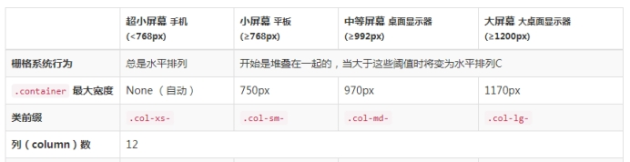
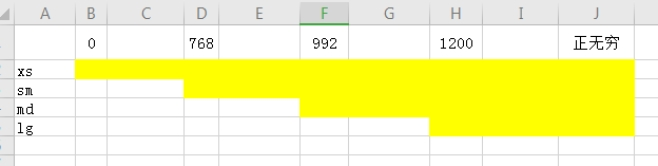
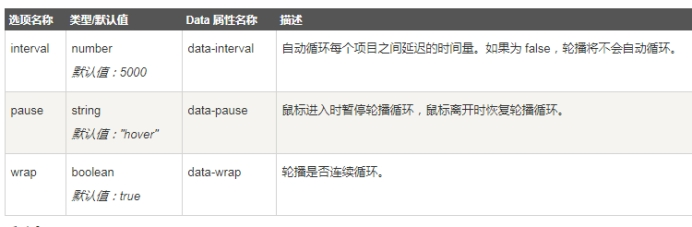
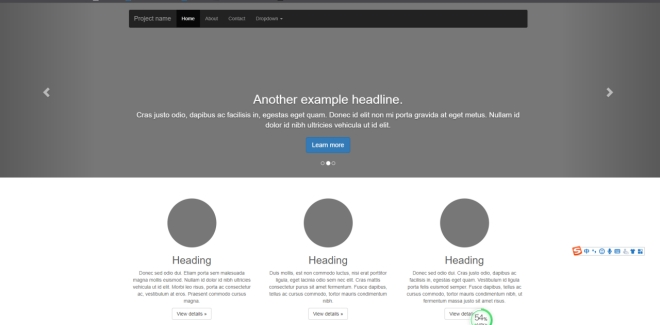

[Bootstrap]: https://www.bootcss.com/


```html
class="col-md-2" 屏幕12等分 多了会换行
超小屏幕 	sm 小屏幕 			 md中等屏幕  		lg大屏幕
<768px		≥768px				≥992px				≥1200px   

       col-md-offst-4 右偏移 4份
       col-lg-push-1 往右移动一份
       col-lg-pull-1 往左移动一份	

```

```javascript
https://www.jq22.com/
http://www.superslide2.com/
https://www.swiper.com.cn/
https://www.swiper.com.cn/download/index.html
```

# **1，bootstrap简介** **UI**

Bootstrap，来自 Twitter，是目前最受欢迎的前端框架。Bootstrap 是基于 HTML、CSS、JAVASCRIPT 的，它遵循移动设备优先的原则，简洁灵活，使得 Web 开发更加快捷。

# **2，如何学习bootstrap**

学习bootstrap

1，菜鸟学院

https://www.runoob.com/bootstrap/bootstrap-tutorial.html

 

2，bootrap中文网

https://v3.bootcss.com/

# **3，下载bootstrap**

和其他框架一样，使用bootstrap需要先把它下载下来，

下载地址：

https://v3.bootcss.com/getting-started/#download

服务器在国外比较慢，可能下载失败

# **4，使用bootstrap**

由于bootstrap是基于jq的，所以在引入bootstrap.min.js之前，需要先引入jq

 

这样，只需要引入3个文件即可：

css/bootstrap.min.css

jquery.js

js/bootstrap.min.js

# **5，一个基于bootstrap的模板**

<!DOCTYPE html>

<html>

​	<head>

		<meta charset="utf-8">

​		<title></title>

​		<link rel="stylesheet" type="text/css" 

href="js/bootstrap-3.3.7/css/bootstrap.min.css"/>

​	</head>

​	<body></body>

	<script src="./js/jquery.min.js"></script>

	<script src="./js/bootstrap-3.3.7/js/bootstrap.min.js"></script>

</html>

# **6，按钮**

<a class="btn btn-default" href="#" role="button">Link</a>

<button class="btn btn-default" type="submit">Button</button>

<input class="btn btn-default" type="button" value="Input">

<input class="btn btn-default" type="submit" value="Submit">

 

1，按钮尺寸

<p>

 <button type="button" class="btn btn-primary btn-lg">（大按钮）Large button</button>

 <button type="button" class="btn btn-default btn-lg">（大按钮）Large button</button></p><p>

 <button type="button" class="btn btn-primary">（默认尺寸）Default button</button>

 <button type="button" class="btn btn-default">（默认尺寸）Default button</button></p><p>

 <button type="button" class="btn btn-primary btn-sm">（小按钮）Small button</button>

 <button type="button" class="btn btn-default btn-sm">（小按钮）Small button</button></p><p>

 <button type="button" class="btn btn-primary btn-xs">（超小尺寸）Extra small button</button>

 <button type="button" class="btn btn-default btn-xs">（超小尺寸）Extra small button</button></p>

 

2，禁用按钮

<button type="button" class="btn btn-lg btn-primary" disabled="disabled">Primary button</button><button type="button" class="btn btn-default btn-lg" disabled="disabled">Button</button>

 

3，按钮颜色

<!-- Standard button --><button type="button" class="btn btn-default">（默认样式）Default</button>

<!-- Provides extra visual weight and identifies the primary action in a set of buttons --><button type="button" class="btn btn-primary">（首选项）Primary</button>

<!-- Indicates a successful or positive action --><button type="button" class="btn btn-success">（成功）Success</button>

<!-- Contextual button for informational alert messages --><button type="button" class="btn btn-info">（一般信息）Info</button>

<!-- Indicates caution should be taken with this action --><button type="button" class="btn btn-warning">（警告）Warning</button>

<!-- Indicates a dangerous or potentially negative action --><button type="button" class="btn btn-danger">（危险）Danger</button>

<!-- Deemphasize a button by making it look like a link while maintaining button behavior --><button type="button" class="btn btn-link">（链接）Link</button>

 

# **7，下拉菜单**

<div class="dropdown">

 <button class="btn btn-default dropdown-toggle" type="button" id="dropdownMenu1" data-toggle="dropdown" aria-haspopup="true" aria-expanded="true">

  Dropdown

  <span class="caret"></span>

 </button>

 <ul class="dropdown-menu" aria-labelledby="dropdownMenu1">

  <li><a href="#">Action</a></li>

  <li><a href="#">Another action</a></li>

  <li><a href="#">Something else here</a></li>

  <li role="separator" class="divider"></li>

  <li><a href="#">Separated link</a></li>

 </ul>

</div>

1，该变为上拉菜单

通过为下拉菜单的父元素设置 .dropup 类，可以让菜单向上弹出（默认是向下弹出的）。

2，分割线

<li role="separator" class="divider"></li>

3，禁用菜单

<li class="disabled"><a href="#">Disabled link</a></li>

# **8，字体图标**

字体图标很像图片，但是他是矢量的，放大不失真，颜色可以像文字一样自由设置

<span class="glyphicon glyphicon-search" aria-hidden="true"></span>

使用的时候，在官网根据需要寻找需要的图标即可。

# **9，图片**

1，响应式图片img-responsive

其实质是为图片设置了 max-width: 100%;、 height: auto; 和 display: block; 属性，从而让图片在其父元素中更好的缩放。

 

2，图片形状


# **10，面板**

面板就是一个盒子，当需要将某些 DOM 内容放到一个盒子里时。可以使用面板组件。

1，无标题面板

<div class="panel panel-default">

  <div class="panel-body">

  Basic panel example

 </div></div>

2，有标题面板

<div class="panel panel-default">

  <div class="panel-heading">Panel heading without title</div>

  <div class="panel-body">

  Panel content

 </div>

</div>

3，带脚注的面版

<div class="panel panel-default">

  <div class="panel-body">

  Panel content

 </div>

  <div class="panel-footer">Panel footer</div>

</div>

# **11，导航**

 

1，标签页导航

<ul class="nav nav-tabs">

 <li role="presentation" class="active"><a href="#">Home</a></li>

 <li role="presentation"><a href="#">Profile</a></li>

 <li role="presentation"><a href="#">Messages</a></li>

</ul>

2，胶囊式标签页

<ul class="nav nav-pills">

 <li role="presentation" class="active"><a href="#">Home</a></li>

 <li role="presentation"><a href="#">Profile</a></li>

 <li role="presentation"><a href="#">Messages</a></li>

</ul>

3，添加下拉菜单

<ul class="nav nav-tabs">

 ...

 <li role="presentation" class="dropdown">

    <a class="dropdown-toggle" data-toggle="dropdown" href="#" role="button" aria-haspopup="true" aria-expanded="false">

   Dropdown <span class="caret"></span>

  </a>

  <ul class="dropdown-menu">

   ...

  </ul>

 </li>

 ...

</ul>

# **12，栅格系统**

栅格系统用于通过一系列的行（row）与列（column）的组合来创建页面布局，内容可以放入这些创建好的布局中。它的内部原理使用了css3的媒体查询技术。

 

栅格系统注意事项：

“行（row）”必须包含在 .container （固定宽度）或 .container-fluid （100% 宽度）中，以便为其赋予合适的排列（aligment）和内补（padding）。

 

# **13，栅格使用举例**

<div class="row">

  <div class="col-md-1">.col-md-1</div>

  <div class="col-md-1">.col-md-1</div>

  <div class="col-md-1">.col-md-1</div>

  <div class="col-md-1">.col-md-1</div>

  <div class="col-md-1">.col-md-1</div>

  <div class="col-md-1">.col-md-1</div>

  <div class="col-md-1">.col-md-1</div>

  <div class="col-md-1">.col-md-1</div>

  <div class="col-md-1">.col-md-1</div>

  <div class="col-md-1">.col-md-1</div>

  <div class="col-md-1">.col-md-1</div>

  <div class="col-md-1">.col-md-1</div></div><div class="row">

  <div class="col-md-8">.col-md-8</div>

  <div class="col-md-4">.col-md-4</div></div><div class="row">

  <div class="col-md-4">.col-md-4</div>

  <div class="col-md-4">.col-md-4</div>

  <div class="col-md-4">.col-md-4</div></div><div class="row">

  <div class="col-md-6">.col-md-6</div>

  <div class="col-md-6">.col-md-6</div></div>

# **14，栅格参数**

通过下表可以详细查看 Bootstrap 的栅格系统是如何在多种屏幕设备上工作的

 

 

栅格作用范围

 

# 15，**Bootstrap 轮播（Carousel）插件**

Swiper 和 superslide

Bootstrap 轮播（Carousel）插件是一种灵活的响应式的向站点添加滑块的方式。除此之外，内容也是足够灵活的，可以是图像、内嵌框架、视频或者其他您想要放置的任何类型的内容。

Bootstrap 已经内置了此插件，所以可以直接使用

<div id="myCarousel" class="carousel slide">

​	<!-- 轮播（Carousel）指标 -->

​	<ol class="carousel-indicators">

​		<li data-target="#myCarousel" data-slide-to="0" class="active"></li>

​		<li data-target="#myCarousel" data-slide-to="1"></li>

​		<li data-target="#myCarousel" data-slide-to="2"></li>

​	</ol>  

​	<!-- 轮播（Carousel）项目 -->

	<div class="carousel-inner">

		<div class="item active">

			<div style="height: 100px;">44</div>

​		</div>

		<div class="item">

​			22

​		</div>

		<div class="item">

​			333

​		</div>

​	</div>

​	<!-- 轮播（Carousel）导航 -->

​	<a class="left carousel-control" href="#myCarousel" role="button" data-slide="prev">

​			<span class="glyphicon glyphicon-chevron-left" aria-hidden="true"></span>

​			<span class="sr-only">Previous</span>

​		</a>

​		<a class="right carousel-control" href="#myCarousel" role="button" data-slide="next">

​			<span class="glyphicon glyphicon-chevron-right" aria-hidden="true"></span>

​			<span class="sr-only">Next</span>

​		</a>

</div>

# **16，轮播配置**

$('#myCarousel').carousel({

​	interval:false

})

 

有一些选项是通过 data 属性或 JavaScript 来传递的。下表列出了这些选项：

 

 

# **17，表格**

为任意 <table> 标签添加 .table 类即可成为bootstrap的表格

1，基础表格

<table class="table">

 ...

</table>

 

2，条纹状表格

<table class="table table-striped">

 ...

</table>

 

3，带边框的表格

<table class="table table-bordered">

 ...

</table>

 

4，鼠标悬停

<table class="table table-hover">

 ...

</table>

 

# **18，官网练习**

下面是一个常见的响应式官网

https://v3.bootcss.com/examples/carousel/#

 