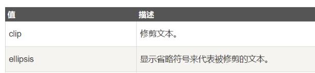

# HTML

HTML（Hyper Text Markup Language）

​	超文本标记语言  （标签）

​	html：结构

​	css： 美化

​	JS：行为

---

标签分为双标签和单表签

1.双标签

<head>  </head> 
2.<br/>单表签

<>内输入错误的标签内容，浏览器不会显示

<hr>分割线
----

!DOCTYPE文件类型，告诉浏览器使用何种版本html显示网页

meta charset 字符集UTF-8

```html
<!DOCTYPE html>
<html>
	<head>
		<meta charset = "UTF-8"/>
		<title>
		网页标题
		</title>
	</head>
	<body>
        内容
	</body>
</html>
```

## 行内元素和块级元素

如h1 h2 会自动换行为，块级元素。如em 一行显示的为行内元素。

## 表单标签


<input type = 'text'/>

```
<form action = "2.html">
			<h3>登录查看</h3>
			账  号：<input type = 'text' value = "请输入账号"/><br/>
			密  码：<input type = 'password'/><br/>
			<input type = "submit" value = "登   录"/>
			</form>	
```

form 标签加action 赋值之后才可以进行跳转。

单选按钮：

````html
<input type = "radio" />
单选按钮选择其中一个 ：把name 属性设置相同
<input type = "radio" name = "sex"/>
````

复选按钮：

```html
<input type = "checkbox" />
默认选中 添加 checked = checked
<input type = "checkbox"  checked = checked/>
```

下拉框：

```html
<select>
    <option select = "selected"></option>
    <option></option>
</select> 
```

文本域：

```html
<textarea rows = "20" cols = "12">文字</textarea>
```

file，选择文件

hidden，隐藏的表单（ js部分会用到 ）vnc

**滑块**

```html
 type="range" 
```


重置：

```html
<input type = "reset" value = "重置" />
```

placehoder

```html
<input type = "text" placehoder = "请输入" />
```

只读

```html
<input type = "text" readonly />
```

禁用

```html
<input type = "text" disabled />
```

无序列表

```html
<ul>
    <li></li>
</ul>
```

有序列表

```html
<ol>
    <li></li>
</ol>
```

定义列表

```html
<dl>
    <dt></dt>
    <dd></dd>
    <dd></dd>
</dl>
```

---


## 表格

内容会把表格撑开

caption 说明文字；标题

bgcolor：(html里面不是缩写)

border-collapse: collapse; 边框合并

```html
<!--cellspacing 控制单元格之间的距离-->
<!--cellpadding 控制单元格与内容之间的距离-->
<!--align:left 左对齐 center 中间对齐 right右对齐-->
<!--<caption> 说明文字；标题-->
bgc-color 颜色 
<!-- thead 表头
	 tbody 表身
	 tfooter 表底部
-->
<table bordre = 1px width="30px" cellspacing = "">
	<!--tr代表行-->
	<tr algin="center">姓名</tr>
	<!--td代表列-->
    <!--<th> 自动加粗居中-->
	<td>年龄</td>
    <td>住址</td>
    <td>邮箱</td>
    
    <!--统计信息-->
    <!--表格合并 colspan = "5" 合并列 5列  写在目标单元格上
	rowspan = "2" 合并行 写在目标单元格上	，删除多余的单元	    	
-->
</table>
```

表格边框不是1px的问题

border改成0，cellpadding（单元格之间的间距）改成1，table颜色改成黑色，<tr>的颜色改成白色，这样显示出来的就是单元格之间的空隙（黑色）

空格     '"&nbsp；"

<a href  = ”#">

锚标记

```html
<a name = "name"></a>
<a href = "#name">点击回顶部</a>
```


问题：使用改变背景颜色的方法设置边框之后，怎么设置背景图片

## **thead、tfoot**、tbody

这三个标签其实是对table内容的分组，他们的顺序应该从上往下，即使我们写乱了，页面呈现的时候，依然会是自上而下。他们的出现，主要是为用于css控制样式


## HTML5新特性

### audio

```html
<audio src="./media/真瑞 - 最美的瞬间.mp3" preload="auto" autoplay loop controls></audio>
audio  
controls(控制开关)
autoplay 自动播放
loop 循环
preload 预加载

```

### video

```html
<video style="width:100%;height:100%" src="./media/mov_bbb.mp4" autoplay preload="auto" loop controls></video>
video
controls(控制开关)
autoplay 自动播放
```

### canvas(画布)

```html
          
```

### 矢量图

```html
<svg t="1677135179015" class="icon" viewBox="0 0 1024 1024" version="1.1" xmlns="http://www.w3.org/2000/svg"
        p-id="2114" width="200" height="200">
```

### 新标签

```html
<header>头部</header>
<main>主要内容</main>
<footer>底部</footer>
<nav>导航栏</nav>
<article>文章</article>
<aside>侧边栏</aside> -->
```

## 本地存储

```html
 <!-- html5-本地存储--js -->
 <!-- html5-本地缓存 -->


```

**表单验证**

```html
required  必填
maxLength  字符长度
input扩充type值 email，url，数据有效性匹配
<form action="http://www.baidu.com">
	<input type="text" required>
	<input type="submit" value="提交"/>
</form>
```

```html
<a href="tel:13800000000">拨打电话</a>
<a href="mailto:945@qq.com">联系我</a>
```

时间，日期，滑块


# CSS

CSS	权重

行内样式表>内部样式表>外部样式表


内部样式stytle 写在head标签里面

行内样式表写在标签的style属性里面

外部样式表用<link rel = "styleseet" href = "路径">

### 字体

font-family:  sans-serif,微软雅黑；        sans-serif(无衬线)

### 字号

font-size：20px； 字体大小

font: 2em;   1em 相当于16px

### 粗体

font-wight：bold； (加粗)

font-wight：900；

### 斜体

font-style：italic；斜体

font-style: oblique; 斜体

### 字母大小写

text-transform：uppercase；英文大写

text-transform：lowercases；英文小写

text-transform：capitalize；首字母大写

### 装饰线

text-decoreation: under; 下划线

text-decoreation: line-through; 删除线

text-decoreation: overline; 上划线

text-decoration: none; 取消下划线

可以组合书写

text-decoration: underline overline line-through;

### 字母间距

letter-spacing: 12px; 字母之间的间距  可为负数   对中文生效

### 单词间距

word-spacing: 12px; 单词间距。 可为负数     对中文无效

### 行间距

line-height: 20px;    行高  数字金额设置为20px , 50%, 20.2,

line-height: 1.5;

line-height: 150%;

### 文本对齐

text-align:center;   居中

text-align:left;   左对齐

text-align: right;   右对齐 

### 文本缩进

text-indent: 32px;    缩进

text-indent:  2em;    缩进2字符

### 首行，首字母

```html
p::first-letter {
	选中第一个字母
}
```

```html
p::first-line {
	选中
}		
```

### **a锚点跳转**

锚点跳转，指的是在当前文档内跳转。

跳转步骤如下：

1，给要跳转的dom取个id名：ok

```html
<p id = ok> </p>
<a href=”#ok”>111</a>
点击 下面链接111 跳转到p
```

### **转义字符**

转义字符串，也称字符实体。在HTML中，定义转义字符串的原因有以下几个：

 

1，像“<”和“>”这类符号已经用来表示HTML标签，因此就不能直接当作文本中的符号来使用。

2，有些字符在ASCII字符集中没有定义，因此需要使用转义字符串来表示。

3，多个空格，浏览器只认识一个


### **sub,sup**

主要用到数学公式上

1，sub，下标

2，sup，上标志

例如：

2 <sup>3</sup> = 8;

log <sup>2</sup> 4 = 2;

ps：行内元素

 

### 文本样式

```html
letter-spacing: 10px;/*字间距：数字 文字 英文*/
text-transform: capitalize;首字母大写
 text-transform:uppercase;全部大写
text-transform:lowercase; 全部小写
text-align:justify 两端对齐
```

## 背景图片

```html
background-image: url(./img/142_07.png);
background-repeat: no-repeat;
background-position: center center;
 background-size: 100% 100%;
 background: url("./img/142_07.png")  center center no-repeat

 筛背景
 .box{
            width: 21px;
            height: 18px;
            background: url("./img/icon.png") -1px -75px;
        }
背景图片填满
background-size: cover;
```


### 列表样式

```html
列表样式
list-style-type: circle;空心圆
list-style-type: decimal； 实心圆
list-style-type: square;  实心方形
list-style-type: decimal; 十进制  
list-style-type: decimal-leading-zero;  十进制前置零
list-style-type: upper-alpha;
list-style-type: lower-alpga;
list-style-type: upper-roman;
list-style-type: lower-roman;

项目符号位置
	list-style-position: outside; 在list外部
	list-style-position: inside; 在list内部
	list-style--position: inherit  从父元素继承 list-style-position 的属性
图片项目符号
	list-style-images: url(图片地址); 图片替换list前图标

list-style-type和 list-style-image是互斥的，且图片优先级高。
```

### 定义列表

```html
	<dl>
        <dt>标题</dt>
        <dd>内容</dd>
        <dd>内容</dd>
        <dd>内容</dd>
    </dl>
```

### background-attachment

设置背景图像，是否固定，或者随着页面滚动


### iframe

内嵌页面  iframe 里面不写内容

```html
<iframe width="100" border="1" scrolling="auto" height="100" style="background:red" src="./2iframe02.html" frameborder="1"></iframe>
```


### a链接跳转


### 单位

基本单位 px

em ：相对单位，相对于父类

rem ：相对单位，相对于根元素（html）

% ：相对单位，相对于父类

vh ：硬件设备高度     height： 100vh；

vw ：硬件设备宽度      width： 100vw；


标签*数量能快速生成

选择器选中元素后更改属性，但有可能被下面的同权重重叠掉

div 	块元素，span 行内元素， 应用广泛因为他们没有默认的样式

---

再html中所有标签都有一个id属性和class属性

### 透明

```html
opacity：0 透明
```


## 选择器

### 通配符选择器

```html
 *{           <!--所有选择器-->
    color: red;
   }
```


### 标签选择器

```html
p {
	color: red;
}
<p></p>
```

### 相邻兄弟选择器：+

选择紧跟在另一元素后的元素，中间不能有别的元素间隔。   不选择本身

例如：

```html
h2 + p{color:red;}

选择h2后面紧跟着的p
```


### 通用兄弟选择器：~

选择h2后面的所有p元素，且p和h2是兄弟关系，中间可以有元素间隔。  不选择本身

```html
h2 ~ p{
color:red;
	}
```

### id选择器：

同一个页面中id的值不能重复（唯一性）

不能以数字开头

```html
#manager {
	color: red;
}

<h3 id = manager></h3>
```


### 类选择器

class属性可以重复

```html
.view {
	color: red;
}

	<p class = "view"></p>
```

一个标签既有 id 又有 class 。id生效

### 伪类选择器

用来添加一些选择器的特殊效果，常用的伪类有：

1，hover，鼠标滑过

2，active，鼠标按下

3，before，在元素开头添加新的元素

4，after，在元素结尾添加新的元素

```html
#x1:before{
	content: "55";
}
#x1:after{
	content: "55";
}
nth-child 子元素索引选择器

first-child，第一个子元素选择器

last-child，最后一个子元素选择器
```

### a链接的样式

```html
链接的样式

a:link - 普通的、未被访问的链接
a:visited - 用户已访问的链接

a:hover - 鼠标指针位于链接的上方
a:active - 链接被点击的时刻
```


ps：a:visited伪类下划线失效的问题

a:visited可能会暴露用户浏览信息记录，攻击者可能会据此判断用户曾经访问过的网站，造成不必要的损失，因此这些浏览器决定限制a:visited的功能，所以不是代码的问题，而是浏览器方面的限制。


### **属性选择器**

```html
[title]，选择具有title属性的所有元素

[title=hello]，[title=”hello”]，选择具有title属性，且值为hello的所有元素

[title^=hello]，[title^=”hello”]，选择具有title属性，且值开头为hello的所有元素

 

[title$=hello]，[title$=”hello”]，选择具有title属性，且值结尾为hello的所有元素

[title*=hello]，[title*=”hello”]，选择具有title属性，且值包含hello的所有元素
```


### 选择器权重

id选择器 权重    >  类选择器权重  >  标签选择器权重

----

## 盒子模型

padding ：盒子内边距  盒子中内容距离边框的宽度

border：盒子边框

margin：盒子外边距  元素之间的距离

宽高

p标签自带16px边距  两个p标签  边距的碰撞 间距为16px 

#### 清样式

```html
* {
	padding: 0;
	margin: 0;
 	border：0;
	outline: 0;
}
```


```html
border-bottem
border-top
border-left
border-right

border-style，风格
border-style :dashed;  (dashed虚线)   边框样式
dotted(点状线)
border-corlor: red; 边框颜色
border-width:1px; 边框宽度

border-bottom-style:dotted 下边框样式
border-bottom-width:5px 下边框粗细
border-left-style: none; 边框消失

通过颜色值为transparent，可以把边框颜色可以设置为透明
border-bottom-color: transparent;


内边距
padding-top: 10px; 
padding-left; 
padding-rigth 
padding-bottom: 

外边距
margin-top:10px;
margin-left:10px;

背景图片
background-image:url();
禁止平铺 
background-repeat:no-repeat;

background-position:right;
background-position:right 40px 20px;
baxkground-color: red;

box-sizing: border-box;   怪异盒子模型
```

### **margin垂直重叠现象**

```
两个垂直相邻的块级元素，当上下两个边距相遇时，外边距会产生重叠现象，且重叠后的外边距，等于其中较大者。（注意：水平方向不受影响）
```


### margin传递现象**

```
当父子元素嵌套，满足以下任一种情况，将会出现子元素margin传递给父元素：

情况1：
父容器的第一个孩子有margin-top，此margin将传递给父容器。
情况2：
父容器的最后一个孩子有margin-bottom，此margin将传递给父容器。

解决方案：
1，父容器加上padding-top或者padding-bottom
2，父容器加上边框

（以后再说）
3，overflow：hidden
4，此子元素为行内块，没有此bug
```


### outline，轮廓

```
语法：outline:颜色 风格 宽度;
使用举例：
outline:red dotted thick;
outline:none；

1，outline在边框之外
2，Outline不占文档流
```


```html
cursor:poingter; 光标变小手
border-collapse： collapse； 边框合并
outline: none;消除边框样式
border-radius: 2px; 边框圆角
background: linear-gradient(to bottom, red 0%, blue 30%);渐变色
```

---

## 定位

fixed，固定定位

static（默认值），静态定位，

relative，相对定位

absolute，绝对定位

### **fixed ，固定定位**

定义：fixed固定定位，元素的位置***\*相对于浏览器窗口是固定位置\****，即使窗口是滚动的它也不会移动，多用于网页右下角，固定的导航。

元素定位设置为fixed之后，会有如下特性：

1，脱离文档流，因此不占据空间，别的元素感觉不到他的存在会和其他元素重叠。

2，变成行内块级元素，宽高将自适应

3，坐标系生效，设置left	right	 top bottom起作用

4，若不设置left，top，他将停留在本应该出现的位置，别的元素也感觉不到他的存在，会和别的元素叠在一起（建议设置）

​	Ps:若不设置宽高，设置了上下左右坐标，元素会被强制拉伸

### **脱离文档流**

1，不在占用正常的文档位置

2，正常布局的元素，将感觉不到他的存在，有可能会发生元素重叠


### **tatic，静态定位**

static是静态定位，他是定位的默认值，位置遵循正常的文档流，自上而下，自左而右依次排列。 

坐标系不生效，设置left right  top	bottom不起作用。


### **relative，相对定位**

定义：relative，相对元素本身的位置偏移。

元素定位设置为relative之后，会有如下特性：

1，坐标系生效，设置left	right	 top bottom起作用

2，相对位置自己的原本位置

3，不脱离文档流。旧位置继续保留，新位置不占文档流（脱离文档流）。


### **absolute，绝对定位**

定义：absolute，其位置，相对于最近的父元素，定位为非static（relative，absolute，fixed）的元素，若找不到，就相对于html。

元素定位设置为absolute之后，会有如下特性：

1，变成行内块级元素

2，脱离文档流。

3，坐标系生效，设置left	right	 top bottom起作用

4，若不设置left，top，他将停留在本应该出现的位置，别的元素也感觉不到他的存在，会和别的元素叠在一起（建议设置）

==ps：子元素absolute之后，子元素的坐标将从父元素边框内部开始计算，与父元素的padding无关。==

## **z-index，层深**

z-index ，指定一个元素的层堆叠顺序，用数字表示，z-index特性如下：

1，z-index越大，层就越高，z-index可为负
2，static定位的元素，zindex为0，不可设置，
3，非static定位的元素，可设置z-index


4，若z-index相等
1）非static比staic定位高
2）若都是非static，根据文档流决定层级，越往下越高


## 浮动

**浮动对元素的影响**

浮动元素将变为行内块级元素，内容自动撑开

遵循文档流，从元素本应该开始的位置，自上而下，依次浮动，一行放不下，将依次换行

若元素左浮动，上面有非块级元素，则此浮动元素会穿透上面元素的最后一行，进入最左侧

浮动元素下面的元素，会环绕浮动元素

父子元素嵌套，若子元素浮动，父元素将感觉不到他的存在（塌陷）

 

解决办法：清除浮动

```
浮动会自动转换为行内块
浮动元素 不会对前面的块元素造成影响
浮动元素 如果前面是行内块元素，有位置就会浮动上去然后占在第一个 没有位置就不会浮动上去
浮动元素前面是行元素  行内有位置就会浮动过去占领第一个 没有位置就不会浮动过去
```


```html
float: left; 左浮动
float： right 右浮动

清除浮动
.clearfix {
	clear: both;
}
给元素调用这个标签
```

浮动作业遇到的问题：


鼠标经过需要给 li 设置高度 足够显示图片， 否则图片压再文字上面

边框塌陷：


 也就是说这里，水平方向的[margin](https://so.csdn.net/so/search?q=margin&spm=1001.2101.3001.7020)生效了，但是垂直方向的margin没有生效，这种现象好像父级的上边框没了，上边框塌陷了，所以称之为 **边框塌陷** 

- 父元素添加 border: 1px solid transparent
- 触发盒子BFC
- 给子元素添加下列任一属性
  1.position: absolute
  2.display:inline-block
  3.float:left
  4.overflow:hidden

```html
height: auto;
overflow: auto;
配合使用 高度自增

设置高可解决盒子塌陷的问题
```

```html
word-wrap: break-word; 文字自动换行
word-break: break-all; 文字自动换行
white-space： nowarp  一行显示
white-space: normol  

```

## 清除浮动


```html
1，父容器添加：overflow:hidden。
2，父容器设置高度
3，浮动元素下方，添加辅助元素（块级）：
clear:  both   |   left   |  right。

div{
  clear:both;
}
4，使用after伪类清除
div:after{
  content:””;
  display:block;
  clear:both;
}
5，让父元素也浮动
```

**浮动和内外边距**

***\*1，浮动和父元素padding的关系\****

浮动元素会被父元素的padding挡住

 

***\*2，浮动和兄弟元素margin的关系\****

如果元素左浮动，下面的兄弟元素有左margin

此左margin将忽略此浮动元素，从父元素开始计算


## display属性

display：none，隐藏

display：block，块级

display：inline，行内

inline-block**行内块级**


### 元素可见性

**visibility**

visibility 属性规定元素是否可见，仅仅是视觉上不可见，元素本身还存在，没有脱离文档流。取值枚举：

1，visible，默认值。元素是可见的。

2，hidden，元素是不可见的。

**opacity**

透明度，取值范围：0（完全透明） -   1（不透明）

```html
h1 { 
	opacity: 1;
}

h1 { 
	opacity: 0.5;
}

h1 {
	opacity: 0;
}
```


**去除元素间的间隔**

行内，行内块元素，默认会有间隔，除此间隔常用的有如下方法：

1，父容器font-size:0；子元素再设置合适的font-size即可

2，把代码中的换行删除（不推荐）

```html
<div>
<span>鲁迅</span>
<span>鲁迅</span>
</div>
改为：
<div>
<span>鲁迅</span><span>鲁迅</span>
</div>
```


## 浏览器内核

**-moz-          Firefox**

**-ms-                   ie**

**-webkit-         safari  chrome**

**-o-					opera** 


## 回顾css

### **white-space**

定义：指定元素内的空白怎样处理。

取值枚举：


### **text-overflow**

定义：当文本溢出包含它的元素，应该发生什么。

需要和overflow配合使用

取值枚举：




一行文本省略号

```html
p{
   Width:100px;
	white-space: nowrap;
	overflow: hidden;
	text-overflow: ellipsis;
}
```

***\*n行文本省略\****

```html
display: -webkit-box;

-webkit-line-clamp: 3;  <!--第 3 行->

-webkit-box-orient: vertical;

overflow: hidden;

text-overflow: ellipsis;
```

注意：容器不要有底部padding，否则文本还会显示

### **设置网页icon图标**

定义图标有多种办法，由于受到浏览器兼容性问题，推荐采用ico格式的图片

这里以百度的图标引入为例：

 ```html
<link rel="shortcut icon" href="/favicon.ico" type="image/x-icon" />
 ```

### 制作icon图标

icon是支持透明的

1，先用ps制作一个宽高是正方形的图片

2，导出此图片为png或者jpg

3，百度搜索在线icon制作工具，根据需要导出icon图标即可

http://www.bitbug.net/

 


### **改变鼠标形状**

cursor属性，定义鼠标指针，在一个元素边界范围内时，所用的光标形状，常用取值：

pointer，手型

crosshair，十字

move，移动

wait，等待

help，帮助

### 自定义鼠标形状

推荐采用ico格式的图片文件


语法：

cursor: url(图标路径),默认光标;


举例：

cursor:url（./a.ico),pointer；

注，默认光标可随意设置，但是必须设置，否则会不显示。


### 最大/小，宽/高

max-width指的是最大宽度，和min-width配合，可以实现响应式效果，通过以下属性，可以设置元素的最大/小，宽/高：

min-width：200px;

max-width：200px;

min-height：200px;

max-height：200px;

例如：

网页里面有一篇文章，最大宽度是600px，最小宽度是300px。

max-width 和 width优先级

max-width  < width


### **CSS3 的文本阴影**

为文本添加阴影效果，

 

语法：

text-shadow: 水平距离 垂直距离 模糊的尺寸 阴影的颜色

text-shadow: 5px 5px 5px #f00;

# CSS动画

## **CSS3 过渡动画**

CSS3 过渡，指的是元素从一种样式，逐渐改变为另一种的效果。

语法：transition:属性名1 动画时间1,属性名2 动画时间2;

```html
.box{
	width: 200px;
	transition: width 1s;
}
	box:hover{
	width: 400px;
}
```


ps：如果动画不生效，就显示的声明具有动画效果的css属性

## Transform转换

transform: translate( x , y ) ; //参数可省略

## rotate，元素旋转

定义 2D 旋转，在参数中规定角度，注意角度的单位是deg。

transform: rotate(45deg)

## scale元素缩放

通过scale，可以对元素大小进行缩放，有2种写法：

1，transform: scale(0.5)；//宽高都变为原来的0.5倍

2，transform: scale(1, 2)；//宽高分别变为原来的1 、 2倍

## **同时生效多组样式**

transform : scale(0.5) rotate(45deg) translate(87px,72px);


# **实现垂直居中 文字和盒子**

垂直居中根据情况不同，有不同的写法。

1，如果只有一行文本，文本的line-height设置为和容器高度相等。

2，如果里面有inline-block元素，设置行内块verticle-align：middle即可。

3，给父容器设置，display:table-cell，verticle-align:middle。

4，定位实现，设置定位为非static，top：50%；margin-top设置为自身高度的负一半。（父容器高度固定）

5，通过上下padding相等实现

6，flex布局（以后再说）


## **CSS3 逐帧动画**

1，先定义动画

```html
@keyframes 动画名 {
		0%  {
	background: red;
	}
		50%  {
	background: blue;
	}
		100% {
	background: green;
	}
}
```

2，在目标元素上使用动画

```html
animation: 动画名  动画持续时间  动画执行次数;
```

ps：关键词 "from" 和 "to"，等同于 0% 和 100%。


## **禁止移动端网页缩放**

禁止网页缩放代码：

```html
<meta name="viewport" content="width=device-width, initial-scale=1, maximum-scale=1, user-scalable=no">
参数解释：
width = device-width：宽度等于当前设备的宽度
initial-scale：初始的缩放比例（默认设置为1.0）  
minimum-scale：允许用户缩放到的最小比例（默认设置为1.0）    
maximum-scale：允许用户缩放到的最大比例（默认设置为1.0）   
user-scalable：用户是否可以手动缩放（默认设置为no，因为我们不希望用户放大缩小页面）
```

ps：此代码只对移动端有效

# **重绘与回流**

**1，什么是重绘和回流**

网页的渲染包括dom树的渲染和css样式的渲染，当页面渲染完毕，页面布局、颜色发生改变，就会触发网页的重绘和回流。

**2，重绘(repaint)**

当渲染树的一部分发生改变, 若只引起页面的非布局外观 (如背景等) 发生改变时, 那这就是一次页面重绘

【引起重绘的情况】

改变 visiblility, z-index, 轮廓, 颜色, 背景, 阴影等

**3，回流 **(reflow)**

若引起页面的布局发生改变, 那这就是一次页面回流,。

同时页面外观也发生改变, 意味着必然伴随重绘。

【引起回流的情况】

添加/删除元素
display: none;
定位, 浮动, 边距等改变位置
改变盒模型
改变文字大小, 粗细, 位置, 间隔, 行高, 超出容器处理方式等
改变浏览器大小
激活伪类 (:hover)
内容变化 (input等输入文字)

 

**4，回避重绘与回流**

回流的代价远比重绘昂贵, 很大程度影响着页面性能, 减缓js，而这里要做的就是规避回流, 降低回流造成的影响, 降低回流需要的成本。

1， 避免频繁操作、影响dom

2，加入DOM前, 先赋予属性内容等

```html
<p> </p>
p.innnertext = 999;
```

3，页面局部刷新代替整体刷新


## **瀑布流布局**

瀑布流布局。是一种网站页面布局，视觉表现为参差不齐的多栏布局，随着页面滚动条向下滚动，这种布局还会不断加载数据块并附加至当前尾部。

```html
.父元素{
     column-count: 2;
    }
```

# css calc() 函数

使用 calc() 函数动态计算元素的尺寸，它有如下特点：

1，运算符前后都需要保留一个空格，例如：width: calc(100% - 10px)；

2，任何长度值都可以使用calc()函数进行计算；

3，calc()函数支持 "+", "-", "*", "/" 运算；

4，calc()函数使用标准的数学运算优先级规则；

兼容性：ie9+


# @media媒体查询

媒体查询，表示符号为：@media，他的作用是：针对不同的屏幕尺寸，显示不同的样式，当浏览器尺寸发生变化时，页面会根据@media规则重新渲染。

```html
语法1：max-width
@media screen and (max-width: 960px){
}
当页面宽度 <= 960px的时候，执行它下面的CSS。

例如：
@media screen and (max-width:960px){
	html{
		background-color:#f00;
	}
}

语法2：min-width
@media screen and (min-width: 960px){
}
当页面宽度 >= 960px的时候，执行它下面的CSS。

若max-width，min-width发生了冲突，按照css代码优先级处理
 @media screen  and (min-width:1000px) and (max-width:1500px) {
           // 1000-1500做什么事情
   }
   @media screen  and (max-width:1000px) {
          //0-1000px你做什么事情
            
  }

ps：and后必须带空格
```


# 单位

**1.px em rem**

**Px 绝对单位 像素 位 位图**

**px就是一张图片最小的一个点,一张图由千千万万的点组成,比如电脑像素1920\*1080,表示的就是水平方向1920个像素点,垂直方向1080个像素点**

## **rem**

**css3新单位,相对于根元素html的font-size,如果html的font-size等于20px ,那么2rem就等于40px**

**em**

**em时相对父元素的font-size**

**vw/vh**

**vw/vh时相对于浏览器的视口的,把是视口分成100份,水平1份就是1vw,垂直1份就是1vh**

**2，其它css选择器**

**1，nth-child 子元素索引选择器**

css3新增的选择器，:nth-child(n) 选择器匹配父元素中的第 n 个子元素，下标从1开始。

 

例如：

1，div  :nth-child(2)，在父元素div中，寻找第2个子元素，中间有空格

2，div   p:nth-child(2)，在父元素div中，寻找第2个子元素，并且必须是p，否则找不到，中间有空格

3，div:nth-child(2)，不推荐

 

ps：选择父元素的子元素

**2，first-child，第****一个子元素选择器**

匹配其父元素中的第一个子元素

.x1 :first-child{

 

}

**3，last-child，最后一个子元素选择器**

匹配其父元素中的第一个子元素

.x1:last-child{

 

}

**2，****@media媒体查询**

媒体查询，表示符号为：@media，他的作用是：针对不同的屏幕尺寸，显示不同的样式，当浏览器尺寸发生变化时，页面会根据@media规则重新渲染。

 

兼容性：ie9+（包括ie9）

**3****，使用媒体查询**

***\*语法1：max-width\****

@media screen and (max-width: 960px){ 0----------960

}

当页面宽度 <= 960px的时候，执行它下面的CSS。

 

例如：

@media screen and (max-width:960px){

​	html{

​		background-color:#f00;

​	}

}

 

***\*语法2：min-width\****

@media screen and (min-width: 960px){

}

当页面宽度 >= 960px的时候，执行它下面的CSS。

 

若max-width，min-width发生了冲突，按照css代码优先级处理

 

ps：and后必须带空格

**4，****媒体查询 - 兼容性**

因为IE8既不支持HTML5也不支持CSS3 Media，所以我们需要加载两个JS文件，来保证我们的代码实现兼容效果：

 

<!--[if lt IE 9]>

  <script src="https://oss.maxcdn.com/libs/html5shiv/3.7.0/html5shiv.js"></script>

  <script src="https://oss.maxcdn.com/libs/respond.js/1.3.0/respond.min.js"></script>

<![endif]-->

**7，vh，vw视口宽高**

vh，把浏览器窗口高度分成100份，每一份为1vh（view-height）

vw，把浏览器窗口宽度分成100份，每一份为1vw（view-width）

 

vh，高，100vh == height：100%

vw，宽，100wh == width：100%

 

兼容性：IE10+

**8，选中文本背景色 鼠标选中的部分**

::selection{background: #A8141B; color: white; /* Safari */}

::-moz-selection{background: #A8141B; color: white; /* Firefox */ }

 

ps：兼容性，ie9+

 

# flex

## **Flex原理**

1. Flex布局原理是：给父盒子加flex属性，控制子盒子的位置排列方式从而实现flex布局

2. 当我们为父盒子设为flex布局以后，子元素的float、clear和vertical-align属性将失效。

3. Flex布局又叫伸缩布局、弹性布局、伸缩盒布局、弹性盒布局、flex布局

# **父类**常用属性

方向和反转

```css
display: flex;/*父类添加*/
            /* flex-direction: row;x水平是主轴,y轴是侧轴 */
            /* flex-direction: row-reverse;反转 */
           /* flex-direction: column;y主轴 x是侧轴 */
```

主轴对齐方式

```css
display: flex;
            /* justify-content: flex-start;左对齐 */
            /* justify-content: flex-end;右对齐 */
            /* justify-content: center;居中 */
            /* justify-content: space-between;两端对齐 */
            /* justify-content: space-around;平均分布 */
            /* 可以改变方向查看效果  y轴展示查看 */
```

换行

```css
display: flex;
            /* flex-wrap: wrap;可以换行 */  
默认不换行如果过多会压缩
```

***\*单行\****水平垂直居中

```css
	display: flex;
          justify-content: center;/*主轴居中*/
          align-items: center;/*y轴（侧轴）居中*/
```

拉伸，子盒子不要有高度

```css
 display: flex;
   justify-content: center; /* 水平垂直居中 */

          align-items: stretch;/*适合单行*/
可以更换主轴方向查看效果，主轴换成y  侧轴x
```

多行对齐方式

```css
 /* 换行可以设置上下对齐方式 */
            display: flex;
            flex-wrap: wrap;
            align-content: flex-start;
            align-content: flex-end;
            align-content: space-around;
            align-content: space-between;
            align-content: stretch;
```

***\*注意：alin-items侧轴单行，align-content侧轴多行，要换行\****

复合型写法 flex-flow

```css
  display: flex;
           /* flex-flow: row wrap;方向和换行复合型写法 */
```

总结：

```css
		flex-direction: 主轴方向;
         justify-content: 子类对齐方式;
         flex-wrap: 换行;
         align-items: 侧轴单行对齐;
         align-content: 侧轴多行对齐;
         flex-flow: 方向和换行复合写法;
```

**子类常用属性**

```css
flex: 1; 等份，
比如三个div 每个div占比1/3,也可以给某一个盒子单独设置份数，其余占比1份
```

单独设置某一个子类在侧轴的对齐方式 

```css
/* 某一个子类自己在侧轴的对齐方式 */
   align-self: flex-end;
```

Order排序

```css
 align-self: flex-end;
  /* order: -1; 越小越向前，默认是0*/
```

