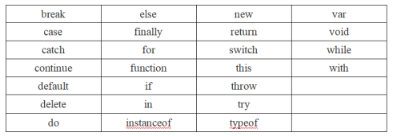
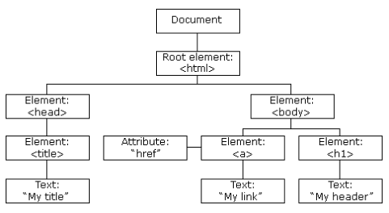
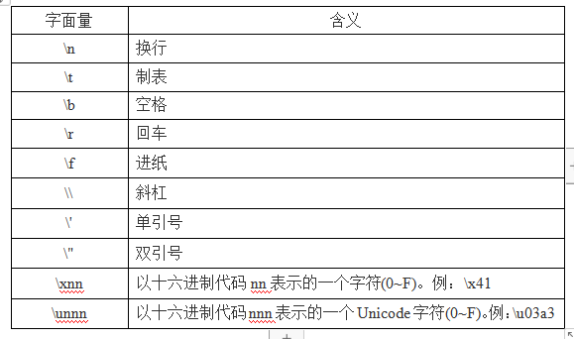
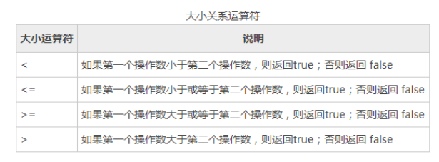
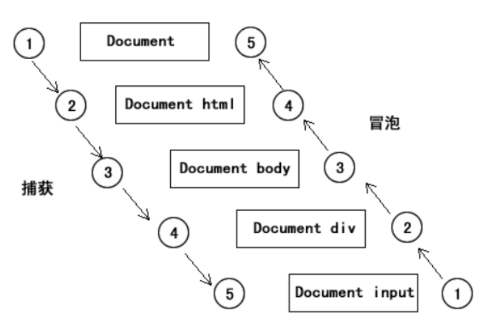
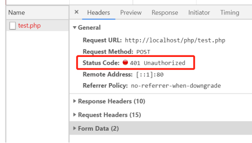
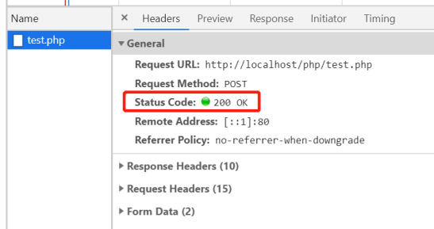
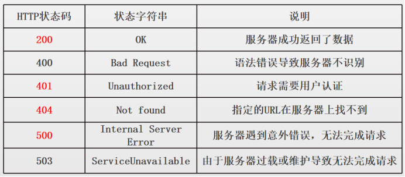

# JavaScript j介绍

js全称javascript，它是一门具有面向对象能力的，在浏览器上执行的，客户端脚本语言。

## **js的作用**

1，操作元素，包括元素的内容、属性和样式

2，控制隐藏显示元素

## 引入js

```javascript
1，JavaScript 代码放在 <script> 与 </script> 标签之间。
<script> 
  alert(“hello world !”);
 </script>

2，script可放在html中的任何位置，建议放在</body>后面，可以快速显示页面

3，放在外部js文件中
<script src=”a.js”></script>

一段js可以被多个html文件引用
一个html文件，可引入多个js
```

## JS的显示方案

1，alert，警告框

2，console.log()

ps：如果输出非数字，需要使用引号括起来

## **js注释**

```javascript
1，单行注释，一次只能注释一行：
//我是注释

2，多行注释，一次注释多行
/*
我是多行注释1
我是多行注释2
*/
```

## script标签的几个属性

1，charset：可选。表示通过src链接文件的编码方式。可忽略。

2，src：可选。表示包含要执行代码的外部文件。

3，type，可选，type="text/javascript"，可忽略

## **变量**

在编程语言中，变量用于存储数据值。

```javascript
1，使用 var 关键词来声明变量。

2，= 号用于为变量赋值，这里和数学的等号不同。
例如：

1，先定义，后赋值
var a;
a=7;

2，定义的同时，赋值
var b=8;

3，同时定义多个变量：var a=9，b=5；

注：
每一行代码代表一条js语句，语句应该以分号(;)结尾
```

## 变量命名规则

变量名应遵循如下规则：

1，由数字、字母、下划线、$组成

2，不许以数字开头

3，不能使用关键字。

4，字母区分大小写

​	注：1，推荐驼峰命名法，goodMorningClass

​	2，首字母小写



## 算术运算符

js可以使用加+、减-、乘*、除/、求模%，对数字进行数学计算，运算符优先级，和数学中一样。

```javascript
var a=3+5;

var a=8;
var b=9;
var c=a+b;

var d = 3 + 5 * 6 - 8 / 2 ;

求模（%），也叫【取余，求余】，获取除法后的余数，主要是针对整数的求模。
var box = 10 % 3;		//1，余数为1	
```

## 赋值运算符

```javascript
赋值运算符分为2种：
1，简单赋值运算符（=）
var a=8;
这行代码的意思是，把 8 赋值给 变量a。

2，附加操作的赋值运算
+=，-=，*=，/=，%=

var a = 8;
a += 4;  等价于 a = a + 4;
```

## dom定义

DOM是Document Object Model(文档对象模型)的缩写，它将网页中的所有元素都看作一个个对象，从而使这些元素可以被js获取、编辑。

1，html标签没有父辈，没有兄弟，所以html标签为根标签

2，head标签是html子标签，

3，meta和title标签之间是兄弟关系。

如果把每个标签当作一个节点的话，那么这些节点组合成了一棵节点树。

PS：后面我们经常把标签称作为元素，是一个意思。



### 通过id获得dom元素

```javascript
语法：document.getElementById(“id名字”);
	或者直接写id名
获取到的dom是个对象，
1，可以通过js，读取，修改他的一些属性
2，为它添加事件

注：id表示一个元素节点的唯一性，不能同时给2个或2个以上的元素节点创建同一个命名的id。
```

### innerText属性

```javascript
作用：获取、设置dom的内容，只包括文本内容
1，读取dom的内容
console.log(dom.innerText);
2，设置dom的内容
dom.innerText=”李寻欢”;
```

### **innerHTML属性**

```javascript
作用：获取、设置dom的内容，包括html标签
<div id=”dom”>
	<p>1111</p>
	<p>2222</p>
</ div>
1，读取dom的内容
console.log(dom.innerHTML);
2，修改dom的内容
dom.innerHTML=”<b>李寻欢</b>”;
```

## 函数初步认识

函数也叫方法，它是一段集合在一起的代码块，会在调用时被执行。

```js
语法：
function 函数名(){  //声明函数
  //代码内容
}

函数名()  //调用函数
```

函数使用的规则：

1，定义函数

2，调用函数

3，定义与调用先后顺序无所谓

### 单击事件

```html
1，调用系统函数
<input type="button" onclick="alert('hello !')" value="点我">

2，调用自定义函数
<input type="button" onclick="abc()" value="点我">
<script>
	function abc(){
		alert("哈哈哈")
	}
</script>
```


# JavaScript 基础（一）

## **数据类型**

1，简单数据类型，5种

Number，String，Boolean，Undefined、Null

2，复杂数据类型，1种

object（function，array，object）


**typeof操作符**   查看数据类型

```javascript
console.log(typeof str)
```


**字面量**

字面量表示如何表达这个值，一般给变量赋值时，等号右边的就是字面量。

例如：var a = 15；

var b = “abc”;


## **字符串转义**

变量里有些字符无法存储，需要用到转义，例如斜杠\，回车



### 类型转换

### 数字转为字符串

```javascript
//方法1，
	toString
	var num = 4;
	num.toString();  

//方法2，
	String
	var num = 24;
	var mystr = String( num ) ; 

//方法3，
	拼接字符串法
	var num = 24;
	var mystr = num + “”;
```

## 字符串的常用功能

```javascript
var str = “Hello World !,abced”;

1，str.length；获得字符串长度
2，str.indexOf(“e”)；查询子字符串，//返回字符串中第一个子串出现的索引（从左到右搜索），搜不到，返回 -1 。
2.1，str.lastIndexOf(“e”)；  //倒着查询子字符串出现的位置，参考2
3，str.charAt(2)；str[2];  //(以数组形式调用)返回指定位置的字符
4，str.toLowerCase()，	//全部转为小写
5，str.toUpperCase()，	//全部转为大写
6，str.trim()，			//去除字符串首尾空格
```

### 截取字符串

```javascript
1，substring(from，to)
//按照开始，结束位置截取（不包括结束位置）  [from,to) 左闭右开
语法：
	str.substring(from，to)；

//1，若结束位置省略，默认截取所有后面的字符
//2，若截取失败，返回空字符串

2，substr（from，length）
//按照开始，长度截取
语法：
	str.substr(from，length)；

//1，若结束位置省略，默认截取所有后面的字符
// 2，若截取失败，返回空字符串
```


## Boolean，布尔

Boolean是布尔数据类型，有两个值(字面量)：true（真）和false（假），js是区分大小写的，

运算时 true是 1  false 是 0


## 关系运算符



**相等(==)、不等(!=)**

```javascript
若比较两边数据类型不同，程序会自动进行转换，然后再进行比较
例如：
var a = (300 == “300”); // true

var b = ( 6 !=  6 ); // false
		console.log(3!="3");
范围：
1，数字间的比较
2，字符串与字符串的比较
3，数字与字符串的比较
```

**全等（= = =）和不全等（！= =）**

```javascript
比较两边数据，值和类型必须全部相等
例如：
var a = (300 === “300”); // false

var b = ( 6 !==  6 ); // false
```

## **逻辑运算符**

```javascript
逻辑与（&&） 左右两边都为true，结果才是true
逻辑或（||）左右两边有一个为true，结果就是true，否则为false
逻辑非（！）右侧为true，则结果为false； 右侧为false，则结果为true
```

## Number数据类型

1，整型（整数）

写法：var a = 67;

2，浮点型（小数）

浮点数的写法：		var a = 3.8;	var b=0.67;

若数字小于1大于0，可省略前面的0：	

var a = 0.66;	等价于		var a= .66;

保留小数位数：

var a = 0.1 + 0.2 ;

alert(a.toFixed(2))  保留两位小数

```javascript
		var price = .2 + .3
        var result = price.toFixed(3)//保留小数，5入 4舍
        console.log(result);  //0.500
```


**数字过大**

1，科学计数法

var a = 3 e 2 ; // 3乘以10的2次方 

var b = 3 e -2; // 3 除以10的2次方

2，数字的位数最大值，最小值（极大值，极小值）

alert(Number.MAX_VALUE);

alert(-Number.MAX_VALUE);

3，最接近0的一个数

alert(Number.MIN_VALUE);

4，超出范围：

Infinity		-Infinity

得到Infinity的办法：

1，7/0

2，写一个超大的数字

### NaN，非数值

得到NaN的办法：

1，NaN

2，Number.NaN

3，NaN与任意数据运算，结果均为NaN

4，0/0

```javascript
alert(Number.NaN);			//NaN
alert(NaN+1);					//NaN
alert(NaN == NaN)				//false
alert(NaN != NaN)				//true
```


**判断** **NaN**

alert(isNaN(NaN));		//true

alert(isNaN(25));		//false，25是一个数值

## 一元运算符

1，++，自增运算符

2，--，自减运算符

```html
a++  先回原值 之后再加1
	var a = 100
	var b = a++  //100
++a  先运算再返回原值
	var a = 100
	var b = ++a  //101
```

## Undefined，未定义

1，定义

Undefined类型只有一个值，即特殊的undefined。它表示变量已声明，但是未初始化。

2，使用

在使用var声明变量时，若没有对其初始化

1）这个变量的值是undefined

2）这个变量的数据类型是：undefined

## Null类型

1，undefined的空，连自己将来要存什么都不知道。

2，null的空，知道自己将来要存对象，空对象，对指针（虽然也可以存别的）

在使用var声明变量时，显示的为其赋值Null。

var a = null;

1）这个变量的值是,null

2）这个变量的数据类型是：null

3）typeof检测，得到的是object

## 运算符优先级

```javascript
从高到低排列：
()
++（自增），- -（自减），!（逻辑非）
*（乘），/（除），%
+（加），-（减）
\>,>=,<,<=，= =（等于），!=（不等于），= = =（全等于，恒等于），！==（不全等于）
&&（逻辑与），
||（逻辑或）
=，+=，-=，*=，=（赋值运算符）
复杂的运算，不要依靠优先级，应该添加小括号表明优先级
```

## if语句

```javascript
if 语句，即条件判断语句，表达式为true，进入if语句，否则不进入。
	1，完整写法：
if(条件表达式){
	语句
	}
if(box>50){
}
	2，简写：
	if (条件表达式) 语句;
	if (box > 50) alert('box大于50');
```

## **if ... else**

```javascript
2，if ... else
	表达式为真，进入if，否则进入else
	语法：
if(条件表达式){
	语句1
}else{
	语句2
}
	举例：
if(4>5){
	语句1
}else{
	语句2
}
```

## **if ... else if ... else**

```javascript
<script>
表达式1为真，进入if，别的忽略
表达式1为假，表达式2为真，进入语句2
所有表达式都为假，进入else
语法：
if(条件表达式1){
    语句1
}else if(表达式2){
	语句2
}else if(表达式3){
	语句3
}else{
 	语句4
}
</script>
```

## switch 语句

```javascript
switch语句是多重条件判断，用于多个值相等的比较。
1，break，跳出switch，
2，匹配失败，进入default，没有default，switch结束
var box = 1;
switch (box) {			//用于判断box相等的多个值
	case 1 :
		alert('one');
		break;		//break;用于防止语句的穿透
	case 3 : 
		alert('three');
		break;
	default :			//相当于if语句里的else，否则的意思
		alert('error');
}
```

## while 循环

```javascript
while语句是一种先判断，后运行的循环语句。
1，必须满足条件了之后，方可运行循环体。
2，遇到break，退出循环
3,遇到continue，退出本次循环，继续下次循环

var box = 1;		//如果是1，执行五次，如果是10，不执行
while (box <= 5) {	//先判断，再执行
	alert(box);
	box++;
}
```

## do...while 概述

```javascript
do...while语句是一种先运行，后判断的循环语句。
1，不管条件是否满足，至少先运行一次循环体。
2，遇到break，退出循环
3,遇到continue，退出本次循环，继续下次循环

var box = 1;			//如果是1，执行五次，如果是10，执行1次
do {
	alert(box);
	box++;
} while (box <= 5);		//先运行一次，再判断
```

# 数组

## 数组常用方法

**数组声明**

```javascript
方式1，使用字面量方式（直接创建）
var box = [];					//创建一个空的数组
var box = ['jack',28,'教师','郑州'];		//创建包含元素的数组
方式2，new关键词法
var box = new Array();			//创建了一个数组
var box = new Array(10);		//创建一个包含10个元素的数组
var box = new Array('jack',28,'教师');	//创建一个数组并分配好了元素
方式3，省略new关键词
var box = Array();			//创建了一个数组
var box = Array(10);		//创建一个包含10个元素的数组
var box = Array('jack',28,'教师');	//创建一个数组并分配好了元素
```

**数组常用方法**

```javascript
1，向数组末尾追加一个元素:	arr.push(5);
2，向数组开头增加一个元素：	arr.unshift(67);
3，删除末尾的元素：arr.pop();	//函数返回被删除的元素
4，删除开头的元素：arr.shift();	//函数返回被删除的元素
5，数组转化为字符串：arr.join(“_”);  //空格内什么也没有 默认逗号隔开，''表示没有字符隔开 '|'表示以|隔开
6，字符串拆分为数组：str.split(“_”);
	var str = 's,hsl,kdfh,gsdfh,gis'
        var str1 = str.split(',') // 空 默认以逗号隔开 ，或s 就是以，或s 分隔
        console.log(str1);  //['s', 'hsl', 'kdfh', 'gsdfh', 'gis']
7，操作数组长度：
var len = arr.length； //读取
arr.length = 3; //修改
arr.length = 0;
8，翻转数组，arr.reverse()，会修改原数组
9，排序 sort（）
		arr.sort(function (a, b) {  //升序
            return a - b
        })

		arr.sort(function (a, b) { //降序
            return b - a
        })
10，过滤filter
	 var arr = ['1', '2', '3', '4', '5']
        var newArr = arr.filter(function (ele, index) {
            console.log(ele); //元素
            console.log(index); //下标
            return ele >= 2   // filter 只能写大于小于等于 不能写加号
        })
        console.log(newArr);  //['2', '3', '4', '5']
11，map
	 var arr = ['1', '2', '3', '4', '5']
        var newArr = arr.map(function (ele, index) {
            console.log(ele); //元素
            console.log(index); //下标
            return ele + '个' + index   //只能写加号 写大于小于返回true或者false
        })
        console.log(newArr) //['1个0', '2个1', '3个2', '4个3', '5个4']
11,foreach
	  var arr = ['1', '2', '3', '4', '5']
        arr.forEach(function (ele, index, a) {
            console.log(ele);  //元素
            console.log(index);  //下标
            console.log(a);  //打印五次本身
        })
12,数组合并 concat
	 var arr1 = [1, 2, 3]
        var arr2 = [4, 5, 6]
        var arr = arr1.concat(arr2)
        console.log(arr)      //[1, 2, 3, 4, 5, 6]
13，some（）
	let arr = [1, 3, 4, '学生', '老师']
        const newArr = arr.some(function (ele, index) {
            console.log(ele);  //元素
            console.log(index);  //下标
            return ele == '老师'
        })
        console.log(newArr); //true
14，every（）
		let arr = ['学生', '学生', '学生', '学生', '学生']
        const newArr = arr.every(function (ele, index) {
            console.log(ele);  //元素
            console.log(index);  //下标
            return ele == '学生'
        })
        console.log(newArr);  //true
15，indexOf（）
		indexOf() 方法可返回数组中某个指定的元素位置，若找到则返回 item 的第一次出现的位置，没找到返回 -1。start从0开始。
        let arr = [1, 3, 4, '学生', '老师']
        const res = arr.indexOf('学生')   //('学生'，1)从下角标开始找  
         const res1 = arr.indexOf('学生124')  
        console.log(res);  //3
         console.log(res1);  //-1
        
16，splice()函数
	splice（开始删除的索引号，删除个数，添加的元素） 添加是在索引号的前面添加
17，includes
	var res = nameArry.includes("rose");// 返回布尔值
        console.log(res);
```

## return 返回值

```javascript
例1
	function fun(a, b) {
            c = a + b
            return c
    }
    console.log(fun(2, 3));
例2
	function fn() {
            return {
                uname: '李',
                age: 12
            }
        }
        console.log(fn().age); //12
return 下面的代码不再执行
```


# 函数

## 函数的声明

1，匿名函数

```
function () {
	
	}
```

2函数的声明：变量表示法

```javascript
var a = function (){
	
	}
```

## 函数的参数

函数的参数，分为形参和实参，函数可以有多个形参，参数之间用逗号隔开。

1，形参，声明的参数变量

2，实参，传入的具体参数。


## 函数参数-arguments

arguments，是存放函数所有参数的数组，在函数内，可以通过arguments对象来接收传递进来的参数，即使实参数大于形参，参数也不会丢失。

```javascript
	<script>
        function fn(a, b, c) {
            console.log(arguments);  //里面很多东西 Arguments(3) [2, 3, 4, callee: ƒ, Symbol(Symbol.iterator): ƒ]
            console.log(arguments[1]); // 3 
            console.log(arguments[0]); // 2
        }
        fn(2, 3, 4)
    </script>
```


# 对象

object，是复杂数据类型，也叫引用数据类型，它有3部分组成：

1，object，对象，键值对

2，function，函数

3，array，数组

## **创建对象**

```javascript
对象就是一个普通变量，
1，字面量方式创建（直接创建）
	var car1 = {
	  	color:”红色”,
 	 	run:function(){
    	console.log(“我要跑了！”);
 	 }
	}
    
2,使用new运算符创建
var box = new Object();			//new方式

3，new关键字可以省略
	var box = Object();
```

## 操作对象属性、方法

```javascript
1，点语法
	读属性：console.log(car1.color);
	写属性：car1.color=”白色”;  
	调函数：car1.fun();
	修改函数：car1.fun = function(){};
2，方括[]号法 - 字面量
	读属性：console.log(car1[“color”]);
	写属性：car1[“color”]=”白色”;
	调函数：car1[“fun”]();
	修改函数：car1[“fun”]= function(){};
3，方括号法 - 变量
	var a = ‘color’;
	var b = “fun”;
	读属性：console.log(car1[a]);
	写属性：car1[a]=”白色”;
	调函数：car1[b]();
	修改函数：car1[b] = function(){};
```

## 对象追加属性,方法

```javascript
1，先创建一个对象
	var a = {};

2，追加属性
	a.age=78;
	a['age']=88;
3，追加方法
	a.eat=function (){}
	a['eat']=function (){}

```

## 删除对象属性,方法

```javascript
语法：
	delete 对象名.属性名
	delete 对象名.方法名

var obj={
  	“age”:34,
 	 run:function(){
         
     }
  }
delete obj.age;
```

## 遍历对象属性

```javascript
语法：for in
    for(var key in obj){
 	}
例子
	//for in
        let obj = {
            name: 'jack',
            age: 123,
            sex: '男'
        }
        //遍历对象
        for (let k in obj) {
            // console.log(k); //属性名 字符串
            console.log(obj[k]); //jack 123 男
        }
```

## **复杂数据类型作为参数**

```javascript
1,简单传参
	var a = 2;
	fun1(a);
	console.log(a);
	function fun1(a){
	  a=9;
	}
//结果 2
2,复杂传参
	var a = {
	  age:7
	};
	fun1(a);
	console.log(a);
	function fun1(a){
	  a.age = 99;
	}
//结果 {age: 99}  是把age：7覆盖了
3，对象比较
	var a = {
		age:89
	}var b = {
		age:89
	}
console.log(a == b) //false 栈地址不同    
```

# 数据类型转换

## 数字 --> 字符串

```javascript
(1)	Var a = 5 + “”;
(2)	Var a = String(5);
(3)	Var num = 9;  var b = num.toString();
```

## 数字 --> 布尔

```javascript
	0 -> false	Boolean(0)；
	非0 -> true	Boolean(1)；
```

## 字符串 --> 数字

```javascript
1，Number法
	Number()
2,parseInt，parseFloat法
	parseInt()，转换成整数 
	parseFloat（），转换成浮点数
    他们从左往右匹配，直到匹配到非数字才中止，如果第一位就不是数字才会返回NaN，
    parseInt("1234blue"); //returns 1234
	parseInt("0xA"); //returns 10
	parseInt("22.5"); //returns 22   向下取整
	parseInt("blue90"); //returns NaN
	parseFloat(“3e1t”);//return 30

```

## 字符串 --> 布尔

```javascript
Boolean(“字符串”)
	1，空字符串 -> false
	2，非空字符串 -> true
```

## 字符串 --> 对象

js可以把具有json格式的字符串转换为对象，属性名必须被双引号括起来，才可正常转换。

```javascript
1，语法
	JSON.parse(“json格式的字符串”)；
```

## 布尔 --> 数字

```javascript
Boolean类型的true和false，分别转换成1和0
(1)，	Number（true）;//1
(2)，	Number（false）;//0
```

## 布尔 --> 字符串

```javascript
布尔转字符串，将得到”true”和”false”字符串
```

## 对象 --> 字符串

```javascript
语法:  JSON.stringify(对象名)；
例如：
	var a = {age:33};
	var b= JSON.stringify(a)；//{"age":33}
    
对象转字符串 里面的方法不能转换 只能转静态（属性），不能转动态（方法）
```

## 对象 --> 布尔

```javascript
除了 obj=null 为false 其他全为true
  		let obj2 = null
         let res2 = Boolean(obj2)
         console.log(res2);  //false

 		let obj1 = {}
         let res1 = Boolean(obj1)
        console.log(res1); //true
```

## undefined，null，NaN -> 布尔

```javascript
都得到false
	console.log(Boolean(undefined));
	console.log(Boolean(null));
	console.log(Boolean(NaN));
```

## null,undefined,NaN异同

```javascript
1，他们的相同点
1）转布尔，都得到false
2）他们都有“空”的意思

2，他们的不同点
1，null，
1）空指针，它应该存储object类型的变量，目前什么都没存。
2）typeof得到object（它的数据类型依然是null）
3）null转为数字时为0，Number(null)
4）作为对象原型链的终点


2，undefined，
1）它已定义还没赋值，未来也不知道会存什么。
2）typeof得到undefined
3）undefined转为数字时为NaN，Number(undefined)
4）函数的默认返回值

3，NaN，
1）它是一个特殊的值，该值表示它不是一个数字。
2）typeof得到number
3）isNaN()得到true
```

## **隐式转换**

在js中，当运算符在运算时，如果两边数据不统一，编译器会自动将运算符两边的数据做一个类型转换，这就叫隐式转换。隐式转换有如下几个情况：

​	1，涉及到逻辑判断，会自动转为布尔

​	1）if判断

​	2）while结束条件

​	3）for结束条件

不同数据类型进行数学运算时

| 隐式转换（+） | 数字 | 布尔         | 字符串         | null                      | undefined                 |
| ------------- | ---- | ------------ | -------------- | ------------------------- | ------------------------- |
| 数字          |      | 布尔 -> 数字 | 数字 -> 字符串 | null -> 数字              | undefined ->数字          |
| 布尔          |      | 布尔 -> 数字 | 布尔 -> 字符串 | null -> 数字 布尔 -> 数字 | 得到NaN（und转数字是NaN） |
| 字符串        |      |              |                | null -> 字符串            | undefined -> 字符串       |
| null          |      |              |                | null -> 数字              | 得到NaN                   |
| undefined     |      |              |                |                           | 得到NaN                   |


# DOM

document.write

向文档流输出html标签，若文档已经加载完毕，会覆盖原有文档。

```javascript
document.write("<h1>鲁迅</h1>");
```

## 查找元素

```javascript
	getElementById()；通过id
	getElementsByTagName()；通过标签名
	getElementsByName()；通过name属性
h5新增的内容:
	getElementsByClassName();//ie9+
	querySelector（）；通过css选择器（ie8+） html5 选择器
    querySelectorAll（）；通过css选择器（ie8+）
```

### 原生js获取表单内容

```javascript
元素对象.value
适用表单：
input.text，input.password，input.hidden，input.checkbox，input.radio，select，textarea，
value属性可读写
```

### 获取选中的checked

```javascript
适用元素：radio，checkbox
如果【元素.checked】为true，说明选中，否则未选中
```

## 变量的作用域

### 全局作用域

```javascript
全局作用域又叫全局变量，他的特点是在代码的任何地方，都能访问到它。它有如下特性：
    1，定义在script下
    2，包括：函数，变量
    3，访问全局作用域：
	   a，直接使用变量、函数名
       b，window.变量名
```

### 局部作用域

```javascript
花括号内
	作用域花括号内
```

## 变量提升

定义的变量，声明会提升到它所在作用域的最顶端，在代码原本赋值处赋值。

## Math对象

常用的Math函数和常量

```javascript
1，Math.ceil(num)，向上取整数
2，Math.floor(num)，向下取整数
3，Math.round(num)，四舍五入
4，Math.random()，获取一个0-1之间的随机数 [0,1)
5，Math.abs(num)，返回num的绝对值
6，Math.pow(num,n)，返回num的n次幂
7，Math.sqrt(num)，返回num的平方根
8，Math.PI，∏的值
9，Math.sin(Math.PI/6);正弦
10，Math.cos(Math.PI/6);余弦
11，Math.tan(Math.PI/6);正切 
```

​	角度转弧度

var deg = 100；//度

180/pi = 100/x等同于x = 100*pi /180


## 定时器

### setTimeout

setTimeout() ，在指定的毫秒数后，调用1次函数或表达式。它属于 window 的函数。

```javascript
语法格式：可以是以下2种：
1，setTimeout(“要执行的代码”, 等待的毫秒数)
2，setTimeout(函数名||匿名函数, 等待的毫秒数)
```


### **clearTimeout，取消定时器**

```javascript
var fp = setTimeout(function(){
	console.log(11);
},1000)

clearTimeout(fp);
```

### setInterval，循环定时器

```javascript
语法格式：可以是以下2种：
 1，setInterval(“要执行的代码”, 等待的毫秒数)
 2，setInterval(函数名||匿名函数, 等待的毫秒数)
```

### clearInterval，取消定时器

```javascript
var fp = setInterval(function(){
	console.log(11);
},1000)
clearInterval(fp);
```

## Date对象

Date，日期对象用于处理日期和时间。

```javascript
获取当前日期对象
var d = new Date();
```

### Date常用的函数

```javascript
getFullYear();	//获取四位年份
getMonth();		//获取月份，从0开始
getDate();	//获取日期
getDay();	//返回星期几，0星期日，6星期六
getHours();	//返回时
getMinutes(;	//返回分钟
getSeconds();	//返回秒数
```

### 时间戳

1，定义：

​	时间戳，指的是：北京时间1970年01月01日08时00分00秒起，至现在的总豪秒数

```javascript
获取办法：
	var d = new  Date();

	var timestamp = Date.parse(d);
	
	var timestamp = d.valueOf();

	var timestamp = d.getTime();
```

### **设置日期**

```javascript
初始化日期，以后很多种办法，常用的有：
	1）new Date("month dd,yyyy hh:mm:ss"); 
	2）new Date("month dd,yyyy"); 
	3）new Date(yyyy,mth,dd,hh,mm,ss); 
	4）new Date(yyyy,mth,dd); //mth从0
	5）new Date(时间戳); 
	6）new Date(“yyyy/mth/dd hh:mm:ss”); 
	7）new Date(“yyyy-mth-dd hh:mm:ss”); //ios端不兼容
-----------
    dd:表示一个月中的第几天，从1到31
	mth:用整数表示月份，从0（１月）到１１（１２月）
	yyyy:四位数表示的年份
	hh:小时数，从0（午夜）到23（晚11点）
	mm:分钟数，从0到59的整数
	ss:秒数，从0到59的整数
	ms:毫秒数，为大于等于0的整数
```

### 操作日期

```javascript
	alert(d.setFullYear(2012));	//设置四位年份，返回的是毫秒数
	alert(d.setMonth(11));		//设置月份
	alert(d.setDate(8));		//设置日期
```

### toLocaleDateString

```javascript
	根据日期对象，把日期部分转换为字符串:
	var d=new Date();
	var n=d.toLocaleDateString();
	
	n 输出结果：2021/6/16
```

### **toLocaleTimeString**

```javascript
	根据日期对象，把时间部分转换为字符串:
	var d=new Date();
	var n=d.toLocaleTimeString();
	
	n 输出结果：下午12:05:17
```

## 三元运算符

三目运算符，也叫三元运算符，他的作用是：根据不同的条件，执行不同的操作，并返回运算结果。

```javascript
语法：布尔表达式1 ? 代码2:代码3;
	若布尔表达式1为true，执行代码2，返回运算结果，否则执行代码3，返回运算结果
```


## JS事件概述

事件，指的是浏览器和用户操作间的交互行为。一般有鼠标事件，键盘事件。

```javascript
内联模型法
<p onclick="say()">
```

### 添加事件 - 脚本模型法

```javascript
  语法：dom元素.事件名=匿名函数||函数名；
例如：
	x1.onclick=function(){
		alert(123);
	}
```

#### JS常用事件

```javascript
所有dom元素都有的事件

1，onclick，鼠标单击
2，ondblclick，鼠标双击

3，onmouseenter，鼠标移入(在不同子元素划过，不触发)
4，onmouseleave，鼠标离开(在不同子元素划过，不触发)

5，onmouseover，鼠标移入(在不同子元素划过，也触发)
6，onmouseout，鼠标离开(在不同子元素划过，也触发)

7，onmousemove，鼠标在元素上移动（持续触发）
8，oncontextmenu，鼠标右键
```

### 常用表单事件

适用于所有表单元素

 ```javascript
1，onfocus，表单获取焦点
2，onblur，表单失去焦点
3，onchange，表单改变，并失去焦点（text，textarea）
	select改变立即触发
4，input的input事件
获得焦点的表单，当输入内容改变的时候，触发此事件。
<input type="text" oninput="say()">
 ```

### 键盘事件

```javascript
作用在html，body，document，表单元素，window上

1，onkeydown，键盘被按下，若不松手，会持续触发
2，onkeyup，键盘弹起后触发

```

### 其他事件

```javascript
	onload ，页面加载完毕触发
	window.onload=匿名函数 || 函数名
```

## 逻辑与、逻辑或的结果

```javascript
1，逻辑或
var a = 表达式1 || 表达式2
若最终结果是false，返回表达式2的值
若最终结果是true，返回第一个为true表达式的值，后面不再判断

2，逻辑与
var a = 表达式1 && 表达式2
若最终结果是false，返回此false的表达式的值
若最终结果是true，返回表达式2的值
```

## 事件对象

```javascript
获得事件对象有2个标准：
1，W3C标准，接收绑定事件的函数参数即可。
元素.onclick = function(e){
log(e);
}

2，IE标准，直接使用event对象即可
元素.onclick=function(){
	log(event);
}

3，由于ie标准和w3c标准不同，所以需要有个兼容写法：
元素.onclick=function(evt){
var e = evt || window.event;		//实现跨浏览器兼容获取event对象
	log(e);
}
```

### 事件冒泡

当父子容器发生嵌套，父子容器都添加了点击事件，事件将先触发子容器，再触发父容器。



### 阻止事件冒泡

阻止事件冒泡，指的是只触发子容器，不再向父容器触发。

```javascript
event.stopPropagation()
event.stopImmediatePropagation()

两个方法区别：只差一个Immediate
	1，stopPropagation方法，调用后，会立即停止对后续节点的访问，但是会执行完绑定到当前节点上的所有同类事件处理程序；
	2，stopImmediatePropagation方法，调用后，除了所有后续节点，绑定到当前元素上的、当前事件处理程序之后的事件处理程序都不会执行。
```

### 事件委托

1）定义：

​	事件委托，也叫事件代理，指的是，通过事件对象的target属性，使用一个事件，管理一系列事件。

2）target属性

​	指的是触发事件的目标元素

3）currentTarget属性

​	指的是监听器触发节点

### 事件监听

addEventListener

事件绑定分为2种：

1，传统事件绑定(内联模型，脚本模型)，

2，现代事件绑定(DOM2级模型)。

传统事件绑定弊端，

一个元素，无法绑定2个相同的事件，第2个会把第1个覆盖掉。

```javascript
	addEventListener() 方法，向指定元素添加事件。
语法：el.addEventListener(event, function, useCapture)
	el，元素id.
	event，事件名, 
	function执行函数, 
	useCapture，可选，是否启动捕捉模式（默认false，冒泡）
```

### 常用的event事件

```javascript
1，click 当用户点击某个对象时调用的事件句柄。
2，contextmenu 点击鼠标右键触发
3，dblclick 当用户双击某个对象时调用的事件句柄。
4，mousedown 鼠标按钮被按下。
5，mouseup 鼠标按键被松开。
```

### 获得键盘的按键

```javascript
通过键盘的事件对象的keyCode属性，可以获得用户按键的键值。
	左：37
	上：38
	右：39
	下：40
document.onkeydown = function(e){
    log(e.keyCode);
}
```

# BOM

## window.onload()

 **window.onload()** 方法用于在网页加载完毕后立刻执行的操作，即当 HTML 文档加载完毕后，立刻执行某个方法。 

```javascript
window.onload()
window.onload=function{
    
}
```


## Window对象

```javascript
window对象，是BOM的核心，它表示浏览器的一个实例，对于每个打开的窗口，系统都会自动为其定义 window 对象。

window对象的属性和方法调用方式
window.属性名		window.方法名()

或者省略window：
属性		方法()
```

## 常用的Window方法

```javascript
	以下三个弹框，会阻塞程序运行
1，alert('Lee');	//直接弹出警告
2，confirm('请确定或者取消')；//确定和取消
	if (confirm('请确定或者取消')) {
		alert('您按了确定！');
	} else {
		alert('您按了取消！');
	}
3，prompt('请输入一个数字', 0)//输入提示框
	第二个参数可省略
	var num = prompt('请输入一个数字', ‘默认值’);
	//两个参数，一个提示，一个值
	点击取消，得到null
	什么都不输，得到空字符串
4，print();	打印
```

## location对象

```javascript
location是BOM对象之一，它提供了与当前窗口中的文档有关的信息，还提供了一些导航功能。

事实上，location对象是window对象的属性，也是document对象的属性；所以window.location和document.location等价。
```

## 常用属性

```javascript
1，href，	//当前URL地址
	读取href，location.href
	修改href（跳转网址），location.href=”网址”，当跳转网页的时候，会留下历史记录
2，port；//当前网址的端口号
3，host，主机名：端口号（域名的一部分）
	192.189.45.667  baidu.com
	网址的组成
	协议://域名|ip地址：端口号
	http，https
	端口若为80，可以省略
举例：
	http://127.0.0.1:8848/
```

## 常用方法

```javascript
1，location.reload（）；刷新网页 按下了F5

2，location.assign（）；跳转网页，和操作href属性等价，会留下历史记录
	location.assign（“http://www.baidu.com”）；

3，location.replace("a.html");//跳转网页，不会留下历史记录
```

## history对象

history对象是window对象的属性，它保存着用户上网的记录，从窗口被打开的那一刻算起。

| 方法      | 功能                            |
| --------- | ------------------------------- |
| back()    | 后退                            |
| forward() | 前进                            |
| go(num)   | 向前或者向后num步，负值代表后退 |

## navigator 导航

```javascript
返回浏览器的基本信息，主要用于检测浏览器类型，例如，只能在微信中运行

	txt = "<p>浏览器代号: " + navigator.appCodeName + "</p>";
	txt+= "<p>浏览器名称: " + navigator.appName + "</p>";
	txt+= "<p>浏览器版本: " + navigator.appVersion + "</p>";
	txt+= "<p>启用Cookies: " + navigator.cookieEnabled + "</p>";
	txt+= "<p>硬件平台: " + navigator.platform + "</p>";
	txt+= "<p>用户代理: " + navigator.userAgent + "</p>";
	txt+= "<p>用户代理语言: " + navigator.language + "</p>";

ps：来自 navigator 对象的信息具有误导性，不应该被用于检测浏览器版本。
实战中检测版本，可以去网上搜一下检测代码【浏览器类型检测】：
	https://www.jb51.net/article/50464.htm
```

# 操作元素的属性

```javascript
js可以通过函数操作元素的属性：
	1，getAttribute()、获得属性  查
	2，setAttribute()、设置属性  修改-----------增加
	3，removeAttribute()。删除属性  删除
```

## getAttribute，获得属性

```javascript
语法：getAttribute（“属性名”）；

	举例：
	<div id="x1" msg="红楼梦">777</div>
	x1.getAttribute("msg");  //红楼梦
```

## setAttribute，获得属性

```javascript
语法：setAttribute（“属性名”,”属性值”）；

	举例：
	<div id="x1" msg="红楼梦">777</div>
	x1.setAttribute("msg"，”牛顿”); 
```

## removeAttribute，删除元素属性

```javascript
语法：元素.removeAttribute（“属性名”）；
```

## 修改元素样式

```javascript
语法1：元素dom.style.css属性名= “css属性值”;
语法2：元素dom.style[‘css属性名’]= “css属性值”;
```

## setAttribute法（行内样式）

```javascript
语法：
元素dom.setAttribute("style","属性名: 属性值;");
```

## 修改className 法（推荐）

```javascript
语法：
	元素dom.className = “class名”;
```

## 获取元素的class

```javascript
语法：
	元素dom.className = 'fl tr';
	元素dom[‘className’] = 'fl tr';
```

## 操作dom尺寸

### 1，获取dom尺寸  class  style

这组属性可以返回元素实际大小，包含边框、内边距和滚动条，不包括margin。

```javascript
元素id.offsetWidth;		//200，宽度
元素id.offsetHeight;		//200，高度
```

### 2，修改元素尺寸

```javascript
元素id.style.height=”100px”;
```

## 获取鼠标坐标

鼠标坐标，被保存在event对象里。

```javascript
1，偏移坐标：
	1）offsetX	以事件发生者左上顶角为原点，x 轴方向偏移量	
	2）offsetY   以事件发生者左上顶角为原点，y 轴方向偏移量

2，偏移坐标：
	1)pageX	  	以文档窗口左上顶角为原点，x 轴方向偏移量
	2）pageY
	以文档窗口左上顶角为原点，y 轴方向偏移量
```

# **本地存储**

localStorage简介 本地存储数据

localStorage可以将数据永久存储到本地，除非主动删除，或者清除浏览器缓存，空间大小：5M，只能存储**字符串**。

localStorage属于永久性存储，如果存储内容多的话会消耗内存空间，会导致页面变卡。

## **localStorage使用**

```javascript
1，存储写入
	localStorage.setItem(key,data)；
	localStorage.setItem(“x1”,”大嘎候，吴系金积单”)；
2，存储读取
	localStorage.getItem(key)；
	若找不到，就返回null。
	localStorage.getItem(“x1”)；
若找不到数据，得到null
	3，删除数据
	1）删除指定数据：localStorage.removeItem("x1");
	2）删除所有数据：localStorage.clear(); 
```

```javascript
注：localStorage遵循同源策略

ps：还可以通过点语法操作
localStorage.age = 78;//存入
var a = localStorage.age;//读取
delete localStorage.age;//删除
```

## sessionStorage

sessionStorage 与 localStorage 的语法一样，但保存数据的生命周期与 localStorage 不同。

sessionStorage。在关闭了浏览器窗口后就会被销毁。

```javascript
1，存储写入
  sessionStorage .setItem(key,data)；
2，存储读取，若找不到，就返回null。
  sessionStorage .getItem(key)；
3，删除数据
  1）删除指定数据：sessionStorage .removeItem("x1");
  2）删除所有数据：sessionStorage .clear(); 
```

# 严格模式简介

JavaScript 严格模式（strict mode），即js在严格的条件下运行。

严格模式通过在脚本或函数的头部添加 "use strict"; 表达式来声明。

```javascript
"use strict";
```

## **使用办法**

```javascript
在脚本或函数的头部添加 "use strict"; 
```

# 表单提交的办法

```javascript
1，form里嵌套type为submit的按钮
	<input type=”submit”/>
	<button type=”submit”></button>

2，用form元素的submit（）函数
	表单id.submit();
```

## 阻止表单提交

```javascript
<form action="a.php">
	<input type="submit" value="提交" onclick="return false;"/>
</form>
----------------------------
<form action="a.php">
	<input type="submit" value="提交" onclick="return test()"/>
</form>

	function test(){
        return false;
	}
```

### 脚本模型

```javascript
<form action="a.php">
	<input type="submit" value="提交" id=”x1” />
</form>
	x1.onclick=function (){
        return false;
	}
```

### 事件对象法

```javascript
	event.preventDefault();
```

## 重置表单

```javascript
1，form里嵌套type为reset的按钮
	<input type=”reset”/>
2，用form对象的reset（）函数
	元素.reset();
```

## 表单内容获取

```javascript
	例如有如下dom
<form id=”form1”>
	<input id=”age” type=”text” name=”age”>
</form>

获取age元素的办法:
	1，直接用元素id
	2，form1.elements[“name属性的值”]；（推荐）
```

## value属性

```javascript
此属性可读可写。适用范围：
	text、password，select，radio，textarea

语法：
	form表单.elements[“表单name”].value；

	例如：
读：	alert(form1.elements[“age”].value);
写：	form1.elements[“age”].value=“888”；

	1，复选框，获取选中内容，必须循环获取
	2，单选框，可以根据数组对象的value属性，直接获取
```

# **递归调用**

在程序中，函数自己调用自己，就叫递归。

注意：递归处理不当，就会进入死循环

```javascript
<script>
	//  1----100
         function  ok(num){
            if(num==1){
                 return 1;
             }

          return num+ok(num-1)
        }

        let result= ok(100);
        console.log(result);
 </script>
```

# 节点常用操作

## parentNode

获取当前节点的父节点

```javascript
dom.parentNode;
```

## createElement()

创建一个节点。

```javascript
document.createElement('p');
```

## appendChild()

将一个新节点，追加到某个节点的末尾上。

```javascript
语法：父节点.appendChild(新节点)。
```

## insertBefore()

在指定容器的指定子节点之前，加入目标节点。

```javascript
语法：父节点.insertBefore(新节点, 目标节点);
新节点需要是creat创造的
```

## removeChild()

删除指定节点

```javascript
语法：父节点.removeChild(目标节点);
```

# **this 概述**

谈谈this指向问题？

this在js中是指针，但是它的指向，只有在执行的时候才能确定，是根据上下文逻辑来确定的

## this的使用

### **单独使用this**

单独使用，也就是不 把this放在函数中，这时候它表示全局对象，即window对象。

```javascript
例如：
<script>
	console.log(this);//window
</script>
```

### 普通函数中使用this

所谓普通函数，就是非对象中的函数。在普通函数中，this 表示全局对象，即window对象。

```javascript
例如：
<script>
	x1();
	function x1(){
		console.log(this);//window
	}
</script>
```

### 对象非方法中使用this

在对象的非方法中，this 指向window

```javascript
例如：
	var a = 7;
	var obj = {
		age:45,
		m:this
  	  }
	console.log(obj.m);//window
```

### 对象方法中使用this

在对象的方法中，this 表示该方法所属的对象。

```javascript
例如：
<script>
	var obj = {
		age:45,
		say:function(){
			alert(this.age);
		}
	}
     obj.say() // 45
</script>
```

### 事件中的this

在事件语句中，this 指向了接收事件的 HTML 元素。

### 脚本模型中的this

```javascript
 <div id="x1">1</div>
    <script>
        const x1 = document.querySelector('#x1')
        x1.onclick = function () {
            console.log(this);//<div id="x1">1</div>
        }
</script>
```

### 内联语句上使用this

直接在内联语句上使用this，会输出目标元素

```javascript
<div onclick="console.log(this)">2</div> 
	结果：
		<div onclick="console.log(this)">2</div>
```

# 箭头函数

```javascript
 let ok=()=>console.log(this);//一行代码可以省略花括号
 let ok=()=>100;	// 一行代码可以省略return
let nice=a=>a+"真棒";//一个形参 可以省略小括号


 // 扩展运算 不能放在第一位,必须放在 最后
     let ok=(a,b,...obj)=>{
           console.log(obj.length); // 3
         //  console.log(arguments); 不可用
        	 return a+b
         };

      console.log(ok(22,30,88,90,120));
```

一般函数与箭头函数的区别

箭头函数this指向父级

```javascript
<button id="btn">ok</button>
<script>
        // let btn = document.getElementById("btn");
        btn.onclick = function () {
            console.log(this.innerText);
            var that = this;
            setTimeout(function () {
                console.log(that.innerText);
            }, 1000)

            // setTimeout(() => {
            //     console.log(this); // <button id="btn">ok</button>
            // }, 1000)
        }
</script>
```


# 浏览器的垃圾回收机制

程序在运行的时候，需要申请内存，例如声明一个变量，就要把它放在内存中，当此变量不用的时候，要及时把它清理掉，这就叫做垃圾回收，

​	主流的垃圾回收方式有2种：

1，标记清除

2，引用计数

## 内存泄露

程序运行中没有用的内存，若不清理，内存消耗会越来越多，导致计算机卡死（这叫内存泄露）。

ps：计算机会自动帮我们清理内存，前提是我们要“告诉”浏览器，哪些变量没用了。

### 标记清除（主流）

它的工作过程如下： 

1，垃圾收集器给内存中的所有变量都加上标记，

2，去掉环境中的变量

3，去掉被环境中的变量引用的变量

4，再剩下的变量就是需要回收的变量

 	因为环境中的变量已经无法访问到这些变量。

### 引用计数清除

引用计数工作原理如下：

1，跟踪记录每个值被引用的次数，被引用n次，就标记为n

2，当n变为0时，垃圾收集器下次再运行时，它就会释放那些引用次数为0的值所占的内存。

 	该方式会引起内存泄漏的原因是它不能解决循环引用的问题

## js闭包--作用域

闭包是一个函数，它能够读取函数内部的变量。实现闭包的过程如下：

父子函数嵌套，子函数作为返回值返回，此子函数就是闭包函数，因为它可以访问父函数内部的变量。

```javascript
function faFun(){
	var age = 9;
	function childFun(){
		alert(age);
	}
	return childFun;
}
	var a = faFun();
	a();//9
```

### 闭包的优缺点

1，优点

​	1）可以读取函数内部的变量

​	2）让这些变量的值始终保存在内存中----内存泄露

​	3）防止变量的污染--防止变量冲突 

2，缺点

​	1）函数内的局部变量不会被垃圾回收，所以使用不当，会导致内存泄露，影响性能

## 立即执行函数

匿名函数还可以以立即执行函数的形式存在，

​	作用：防止全局变量污染

```javascript
//1.第一种。
	(function(){
		document.write('wo hao');
	})();

//2.第二种
	(function(){
	document.write('hello');
    }());

//3.第三种
	[function(){
		document.write('world');
	}()];
```

# 改变this指向

## call函数

函数其实是特殊的对象，他有一个call方法，他的作用是***\*改变自己内部的this指向\****。

```javascript
语法：objA.函数名.call(thisObj，参数1，参数2，。。。);
其中，函数fn内部的this将指向thisObj
```

```javascript
例如：
	var cat ={
		name:"大脸猫",
		say(a,b){
			console.log(this.name,a,b);
		}
	}
	var dog ={
		name:"小花狗",		
	}
	cat.say.call(dog,5,2);// 小花狗 5 2
```

## apply

```javascript
apply和call一样，区别是传参不同。apply把参数放在数组中，例如：	
	var cat ={
		name:"大脸猫",
		say(a,b){
			console.log(this.name,a,b);
		}
	}
	var dog ={
		name:"小花狗",		
	}
	cat.say.call(dog,[3,5]);//小花狗 [3,5] undefined
```

## bind函数 

bind() 方法与 apply 和 call 很相似，也是可以改变函数体内 this 的指向。有没有一种办法，可以让函数的this永远指向一个对象呢？bind就可以做到。

```javascript
语法：
	var 函数1 = 函数2.bind(对象1)；
    
 <script>
  // 普通函数
  function sayHi() {
    console.log(this)
  }
  let user = {
    name: '小明',
    age: 18
  }
  // 调用 bind 指定 this 的值
  let sayHello = sayHi.bind(user);
  // 调用使用 bind 创建的新函数
  sayHello()
</script>
```

bind()方法会创建一个新函数，称为绑定函数，当调用这个绑定函数时，绑定函数会以创建它时传入 bind()方法的第一个参数作为 this

## eval函数

### 执行js

计算某个字符串，或者执行一段js格式的，字符串代码。

```javascript
var str = "var a = 6;a++;console.log(a);";
	eval(str);
```

### 转换对象

把json格式的字符串，转为对象

```javascript
eval ( "(" + JSON字符串 + ")" )；
```


# **防抖和节流**

防抖：用户操作频繁，只获取最后一次的操作 比如 input框输入

```javascript
  <input type="text" id="okinput" />

<script>
        var okinput = document.getElementById("okinput");

        // 封装
        okinput.oninput = ok(function () {
            // 逻辑
            console.log(this.value);

        }, 500);

        function ok(fn, delay) {
            let timer = null;
            return function () {
                if (timer != null) {
                    clearTimeout(timer)
                }
                timer = setTimeout(() => {
                    // console.log(this);
                    // fn();
                    fn.call(this)
                }, delay)

            }
        }
</script>
```


节流：控制高频事件操作,减少次数，比如滚动 移动，

```javascript
<script>
        window.addEventListener('mousemove', fun(fn1, 500))

        function fn1() {
            console.log(1);
        }

        function fun(fn2, t) {
            let timer = null
            return function () {
                if (!timer) {
                    timer = setTimeout(function () {
                        fn1()
                        timer = null
                    }, t)
                }

            }
        }
</script>
```


# js事件添加和清除

## 脚本模型法

```javascript
	btn.onclick=fun;
	btn.onclick=null;
	ps：内联模型法也这么删除

btn.addEventListener(“click”,fun);
btn.removeEventListener(“click”,fun);
	ps：移除事件，不许使用匿名函数
```

# **自动触发事件**

有时候，我们需要代码自动触发对应的事件，而不需要人为操作。比如，一个按钮的点击事件，不要点击它，而让它自动执行。

```javascript
1，方式1
首先定义事件，先按照传统的 onclick 方式来。（这里以点击某个标签事件为梨）

	var xx = document.getElementById("xx");
	xx.onclick = function(){}
	
触发：
	xx.click();
	xx.onclick();

2，方式2
	 var ev = new Event("click");
	 btn.dispatchEvent(ev);// 分发一个事件
	ps：new Event（） 是创建一个事件对象。通过 标签 的 dispatchEvent 方法可以触发该事件。
```

# js错误处理流程

## 1，同一个script标签下

1）遇到错误，此标签后的代码不再执行，

2）继续执行下一个script，

3）或者下一个js文件


## 2，同一个js文件中

1）遇到错误，此js文件下的代码不再执行，

2）继续执行下一个script

3）或者下一个js文件


# js的原型链

## **js原型链定义**

每个对象都有_ _proto__属性，读作double underscore proto，它指向当前对象的父对象，父对象又可以有自己的父对象，若一直找上去，会得到null，这条一直寻找父对象的链路，就叫做原型链

## **原型链__proto__的特性**

1，主要用在js的继承上，因为es5没有专门的继承语法，所以可以用__proto__来模拟。

2，每个对象都有_ _proto__属性，它指向当前对象的父对象，

3，若一直顺着原型链找上去，会得到null。Null最顶端对象

4，访问对象的属性时，若当前对象没有此属性，则去它的父对象中找，一直无，一直找，根对象是null

## **Object.create**

该函数接收一个参数，创建一个新对象，且参数为该对象的父对象（对象原型）。

```javascript
	var animal = {// 动物
		life:100
	}

	var dog = Object.create(animal);

	console.log(dog.life);
```

## 原型链知识

1，每个函数都有prototype属性 (.)

2，每个对象都有_ _proto__属性，它指向当前对象的父对象

3，父对象具有的属性和方法，我们称之为【原型属性、原型方法】

4，直接定义在对象上的属性、方法，称为【实例属性、实例方法】

5，原型属性、方法，也可以通过实例来调用

6，普通对象（包括 new Object）的原型链上只有3个节点，对象 -> 原型对象 -> null  var obj={}

7，所有普通对象的原型对象，指向同一个父对象

8，函数对象原型链上有4个节点，对象 -> constructor -> 原型对象 -> null

9，相同构造函数生成的对象，他们的原型对象相同

10，函数的prototype属性，其实就是对应实例的_ _proto__原型对象

11，函数的prototype属性，具有constructor属性，此属性指向函数本身

```javascript
	 // new 关键词 new对象 步骤
    // 1.开辟一个空间
    // 2.复制一份 构造函数
    // 3.构造函数的this指向实例化对象
    // 4.让对象的__proto__属性指向构造函数的prototype

	什么叫原型*******************重要 
 	 函数的身上有 prototype属性，这个属性也是对象，也可以叫做原型对象
  	 对象的身上有__proto__属性，这个属性也是对象
     
    什么叫原型链?***************

     获取对象的属性，先在自身找该属性，如果有直接返回停止查找
     如果没有继续向父对象查找，有返回，没有继续向上查找，直到找到顶端对象null
```

##  Object.create()方法 

```javascript
	使用Object.create()方法创建对象，可以指定原型对象。
const personProto = {
  greet: function() {
    console.log("Hello!");
  }
};

const myObj = Object.create(personProto);
myObj.name = "John";
myObj.age = 30;
```


# 面向对象编程**

面向过程 做饭：关注每一步，接水------开火----煮面

面向对象 做饭：人 接水，人 开火 ， 人 煮面

---

​		面向对象编程，是一种编程思想，它把具有相似功能的属性和方法，放在一个对象里，在使用时，只需要关注功能的运用，而不需要了解功能的实现过程。

## 面向对象特征

面向对象编程有4大特征：抽象、**封装**、**继承**、**多态**

​	**1,抽象**

**抽象**，用来解释类和对象之间的关系。

**类**，是对象特征的抽象-----构造函数

**对象**，是类的实例

​	**2，封装**

封装有两方面的含义

1）将数据、操作代码封装在对象当中，各个对象之间相对独立互不干扰。

2）将对象中某些数据、操作私有化，以达到数据和操作信息隐蔽，有利于数据安全，防止无关人员修改。

​	**3，继承**

继承是为了代码复用，当一个类（构造函数）中，已有了相应的属性和方法，另一个类当中也需要写重复的代码，使用继承，子类继承自父类，子类便有了父类的属性和方法。

​	**4，多态--调用参数**

忽略(参数理解)

## js的类编程

在js的es5中，是没有类（class）概念的，要想像java一样实现类编程，需要借助function函数。

在es5中，一个类，其实就是一个function，这个类，也叫构造函数

```javascript
// 1.首字母大写
// 2.构造函数里面this
```

### **为类添加实例方法**

```javascript
方法1：直接写在function里
	function Animal(){
		this.say=function(){
		console.log('我是动物！');
	}
}
	var a=new Animal();
	a.say();

方法2：用prototype动态添加
	function Animal(){}
	// 第一种写法
		Animal.prototype.say=function(){
		consol.log('我是动物！');
	}
	// 第二种方法 
		Animal.prototype={
        name:"tom",
        say:function(){
        console.log("我是动物")
          }
     }
	var a=new Animal();
	a.say();
```

### **为类添加静态方法**

```javascript
	function Animal(){}
	Animal.age=60;
	静态属性和方法不能被实例访问
```

## **继承**

```javascript
把父类的实例，挂载到子类的propotype上即可
	function A(){
	this.name="我是A"；
}
	function B(){	}
	B.prototype=new A();
	var b=new B();
	console.log(b.name);
```

## 继承的方式

### 原型链继承

* 引用数据类型 （数组，对象），一个子类修改，其他的子类都会受到影响
* 子类实例不能给父类传参

### 构造函数继承  父类.call(子类this)

优点:可以解决引用类型影响
缺点：子类对象不能调用父类构造函数原型对象上面的**方法和属性**

### 组合继承

优点：子类对象可以访问父类原型上面的方法和属性，引用数据类型不会影响
确定：父类构造函数会多调用一次

## 寄生组合继承

寄生组合继承---最优解决方案

```
<script>
        // es6
        class Fa {// 类=====构造函数
            constructor(name, age) {//初始化
                console.log("父类构造");
                this.name = name;
                this.age = age;
                this.likes = ["篮球"]
            }

            run() {
                console.log(this.name + "跑");
            }
        }
        class Son extends Fa {//子类继承父类
            constructor(name, age) {//构造函数
                super(name, age)
            }

        }
        var child = new Son("jack", 20);
        child.likes.push("唱歌");
        console.log(child.likes);
        console.log(child.name);
        console.log(child.age);
        child.run();
        console.log("---------------------------------------------");
        var child2 = new Son("jack", 20);
        console.log(child2.likes);
        console.log(child2.name);
        console.log(child2.age);
        child2.run();
 </script>
```


# ajax 

**1，ajax 定义**

ajax，是异步 js 和 xml，他是（Asynchronous JavaScript and XML）的缩写。他的作用是：在不刷新页面的情况下，与服务器交换数据，实现对局部网页的更新。      Asynchronous : 异步;

## json和xml

json

json是一种数据格式，全称(js Object Notation)，JS 对象简谱。

1，方便阅读和编写

2，不同语言之间通用，所以兼容性非常高

3，这使它成为理想的数据交换语言。

4，非常简练

数据举例：（班级数据）

```javascript
{

	“name:”20034班”,

	“stuArr”:[

		“黄晓明”,”霍金”,”郑凯”

	]

}
```

## Json格式：

```javascript
最外层 {}

属性名 英文双引号

Json的最后一行不能写逗号

Json文件中不能添加任何注释
```


xml

xml是一种数据格式，全称(EXtensible Markup Language)，可扩展标记语言。

它和json相似，也有如下特点：

1，方便阅读和编写	

2，不同语言之间通用，所以兼容性非常高

3，这使它成为理想的数据交换语言。	

4，不太简练（对比json）

数据举例：（班级数据

```javascript
<classData>
	<name>21040班</name>
	<stuArr>
		<stu>黄晓明</stu>
		<stu>霍金</stu>
		<stu>郑凯</stu>
	</stuArr>
</classData>
```

# HTTP状态码

## **1，状态码简介**

HTTP状态码，英语名称是：HTTP Status Code，即：超文本传输协议响应状态数字代码，它由3位数字组成，代表服务器通知客户端，本次请求的处理情况，后台程序员可自由定义。

此码总共有5个系列：

1xx，通知

2xx，成功

3xx，重定向

4xx，客户端错误

5xx，服务端错误

## **2，HTTP状态码 - 示意图**

HTTP状态码查看办法：

1，f12打开控制台，任意选择一个http请求

2，在右侧弹出的窗口下：

General -> Status Code










## 跨域简介

## 什么是跨域

当两个非同源的网页，试图访问彼此的资源时，就会触发跨域。

跨域分两种，

​	1，广义的跨域

​	2，狭义的跨域

## **2，广义的跨域**

广义的跨域指的是如下情形：

1）域a下的form表单向域b提交 

2）域a试图引用域b下的资源（盗链）

<link>、<script>、、<iframe>，

​	background:url()

3）域a向域b发起的ajax请求

4）

http://192.168.0.115:5500

http://www.baidu.com

## **3，盗链**

网站盗链会大量消耗被盗链网站的带宽，而真正的点击率也许会很小，严重损害了被盗链网站的利益。早期的盗链一般是一些比较小的网站盗取一些有实力的大网站的地址，盗链的目标比较有针对性，现如今，一些大型的网站也已经开始把盗链的目光锁定在了整个互联网上，窃取整个互联网上的其它机器的带宽。常见的盗链有以下几种：图片盗链、音频盗链、视频盗链、文件盗链。

## **4，狭义的跨域**

狭义的跨域，指的是：域a向域b发起的ajax请求

 

跨域多出现在开发中，例如：

1，后端开发工程师给前端开发工程师接口文档，服务器在后端开发工程师这里

2，前端开发工程师在ajax调用的时候，是在本地发送了一个ajax请求

3，前端请求后端就会跨域

 

上线后也可能出现，例如：

我的网站，想添加天气预报功能，就需要调用中国天气网的接口（第三方）。

## **5，狭义跨域的限制**

跨域（非同源）具体限制内容：

1）Cookie、LocalStorage 和 SessionStorage 无法读取 

2）DOM 无法操作 

3）AJAX 请求不能发送

4）图片，影音，css，js等资源无法引用（需要后台配置）

**协议、ip、端口号三者有一个不一致 就会产生跨越**

请求过程中会有跨域的问题（后端放开权限）

同源：同一个源头

## **3，跨域解决方案**

解决跨域，就是突破浏览器的同源策略，让不同的域名之间，可以互相访问。

 注意：跨域是在浏览器端限制的，是浏览器认为跨域不安全。

## **方案2，JSONP解决跨域**

此方案需要后台程序员的配合，并且只适用于get请求，有2种使用方式：

需要约定一个函数名，供jsonp回调

后端也需要处理jsonp

```javascript
<script>
    function say(r){
        console.log(r);
    }
</script>
	<script src="http://192.168.60.165:3000?name=jack&age=16&callback=say"></script>
```


## 方案3 后台程序员自己解决跨域

此方案只需要后台程序员设置允许跨域即可，前台程序员不需要任何操作，正常调用ajax即可。

后台是通过响应头的：Access-Control-Allow属性来设置的。

 

比如：1，php设置允许跨域的方案：

// 制定允许其他域名访问

header("Access-Control-Allow-Origin:*");

// 响应类型

header('Access-Control-Allow-Methods:POST');

// 响应头设置

header('Access-Control-Allow-Headers:x-requested-with, content-type');

比如：2，Node 解决跨域：通过cors插件解决

## **4，几种跨域方案的对比**

1，谷歌浏览器设置：只适用于自己在本地开发，前台自己搞定，不需要后台配合，简单方便

2，jsonp：只适用于get请求，前台需要处理，还需要后台配合

3，后台解决：完美方案，只需要后台设置即可。

4，其它解决方案：vue跨域配置，react跨域配置

5，ngix反向代理


# get请求

```javascript
<body>
    <ul id="ulcontent">
    </ul>
    <script>
        var ulcontent = document.getElementById("ulcontent")

        var xhr = new XMLHttpRequest(); //请求
        xhr.open("get", "http://192.168.1.186:3000?username=jack&password=888");//true 异步 请求
        xhr.send(); //请求
        xhr.onreadystatechange = function () {//响应的回调函数里面处理
            if (xhr.readyState == 4 && xhr.status == 200) {
                let obj = JSON.parse(xhr.response);
                let str = "";
                for (let i = 0; i < obj.students.length; i++) {
                    str += `<li>姓名：${obj.students[i].name},你的年龄：${obj.students[i].age}</li>`;
                }
                ulcontent.innerHTML = str;
            }
        }
    </script>
</body>
```

# post请求

```javascript
<body>
    <input type="text" id="username"> <br>
    <input type="password" id="password"><br>
    <button id="btn">post请求</button>
    <script>
        var btn = document.getElementById("btn");
        var username = document.getElementById("username");
        var password = document.getElementById("password");
        btn.onclick = function () {
            var xhr = new XMLHttpRequest();
            xhr.open("POST", `http://192.168.1.186:3000/login`, true);
            xhr.setRequestHeader("Content-Type", "application/x-www-form-urlencoded")// Form Data表单格式
            // xhr.setRequestHeader("Content-Type","application/json")//字符串
            xhr.send(`username=${username.value}&password=${password.value}`);//post请求体
            xhr.onreadystatechange = function () {
                console.log(xhr);
            }
        }
    </script>
</body>
```

