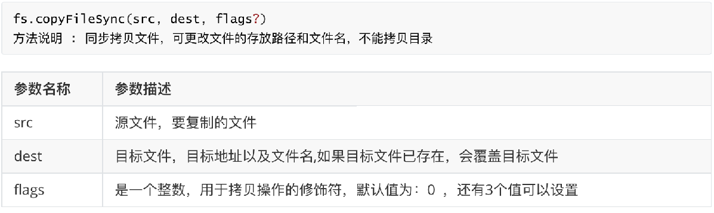
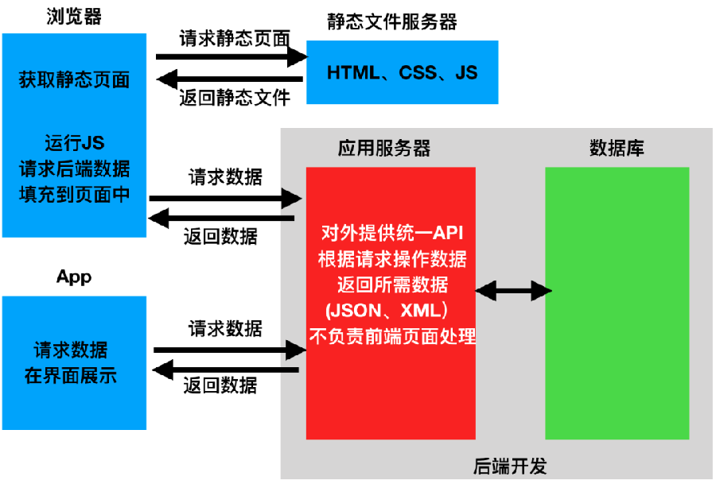

__filename     指向当前运行的脚本文件名

__dirname：指向当前运行的脚本所在的目录

ls   列出文件
cd  进入
./ 和 ../ 
mkdir 创建文件夹

touch 创建文件

pwd 当前文件夹路径

# 模块化

exports   				抛出  	  	 require("地址")  接受						类似  es6 export     可抛出多次

module.exports     抛出			require("地址")  接受						类似  es6 export default 抛出1次   会覆盖


# 通信规则：

require 引进来

exports或者 module.exports  抛出去

# npm init  -y 生成package.json描述文件

# npm i qs 或者 npm  install  qs

# node_modules 第三方包的存放目录

# npm i 自动根据package.json下载 node_modules文件夹

# 上线环境

```
npm i  包名 
npm i  包名 --save
npm i  包名 -S
```

# 开发环境

```
npm i bootstrap --save-dev
npm i bootstrap -D

```

# npm


npm i 包名 -g  全局安装 

npm i  包名@版本号

MVC M数据 V视图  C控制器

npm uninstall 包名 或者  npm  uni 包名

卸载多个模块 中间用空格  npm uni qs  axios  jquery

安装多个模块 中间用空格  npm i qs  axios  jquery

npm install -g cnpm --registry=https://registry.npm.taobao.org

cnpm中国淘宝镜像  npm国外镜像，npm怎么用 cnpm就怎么用

## npm常用命令


# Node fs模块（File System）

```javascript
const fs = require('fs')
```

## Node fs模块 常用API


```javascript
fs.redFile('路径',[],(error,data)=>{
    
})
```


```javascript
fs.redFile('路径',[])
```


### 同步修改文件名


### 异步修改文件名


### 同步拷贝文件




### 异步拷贝文件


### 同步追加内容


### 异步删除文件


### 异步创建文件夹


### 读取目录


### 异步删除目录


### 同步删除目录


### 异步读取文件


使用http模块的基本使用步骤：


## Node fs模块（File System） 文件常识


## Node path模块

Node中的path模块提供了一些用于处理文件和目录路径的API，用来动态处理路径问题。
使用path模块首先需要导入 path模块包：

```javascript
const pat = require('path')
```

### Node path模块c常见API


# HTTP


## HTTP 请求报文


## 使用http模块的基本使用步骤：

```javascript
//1. http模块提供了搭建本地服务器的API,首先在项目中引入：
const http=require('http')

//2. 引入之后利用http.createServer()方法得到一个服务器实例。
const sever=http.createServer()

//3. 经过以上两步，已经搭建好了一个服务器实例，然后给服务器实例绑定接收request的事情处理函数。
server.on('request',(req,res)=>{
    //请求到的路径永远以 / 开头
    console.log(`请求的URL是${req.url}`)
})

//4.绑定监听端口号，开启服务器。代码如下：
server.listen(8080.'127.0.0.1',()=>{
    console.log('服务器已启动')
})
```


方法：createServer()


方法：server.on(event, listener)


方法： server.listen(port, [hostname],[listener])


Node中的HTTP模块中对请求的处理是通过对“request”事件的监听，通过事件回调函数中request对象进行处理：


let response= url.parse(req.url);


在服务器端用来向用户做出响应的对象，凡是需要向用户（客户端）响应操作，都需要通过response对象来进行。 


## Node http模块 HTTP服务处理静态资源 


# express


 Express应用使用回调函数的参数：request对象处理HTTP请求相关内容，包含了请求查询字符串、参数、内容、HTTP头部等属性，常见的属性有： 


 Response对象-对象表示 HTTP 响应，即在接收到请求时向客户端发送的 HTTP 响应数据。常见属性有： 


##  静态资源

静态文件  很久不更新  
.html .css .js .json
.png .jpeg .jpg

处理方式：


## 中间件

 Express 中间件函数，帮助拆解主程序的业务逻辑，并且每一个的中间件函数处理的结果都会传递给下一个中间件函数

中间件(Middleware)是一个函数，它可以访问请求对象(req),响应对象(res)和 Web 应用中处于请求/响应循环流程中的中间件，下一个中间件函数通常由名为 next 的变量来表示。如果当前中间件没有终结请求/响应循环，则必须调用 next() 方法将控制权交给下一个中间件，否则请求就会挂起。中间件装入顺序很重要：首先装入的中间件函数也首先被执行，这个装入就是注册函数。


### Express应用可以使用如下几种中间件：

应用级中间件
路由级中间件
错误处理中间件
内置中间件
第三方中间件：axios   qs  vuex  vue-router  queryString

## post


## body-parse 基本用法

 引入 body-parse


配置中间件 


 解析


## 默认的解析就是GET解析


# 路由

 路由是指确定服务端应用程序如何响应客户端对特定端点的请求，该特定端点是URI（或路径）和特定的HTTP请求方法（GET，POST等）。对Node来说，每个路由可以具有一个或多个处理程序函数，这些函数在路由匹配时执行。
简单的说，路由是根据不同的URL地址展示不同的内容和页面，也可以认为路由是URL到函数的映射；


## 1. 前端路由

前端路由主要借助hash（#）来实现，对于单页面应用程序来说，主要通过URL中的hash(#号)来实现不同页面之间的切换，这就称之为前端路由。

##  2. 后端路由

对于普通的网站，所有的超链接都是URL地址，所有的URL地址都对应服务器上对应的资源；


## Express中的路由

理解：
router 可以理解为一个容器，或者说是一种机制，它管理了一组route。简单说，route只是进行了URL和函数的映射，而在当接收一个URL之后，先去路由映射表中查找相应的函数。这个过程是由router来处理的。

## Express 路由中间件


## REST和RESTful应用




### 什么是REST

 REST全称是 Representational State Transfer，中文意思是表述（编者注：通常译为表征）性状态转移。
 REST不是一种协议，也不是一种文件格式，更不是一种开发框架。
资源的表述
资源的状态


### RESTful规范的优点

 简单、轻量。
 面向资源，一目了然，具有自解释性。
 数据描述简单，一般使用XML、JSON做数据交换（现在主要是JSON）。


# 生成器


- npx express-generator --view=ejs


# xhr


****


# 跨域


## 跨域的解决办法

 CORS nodejs 后端解决
 代理 vue跨域代理 proxy---------------
 JSONP 适用于 get
浏览器解决跨域

# cookie

http无状态协议 没有记忆  


## 会话概述

 **什么是会话**
session，中文经常翻译为会话，其本来的含义是指有始有终的一系列动作/消息，比如打电话时从拿起电话拨号到挂断电话这中间的一系列过程可以称之为一个session。有时候可以看到这样的话“在一个浏览器会话期间，...”，这里的会话一词用的就是其本义。
 **一次会话**：通常情况下（不管有没有设置有效期），会话创建到浏览器关闭为一次会话；如果设置会话有效期，有效期内为一次会话。为了保存多个请求的数据，需要利用会话机制。
 例如，在购物的时候，首先添加了一本《Node.js高阶修养》进入购物车，然后我们又继续去搜索《Java》，并添加到购物车，这时购物车应该有两本书。
 Http是一种无状态协议，它是无记忆的。

## cookie-parser

```javascript
res.cookie("username","jack") //设置cookies
   res.cookie("name",'jack',{
        maxAge:10*1000//设置有效期
    })
 req.cookies.username //取cookies 


 res.clearCookie("username")//删除cookies

```


# session


 “express-session”实现的原理：
 1. C/S模式下，HTTP是无状态的，本身是没有会话功能，是通过Cookie实现会话机制；
 2. C端（Client）浏览器访问S端，进行请求服务；
 3. 具备会话机制后的S端就会生成一个SID存储在Cookie； 
 4. C端再次访问S端的时候就是带上SID，S端就会根据SID去get Session data，这个Session data 就是会话机制的数据。
 5. 判断会话机制的数据是否正确。


```javascript
req.session.username="jack" //设置一个session
req.session.username  //获取 session
req.session.destroy() //清除 session

```


# Token


## Token使用


# 核心代码

1. 工具类实现 
 2. 路由中间件实现
 3. 内置 fs  url path http 
 4. cookie-parse   express-session jsonwebtoken body-parser  cors multer  qs axios express


