# VUE

### **v-html，绑定富文本** **vue指令**

vue可以把富文本渲染到页面上。

语法：v-html=”变量名”

```html
例如：<div v-html="msg"></div>
data:{
	msg:”哈哈！”
}
```

v-text 显示文本、字符串

v-html 会解析字符串中的标签

### v-if，v-else

v-if，按照条件是否渲染，若不需要渲染，此dom或被从文档中移除。

v-else，与v-if配合使用，与v-if互斥

语法：v-if=”变量”

若变量不是布尔类型，会隐式的转换为布尔。

```html
<p v-if=”isShow”>1111</p>
<p v-else>1111</p>
```

### v-show

v-show，按照条件是否显示，他的原理是控制dom的display属性，

```html
<p v-show=”isShow”>1111</p>
```

V-if和v-show的区别     v-if会把dom移除。 

### v-for循环

v-for循环，可以循环3种数据：数字  数组，对象，，其中循环数组和对象非常相似

可以把数组中的元素，或者对象中的属性值显示在页面上。

```javascript
var arr = [“鲁迅”,”悟空”,”牛顿”];
var obj = {
 num:56,
 age:77,
 nick:”萧炎”
};
```

1，只要数组元素的值

```html
<p v-for=”el in arr”>{{el}}</p>
```

2, 只要对象的属性值

```html
<p v-for=”el in obj”>{{el}}</p>
```

3 , 数组元素的值下标都要

```html
<p v-for=”(el,index) in arr”>
    	{{index}}-{{el}}
</p>
```

4，对象的属性值、属性名都要

```html
<p v-for=”(el,key) in obj”>
	{{key}}-{{el}}
</p>
```

5，循环数字，只要数字

```html
 <li v-for="(item,index) in 5">
                  {{index}}--{{item}}
              </li>
```

6，循环数字，数字、下标都要

```html
<p v-for=”(el,key) in obj”>
	{{key}}-{{el}}
</p>

ps：对象，数组语法类似
```


# methods

vue中的函数
1，定义函数

```javascript
var app = new Vue({
	  methods:{
	say:function(){
		  return 55;
		}
	}
})
app.say();//js调用
```

2，dom中调用函数

```javascript
dom会显示函数return的内容
{{say()}}  文本插值
```


# 事件

## 1，v-on:click单击事件

```html
语法1：
<p v-on:click=”js语句”>1111</p>
语法2：
<p v-on:click=”函数名”>1111</p>
语法3：
<p v-on:click=”函数名()”>1111</p>

ps，这里的函数名，指的是methods中的函数

v-on:click的简写 @click
```

## **2，事件传参**

```html
1，直接传字面量
<p @click=”say(45)”>11111</p>
<p @click=”say(‘45’)”>11111</p>
<p @click=”say([1,2])”>11111</p>

2，传data中的变量
	<p @click=”say(age)”>4444</p>
	data:{
 	 age:66
	},
methods:{
  say:function(a){
    alert(a);
	}
}
```

## 3，事件修饰符

```html
语法：<p @click.修饰符=”fun”>111</p>
<p @click.once=”fun”>111</p>

1，once，只触发一次
2，stop，阻止冒泡
3,.capture  捕获
4，prevent，阻止默认事件

修饰符可串联
@click.修饰符1.修饰符2

<a @click.prevent.once href="http://www.baidu.com">百度</a>
```

## 4，其它事件

```html
1，普通鼠标事件
1，dblclick，双击
2，mousemove，鼠标移动
3，contextmenu，右键单击
4，mouseout，鼠标移出
<p @click=”fun1” @dblclick=”fun2”>111</p>
2，表单事件
1，focus，获得焦点
2，blur，失去焦点
3，change，内容改变
3，键盘事件
Keyup  keydown  keypress
```

# 双向绑定

v-model:value=" "  简写  v-model=" " **表单**

单选框

```html
<body>
    <div id="app">
        <input type="radio" name="sex" v-model="sex" value="男" id="">男
        <input type="radio" name="sex" v-model="sex" value="女" id="">女
    </div>
    <script src='https://cdn.jsdelivr.net/npm/vue@2.7.14/dist/vue.js'></script>
    <script>
        new Vue({
            el: "#app",
            data: {
                sex: "男"
            },
            methods: {

            },
        })
    </script>
</body>
```

复选框

```html
<body>
    <div id="app">
        <input type="checkbox" name="" v-model="hobby" value="唱歌" id=""> 唱歌
        <input type="checkbox" name="" v-model="hobby" value="跳舞" id=""> 跳舞
        <input type="checkbox" name="" v-model="hobby" value="吃饭" id=""> 吃饭
        {{hobby}}
    </div>
    <script src='https://cdn.jsdelivr.net/npm/vue@2.7.14/dist/vue.js'></script>
    <script>
        new Vue({
            el: "#app",
            data: {
                hobby: ['唱歌']
            },
            methods: {

            },
        })
    </script>
</body>
```

下拉框

```html
<body>
    <div id="app">
        商品类型：
        <select v-model:value="index">
            <option v-for="(item,index) in data2" v-bind:value="index">
                {{item.goodsName}}
            </option>
        </select>
        <p>单价：<span>{{data2[index].price}}</span></p>

        <p>数量：<input type="number" v-model="num"></p>
        <p>金额：<span>{{ num * data2[index].price}}</span></p>
        <button @click="alert">打印小票</button>

    </div>
    <script src='./vue.js'></script>
    <script>
        new Vue({
            el: "#app",
            data: {
                index: 0,
                num: 1,
                data2: [
                    {
                        id: 1,
                        goodsName: "花生",
                        price: 1
                    },
                    {
                        id: 2,
                        goodsName: "包菜",
                        price: 2
                    },
                    {
                        id: 3,
                        goodsName: "倭瓜",
                        price: 3
                    }
                ]
            },
            methods: {
                alert() {
                    alert("打印成功")
                }
            },
            watch: {
                'num'(val, oldVal) {
                    if (val < 1) {
                        alert("太少了")
                        this.num = 1
                    }
                }
            }
        })
    </script>
</body>
```

## 表单修饰符

### **1，.lazy**

在默认情况下， v-model 在 input 事件中同步输入框的值与数据，这会影响页面性能，特别是在移动设备上。

添加一个修饰符 lazy ，从而转变为在 change 事件中同步：

```html
<!-- 在 "change" 而不是 "input" 事件中更新 -->

<input v-model.lazy="msg" >

失去焦点更新数据
```

### **2，.number**

```html
number会把输入的值转换成number类型，当失去焦点的时候，再把转换结果填入表单中。
<input v-model.number="age" type="number">
例如：0123会转成123
```

### **3，.trim**

```html
在表单失去焦点后，去除首尾空格。
<input v-model.trim="msg">
```

# 操作元素class

### **1，v-bind:class 概述**

```html
我们可以用 v-bind:class操作元素的class属性。
<p v-bind:class="{class1:表达式1|变量1，class2:表达式2|变量2}" class="x2">3333</p>
若表达式|变量得到true（隐士转换为布尔），则会加上对应的class，当变量或者表达式变化时，class会实时更新。
简写：v-bind:class 等价于 :class

举例：
<p :class={c1:b1,c2:b2}>大家好！</p>
data:{
	b1:true,
	b2:false
}
得到的结果：
<p class=”c1”>大家好！</p>


与普通class共存
v-bind:class ，可以与普通的 class 属性共存。
<p class=”x1” :class=”{c1:b1}”>111</p>
运行结果：
<p class=”x1 c1”>111</p>
```

### 2，绑定的数据对象

```html
不必内联定义在模板里
<p class=”x1” :class=”obj”>111</p>
data:{
	obj:{
		c1:true
	}
}
运行结果：
<p class=”x1 c1”>111</p>
```

### 3,数组操作class

1，数组语法

我们可以把一个数组传给 v-bind:class，以应用一个 class 列表。

 ```html
语法：<p v-bind:class="[变量1,变量2...]">3333</p>
2，举例
<p v-bind:class="[c1,c2]">3333</p>
data:{
	c1:”active”,
	c2:”red”
}
渲染结果：
	<p class=”active red”>333</p>

-------------------------------------------------------------------------------
<span :class="[blo?'red':'blue','ok']">数组的形式</span>
<script>
        let vm = new Vue({
            el: '#app',
            data: {
                blo:true
            }
        });
    </script>
 ```

## 4，操作元素style

### **1，v-bind:style 概述**

我们可以为 v-bind:style操作元素的class属性。

​	简写：v-bind:style等价于 :style

```html
<p v-bind:style="{color:表达式1|变量1，fontSize:表达式2|变量2}">3333</p>
表达式|变量的值，就是样式属性的值
```

### 2，绑定的数据对象

```html
不必内联定义在模板里
<p class=”x1” :style=”obj”>111</p>
data:{
	obj:{
		color:”red”,
		fontSize:”23px”
	}
}
css属性名可以用驼峰式:fontSize ：“23px”
短横线分隔：“font-size”:”23px”
```

### 3，数组对象

```html
<p class=”x1” :style=”arr”>111</p>
data:{
	arr:[
		{color:”red”},
		{fontSize:”23px”}
	]
}
```

# 监听

## 1，watch属性

```javascript
监听对象的属性:”obj.name”:function(nVal,oVal){}

var app = new Vue({
    el:"#app",
	data:{
		age:89
	},
	watch:{
		age:function(新值,旧值){}，
		"obj.name"(new,old){
        
		}
	}
})
```

## 2，app.$watch

```javascript
vue可以通过$watch监听data中数据的变化。
语法：
app.$watch(“属性名”,function(nVal,oVal){

})

1，匿名函数为数据变化后的回调

2，nval表示变化后的新值，oVal旧值

3，监听对象的属性：
	app.$watch("obj.name",function(nVal,oVal){})

举例
var app= new Vue({
	data:{
		name:”小明”
	}
})
app.$watch("name",function(nVal,oVal){
	alert(旧值：”+oVal);
	alert(新值：”+nVal);
})
```

## **3，deep，深度监听**

```javascript
监听对象的属性改变，比较耗性能
watch:{  
	obj:{//监听所有属性变化
		handler:function(n,o){
			console.log(n,o);
		},
		deep:true
	}
}
```


# 函数

页面中直接使用函数，页面会显示函数return返回的数据。

```html
{{say()}}

methods:{
	say:function(){}
}

若在页面中直接使用函数，会有如下情况发生：
1，初始化vue的时候，调用几次函数就执行几次
2，data中只要依赖数据变化，所有调用函数的地方都要执行一次
```

# 计算属性

计算属性和函数非常相似，但是性能上秒杀函数。

```html
语法：
data:{age:7},
computed:{
	say:function(){
		return this.age
	}
}
```

## 计算特点

1，计算属性依赖缓存，只有相关依赖发生改变，才会重新取值。

2，使用的时候，把他当做变量即可

3，他不接受参数

## 函数 vs 计算属性

计算属性和函数间的区别：

1，函数可以完全替代计算属性

2，函数可以接受参数，计算属性不能 计算属性渲染数据

3，语法上，函数后面必须带小括号，计算属性只需要写函数名

4，计算属性性能更好，它依赖缓存，只有依赖改变才会更新

# v-once

一次性插入文本

只渲染元素和组件一次，随后的渲染，使用了此指令的元素/组件及其所有的子节点，都会当作静态内容并跳过，这可以用于优化更新性能。

```html
例如：
//dom会随着age的改变更新
<p>{{age}}</p>

//即使age改变，dom也不会再更新
<p v-once>{{age}}</p>

app.age = 89;
```

# 计算月份天数

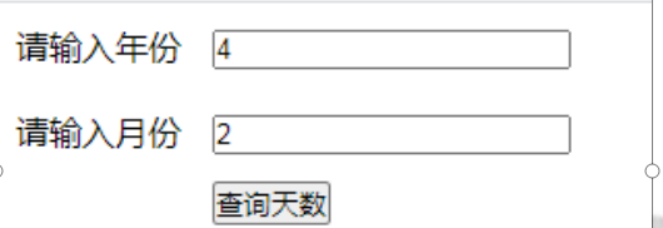


```javascript
new Date(year, month, 0).getDate()
```


# 多个vue实例

```html
其实，一个网页可以有多个vue实例，他们互不影响各自独立，例如：
<div id=”app1”></div>
<div id=”app2”></div>
var app1 = new Vue({el:”#app1”})
var app2 = new Vue({el:”#app2”})
```

## vue实例间互相访问

通过{{vue实例名.属性名}}访问别的vue实例。

语法：{{app1.age}}

下面的vue实例可以直接使用上面vue实例的变量，而不能反过来，这是因为代码会自上而下运行。

# 组件概述

```html
组件（Component）是 可复用的vue实例，它带有一个名字，它可以扩展 HTML 元素。让我们像搭建积木一样搭建页面。
假如我们封装了一个组件，名字为Footer，那么我们就可以这么使用它：
<Footer></Footer>

这有点像我们曾经使用的网页公共dom，例如：
<div class=”footer”>。。。。</div>
```

## 全局组件

```javascript
// 组件的data 是一个函数  返回值 是一个对象********************
// template拼接时候注意 外双内单  或者es6字符串拼接
// 组件必须要有根元素包裹
```

```html
当前页面下，所有的vue实例，都可以用到该页面定义的全局组件。
定义全局组件语法：
Vue.component(“组件名”,{template:”html字符串”})

例如：

Vue.component(“footer1”,{
	template:”<h1>我是一个组件</h1>”
})

使用：<footer1</footer1>
<footer1/>
```

## 组件命名规范

vue组件命名分两种情况。

1，引入vue.js文件

1，组件名全部小写

2，组件名，多个单词之间，用-（横线）隔开

3，不许使用关键词

2，vue-cli中使用（以后会详细说明）

1，要求比较宽松，推荐使用驼峰命名法

2，不许使用关键词

## 局部组件

```javascript
在某个vue实例中注册的组件，就是局部组件，也只能在当前vue实例中使用。
定义局部组件语法：
var app1 = new Vue({
	components:{
		Com1:{
			template:”<p>我是组件Com1</p>”
		},
		Com2:{
			template:”<p>我是组件Com3</p>”
		},
	}
})
```

## 组件的其他功能

现在我们单个页面引入vue.js属于多页面项目，vue组件的威力暂时发挥不出来，等学到单页面应用（spa- single page web application）的时候，就能看到组件的强大之处。 spa 组件别的威力，也只有spa的时候才能见识到，现在使用反而成了负担。

例如：

1，父子组件通信

2，多页面共享组件


# vue-cli简介

## vue-cli的好处

1，把es6编译成es5------babel

2，借助webpack压缩代码空格删除注释---html css js压缩  .vue文件转成 html

3，解决缓存问题

4，编译sass和less等

5，支持热更新，修改立即生效

热更新需要借助webpack-dev-server插件，此插件在本地帮咱们搭建了一个服务器，若没有vue-cli，需要自己配置

6，学习vue-cli

vue-cli目前有4个版本，分别是1.x、2.x、3.x，目前3.x是最好用的，这里以3.x，4.x为例。

5.0.8

官方文档地址：

https://cli.vuejs.org/zh/guide/

## 创建vue-cli项目

vue create  项目名称


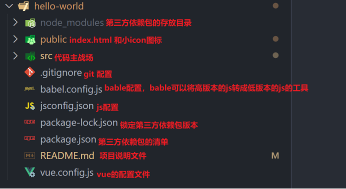


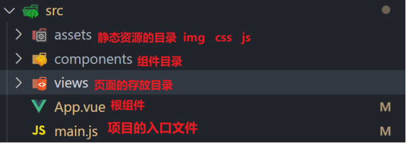


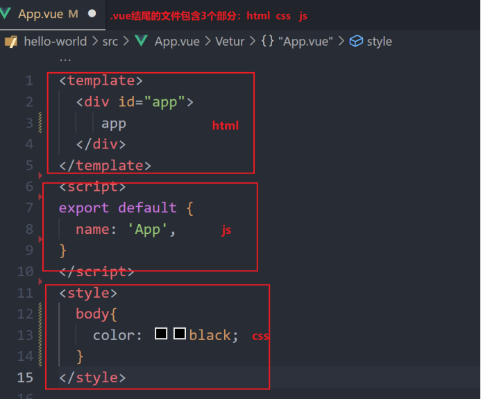


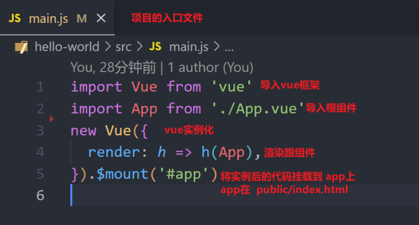


## demo源码解析

## **1，程序执行顺序**

1，main.js，程序入口------------

​	引入vue和app组件，实例化vue

2，App.vue，vue实例的根组件

vue-cli项目，所有的组件都嵌套在App.vue组件中

3，assets，静态素材存放位置，名称可改变

4，components，组件存放位置，名称可改变

## **2，vue-cli组件的组成**

每个vue组件，都是一个vue实例

1，dom内容

`<template></template>`

2，js

`<script></script>`

3，样式

`<style></style>`

## eslint简介

eslint是代码格式检测工具，他对我们的代码格式有着强烈的硬性要求，例如哪里必须有空格，什么时候用tab退格等。

优点：可以规范代码，统一风格

缺点：非常苛刻反而成了负担

vue-cli就用了eslint

## 屏蔽eslint

找到项目根目录下的：package.json，删除如下代码即可，重启项目即可

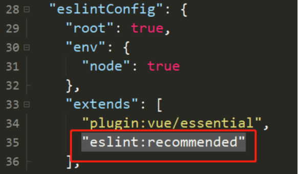

## 打包vue项目

vue项目不能直接运行，因为浏览器不认识.vue文件和最新的es6语法，所以必须对项目进行打包。

被打包的文件，会被放在项目根目录下的dist目录下。

vue-cli3.x的打包命令如下：

npm run build


# vue组件概述

.vue组件由3部分组成，分别是：

1，template，dom模板

2，script，js脚本

3，style，css样式

## 快速使用

```vue
<template>
  <div class="hello">
    <h1>{{ msg }}</h1>
  </div>
</template>

<script>
export default {
  data:function(){
	  return {
		  msg:56
	  }
  }
}
</script>

<style>
</style>
```

## 组件组成分析

### template

dom代码必须放在template里面，并且只能有一个根元素。

### script

1，name属性，非必填项

具体作用是缓存，递归和调试代码，暂时不管它。

2，data，数据属性

在这里data必须是一个函数，返回一个obj变量，这是因为vue的组件会被复用，而复用的时候，如果data中有变量，他们会共用此变量，这由js的原型链决定的，所以vue只好如此。

3，export default

这是es6提供的特殊语法，意思是把当前模块导出，后面再说具体用法

4，其它属性

其它属性和以前学的vue相差不大，后面遇到了再补充

## style

vue组件的样式格式可以用很多种，例如：普通css，还有咱们没学过的less，sass，普通css和咱们以前学的完全一样。

## key的作用

## **1，v-for概述**

 v-for渲染的列表的结构采用“就地复用”的策略，也就说当数据重新排列数据时，会复用已在页面渲染好的元素，不会移动 DOM 元素来匹配数据项的顺序，这种模式是高效的，改变现有位置的结构的数据即可。

## **2，v-for遇到的问题**

总结为一句话：

key的作用主要是标识组件的唯一性，高效的更新虚拟dom。

vue中列表循环需加:key="唯一标识" ，唯一标识可以是item里面  id   ndex等，因为vue组件高度复用，增加Key可以标识组件的唯一性，为了更好地区别各个组件，key的作用主要是为了高效的更新虚拟DOM


## vue-cli引用子组件

```html
vue-cli中，定义的vue组件是可以互相引用的。引用一个组件的流程如下：
1，定义一个组件

2，在父组件中，把它import导入进来
import Footer from './components/Footer.vue'
其中【.vue】后缀可以省略
当前目录的【./】不可省略，否则会报错

3，在components属性下，把该组件注册进来
{Footer}

4，调用该组件即可
<Footer></Footer>
ps：vue-cli可以简写调用语法：<Footer />
```

## scoped属性

`<style scoped> </style>`

scoped属性

scoped CSS规范是Web组件产生不污染其他组件，也不被其他组件污染的CSS规范。

1，他们各自设置的样式互相独立，互不影响。

2，特殊情况：

即使父组件都设置了scoped，父组件的css依然可以影响子组件的根元素，这么设计的目的是父组件可以对子组件根元素进行布局。

## 父子组件通信

当父子组件嵌套的时候，他们之间是可以通信的，所谓通信，指的是互相调用彼此的函数，变量。

### 父传子 - 父组件部分 绑定属性

```html
1，把父组件里的变量，或者字面量绑定在子组件的属性上
<Com1 :age=”age”/>		绑定变量
<Com1 age=”23”/>		绑定字面量

data:{age:23}
```

## 父传子 - 子组件接受

```html
子组件通过props接收父页面传过来的参数，注意变量名要和父组件里面的属性名保持一致。在组件中使用此变量，就像使用data中的普通变量一样。
有2种接收方式：
1，不严格要求数据类型
props:[“age”]
2，严格要求数据类型，若类型错误会报错，但是程序不影响执行
props:{
	age:String
}

使用方式：{{age}}
```

## 子传父 - 通信 提交自定义事件

子传父，大致思路是：

1，父组件写个函数等待子组件调用，

2，把被调用的函数注册到子组件上，

3，子组件通过$emit向父组件抛出事件

```vue
 this.$emit("zdy",88)

 <my  okage="jack" @zdy="getfun"></my>
```

### 子传父 - 父组件部分

```html
1，在父组件中，先写一个普通的函数，等待子组件调用
Fun (num){
	console.log(num);
}
2，在子组件引用时，写上监听子组件的监听函数
<ChildCom @getAge="fun" />
```

### 子传父 - 子组件部分

```html
子组件部分比较简单，通过$emit，向父组件发送消息
this.$emit('getAge', 88);

ps：这里的getAge要和父组件中@后面的参数保持一致。
```


## ref属性

ref 被用来给DOM元素或子组件注册引用信息。类似元素的id，目的是获取元素。

```html
语法：
1，定义标签
<p ref=”x1”>1111</p>
2，获取该标签：
this.$refs.x1
```

### ref父传子

```html
通过组件的ref属性，可以调用子组件的属性和方法。
<com1 ref=”x1”></com1>
data:{age:80},
methods:{
	say(msg){
		alert(msg)
	}
}

1，调用属性
var age = this.$refs.x1.age;

2，调用方法并传参
this.$refs.x1.say(“茄子”);
```

## 非父子通信

```javascript
import VueBus from 'vue-bus'; 第三方
Vue.use(VueBus);

this.$bus.emit('add-todo', { text:100 });

this.$bus.on('add-todo',function(arg){
         console.log(arg);
  });
```

# vue的生命周期 vue2

按照执行顺序，所有生命周期如下：

> before Create		created
>
> beforeMount		mounted
>
> beforeUpdate		updated
>
> beforeDestroy	  destroyed

生命周期中访问vue中的属性

## 生命周期详解

> 1，beforeCreate，创建前
>
> 代码运行到这里，vue的一切属性还没开始创建，
>
>  
>
> 2，created，创建后
>
> 事件初始化完毕，data属性初始化完毕
>
> 可以访问data：this.$data
>
>  
>
> 3，beforeMount，挂载前
>
> dom创建完成，已经挂载到页面中，但是数据还没渲染
>
> 可以访问dom，但是还没更新：this.$el
>
>  
>
> 4，mounted，挂在后
>
> 数据渲染完成，到这里证明vue实例已经初始化完毕，ajax也是在这里开始请求
>
> 可以访问dom，已经更新：this.$el
>
>  
>
> 5，beforeUpdate，更新前
>
> data发生了改变，但是view层没有被重新渲染，view层（页面上）的数据没有变化。
>
>  
>
> 6，updated，更新后
>
> 更新后的数据，已经渲染到view层
>
>  
>
> 7，beforeDestroy，销毁前
>
> 在这一步，vue实例仍然完全可用。可以在这里阻止实例销毁，例如表单数据的内容如果还没提交，可以禁止销毁。
>
>  
>
> 8，destroyed，销毁后
>
> 到这里，Vue实例指示就彻底销毁了，所有的数据，事件都不存在了。

## 全局引入css样式

### 1，vue组件中使用

我们知道，每个vue组件中都可以设置style，若不写scoped，则样式作用于全局，不过需要此组件被引用到才会生效。

 

另外，也不推荐用vue的组件来控制全局样式，单个组件建议完成单个功能，样式加上scoped防止样式混乱。

### **2，main.js导入**

1，在./src/assets/目录下新建a.css文件

2，在./src/main.js中导入此css即可

import “./assets/a.css”；

### 3,App.vue样式中导入

既然App.vue是整个项目的根组件，那么只要App.vue的style不添加scoped属性，那么就可以设置全局css。

> 1，在./src/assets/目录下新建a.css文件
>
> 2，在./src/App.vue中导入此css即可
>
> <style>
>
> @import url(“./assets/a.css”)
>
> </style>
>
> Link  @import  行内  内部

### 4，index.html中link引入

vue-cli项目内部，会使用./public/index.html作为html模板，所以可以在其中引入css.。

```html
1，在./public/目录下新建a.css文件

2，./public/index.html中引入

<link rel="stylesheet" type="text/css" href="./a.css"/>

ps：这时候css文件不能放在src下，否则会找不到。这是因为webpack会对src下面的文件进行js打包，打包后src就不存在了。
```

### 5，组件中导入css文件

```html
作用于全局，标签内不可再写样式
<style src="../assets/a1.css">
</style>

作用于当前组件，标签内不可再写样式
<style src="../assets/a1.css" scoped>
</style>
```


# Vue全家桶（vueRouter ,axios,vuex）

## 1,vue-router路由

## 1,概述

这里的路由并不是指我们平时所说的硬件路由器，指的是SPA单页面应用的路径管理器。再通俗的说，vue-router就是WebApp的链接路径管理系统。

single page application（单页面应用）

传统的路由通过a连接来实现（js跳转）：

`<a href="地址"></a>`

Location.href=”地址”  BOM

1，帮助页面- help.html

2，游戏界面- game.html

## 2,为什么不用a连接跳转

这是因为用Vue做的都是单页应用，项目打包后，会生成dist文件夹，这里面只有静态资源和一个index.html页面。所以`<a></a>`标签是不起作用的，必须使用vue-router来进行管理。


## 3,hash值改变 history

http://192.168.1.139/#/my

http://192.168.1.139/my


## 2，路由使用

### 1.下载 cnpm i vue-router@3

### 2. src/router/index.js

```
import Vue from "vue";//引入vue框架
import VueRouter from "vue-router";//引入路由了
Vue.use(VueRouter);//vue中使用 路由了

const router= new VueRouter({});

export default router;
```

### 3.main.js引入路由

```
.......

import router from './router';// ./router/index.js

new Vue({//new 一个vue实例 一个项目 只有一个
  render: h => h(App),//将App根组件 渲染到页面
  router
}).$mount('#app') // id=app 这个标签
```

### 4.  src/views文件夹  存放页面

### 5. 配置页面了  src/router/index.js

```
import Vue from "vue";//引入vue框架
import VueRouter from "vue-router";//引入路由了
Vue.use(VueRouter);//vue中使用 路由了
import Index from "../views/Index.vue";
import My from "../views/My.vue"

const router= new VueRouter({
    routes:[
        {
            path:"/",
            component:Index
        },
        {
            path:"/my",
            component:My
        }
    ]
});

export default router;
```

### 6.使用 App.vue

* routerLink 类似于 a标签
* routerView 路由视图
* tag属性 router-link默认渲染成为a标签，通过tag属性，也可以渲染成别的元素。语法：`<router-link tag="div">帮助</router-link>`

```
<template>
  <div>
     <router-link to="/">首页</router-link>
     <router-link to="/my">个人中心</router-link>

     <router-view></router-view>
  </div>
</template>

```

###  路由3个概念

* route:代表一个页面信息 路由 参数 
* routes:代表整个项目的所有页面  []
* router:路由管理 跳转 重定向 

### routerLink和routerview

* routerLink 页面跳转 类似 a标签
* routerview  页面存放视图 类似 div

```
routerLink  的 tag可以 改变渲染标签
```

### 路由跳转模式

* hash   地址上面有# ，不好看，项目上线 hash不需要反向代理
* history  地址没有# 项目上线 hash需要反向代理  go()  back() forwards()
* abstract 服务器端模式

### 路由跳转方式2种

### 标签

```
<router-link to="/my">个人中心</router-link>

<router-link :to="{path:'/my'}">个人中心</router-link>

<router-link :to="{name:'My'}">个人中心</router-link>
```

### js 跳转

```
      this.$router.push("/my")//路由压栈
      this.$router.replace("/my") //关闭当前页面打开一个新页面。用户登录
      this.$router.push({
           path:"/my"
       })

      this.$router.push({
        name:"My"
      })
```


### 4，vue-router模式

#### **1，vue-router模式**

vue-router有2种模式，这两种模式都可以配置路由跳转，并且各有优缺点，他们分别是：

1，hash模式

2，history模式

在./src/router/index.js文件中修改此配置。

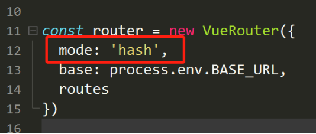

#### **2，hash模式（推荐）**

这是vue-cli默认的模式，使用 URL 的 hash 来模拟一个完整的 URL，当 URL 改变时，页面不会重新加载。

例如：http://localhost:8080/#/about

#### **3，history模式**

此模式，url就像正常的 url，比hash模式好看。但是此模式需要后台程序员的配合。

例如：http://yoursite.com/user/id

### 5，路由跳转

#### 1，概述

路由跳转，有2种方式，router-link跳转和js编程式跳转。

router-link跳转，类似网页中的a链接跳转。

js编程式跳转，类似js的location修改href属性。

1，router-link，借助单个路由的path、name属性跳转（标签的形式）

2，js方式，借助this.$router.push方法

#### 2，router-link - path - 跳转

1，直接用path属性

`<router-link to="/HelpPage">help</router-link>`

2， 变量形式跳转

`<router-link :to='{path:"HelpPage"}'>9999</router-link>`

#### 3，router-link - name- 跳转

单个路由的name属性，其实和path差不多，name可以理解为path的别名，方便我们记忆。

变量形式跳转

`<router-link :to='{name:"HelpPage"}'>9999</router-link>`

```javascript
处理不能再跳转当前页面
const routerPush = VueRouter.prototype.push
VueRouter.prototype.push = function push(location) {
    return routerPush.call(this, location).catch(error => error)
}

```


#### 4，$router.push - 跳转

在这里，name，path选一个就行

```javascript
this.$router.push({
 	name:'LearnPage',
 	//path:'LearnPage'，
   // redirtect:"/xx" 重定向
    component:()=>{'./xxx.vue'}
}
                  
    this.$router.push({
 	path:'*' ,//没有的路由跳这里
    component:()=>{'./xxx.vue'}
}              
```

#### **5，exact-active-class**

路由精准匹配时的class

```javascript
 <router-link exact-active-class="aaa">帮助</router-link> 

还有另一种方法
配置在
this.$router.push({
 	name:'LearnPage',
 	******这里
}
```


### **6**，路由传参

路由跳转，有时候需要传递参数，例如点击新闻列表，进入新闻详情，需要带着id。

#### 1，router-link 传参

携带参数有2种形式，

1，基于name的跳转，params和query都可传参，可同时存在。

2，基于path的跳转，只能query传参。

其中，刷新页面parms参数会丢失，query参数显示在地址栏后面，不会丢失。

#### 2，router-link传参示例

```html
1，name跳转，query、params都可传参
<router-link :to='{
		name:"/HelpPage",
		query:{num:5},
		params:{age:6}
	}'>跳转</router-link>

2，path跳转，只能query传参
<router-link :to='{
		name:"/HelpPage",
		query:{num:5}
	}'>跳转</router-link>
```

#### 3，接受路由参数

```html
1，接受query参数
	this.$route.query.参数名
2，接受params参数
	this.$route.params.参数名
```

#### 4，$router.push 传参

$router.push路由跳转和router-link相似，参数传输和接受都相似，只是语法略有区别。

```javascript
$router.push使用举例
1，基于name跳转
this.$router.push({
	name: 'HelpPage1',
	params: {id: 2},
	query: {age: 88}
})

2，基于path跳转
this.$router.push({
	path: 'HelpPage',
	query: {age: 88}
})
```


老师笔记

> # path
>
> * query : 类似于get请求,页面刷新数据不会丢失
>
>   ```
>     <router-link :to="{path:'/my',query:{a:100,b:'ok'}}">个人中心</router-link>
>   ```
>
>   ```
>   html 接受
>   {{$route.query.a}}
>   ```
>
>   ```
>   js 接受
>   this.$route.query.a
>   ```
>
> * params不支持
>
> # name
>
> * query  : 类似于get请求,页面刷新数据不会丢失
>
> ```
>     <router-link :to="{name:'My',query:{name:'小明',age:23}}">name-个人中心</router-link>
> 
> ```
>
> ```
> html
> {{$route.query}}
> ```
>
> ```
> this.$route.query
> ```
>
> * params:类似于 post,刷新页面 数据丢失
>
> ```
>     <router-link  :to="{name:'My',params:{name:'jack',age:25}}">name-个人中心</router-link>
> 
> ```
>
> ```
> html
> {{$route.params}}
> ```
>
> ```
> js
> this.$route.params
> 
> ```
>
> # 动态路由: get请求 页面刷新不会丢失
>
> * 1.路由配置项 配置
>
> ```
> {
>             path:"/my/:id",
>             name:"My",
>             component:()=>import("../views/My.vue")
> }
> 
> ```
>
> * 2.跳转
>
> ```
> <router-link to="/my/188">个人中心</router-link>
> 
> ```
>
> * 3接受
>
> ```
> params
> 
> ```


### 1，二级路由

#### 1,简介

2，二级路由实现

> 这里以新闻列表为例，假如新闻列表是1级路由，
>
> 1，需要在新闻组件里边里面，再写个<router-view />，用于展示二级路由的具体内容。
>
> 2，修改路由配置文件，通过children添加二级路由
>
> 3，通过router-link或者$router.push做对应跳转即可

3，路由配置文件

```javascript
下面是一个新闻列表的二级路由配置：
{
	path: '/NewsList,
	name: NewsList,
	component: () => import('../pages/NewsList.vue'),
	children:[
		{
			path: 'MoneyCom',//财经
			component: () => import('../com/NewsListMoneyCom')，
            Children:[]
		},
		{
			path: '/HappyCom',//娱乐
			component: () => import('../com/NewsListMoneyCom')
		},
	]
}
```

4，二级路由跳转

> 在哪里都可以跳转二级路由，只要路径写对即可。
>
> <router-link to="/HappyCom">娱乐<router-link/>
>
> <router-link to="/MoneyCom">财经<router-link/>


## 什么是路由守卫


路由在跳转之前，可以进行一次拦截，来决定是否要跳转到目标页面，或者跳转到别的页面，这次拦截就叫路由守卫。

例如：淘宝网浏览商品不需要登录，若点击个人中心，就要判断是否登录，若没有登录，就拦截，然后跳转到登录页面。

## 路由守卫 - 使用 全局：前置和后置

```javascript
在./src/router/index.js中，添加如下代码： 
router.beforeEach((to, from, next) => {
	
})

其中：
to，要跳转的目标页面
from，跳转之前，来自哪里
next，一个特殊函数，决定路由跳到哪里

1，正常跳转
router.beforeEach((to, from, next) => { // 全局拦截
	next()
})

2，强制跳转到登录页（小心死循环）
router.beforeEach((to, from, next) => {
	if(to.name==”myCenter” && to.path!=”LoginPage'” ){
		next({
     			path: '/LoginPage',
        	})
	}else{
next();
}
})
```

## 组件内的守卫 - 使用

```javascript
	进入之前
beforeRouteEnter (to, from, next) {

},

	离开之前
beforeRouteLeave (to, from, next) {

}
```


老师笔记：

> * 全局守卫 beforeEach  afterEach
>
> ```
> beforeEach((to,from,next)=>{
> 
>       to 目的地
>       from 出发地
>       next() 中间件
> })
> 
> ```
>
> * 组件内守卫 beforeRouteEnter  beforeRouteLeave
> * 路由配置守卫 beforeEnter


### 4，路由元信息

路由元信息指的是路由配置时候的meta字段，可以自定义字段名，一般用在权限管理，或者修改网页标题方面。

例如规定个人中心必须验证是否登录，就可以在路由跳转之前，根据情况判断一下是否需要验证。

```javascript
{
	path: '/about',
	name: 'About',
	component: () => import('../views/About.vue'),
	meta: { age: 1,num:66}
}
```

### 5，路由守卫中获取 - 路由元信息

```javascript
router.beforeEach((to, from, next) => {  //  全局
	console.log(to.meta);
	next();
})
```

### 监听路由

```javascript
watch:{
     "$route"(to,from){
       console.log(to,from);
     }
   }
```

### 配置中写监听函数

```javascript
	{
            path:"/my",
            name:"My",
            meta:{
                  name:"李扬",
                  age:18
            },
            beforeEnter (to, from, next) {
                 console.log(to,from);
                 next()
                      // ...
            },

            component:()=>import("../views/My.vue") //按需加载
        }
```

## 3，vue.config.js配置文件

### **1，配置概述**

vue.config.js这个文件默认是不存在的，需要用户在项目根目录创建，使用它可以实现很多配置，例如：

项目打包目录，打包后的输出目录，启用跨域等

```javascript
文件格式：
module.exports = {
  。。。//配置信息
}

例如：
module.exports = {
	publicPath:"./",  
	//。。。。
}
```

### 2，vue.config.js - 常用配置

> 1，publicPath，部署应用包时的基本 URL。
>
> 默认情况下，vue-cli打包的项目必须放在网站的根目录下，因为采用的都是绝对路径，咱们需要相对路径，改为如下即可：
>
> publicPath:”./”，这样项目放在哪里都可以。
>
>  
>
> 2，outputDir，打包时生成的生产环境构建文件的目录
>
> 默认为dist，可修改：outputDir:”dist1”
>
>  
>
> 3，devServer.port，修改默认端口号
>
> 若设置的端口号已被占用，程序会自动更换端口
>
> 4，devServer.open，项目启动，自动打开浏览器
>
> 默认false，取值枚举：true | false

### vue-cli项目移动

vue-cli项目移动的时候，以下两个目录不需要跟着移动，因为他们两个可以用程序生成：

1，dist打包目录，不必移动

2，node_modules，不可移动，必须重新生成

重新生成node_modules命令：cnpm i

### v-cloak。隐藏源码

```html
vue渲染时，在实例没初始化完成之前，会显示源码，这会造成不好的用户体验，所以需要把源码隐藏。
对于这个问题Vue给予了解决办法：v-cloak指令。

css部分
[v-cloak]{display: none}

html部分
<div id="app" v-cloak></div>
```


## vue-cli中使用axios

### **1，安装**

在vue-cli中，就要使用npm安装了，让package.json来管理安装的包。

安装命令：npm i axios -S   npm i axios --save

卸载命令：npm uni axios -S

ps：这里的-S参数，指定是项目上线了，此插件依然会用到。

安装成功之后，会在package.json中看到关于axios的记录。

### 2，使用axios

在main.js中，添加如下配置即可使用：

```javascript
import axios from 'axios'
Vue.prototype.$axios = axios

使用：
this.$axios({
	 url: "a.php",
 }).then((res) => {
	console.log(res);
 });

ps:这里的this，指向任何一个Vue实例都行
```

```javascript
Src/axios/index.js

import axios from "axios";

const instance = axios.create({
    baseURL: '请求路径',
    timeout: 1000,
    headers: {}
  });
export default instance;
```

### 3，axios拦截

```javascript
import axios from "axios";
// const instance = axios.create({
//     baseURL: 'https://api-hmugo-web.itheima.net/api/public/v1/home/',
//     timeout: 1000,
//     headers: {}
//   });

axios.defaults.baseURL = '请求路径';
// axios.defaults.headers.common['Authorization'] = "123";
axios.defaults.headers.post['Content-Type'] = 'application/x-www-form-urlencoded';
axios.interceptors.request.use((config) => { // 请求时候的拦截  加一个密钥
    // config.headers.common['Authorization'] = "123";
   if (config.url != "login") { // 如果不是登录接口需要加一个密钥
               config.headers.common['Authorization'] = localStorage.getItem("key");
    }
    console.log("请求拦截");
    console.log(config);
    return config
}, (error) => {
    return Promise.reject(error);
});
axios.interceptors.response.use((response) => { // 对响应过来的数据提前处理
    console.log("响应拦截");
    console.log(response);
    return response.data;
}, (error) => {
    return Promise.reject(error);
});
export default axios;
```

### **4,引入静态图片需要加关键词 require**

```javascript
  logoImg:require("./assets/img/logo.jpg"),
```


## 2，vue-cli，proxy解决跨域

### **1，跨域概述**

vue-cli解决跨域的思路：

因为用vue-cli开发的项目，都是前后端分离的，所以开发过程中肯定会遇到跨域问题。vue-cli本地有现成的nodejs服务器环境，所以vue官方就借助nodejs，帮我们代理请求ajax，跨域问题迎刃而解。

ps：项目打包后，就不在需要node环境，这时候若不把项目包放到和接口网站同域，依然会有跨域问题。

### **2**，配置跨域

在vue.config.js里，修改devServer.proxy如下：重启服务器

```javascript
module.exports = {
    devServer: {
        proxy: {
            '/api': {
                // 此处的写法，目的是为了 将 /api 替换成 https://www.baidu.com/
                target: '后台真正地址******',
                
                changeOrigin: true,// 允许跨域
                ws: true,
                pathRewrite: {
                    '^/api': ''
                }
            }
        }
    }
}
```

### **3**，参数解释

```javascript
第2行， '/api'
如果请求地址中有api，就会匹配进入此规则

第3行，target
表示代理的服务器url，也就是真实的请求地址

第4行，pathRewrite表示路径重写

第5行的'^/api'是一个正则表达式
表示要匹配请求的url中，例如：
http://localhost:8080/api5/a.php'
转接为
http://localhost:3000/api/a.php
```


## **3，**vue插槽的使用

### **1，插槽定义**

插槽就是子组件提供给父组件的一个占位符,用`<slot></slot> `表示，里面可以填充任意dom，支持变量。

插槽分2种

1，默认插槽（无名字的插槽）

2，具名插槽（有名字的插槽）

### 2，默认插槽

```vue
默认插槽就是没有名字的插槽，使用过程如下：
1，定义组件A1Com在里面写一个slot，例如
<template>
	<div>
		<h2>我是子组件</h2>
		<slot></slot>
	</div>
</template>
2，使用的时候，引入dom
<A1Com>
	<div>666</div>
	<p>罗玉凤</p>
</A1Com>
```

### 3，具名插槽

```vue
具名插槽就是有名字的插槽，一个子组件中，可以有多个插槽，通过v-slot或者slot使用，使用过程如下：
子组件内定义
<div>
	<slot name=”a1Header”></slot>
	<h2>我是子组件</h2>
	<slot name=”a1Footer”></slot>
</div>
父组件中使用

1，slot=”插槽名”
<A1Com>
	<div slot=”a1Header“><p>111</p></div>
	<div slot=”a1Footer“><p>111</p></div>
</A1Com>

2，v-slot使用
v-slot只能用在template或者组件上使用：
<A1Com>
	<template v-slot:a1Header><p>111</p></template>
	<template v-slot:a1Footer><p>111</p></template>
</A1Com>
```

### 4，插槽中变量

```vue
插槽传过去的dom中，可以使用变量，这时候变量要写在父组件中。
父组件中写入
<template v-slot:slot1>
	<p>你好 {{k1}}</p>
</template>
data(){
	return {
		k1:”哈哈”
	}
}
```

### 5，插槽中样式

插槽传过去dom的样式，写在父组件和子组件中都行，即使定义了scoped也没关系

## 4，vue-cli启动的服务器

vue-cli默认在本地启动一个服务器，他的根目录在public下。

项目启动的时候，webpack会把public中的文件复制一份，放到缓存中，把src下的文件编译，也和public一起也放在缓存中。

## 5，图片资源

```vue
图片运行后，为何带哈希值后缀？
src下的图片，被webpack编译后，默认全部放在img目录下，名字会加上哈希值后缀，目的是解决图片重名的问题。
ps：对于过小的图片，会被webpack编译为base64位的图片代码
```

## 6，vue样式穿透

```vue
vue-cli组件，若是style样式加上scoped属性，那么他的样式将无法作用于子组件。但是若有需求确实需要影响子组件，就要用到样式穿透。
有3种办法可以样式穿透

语法1：   .fa >>> .child{color:#f00;}
语法2：   ::v-deep .fa .child{color:#00f;}
语法3：	.fa /deep/ .child{color:#00f;}
```


# Vuex

## **1，**vuex简介与安装

Vuex是状态管理器，它是vue中用来管理组件间通信的一个插件，它集中式的存储管理所有组件状态（数据），其实就是整个项目中的全局变量。数据仓库

若是项目逻辑不复杂，也可以不用vuex。

> vuex由5部分组成：
>
> 1，state 存放状态 数据
>
> 2，getters 加工state成员给外界 对数据进行二次修改
>
> 3，mutations 同步修改state中的值 方法
>
> 4，actions 异步修改state中的值 分发方法
>
> 5，modules 模块化状态管理 模块化

## **2，安装vuex**

> 方式1：创建项目的时候，勾选vuex
>
> 分析vuex对项目目录结构的影响。
>
> 1）./src/store/index.js中，定义并use vuex
>
> 2）./src/main.js中，引入并使用store
>
> 方式2：cnpm i vuex -S
>
> 采用此方式，需要自己配置vuex

## 3，state-读取状态

## **1，state- 存放****数据**

state用于存放整个项目的所有数据，是唯一的数据源，是vuex的核心，vuex的其它功能，其实都是围绕它在转。

 ```javascript
使用举例：
new Vuex({
	state:{
		age:88
	}
})
 ```

## 2，直接读取state的值

直接读取存放状态，不会对state的值有影响，获得的值也不可以特殊加工：

```javascript
1，页面中读取
	<p>{{$store.state.age}}</p>
2，js中读取
	var a = this.$store.state.age;

computed:{// 数据存放在了 计算属性
        aname(){
           return this.$store.state.name
        }
   },
       
	// ...mapState(["name","age"]) 数组
      ...mapState({对象写法
          abcname:state=>state.name
      })
       
```

## 3，读取state之前，对数据加工

通过vuex的getters，可以获得state中的数据，并且对数据进行加工，state会作为参数，放在getters中的参数里。

```javascript
state:{age:7},

getters:{
	getAge1(r){
	return “凤姐年龄是：”+r.age;
	}
}
```

使用：

```javascript
$store.getters.newname
	var a = this.$store.getters.getAge1;
console.log(a);

computed:{// 数据存放在了 计算属性
      ok(){
         return this.$store.getters.newname
      }
   },
     // ...mapGetters(["newname"])//数组
      ...mapGetters({
           getFun:"newname"//对象
})
```

## 4，mutations - 同步修改state状态

## **1，**mutation概述

只有mutation可以修改state中的值，为了防止变量修改不能被有效的追踪，下面的操作是不被允许的，即使这么写也可以生效：

1，mutation中，并且必须同步修改数据

2，不许直接对变量进行操作，this.$store.state.age=19;

ps：经过mutation的另一个目的是，可以在数据操作前进行一次拦截

## 2，mutation - 修改state状态（推荐写法）

```javascript
1，先在mutation中定义一个方法，此方法接收2个参数，第1个参数就是state，第2个是打算修改的值（参数）
2，在方法中修改指定的属性即可
3，在组建中，通过$store.commit，调用指定的方法，传入参数即可。
mutations：{
	setAge1(state,val){
		state.age=val;
	}
}
在组件中调用此方法：
this.$store.commit('setAge1', 10)

/ ...mapMutations(["changeAge"])
      ...mapMutations({
            func:"changeAge"
      })
```

## **3，修改state状态改进写法**

有时候state下会有很多键值对，若是为每个键值对都添加一个方法，将是一场灾难。

```javascript
state:{age:3,num:8},
mutations:{
	setPropo(state,obj){
		state[obj.key] = obj.val;
	}
}
在组件中调用此方法：
this.$store.commit(setPropo, {
	key:”age“
	val:5
})
```

## 5，actions-异步修改state状态

### 1，actions概述

```javascript
actions专门用来进行异步操作state中的数据，但是它最终还是要走向mutation。
Actions-----------------------mutaion-----------------------state
在./store/index.js中，写上如下方法：
Actions:{
setAgeAjax(context,val){
	setTimeout(()=>{
		context.commit('setAge1',val)
	},1000)
}

}

其中，context参数，就是前面的$store对象
```

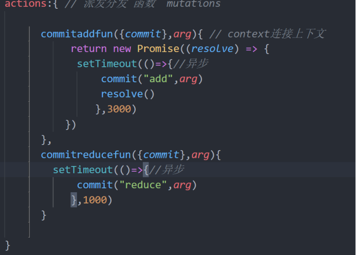

### **2，组件中调用actions中的方法**

```javascript
在组件中，调用方法，并传参即可：

this.$store.dispatch("setAgeAjax",90);
	 this.$store.dispatch("commitaddfun").then(() => {
         this.$store.dispatch("commitreducefun")
      });
```

## **6，**modules - 模块

当项目庞大，状态非常多时，可以采用模块化管理模式。Vuex 允许我们将 store 分割成模块（module）。

每个模块拥有自己的 state、mutation、action、getter、甚至是嵌套子模块——从上至下进行同样方式的分割。

```javascript
modules结构
const moduleA = {
 state: { ... },
 mutations: { ... },
 actions: { ... },
 getters: { ... }
 }
const moduleB = {
 state: { ... },
 mutations: { ... },
 actions: { ... }
 }
 
//  index.js
const store = new Vuex.Store({
 modules: {
  a: moduleA,
  b: moduleB
})

store.state.a // -> moduleA 的状态
store.state.b // -> moduleB 的状态
  <!-- 注意写法  -->
  {{$store.state.a.name}}
```

## **7, 辅助函数**

### **1，**mapState

```javascript
computed:{
      msg(){
          return "小可"
      },
      ...mapState({ //第一种
          name:state=>state.name
      }),
      ...mapState(['name']), // 第二种

      ...mapState({ // 第三种
          username:"name" // 
      })
  }
```

### **2,mapGetters**

```javascript
 ...mapGetters(['newname']), // 第一种
    ...mapGetters({
         getnewname:"newname"
})
```

### 3,mapMutations

```javascript
// ...mapMutations(['add'])// 第一种方法

    ...mapMutations({ // 第二种写法
        add:"add"
    })
```

### **4,mapActions** **异步**

```javascript
 // ...mapActions(["coadd"]) //第一种
    ...mapActions({ // 第二种
      coadd:"coadd"
    })
```

## 1，自定义指令

Vue自定义指令，有2种使用方式：fliter  filters 管道  component  components

1，全局注册

2，局部注册 

ps：指令定义 指令是告诉计算机从事某一特殊运算的代码

### 2，全局注册 指令

```vue
<script>
    Vue.directive("focus", {
        inserted: function(el){
            el.focus(); // js  input焦点
        }
    })
    new Vue({
        el: "#app"
    })
</script>
```

### 3、钩子函数

一个指令定义对象可以提供如下几个钩子函数 (均为可选)：

> bind：只调用一次，指令第一次绑定到元素时调用。在这里可以进行一次性的初始化设置。
>
> inserted：被绑定元素插入父节点时调用 (仅保证父节点存在，但不一定已被插入文档中)。
>
> update：所在组件的 VNode 更新时调用。
>
> componentUpdated：指令所在组件的 VNode 及其子 VNode 全部更新后调用。
>
> unbind：只调用一次，指令与元素解绑时调用。

### 4，钩子函数参数

> 子函数的几个参数吧。指令钩子函数会被传入以下参数:
>
> ​	el: 指令所绑定的元素，可以用来直接操作 DOM，就是放置指令的那个元素。
>
> ​		binding: 一个对象，里面包含了几个属性：
>
> ​		name：指令名，不包括 v- 前缀。
>
> ​		value：指令的绑定值，例如：v-my-directive=“1 + 1” 中，绑定值为 2。
>
> ​		oldValue：指令绑定的前一个值，仅在 update 和 componentUpdated 钩子中可用。无论值是否改变都							可用。
>
> ​		expression：字符串形式的指令表达式。例如 v-my-directive=“1 + 1” 中，表达式为 “1 + 1”。
>
> ​		arg：传给指令的参数，可选。例如 v-my-directive:foo 中，参数为 “foo”。
>
> ​		modifiers：一个包含修饰符的对象。例如：v-my-directive.foo.bar 中，修饰符对象为 { foo: true, bar: 							true }。
>
> ​		vnode： Vue编译生成的虚拟节点。移步 VNode API 来了解更多详情。
>
> ​		oldVnode：上一个虚拟节点，仅在 update 和 componentUpdated 钩子中可用。

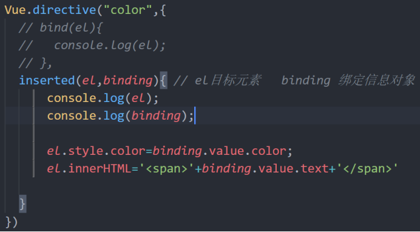

使用:

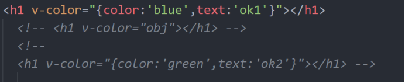


### **5，**局部注册

```vue
ethods:{
	tap1(){
		this.$store.dispatch('editAge2',17);
	}
},
directives:{
	addM:{
		inserted:function(el,binding){
			el.innerText +="m"; 
			el.style.background = 'red';
		}
	}
}
```

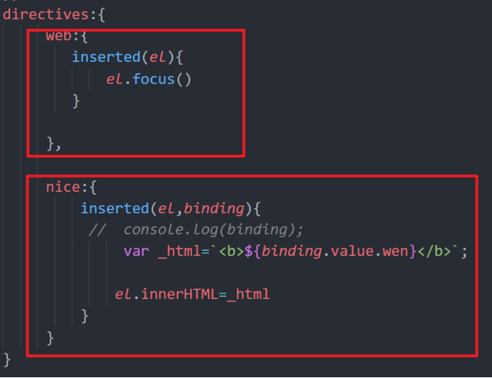

使用：

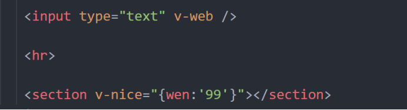


## **2**，mixin，混入

### **1，概述**

混入 (mixin) 提供了一种非常灵活的方式，来分发 Vue 组件中的可复用功能。一个混入对象可以包含任意组件选项。当组件使用混入对象时，所有混入对象的选项将被“混合”进入该组件本身的选项。

### **2，单个组件中混入**

```javascript
1）新建mix1.js
let mixin = {
  data() {
    return {
      msg: 'hello mixin'
    }
  },
}
export default mixin;

2）导入mix1.js
import mix1 from './mix1.js';

3）使用
export default {
	mixins: [mix1],
	mounted(){
		console.log(this.msg);
	}
}
```

### **3，混入注意事项**

1，混入的data数据若发生冲突，会被组件的data覆盖

2，同名钩子函数都将被调用。并且混入优先调用

### **4，全局混入**

```javascript
混入也可以进行全局注册。使用时格外小心！一旦使用全局混入，它将影响每一个之后创建的 Vue 实例。

有2种使用办法：
1）在工程的main.js中直接注册
Vue.mixin({
  created() {
    console.log('全局混入的钩子函数');
  }
});
2）模块化注册，新建mixin.js文件并添加以下代码

export default {
  install(Vue) {
    Vue.mixin({
      created() {
        console.log('全局混入的钩子函数');
      }
    })
  }
}
然后在main.js中引入该文件并使用use方法进行注册
import myMixin from './mixin.js';

Vue.use(myMixin);
```

## 3，keep-alive缓存

### **1，概述**

keep-alive 是 Vue 的内置组件，当它包裹动态组件时，会缓存不活动的组件实例，而不是销毁它们。

 例如路由跳转，当从a页面跳转到b页面，正常情况a页面是要被销毁的的，有了keep-alive，就不会销毁了。

### **2，常用属性**

1，include - 字符串或正则表达式。只有名称匹配的组件会被缓存。

2，exclude - 字符串或正则表达式。任何名称匹配的组件都不会被缓存。

3，max - 数字。最多可以缓存多少组件实例。

若不写include ，exclude ，所有组件都会被缓存

## **3，使用举例**

```javascript
1，缓存所有路由
<keep-alive>
   <router-view/>
 </keep-alive>

2，只缓存部分路由（该组件的name名称） 注意
<keep-alive include='a,b'>
   <router-view/>
</keep-alive>

3，不缓存部分路由（组件的name属性）
<keep-alive exclude='a,b'>
   <router-view/>
</keep-alive>
```

### 4，结合路由，配置缓存页面

```javascript
把需要缓存的页面，在元信息中记录下来，就可以根据情况，自动判断是否需要缓存。
{
    component: Home,
meta: {
	keepAlive: true  // 需要缓存
}
},
页面中使用
<keep-alive>
	<router-view v-if="$route.meta.keepAlive" />
</keep-alive>
<router-view v-if="!$route.meta.keepAlive">	</router-view>
```

### **5，缓存页面的生命周期**

缓存页面新增了2个生命周期，

1. activated

​	在 keep-alive 组件激活时调用

2. deactivated

​	在 keep-alive 组件停用时调用

