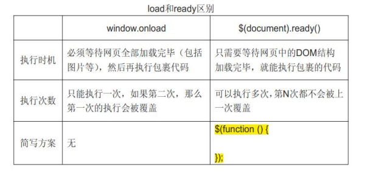
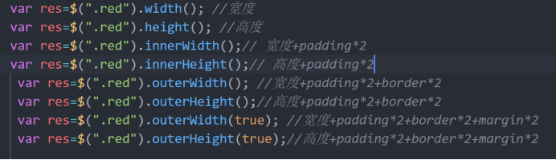
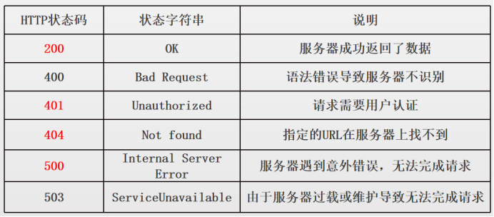
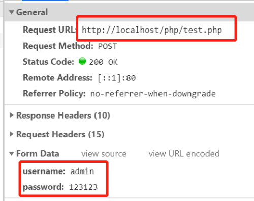
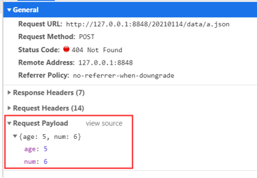
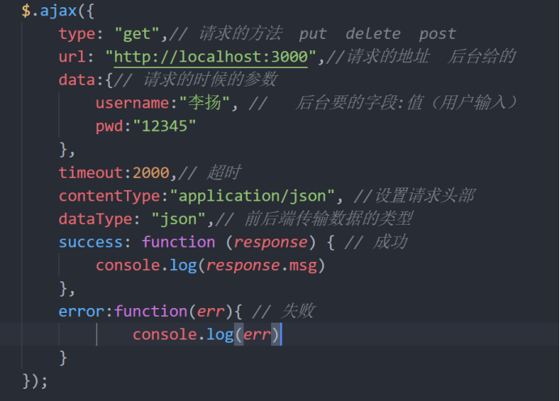
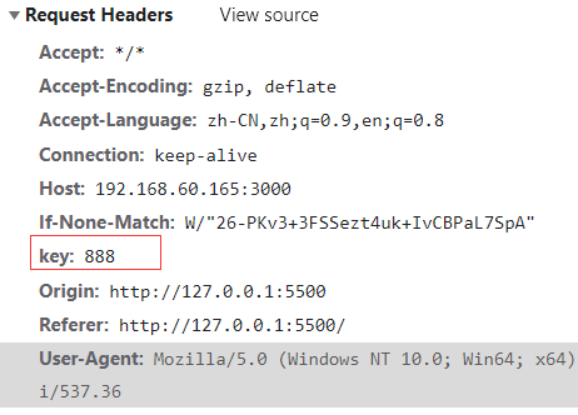
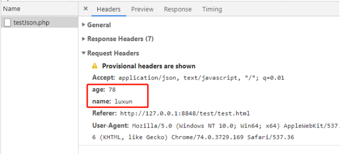

# jQuery

通过 jq，您可以选取HTML 元素，并对它们进行操作。

```javascript
语法：$(“选择符”).action()；
```

1，$，美元符号，对jq的引用（全称：jQuery），工厂函数

2，选择符（selector）"查询"和"查找" HTML 元素

3，action，对元素的操作

```javascript
	 $(function(){//相当于 window.onload 页面元素加载完成之后
          //todo
      })
```


# jQeruy选择器

```javascript
<script src="./js/jquery-1.8.3.min.js"></script>
$(“#元素id”)
```

```javascript
$(".ok>div").css("background","red") 直系选择器
$(".ok+li").css("background","red") 兄弟选择器
$("div span").css("background","red") 后代选择器
$("div[data-ok=ok]").css("background","yellow") 属性选择器
$("#ok").css("background","red") id选择器
$(".ok").css("background","red") clss选择器
$("div").css("background","blue") 标签选择器
$("li,span,b").css("color","green") 分组选择器
$("ul li:odd").css('background',"red") 奇数
$("ul li:even").css('background',"blue") 偶数

$("p:even")；偶数选择器
//选择偶数位置的p元素，从0开始
$("p:odd")；奇数选择器
//选择奇数位置的p元素，从0开始
```

# 元素隐藏显示

hide、show、toggle	右下到左上

slideUp , slideDown,slideToggle  ， 收起放下

fadeIn ， fadeOut ，fadeToggle  淡入淡出

## hide，隐藏元素

```javascript
通过 jq的hide（）函数，可以对所选元素进行隐藏。

语法：$(“选择器”).hide();
		hide（）函数的本质，就是：display：none；

例如：
		$(“#x1”).hide();//隐藏di为x1标签
        $("div").hide(1000, function () {
              alert("nice")
         })

PS：对比原生js的实现过程，感受jq带来的便利
```

## show，显示元素

```javascript
通过 jq的show（）函数，可以对所选元素进行显示。

	语法：$(“选择器”).show();

	show（）函数的本质也是操作display属性；

例如：
$(“#x1”).show();//显示id为x1标签
  $("div").show(2000) //2秒持续时间
```

## **toggle，自动切换**

```javascript
自动切换 hide() 和 show() 方法。
	$(“#x1”).toggle();//自动切换
```

slideUp 向上收起

slideDown 向下放下

slideToggle  切换

## fadeIn，淡入  

 ```javascript
	语法：
	$(selector).fadeIn(speed,callback)；

speed参数：毫秒 （比如 1500），slow，normal，fast  
callback，淡出动画执行完之后，要执行的函数。
 ```

## fadeOut，淡出

```javascript
	语法：
	$(selector).fadeOut(speed,callback)；
```

## fadeToggle，淡入淡出

```javascript
fadeToggle() 方法可以在 fadeIn() 与 fadeOut() 方法之间进行切换。
	$(selector).fadeToggle(speed,callback);
```


## stop()

```javascript
当用户多次快速点击一个按钮触发一个动画时，如果没有调用stop()函数，这个动画将会不断地重复进行，可能会导致UI异常或者性能问题。因此，在用户交互的过程中，我们可以在动画执行前先调用stop()方法停止之前的动画，确保每次只有一个动画在执行。
	$(".small_box").click(function () {

        $('ul').slideUp(500)

        $(this).siblings().stop().slideToggle(500)
    })
```


```javascript
<style>
        .box {
            width: 100px;
            height: 100px;
            background: red;
        }
    </style>
</head>

<body>
    <button id="hide">隐藏</button>
    <button id="show">显示</button>
    <hr>
    <button id="btn">toggle</button>
    <div class="box">内容</div>
    <script src="./js/jq.js"></script>
    <script>
        $(function () {
            $("#hide").click(function () {
                //   $("div").hide(1000,function(){
                //       alert("nice")
                //   })
                $("div").slideUp(1000)
            })


            $("#show").click(function () {
                // $("div").show(2000)
                $("div").slideDown(2000)
            })

            $("#btn").click(function () {
                // $("div").toggle(1000) //show hide
                $("div").slideToggle(1000)// slideUp slideDown
            })

        })
 </script>
```

## eq函数


```javascript
<style>
        ul li {
            display: none;

        }

        ul li:nth-child(1) {
            display: block;
        }
    </style>
</head>

<body>

    <span>tab1</span><span>tab2</span>

    <ul>
        <li>
            第一个内容
        </li>
        <li>
            第二个内容
        </li>
    </ul>

    <script src="./js/jq.js"></script>
    <script>
        $(function () {
            // index 下标
            // eq() 找标签，通过下标
            // html() 内部内容
            // text() 文本
            // siblings() 哥哥弟弟们 不包括自己
            $("span").click(function () {
                //   console.log(this);//js
                // console.log($(this).html());
                let index = $(this).index();
                // $("ul li").hide();
                // 链式调用
                // $("ul li:eq("+index+")").show().css('background',"red").html('真棒')
                $("ul li:eq(" + index + ")").show().siblings().hide()
            })
        })
</script>
```

# 事件

## 鼠标

mouseenter和mouseleave在进入离开子盒子**不会**触发

```javascript
	$(".box").mouseenter(function () {
	    console.log("进入");
	})
	$(".box").mouseleave(function () {
	    console.log("离开");
	})
```

mouseover和mouseout在进入离开子盒子**会**触发

```javascript
	$(".box").mouseover(function () {
     console.log("进入");
	})
	$(".box").mouseout(function () {
    console.log("离开");
	})
```

e,event,target,$(this)

```javascript
	<style>
        .box {
            width: 100px;
            height: 100px;
            background: red;
            padding: 20px;
        }
    </style>
<div class="box">
        <button id="btn">单机888</button>
    </div>
    <script src="./js/jq.js"></script>	
 <script>
$("#btn").click(function (e) {
       let text = $(this).text();
       console.log(text);
       console.log("触发");
       console.log(e.target.innerText);
       console.log(event.target.innerText);//target目标元素，按钮这个元素
    })
</script>
```

```javascript
<!DOCTYPE html>
<html lang="en">

<head>
    <meta charset="UTF-8">
    <meta http-equiv="X-UA-Compatible" content="IE=edge">
    <meta name="viewport" content="width=device-width, initial-scale=1.0">
    <title>Document</title>
    <style>
        .box {
            width: 100px;
            height: 100px;
            background: red;
            padding: 20px;
        }
    </style>
</head>

<body>


    <div class="box">
        <button id="btn">单机888</button>
    </div>
    <script src="./js/jq.js"></script>
    <script>
        $(function () {
            $("#btn").click(function (e) {
                let text = $(this).text();
                console.log(text);
                console.log("触发");
                console.log(e.target.innerText);
                console.log(event.target.innerText);//target目标元素，按钮这个元素
            })
            //   $("#btn").click()

            // $("#btn").trigger("click")

            // $("#btn").dblclick(function(){
            //       console.log("ok");
            // })
            //             

            // mouseleave，mouseenter，鼠标进入离开，触发1次鼠标
            // $(".box").mouseenter(function () {
            //     console.log("进入");
            // })
            // $(".box").mouseleave(function () {
            //     console.log("离开");
            // })


            // $(".box").mouseover(function () {
            //     console.log("进入");
            // })
            // $(".box").mouseout(function () {
            //     console.log("离开");
            // })


            // $(".box").mousedown(function () {
            //     console.log("down");
            // })
            // $(".box").mouseup(function () {
            //     console.log("up");
            // })
        })
    </script>
</body>

</html>
```

## 表单事件

```javascript
	$("#inp")attr.("type",'password') //更改属性
	$("#inp").val()  //获取value 值
	$("#username").val("jack"); //更改value值
	 $("#username").val("");	//清空value值
	$"(#inp")attr.("data-age","") //清空属性
	$("#username").removeAttr("data-age") // 删除属性
	$("#inp").html()
	$("#inp").text()

	$("#address").change(function(){ //内容变更
         let  val=$(this).val();
         console.log(val);
     })

	$("#username").focus(function(){ //获取焦点
      console.log("获取焦点");
 	})

	 $("#username").blur(function () {  //失去焦点
        console.log("失去焦点");
    })

		//onsole.log($("#username")[0])//jQ 更改为 js
     $("#username")[0].oninput=function(){
            console.log($(this).val());
     }
```


```javascript
	<input id="username" name="user" value="小明" type="text"><br>
    <button id="changName">改变-jack</button>
    <button id="clearBtn">清空</button>
    <hr>
    <!-- 失去焦点 -->
    <!-- 改变 -->
    <select id="address">
        <option value="郑州">郑州</option>
        <option value="洛阳">洛阳</option>
        <option value="南阳">南阳</option>
    </select>
<script>
       $("#username").attr("type", "password") //
            
</script>
```

## 键盘事件

```javascript
$("#id").keydown(function(){
    console.log("1")
})

$("#id").keyup(function(){
    console.log("2")
})

event.keyCode，区别按下了哪个键
```

## 加载事件

$(document).ready与 window.onload



```javascript
		window.onload = function () {
            console.log(1);
        }
        window.onload = function () {
            console.log(2);
        } 
//结果是2

	    $(function () {
            $(document).ready(function () {
                console.log(3);
            })
        })
        $(function () {
            $(document).ready(function () {
                console.log(4);
            })
        })
//结果 3，4

```

## 窗口事件

当调整浏览器窗口大小时，发生 resize 事件。

```javascript
$(window).resize(function(){
	console.log(111);
})
```

## 滚动事件

当用户滚动指定的元素时，会发生 scroll 事件。该事件适用于所有可滚动的元素和 window 对象

```javascript
1，浏览器滚动
	$(window).scroll(function(){
		console.log(111);
	})

2，指定dom滚动
	$("#x1").scroll(function(){
		console.log(111);
	})

原生js：window.onscroll=function(){
    
			};		
```


# animate动画

通过animate方法，允许用户创建自定义动画

```javascript
	语法：$(selector).animate({params},speed,callback);
params ，必填，参数定义形成动画的 CSS 属性。
speed ，可选，参数规定效果的时长。它可以取以下值："slow"、"fast" 或毫秒。
callback 可选，参数是动画完成后所执行的函数名称。

	例如：
$("div").animate({height:'200px'});
$("div").animate({  	//操作多组样式：
    left:'250px',
    opacity:'0.5',
    height:'150px',
    width:'150px'
  });
```

组合属性

```javascript
$("div").animate({
    ‘font-size’:'250px',
    fontSize:'100px'
  });
```

动画不能改颜色需要去jQuery官网下载插件


# 获取元素

## text() 

## html() 

## val()

## attr( )

```javascript
$(“选择器”).attr(“属性名”)；
	$(“#x1”).attr(“age”,”red”)；	
```

## 创建元素

jq中，有2种办法创建元素：

1，jq法

```javascript
var txt2=$("<p>1111</p>");
```

2，直接添加dom格式的字符串


## 追加节点

```javascript
1,追加子节点
	append()
语法：$（父选择器）.append(目标元素)；
ps：目标元素，可以是dom格式的字符串，也可以是元素选择器

	appndTo()
语法：$(目标元素).appendTo(父选择器)
把目标元素，作为子元素，加入到父选择器的最后边

	prepend() - 内部开头添加
把目标元素，作为子元素，加入到父选择器的最前边
语法：$(父选择器).appendTo(目标元素)

	prependTo() - 内部开头添加
把目标元素，作为子元素，加入到父选择器的最前边
语法：$(目标元素).prependTo(父选择器)

2，追加兄弟节点
	after() - 后面添加兄弟元素
把目标元素，作为兄弟元素，加入到兄弟元素的后面
语法：$(兄弟选择器).after(目标元素)

	insertAfter
把目标元素，作为兄弟元素，加入到兄弟元素的后面
语法：$(目标元素).insertAfter(兄弟选择器)

	before() - 前面添加兄弟元素
把目标元素，作为兄弟元素，加入到兄弟元素的前面
语法：$(兄弟选择器).before(目标元素)

	insertBefore
把目标元素，作为兄弟元素，加入到兄弟元素的前面
语法：$(目标元素).insertBefore(兄弟选择器)


```

## 删除元素

```javascript
	remove()
删除目标元素
语法：$(目标元素).remove()；
```

## 元素节点查找

```javascript
获取父节点
	parent（），
寻找当前节点的1级父节点
语法：$(“选择器”).parent();
ps：可多次使用parent()，一直向上寻找父节点
	Parents() 寻找全部父级
   
获取子节点
	children（）函数
此函数只会寻找一级孩子
语法：$(“选择器1”).children(“选择器2”)；
说明：
	1，寻找选择器1下的一级孩子，并且这些孩子满足选择器
	2，若选择2为空，会选择所有孩子。
    
获取兄弟节点
siblings()，获取所有兄弟节点，不包括它自己
next（）；获取下一个兄弟节点
nextAll（）；获取所有跟随它的兄弟元素。
prev（），获取上一个兄弟节点
prevAll（）；获取所有它上面的兄弟元素。

find()方法
语法：$(“#x1”).find（“p”）;
	find() 方法返回被选元素的后代元素，不限层级。
	注：若子元素有iframe，不会检索iframe内部。
    
contents()方法 
查找匹配元素内部所有的子节点（包括文本节点）

其它选择器
1，$(“p:eq(0)”);//下标等于
2，$(“p:gt(2)”);//下标大于
3，$(“p:lt(2)”);//下标小于

4，并集选择器，$(“.x1，.x2”)；
```

# jq、js对象之间的转化

```javascript
1，将JQ对象转成JS对象
 	var $div = $("#div1");
	 var jsObj  =  jqObj.get(0); //或者用var jsObj = jqObj[0];

2，将JS对象转换成JQ对象
	对 js 对象，使用 $ 符包裹即可
	var jqObj = $(jsObj);
	总结：
	JQ=>js  一定要加下标
	Js=>jQ 加$符号
```

# 设置css样式

## 获取css() 属性

css() 方法返回元素的一个css样式属性。不限行内样式

1，获取css属性，若有多个元素，会用第一个的

```javascript
$(“.x1”).css(“left”);

2，属性名若带中划线-，可以直接携带，也可以使用驼峰命名法
	var a = $(“.x1”).css(“background-color”);
	var ab= $(“.x1”).css(“backgroundColor”);
```

## 设置css() 属性

css() 方法设置元素的一个或多个样式属性。

1，设置一个样式

```javascript
写法1
	$(“.x1”).css(“left”，“200px”);
写法2
	$("div").css({
		"background-color":"red"
	});
```

2，设置多个样式

```javascript
$("div").css({
	"background-color":"red",
	margin:"100px"

});
```

## **操作 class 类**

### 添加class

向元素添加一个或多个类，若此类已存在，会自动忽略。

多个class，用空格隔开。

```javascript
$(“#x1”).addClass(“active”);
 $(“#x1”).addClass(“f1 f2”);
```

### removeClass

向元素删除一个或多个类，若此类不存在，会自动忽略。

多个class，用空格隔开。

```javascript
$(“#x1”).removeClass(“f1”);
$(“#x1”).removeClass(“f1 f2”);
```

### 切换class

若目标class存在，就删除，不存在就添加

```javascript
$(“#x1”).toggleClass(“active”);
```

## jq操作元素尺寸

width()

height()

innerWidth()

innerHeight()

outerWidth()

outerHeight()



设置元素尺寸

这里以width为例，可以设置元素的宽度：

```javascript
语法：$(“选择器”).width(100)；
注意：若不写单位，默认是px像素
```

读取浏览器可视尺寸

```javascript
1，宽度，$(window).width();
2，高度，$(window).height();
```

读取文档尺寸

```javascript
1，宽度，$(document).width();
2，高度，$(document).height();
```

## jq获取文档滚动距离

```javascript
var h = $(document).scrollTop();
```


# Ajax

HTTP状态码，英语名称是：HTTP Status Code，即：超文本传输协议响应状态数字代码，它由3位数字组成，代表服务器通知客户端，本次请求的处理情况，后台程序员可自由定义。

 

此码总共有5个系列：

1xx，通知

2xx，成功

3xx，重定向

4xx，客户端错误

5xx，服务端错误





什么是跨域？ 协议  ip  端口号 有一个不一样就会跨域

怎么解决跨域？

1，谷歌浏览器设置

只适用于自己在本地开发，前台自己搞定，不需要后台配合，简单方便

2，jsonp

只适用于get请求，前台需要处理，还需要后台配合

3，后台解决

完美方案，只需要后台设置即可。

4，其它解决方案

Vue，react跨域配置，proxy

5，ngix反向代理


## 使用jQuery的ajax

一个最简单的ajax请求，必须包括以下几部分：

1，url，请求数据的地址

2，success，请求成功之后的回调函数，它有一个参数，里面记录了服务器的返回内容。

```javascript
举例：
$.ajax({
	url:"http://192.168.60.105/news/get_news.php",
	success:function(r){
		console.log(r);
	}
})
```

## ajax常用参数

1，type

ajax的请求方式，包括数据参数怎么传输，总共有4种方式，其实用哪种都可以，他们的区别是参数可携带的多少与语义化。

取值枚举与特性：

1、get（默认值），携带的参数会在url中显示，数据量最大1k，速度快，由于参数明码显示，所以不安全。

2、post，参数不显示在url中，数据量最大2M。速度没有get快。

3，put，语义化，向数据库放入东西，参考post

4、delete，语义化，删除某个数据，参考post


2，data

发送到服务器的数据。一般是一个对象，或者对象格式的字符串，

````javascript
例如：
$.ajax({
	url:”a.php”,
	data:{
		name:”wsx”,
        age:79
	}
})

var obj = {
	name:”wsx”,
	age:79
}
$.ajax({
	url:”a.php”,
	data:JSON.stringify(obj)
)
````

3,dataType

预期服务器返回的数据类型。如果不指定，jq将自动判断。

常用的取值：

json，返回 JSON 数据

html，返回纯文本 HTML 信息

text，返回纯文本字符串

xml， XML 数据，可用 jQuery 对象进行解析 

```javascript
举例：
$.ajax({
	url:”a.php”，
	dataType:”json”
})
```

4,contentType

发送信息至服务器时内容编码类型。这个请求头的目的是告诉服务器端，我的请求参数是什么格式的数据，你要按照对应的格式去处理。

取值枚举：

​	1，application/x-www-form-urlencoded（默认值）

```javascript
$.ajax({
	url:"http://localhost/php/test.php",
	dataType :"json",
	contentType:'application/x-www-form-urlencoded',
	data:obj,
	success:function(r){
		console.log(r);
        }
})
```



  2，application/json

不支持get

​	告诉服务端，消息主体是：序列化后的 json 字符串

​	控制台参数与地址截图：

```javascript
$.ajax({
	url:"http://localhost/php/test.php",
	type:"post",
	contentType:'application/json',
	data:JSON.stringify(obj),
	success:function(r){
		console.log(r);
	}
})
```



5,timeout，请求超时

```javascript
1，timeout，设置请求超时时间（毫秒）
	$.ajax({
		timeout:2000
	})
```

6,error

此函数接收3个参数：XMLHttpRequest 对象、错误信息、（可选）捕获的异常对象。

触发error的原因：

1，timeout超时时

2，跨域时

3，预期数据返回类型不一致时




# 语法糖

## $.get

$.get() 方法，使用 HTTP GET 请求从服务器加载数据。

```javascript
语法：
	$.get(url，data，callback，dataType)

url，接口地址
data，接口参数（可选）
callback，接口成功返回后的回调（可选）
dataType，预期服务器返回的数据类型（可选）

使用举例
	 $.get("http://192.168.60.165:3000",{name:"jack"},function(res){
  	  console.log(res)
	},'json')
```

## $.post

$.post() 方法，使用 HTTP POST 请求从服务器加载数据。

```javascript
语法：
	$.post(url，data，callback，dataType)

url，接口地址
data，接口参数（可选）
callback，接口成功返回后的回调（可选）
dataType，预期服务器返回的数据类型（可选）

使用参考：$.get
	$.post("http://192.168.60.165:3000",{name:"jack"},function(res){
  	  console.log(res)
	},'json')
```

## $.getJSON

$.getJSON()方法，使用 AJAX 的 HTTP GET 请求获取 JSON 数据。

```javascript
语法：
	$.getJSON(url,data,success(r){
              
              }) 
    
url，接口地址
data，接口参数（可选）
success，接口成功返回后的回调（可选）

	$.getJSON("http://192.168.60.165:3000",{name:"lucy"},function(r){console.log(r)})
```

## headers参数

### headers参数简介

在ajax请求中，还有一种传参方式：headers传参，请求截图如下：



### 添加headers参数

有两个办法可以添加headers参数，

 

方式1：直接在ajax请求中，写入headers参数：

```javascript
$.ajax({
	url:”a.php”,
	headers:{
		age:78，
		name:”luxun”
	}
})
```

直接在参数中输入headers参数键值对即可

方式2：ajax发起请求之前，拦截一下，强制设置参数：

```javascript
$.ajax({
	beforeSend: function(request) {
		request.setRequestHeader("age",78);
		request.setRequestHeader("name","luxun");
	}
})
```



# $.extend

1，jq的extend方法

此方法可合并对象的属性和方法，并返回合并后的对象。

```javascript
语法：$.extend(obj1,obj2,obj3,...)；
```

注意：此函数会把后面的参数的属性和方法合并到第一个参数上，并且后面参数的优先级高，他会改变obj1

2，使用

```javascript
var a = {age:12};
var b = {num:89,age:12}
var c1 = $.extend(a,b);
//var c2 = $.extend({},a,b);

var  obj={...stu,...stu2}; es6
 var obj= $.extend({},stu,stu2); //jquery
如果键名一样就会 造成覆盖
```


# bind方法

bind() 方法为被选元素添加一个或多个事件处理程序，并规定事件发生时运行的函数。有2种语法形式：

## **语法1**

```javascript
$(选择器).bind(event,data,function)

参数解释：
event）必需。规定添加到元素的一个或多个事件。由空格分隔多个事件。必须是有效的事件。
data）可选。规定传递到函数的额外数据。
function）必需。规定当事件发生时运行的函数。
其中data，可以通过事件对象e.data接收
```


例如：

```javascript
	$("#x1").bind(“click”,function(){});
	$("#x1").bind(“click”,{age:6},function(e){
			log(e.data);
	});

	$("#x1").bind(“click mouseover”,{age:6},function(e){
		log(e.data);
	});
```

## **语法2**

 ```javascript
$(selector).bind({event:function, event:function, ...})
 ```

例如：

```javascript
$("#btn").bind({
	click:function(){
		console.log(1);
	},
	dblclick:function(){
		console.log(2);
	}
})
```

# **自动触发事件**

可以用trigger()方法可以自动触发事件。

```javascript
$('#btn').trigger("click");
$('#btn').click();
```

# **unbind，移除事件**

```javascript
unbind(type) //data是要移除的函数
$('#btn').unbind("click"); //移除click

 $("#btn").unbind("click mouseover") //空格

$('#btn').unbind(); //移除所有
```

ps：jQuery的移除事件办法，无法移除原生js添加的事件

# on() 添加事件

on方法在被选元素及子元素上添加一个或多个事件处理程序。

自 jQuery 版本 1.7 起，on() 方法是 bind()、live() 和 delegate() 方法的新的替代品。该方法给 API 带来很多便利，我们推荐使用该方法，它简化了 jQuery 代码库。

可处理动态dom失效问题

```javascript
举例：
	$("#f1").on("click",function(){
		console.log(1);
	});

	$("#f1").on("click",function(){
		console.log(2);
	});

	$(doucument).on(“click”,”目标元素”,function(){
	})
```

# off移除事件

不管同一类型的事件添加多少次，使用此方法，会移除所有指定类型的事件。

```javascript
	$("button").click(function(){
  	  $("p").off("click");
	});
给谁绑定给谁解绑
```

# **jQuery的each方法**

```javascript
1，循环dom
each() 方法为每个匹配元素规定要运行的函数。
语法：$(selector).each(function(index,element))

1，index - 选择器的 index 位置。
2，element - 当前的元素（也可使用 "this" 选择器）

2，循环数组
var myArray = ["apple", "mango", "orange", "grapes", "banana"];

$.each(myArray, function (index, value) {
  console.log(index+' : '+value);
});

3，循环对象属性
方法也会被循环出来
var myArray = {
	age:6,
	num:7,
	say:function(){
		console.log(22);
	}
};
$.each(myArray, function (index, value) {
  console.log(index+' : '+value);
});
```

