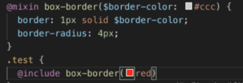

Css样式中能不能写变量 能不能写函数 能不能模块化 能不能嵌套

 Sass 预处理器  最后都会webpack 编译成 css

## 创建项目选择sass  css预处理器


## 变量的使用

（1）以$开头声明变量


2）变量具有作用域的。

3）变量中连接符中划线和下划线是互通的。


##  样式嵌套

```scss
.ok{
  color: #F90;
  span{
    color: red;
  }
&:hover{
  Color:yellow
}
}
.ok:hover{}
.ok {
    Color:#f90
}
.ok span{}
```

这种嵌套的规则，也可以应用于伪类，在sass用“&”指代了外层的选择器，例如在a标签中，添加hover的效果：

##  混入样式的关键字是mixin和include，

这是一个强大的功能，可以类似于函数一般复用代码并通过参数个性化，例如，有一个通用的边框样式：


或者可以使用参数



以上是默认边框颜色是#ccc，在使用box-border时不传入颜色将默认为#ccc，上面传入了一个值为red的颜色值，则最终的颜色值为red。

## 样式继承


上面是一个简单例子，只为说明继承的作用，在.test中继承了.test-border，最终会拷贝.test-border的样式到.test中。

## 导入文件

导入文件的关键字是import，在sass中可以导入sass文件,也可以导入css文件，省略文件名时，默认导入sass文件。导入时语法如下：

`@import "xxx.scss"`

##  全局导入 

scss 在 vue.config.js  项目启动马上加载无需在 main.js导入

` // 注意：在 sass-loader v7 中，这个选项名是 "data"`

```scss
css: {
        loaderOptions: {
        sass: {
         additionalData: `@import "~@/assets/css/index.scss";`
         },
          scss: {
            data: `@import "~@/assets/css/index.scss";`
          },
          less:{
            globalVars: {
              primary: '#fff'
            }
          }
        }, // Enable CSS modules for all css / pre-processor files. // This option does not affect *.vue files.
      },
```


