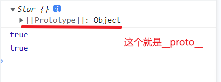
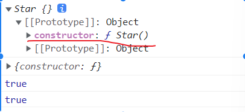
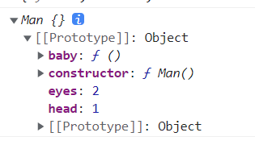

构造函数每实例一个对象就在 栈中创建一个地址 指向 堆中的复杂数据类型，

​	如：  

```javascript
	function Star(uname, age) {
            this.uname = uname
            this.age = age
            this.sing = function () {
                console.log('唱歌');
            }
        }
 	const ldh = new Star('刘德华', 55)
	const zxy = new Star('张学友', 50)
    
     console.log(ldh === zxy); // false
 console.log(ldh.sing === zxy.sing);//false

```

原型对象

JavaScript 规定，每一个构造函数都有一个 prototype 属性，指向另一个对象，所以我们也称为原型对象

我们可以把那些不变的方法，直接定义在 prototype 对象上，这样所有对象的实例就可以共享这些方法。

```javascript
	function Star(uname, age) {
            this.uname = uname
            this.age = age            
        }

	 Star.prototype.sing = function () {
            console.log('唱歌');
        }

	console.log(ldh.sing === zxy.sing); // true

	console.log(ldh === zxy); // false
```

**注意：**公共的属性写到 构造函数上  公共的方法写到 原型对象身上


**构造函数 this 和原型对象里面的函数 this都指向实例对象** 

构造函数 this 指向 实例对象 

```javascript
 		let that
        function Star(name) {
            that = this
            this.uname = name
        }
	 const ldh = new Star('刘德华')
     console.log(that === ldh) // true

 	 console.log(ldh.uname);//刘德华
```

原型对象里面的 this 指向调用者 也就是实例对象

```javascript
		let that
        function Star(name) {
            this.uname = name
        }
        //原型对象里面的函数 this 指向的还是 实例对象 ldh
        Star.prototype.sing = function () {
            that = this
            console.log('唱歌')
        }

		 const ldh = new Star('刘德华')
         ldh.sing()//原型对象里面的函数 this 指向调用者 也就是实例对象 ldh
         console.log(that === ldh) // true         
```


**constructor**

每个原型对象里面都有一个constructor属性

constructor的作用：该属性指向该原型对象的构造函数， 简单理解，就是指向我的爸爸，我是有爸爸的孩子    让原型对象能找到自己的构造函数

```javascript
		function Star() {

        }
	console.log(Star.prototype.constructor === Star); // true
```

constructor的使用

```javascript
		function Star() {

        }
//给Star的原型挂载函数
		Star.prototype.sing = function () {
            console.log('唱歌');
        }

        Star.prototype.dance = function () {
            console.log('跳舞');
        }
		console.log(Star.prototype);//{sing: ƒ, dance: ƒ, constructor: ƒ}

//每次挂载比较麻烦，所以可以给Star的原型上挂载个对象
		Star.prototype = {
            sing: function () {
                console.log('唱歌');
            },
            dance: function () {
                console.log('跳舞');
            }
        }
	//但是有个问题
    console.log(Star.prototype);//{sing: ƒ, dance: ƒ} 没有了constructor: ƒ指回构造函数

//所以要添加constructor指回构造函数
		Star.prototype = {
            constructor: Star，
            sing: function () {
                console.log('唱歌');
            },
            dance: function () {
                console.log('跳舞');
            }
        }
//多个方法一起添加，其实是赋值操作会把 constructor 覆盖掉        
```


**对象原型**

构造函数可以创建实例对象，构造函数还有个原型对象，一些公共的属性和方法放在原型对象上，但是为什么实例对象可以访问原型对象里的属性和方法呢？

实例对象都会有一个属性 `__proto__` 指向构造函数的 prototype 原型对象，之所以我们对象可以使用构造函数 prototype 原型对象的属性和方法，就是因为对象有 `__proto__ `原型的存在。

```javascript
		function Star() { }
        const ldh = new Star()
        console.log(ldh);
```



- `__proto__ `是JS非标准属性

- [[prototype]]和`__proto__ `意义相同

- 用来表明当前实例对象指向哪个原型对象prototype

- `__proto__ `对象原型里面也有一个 constructor属性，指向创建该实例对象的构造函数

  ​			

  `__proto__ `只读，不能修改

  

```javascript
		//对象原型 __proto__指向 该构造函数的原型对象
		function Star() {
            
        }
		const ldh = new Star()
		 console.log(ldh.__proto__);//{constructor: ƒ}
		console.log(ldh.__proto__ === Star.prototype); // true

		// 对象原型里也有constructor 指向 构造函数 Star
        console.log(ldh.__proto__.constructor === Star);  // true
```




**原型继承**

```javascript
<script>
        //女人 构造函数
        function Woman() {
            this.eyes = 2
            this.head = 1
        }

        const red = new Woman()
        console.log(red);


        //男人构造函数
        function Man() {
            this.eyes = 2
            this.head = 1
        }

        const pink = new Woman()
        console.log(pink);

    </script>
```

继续抽取

```javascript
    <script>
        //让男人构造函数和女人构造函数继承 Perosn
        const Person = {
            eyes: 2,
            head: 1
        }

        //女人 构造函数
        function Woman() {

        }

        const red = new Woman()
        console.log(red);

        //男人 构造函数
        function Man() {

        }

        const pink = new Woman()
        console.log(pink);

    </script>
```

原型继承

```javascript
<script>
        //让男人构造函数和女人构造函数继承 Perosn
        //公共的部分放到原型上
        const Person = {
            eyes: 2,
            head: 1
        }

        //女人 构造函数  继承Person
        function Woman() {
        }

        //Woman通过原型继承 Person
        Woman.prototype = Person

        const red = new Woman()
        console.log(red);
        console.log(red.eyes); // 2

        //男人 构造函数  继承Person
        function Man() {
        }

        const pink = new Man()
        console.log(pink);
</script>
```

但是有个问题

```javascript
console.log(Woman.prototype); //{eyes: 2, head: 1} 没有了constructor指回构造函数
```

给`Woman.prototype`添加`constructor = Woman`指回构造函数

```javascript
<script>
        //让男人构造函数和女人构造函数继承 Perosn
        //公共的部分放到原型上
        const Person = {
            eyes: 2,
            head: 1
        }

        //女人 构造函数  继承Person
        function Woman() {
        }

        //Woman通过原型继承 Person
        Woman.prototype = Person
        //指回原来的构造函数
        Woman.prototype.constructor = Woman

        const red = new Woman()
        console.log(red);
        console.log(red.eyes); // 2

        //原型继承的问题：
        // console.log(Woman.prototype); //{eyes: 2, head: 1} 没有了constructor指回构造函数
        console.log(Woman.prototype) //{eyes: 2, head: 1, constructor: ƒ}

        //男人 构造函数  继承Person
        function Man() {
        }

        const pink = new Man()
        console.log(pink);
</script>
```

有一个问题 : 单独给Woman的`prototype`添加方法，Man也会有这个方法

```javascript
<script>
        //让男人构造函数和女人构造函数继承 Perosn
        //公共的部分放到原型上
        const Person = {
            eyes: 2,
            head: 1
        }

        //女人 构造函数  继承Person
        function Woman() {
        }

        //Woman通过原型继承 Person
        Woman.prototype = Person
        //指回原来的构造函数
        Woman.prototype.constructor = Woman

        //给女人添加一个方法
        Woman.prototype.baby = function () {
            console.log('baby');
        }

        const red = new Woman()
        console.log(red);
        console.log(red.eyes); // 2
        red.baby() //baby

        //原型继承的问题：
        // console.log(Woman.prototype); //{eyes: 2, head: 1} 没有了constructor指回构造函数
        console.log(Woman.prototype) //{eyes: 2, head: 1, constructor: ƒ}

        //男人 构造函数  继承Person
        function Man() {
        }
        Man.prototype = Person
        Man.prototype.constructor = Man

        const pink = new Man()
        console.log(pink);
    </script>
```



原因：原型链.ddd文件

[]: C:\Users\25226\Desktop\Note\file\原型链.ddd

解决办法：给他们不同的对象 Person1,Person2 

```javascript
<script>
        //让男人构造函数和女人构造函数继承 Perosn
        //公共的部分放到原型上
        const Person1 = {
            eyes: 2,
            head: 1
        }
        const Person2 = {
            eyes: 2,
            head: 1
        }

        //女人 构造函数  继承Person
        function Woman() {
        }

        //Woman通过原型继承 Person
        Woman.prototype = Person1
        //指回原来的构造函数
        Woman.prototype.constructor = Woman

        //给女人添加一个方法
        Woman.prototype.baby = function () {
            console.log('baby');
        }

        const red = new Woman()
        console.log(red);
        console.log(red.eyes); // 2
        red.baby() //baby

        //原型继承的问题：
        // console.log(Woman.prototype); //{eyes: 2, head: 1} 没有了constructor指回构造函数
        console.log(Woman.prototype) //{eyes: 2, head: 1, constructor: ƒ}

        //男人 构造函数  继承Person
        function Man() {
        }
        Man.prototype = Person2
        Man.prototype.constructor = Man

        const pink = new Man()
        console.log(pink);
    </script>
```

这样Man里就不会有baby方法  但是这样就麻烦

 构造函数new出来的对象 结构一样 对象不一样  这样就能解决这个问题`lhg==zxy //false`

用构造函数

```javascript
  <script>
      //继续抽取  构造函数new出来的对象 结构一样 对象不一样
        function Perosn() {
            this.eyes = 2
            this.head = 1
        }
	
		// console.log(new Perosn());
        // let a = new Perosn()
        // let b = new Perosn()
        // console.log(a === b);//false

       //女人 构造函数  继承Person
        function Woman() {
        }

        //Woman通过原型继承 Person
        Woman.prototype = new Perosn()
        //指回原来的构造函数
        Woman.prototype.constructor = Woman

        //给女人添加一个方法
        Woman.prototype.baby = function () {
            console.log('baby');
        }

        const red = new Woman()
        console.log(red);
        console.log(red.eyes); // 2
        red.baby() //baby

        //原型继承的问题：
        // console.log(Woman.prototype); //{eyes: 2, head: 1} 没有了constructor指回构造函数
        console.log(Woman.prototype) //{eyes: 2, head: 1, constructor: ƒ}

        //男人 构造函数  继承Person
        function Man() {
        }
        Man.prototype = new Perosn()
        Man.prototype.constructor = Man

        const pink = new Man()
        console.log(pink);
</script>
```


----


构造函数 Star

Star.propotype (原型)

 const ldh = new Star() 

ldh 实例对象


ldh._ _propotype__指向原型 也就是Star.propotype

Star.prototype里有个constructor属性 属性值是 Star这个构造函数。


---


对象原型 _ _proto__指向 该构造函数的原型对象

```javascript
console.log(ldh.__proto__ === Star.prototype); // true
```

对象原型里有constructor 指向 构造函数 Star

```javascript
 console.log(ldh.__proto__.constructor === Star);  // true
```


---

Person.prototype._ _proto__ 原型对象的_ _proto__指向上一级的原型对象，直到 null