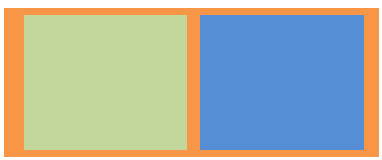
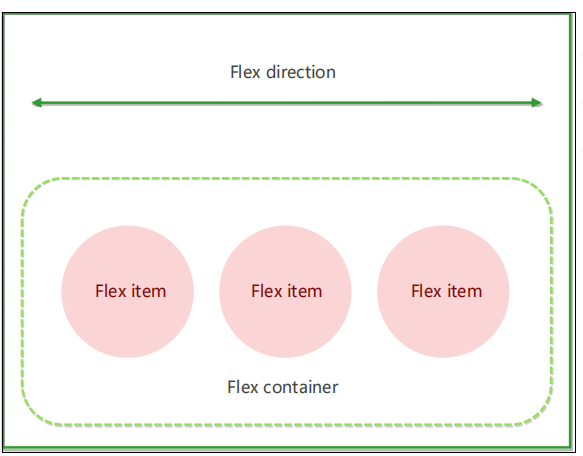
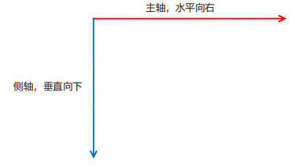
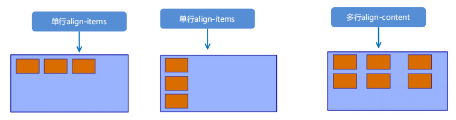

# 视口

布局视口、视觉视口 和 **理想视口**

**理想视口** **ideal viewport** 

* 为了使网站在移动端有最理想的浏览和阅读宽度而设定 

* 理想视口，对设备来讲，是最理想的视口尺寸 

* 需要手动添写meta视口标签通知浏览器操作 

* meta视口标签的主要目的：布局视口的宽度应该与理想视口的宽度一致，简单理解就是设备有多宽，我们布局的视口就多宽

## meta视口标签

   ```html
<meta name="viewport" content="width=device-width, user-scalable=no, 
initial-scale=1.0, maximum-scale=1.0, minimum-scale=1.0">
   ```

| 属性          | 解释说明                                               |
| ------------- | ------------------------------------------------------ |
| width         | 宽度设置的是 viewport 宽度，可以设置device-width特殊值 |
| initial-scale | 初始缩放比，大于0的数字                                |
| maximum-scale | 最大缩放比，大于0的数字                                |
| minimum-scale | 最小缩放比，大于0的数字                                |
| user-scalable | 用户是否可以缩放，yes或no（1或0）                      |

#  **二倍图**

###  物理像素&物理像素比

* 物理像素点指的是屏幕显示的最小颗粒，是物理真实存在的。这是厂商在出厂时就设置好了,比如苹果6\7\8 是 750* 1334

* 我们开发时候的1px 不是一定等于1个物理像素的

* PC端页面，1个px 等于1个物理像素的，但是移动端就不尽相同

*  一个px的能显示的物理像素点的个数，称为物理像素比或屏幕像素比(如 iPhone8 1px 就等于两个像素)

  

  ## 多倍图

* 对于一张 50px * 50px 的图片,在手机 Retina 屏中打开，按照刚才的物理像素比会放大倍数，100* 1000这样会造成图片模糊
* 采取的是放一个100*100 的图片然后缩小为50 *50（css像素）
* 我们准备的图片 比实际需要的大小 大2倍 这就是2倍图

* 在标准的viewport设置中，使用倍图来提高图片质量，解决在高清设备中的模糊问题 

* 通常使用二倍图， 因为iPhone 6\7\8 的影响,但是现在还存在3倍图4倍图的情况，这个看实际开发公司需求 

* 背景图片 注意缩放问题

```html
 /* 在 iphone8 下面 */
 img{
 /*原始图片100*100px*/
 width: 50px;
 height: 50px;
 } 
.box{
 /*原始图片100*100px*/
 background-size: 50px 50px;
 }
```

### **背景缩放 background-size**

```html
background-size: 背景图片宽度 背景图片高度
background-size: 500px 200px;
background-size: 45% 30%;  相对于父盒子来说
background-size: cover 覆盖 等比例拉伸 (可能有部分背景图片显示不全)
background-size: contain  （包含） 等比例拉伸 当高度或者宽度铺满盒子就不在进行拉伸，可能有部分空白区域
```

* 单位： 长度|百分比|cover|contain; 

* cover把背景图像扩展至足够大，以使背景图像完全覆盖背景区域。 

* contain把图像图像扩展至最大尺寸，以使其宽度和高度完全适应内容区域

#  

# **移动端开发选择**

**1. 单独制作**移动端页面（主流）

**2.** **响应式**页面兼容移动端（其次）


# **移动端技术解决方案**

移动端浏览器基本以 webkit 内核为主，因此我们就考虑webkit兼容性问题。 

我们可以放心使用 H5 标签和 CSS3 样式。 

同时我们浏览器的私有前缀我们只需要考虑添加 webkit 即可


## **CSS初始化** **normalize.css**

移动端 CSS 初始化推荐使用 normalize.css/ 

* Normalize.css：保护了有价值的默认值 
* Normalize.css：修复了浏览器的bug 
* Normalize.css：是模块化的 
* Normalize.css：拥有详细的文档 

官网地址： http://necolas.github.io/normalize.css/


##  **CSS3 盒子模型** **box-sizing**

* 传统模式宽度计算：盒子的宽度 = CSS中设置的width + border + padding 

* CSS3盒子模型： 盒子的宽度 = CSS中设置的宽度width 里面包含了 border 和 padding  也就是说，我们的CSS3中的盒子模型， padding 和 border 不会撑大盒子了

```html
/*CSS3盒子模型*/
 box-sizing: border-box;
 /*传统盒子模型*/
 box-sizing: content-box;
```

**传统or CSS3盒子模型？**

* 移动端可以全部CSS3 盒子模型

* PC端如果完全需要兼容，我们就用传统模式，如果不考虑兼容性，我们就选择 CSS3 盒子模型


## 特殊样式

```html
 /*CSS3盒子模型*/
 box-sizing: border-box;
 -webkit-box-sizing: border-box;
 /*点击高亮我们需要清除清除 设置为transparent 完成透明*/
 -webkit-tap-highlight-color: transparent;
 /*在移动端浏览器默认的外观在iOS上加上这个属性才能给按钮和输入框自定义样式*/
 -webkit-appearance: none;
 /*禁用长按页面时的弹出菜单*/
 img,a { -webkit-touch-callout: none; }
```


# 移动端常见布局

**1. 单独制作移动端页面（主流）**

* 流式布局（百分比布局） 

* flex 弹性布局（强烈推荐） 

* less+rem+媒体查询布局 

* 混合布局

**2.响应式页面兼容移动端（其次）**

* 媒体查询

* bootstarp


###  **流式布局（百分比布局）**

* 流式布局，就是百分比布局，也称非固定像素布局。
* 通过盒子的宽度设置成百分比来根据屏幕的宽度来进行伸缩，不受固定像素的限制，内容向两侧填充
* 流式布局方式是移动web开发使用的比较常见的布局方式。



* max-width 最大宽度 （max-height 最大高度） 
* min-width 最小宽度 （min-height 最小高度）

### **常用初始化样式**

```html
body {
	margin: 0 auto;
	min-width: 320px;
	max-width: 640px;
	background: #fff;
	font-size: 14px;
	font-family: -apple-system, Helvetica, sans-serif;
	line-height: 1.5;
	color: #666;
}
```


# 京东案例

##  **二倍精灵图做法**

在firework里面把精灵图等比例缩放为原来的一半

之后根据大小 测量坐标

注意代码里面background-size也要写： 精灵图原来宽度的一半


# Flex布局

## **布局原理**

flex 是 flexible Box 的缩写，意为"弹性布局"，用来为盒状模型提供最大的灵活性，任何一个容器都可以 指定为 flex 布局。

* 当我们为父盒子设为 flex 布局以后，子元素的 float、clear 和 vertical-align 属性将失效。
* 伸缩布局 = 弹性布局 = 伸缩盒布局 = 弹性盒布局 =flex布局

采用 Flex 布局的元素，称为 Flex 容器（flex container），简称"容器"。它的所有子元素自动成为容器成 员，称为 Flex 项目（flex item），简称"项目"。



**总结flex布局原理：** 

就是通过给父盒子添加flex属性，来控制子盒 子的位置和排列方式


## **常见父项属性**

以下由6个属性是对父元素设置的

```html
flex-direction：设置主轴的方向 

justify-content：设置主轴上的子元素排列方式 

flex-wrap：设置子元素是否换行 

align-content：设置侧轴上的子元素的排列方式（多行） 

align-items：设置侧轴上的子元素排列方式（单行） 

flex-flow：复合属性，相当于同时设置了 flex-direction 和 flex-wrap
```


**flex-direction** **设置主轴的方向**

**1. 主轴与侧轴**

在 flex 布局中，是分为主轴和侧轴两个方向，同样的叫法有 ： 行和列、x 轴和y 轴

* 默认主轴方向就是 x 轴方向，水平向右 

* 默认侧轴方向就是 y 轴方向，水平向下



**2. 属性值**

flex-direction 属性决定主轴的方向（即项目的排列方向） 

注意： 主轴和侧轴是会变化的，就看 flex-direction 设置谁为主轴，剩下的就是侧轴。而我们的子元素是跟着主轴来排列的

| 属性值         | 说明           |
| -------------- | -------------- |
| row            | 默认值从左到右 |
| row-reverse    | 从右到左       |
| column         | 从上到下       |
| column-reverse | 从下到上       |


**3** **justify-content** **设置主轴上的子元素排列方式**

justify-content属性定义了项目在主轴上的对齐方式 

==注意： 使用这个属性之前一定要确定好主轴是哪个==

| **属性值**    | **说明**                                    |
| ------------- | ------------------------------------------- |
| flex-start    | 默认值 从头部开始 如果主轴是x轴，则从左到右 |
| flex-end      | 从尾部开始排列                              |
| center        | 在主轴居中对齐（如果主轴是x轴则 水平居中）  |
| space-around  | 平分剩余空间                                |
| space-between | 先两边贴边 再平分剩余空间（重要）           |


**flex-wrap** **设置子元素是否换行**

默认情况下，项目都排在一条线（又称”轴线”）上。flex-wrap属性定义，flex布局中默认是不换行的如果装不开，会默认缩小子元素的宽度放到父元素里面

| **属性值** | **说明**       |
| ---------- | -------------- |
| nowrap     | 默认值，不换行 |
| wrap       | 换行           |


 **align-items** **设置侧轴上的子元素排列方式（==单行== ）**

该属性是控制子项在侧轴（默认是y轴）上的排列方式 在**子项为单项（单行）的时候**使用 

| **属性值** | **说明**                 |
| ---------- | ------------------------ |
| flex-start | 从上到下（默认值 ）      |
| flex-end   | 从下到上                 |
| center     | 挤在一起居中（垂直居中） |
| stretch    | 拉伸                     |


 **align-content** **设置侧轴上的子元素的排列方式（多行）**

设置子项在侧轴上的排列方式 并且**只能用于子项出现 ==换行== 的情况（多行）**，在单行下是没有效果的

​      **align-content**

| **属性值**    | **说明**                               |
| ------------- | -------------------------------------- |
| flex-start    | 默认值在侧轴的头部开始排列             |
| flex-end      | 在侧轴的尾部开始排列                   |
| center        | 在侧轴中间显示                         |
| space-around  | 子项在侧轴平分剩余空间                 |
| space-between | 子项在侧轴先分布在两头，再平分剩余空间 |
| stretch       | 设置子项元素高度平分父元素高度         |

 

 **align-items和align-content**  **区别**

* align-items 适用于单行情况下， 只有上对齐、下对齐、居中和 拉伸 
* align-content 适应于换行（多行）的情况下（单行情况下无效）， 可以设置 上对齐、 下对齐、居中、拉伸以及平均分 配剩余空间等属性值
* 总结就是单行找 align-items 多行找 align-content




**flex-flow**

flex-flow 属性是 flex-direction 和 flex-wrap 属性的复合属性

```html
flex-flow:row wrap;
```

* flex-direction：设置主轴的方向 
* justify-content：设置主轴上的子元素排列方式 
* flex-wrap：设置子元素是否换行 
* align-content：设置侧轴上的子元素的排列方式（多行） 
* align-items：设置侧轴上的子元素排列方式（单行） 
* flex-flow：复合属性，相当于同时设置了 flex-direction 和 flex-wrap


##  **flex布局子项常见属性**

* flex 子项目占的份数 

* align-self 控制子项自己在侧轴的排列方式 

* order属性定义子项的排列顺序（前后顺序）


**flex 属性** ★

flex 属性定义子项目分配剩余空间，用flex来表示占多少份数。

```html
.item {
 	flex: <number>; /* default 0 */
}
```


 **align-self** **控制子项自己在侧轴上的排列方式**

align-self 属性允许单个项目有与其他项目不一样的对齐方式，可覆盖 align-items 属性。 

默认值为 auto，表示继承父元素的 align-items 属性，如果没有父元素，则等同于 stretch。

```html
span:nth-child(2) {
	 /* 设置自己在侧轴上的排列方式 */
	 align-self: flex-end;
 }
```


**order** 属性定义项目的排列顺序

数值越小，排列越靠前，默认为0。 

注意：和 z-index 不一样。 

```html
.item {
	 order: <number>;
}
```


# 携程网案例


## 渐变色

 **背景线性渐变**

语法

```html
background: linear-gradient(起始方向, 颜色1, 颜色2, ...);
background: -webkit-linear-gradient(left, red , blue);
background: -webkit-linear-gradient(left top, red , blue);
```

背景渐变必须添加浏览器私有前缀 

起始方向可以是： 方位名词 或者 度数 ， 如果省略默认就是 top


# **移动WEB开发之rem适配布局**

**rem 单位** 

rem (root em)是一个相对单位，类似于em，em是父元素字体大小。 

不同的是rem的基准是相对于html元素的**字体大小**。 

比如，根元素（html）设置font-size=12px; 非根元素设置width:2rem; 则换成px表示就是24px。 

rem的优势：父元素文字大小可能不一致， 但是整个页面只有一个html，可以很好来控制整个页面的元素大小

```html
/* 根html 为 12px */
html {
 font-size: 12px;
}
/* 此时 div 的字体大小就是 24px */ 
div {
 font-size: 2rem;
}
```


 


